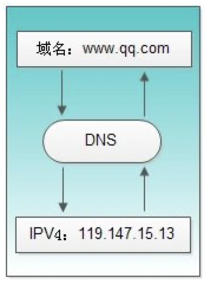

[TOC]

### Java部分

#### 什么是重载 & 什么是重写 & 区别

> 重载：(Overload)在同一个类中，同名的方法如果有不同的参数列表（**参数类型不同、参数个数不同甚至是参数顺序不同**）则视为重载。同时，重载对返回类型没有要求，可以相同也可以不同，但不能通过返回类型是否相同来判断重载.     
>
> 重写：(Override)在子类中把父类本身有的方法重新写一遍。子类继承了父类原有的方法，但有时子类并不想原封不动的继承父类中的某个方法，所以在方法名，参数列表，返回类型(除过子类中方法的返回值是父类中方法返回值的子类时)都相同的情况下， 对方法体进行修改或重写，这就是重写。但要注意子类函数的访问修饰权限不能少于父类的
>
> 区别：方法的重载和重写都是实现多态的方式，区别在于前者实现的是编译时的多态性，而后者实现的是运行时的多态性。重载发生在一个类中，同名的方法如果有不同的参数列表（参数类型不同、参数个数不同或者二者都不同）则视为重载；重写发生在子类与父类之间，重写要求子类被重写方法与父类被重写方法有相同的参数列表，有兼容的返回类型，比父类被重写方法更好访问，不能比父类被重写方法声明更多的异常（里氏代换原则）。重载对返回类型没有特殊的要求，不能根据返回类型进行区分。

#### 谈谈你对this和super的认识

> this: 是自身的一个对象，代表对象本身，可以理解为：指向对象本身的一个指针。
>
> super: 可以理解为是指向自己超（父）类对象的一个指针，而这个超类指的是离自己最近的一个父类。
>
> ​	this的用法在java中大体可以分为3种：1.普通的直接引用，this相当于是指向当前对象本身。2.形参与成员名字重名，用this来区分;3.引用构造函数
>
> ​	super也有三种用法：1.普通的直接引用与this类似，super相当于是指向当前对象的父类，这样就可以用super.xxx来引用父类的成员。2.子类中的成员变量或方法与父类中的成员变量或方法同名.3.引用构造函数super（参数）：调用父类中的某一个构造函数（应该为构造函数中的第一条语句）。this（参数）：调用本类中另一种形式的构造函数（应该为构造函数中的第一条语句）。

#### 接口和抽象类的区别

> 抽象类：1、抽象类使用abstract修饰；2、抽象类不能实例化，即不能使用new关键字来实例化对象；3、含有抽象方法（使用abstract关键字修饰的方法）的类是抽象类，必须使用abstract关键字修饰；4、抽象类可以含有抽象方法，也可以不包含抽象方法，抽象类中可以有具体的方法；5、如果一个子类实现了父类（抽象类）的所有抽象方法，那么该子类可以不必是抽象类，否则就是抽象类；6、抽象类中的抽象方法只有方法体，没有具体实现；
>
> 接口：1、接口使用interface修饰；2、接口不能被实例化；3、一个类只能继承一个类，但是可以实现多个接口；4、接口中方法均为抽象方法；5、接口中不能包含实例域或静态方法（静态方法必须实现，接口中方法是抽象方法，不能实现）

#### 静态属性和静态方法能被继承吗？静态方法又是否能被重写呢？

> 父类的静态属性和方法可以被子类继承
>
> 当父类的引用指向子类时，使用对象调用静态方法或者静态变量，是调用的父类中的方法或者变量。并没有被子类改写。 所以我认为不可以被子类重写。
>
> 静态方法不能被重写，不能实现多态。

#### 给我谈谈Java中的内部类

> 内部类：就是在一个类的内部定义另一个类。就像我们在类中声明成员变量一样，变量可以使用访问控制符，static，可以声明为成员变量或者函数内部的局部变量。内部类也可以有上述的用法，java中的内部类可以分为普通内部类（成员内部类），静态内部类，局部内部类和匿名内部类。
>
> 成员内部类——就是像普通的成员函数一样声明的内部类，InnerClass是OutClass的成员内部类，可以访问OutClass的成员变量。
>
> （1）可以使用public，private，protected或者默认的访问权限控制符声明，表示该内部类的访问权限；（2）可以访问外部类的成员变量和方法<内部类持有外部类的引用,java在编译内部类时会在其构造函数中默认添加外部类引用的参数，从而持有外部类的引用。>；（3）成员内部类不能声明静态成员；原因为==成员内部类就相当于外部类的一个普通的成员变量，当jvm加载外部类的时候并不会加载非静态变量，因此也就不会加载内部类。如果内部类可以声明静态变量，那么就会出现类还没有加载却要初始化静态变量的现象，因此java不会允许这种情况通过编译。
>
> 静态内部类——就是有static修饰的内部类，类似静态变量或者静态函数。相比于成员内部类对外部类的依赖，静态内部类基本不依赖外部类。通过其官方名称"**static nested classes**"(静态嵌套类)，更能说明其与外部类没有关系，只是自己的类声明嵌套在外部类的java文件中。静态内部类只能访问外部类的静态成员和方法，这点非常好理解，因为静态内部类和外部类没关系。静态内部类和静态变量或方法一样可以使用public，private，protected或者默认的访问权限控制符声明，这点也很好理解。
>
> <内部类的声明不再依赖外部类，可以完全独立声明对象，其实静态内部类不再持有外部类的引用>
>
> 局部内部类——就是声明在一个函数或者某个作用域中的内部类。可以看出局部内部类只作用于其所声明的函数或者局部作用域中，因此在局部内部类中不能使用public，private和protected。
>
> 匿名内部类——Runable是一个接口，我们通过new来实现了一个匿名内部类，这个类没有类名(其实真实编译后会以"外部类$数字"的形式作为类名)。匿名内部类，它可能引用三种外部变量：外部类的成员变量，外部方法或作用域内的局部变量，外部方法的参数。第一种变量是不需要声明为final的，但后两种是需要声明为final的。
>
> 使用内部类的作用：1）使用成员内部类可以使得内部类访问外部类的成员变量；
> （2）使用匿名内部类使得我们代码变得更简洁，不需要定义一些只是用一次的类；

#### static关键字的作用？

> 1.修饰变量：类变量，可以通过类名.变量名来访问
> 2.修饰方法：类方法
> 3.静态内部类
> 4.静态代码块
> 5.静态导包
>
> **一、特点：**
>
> 　　1、static是一个修饰符，用于修饰成员。（成员变量，成员函数）static修饰的成员变量	称之为静态变量或类变量。
>
> 　　2、static修饰的成员被所有的对象共享。
>
> 　　3、static优先于对象存在，因为static的成员随着类的加载就已经存在。
>
> 　　4、static修饰的成员多了一种调用方式，可以直接被类名所调用，（类名.静态成员）。
>
> 　　5、static修饰的数据是共享数据，对象中的存储的是特有的数据。
>
> **二、成员变量和静态变量的区别：**
>
> 　　1、生命周期的不同：
>
> 　　　　成员变量随着对象的创建而存在随着对象的回收而释放。
>
> 　　　　静态变量随着类的加载而存在随着类的消失而消失。
>
> 　　2、调用方式不同：
>
> 　　　　成员变量只能被对象调用。
>
> 　　　　静态变量可以被对象调用，也可以用类名调用。（推荐用类名调用）
>
> 　　3、别名不同：
>
> 　　　　成员变量也称为实例变量。
>
> 　　　　静态变量称为类变量。
>
> 　　4、数据存储位置不同：
>
> ​		成员变量数据存储在堆内存的对象中，所以也叫对象的特有数据。
>
> 　　　　静态变量数据存储在方法区（共享数据区）的静态区，所以也叫对象的共享数据。
>
> **三、静态使用时需要注意的事项：**
>
> 　　1、静态方法只能访问静态成员。（非静态既可以访问静态，又可以访问非静态）
>
> 　　2、静态方法中不可以使用this或者super关键字。
>
> ​	3、主函数是静态的
>
> **四、什么时候使用static来修饰**
>
> ​        1、静态变量：
>
> ​                （1）当分析对象中所具备的成员变量的值都是相同的。这时这个成员就可以被静态修饰。
>
> ​                （2）只要是数据在对象中都是不同的，就是对象的特有数据，必须存储在对象中，是非静态的。
>
> ​                （3）如果是相同的数据，对象不需要做修改，只需要使用即可，不需要存储在对象中，是静态的。
>
> ​	2、静态函数。
>
> ​                （1）函数是否用静态修饰，就参考一点，就是该函数功能是否有访问到对象中特有的数据。
>
> ​                （2）简单来说，从源代码看，该功能是否需要访问非静态的成员变量，如果需要，该功能就是非静态的。如果不需要，就可以将该功能定义成静态的。当然，也可以定义成非静态，但是非静态需要被对象调用，而仅创建对象是没有意义的。
>
> ​        3、静态代码块：
>
> ​                （1）随着类的调用或创建实例而执行，而且只执行一次。
>
> ​                作用：用于给类进行初始化。

#### final关键字的作用。

> final关键字可以用来修饰引用、方法和类。
>
> 用来修饰一个引用——1、 如果引用为基本数据类型，则该引用为常量，该值无法修改；2、 如果引用为引用数据类型，比如对象、数组，则该对象、数组本身可以修改，但指向该对象或数组的地址的引用不能修改。3、如果引用时类的成员变量，则必须当场赋值，否则编译会报错。
>
> 用来修饰一个方法——当使用final修饰方法时，这个方法将成为最终方法，无法被子类重写。但是，该方法仍然可以被继承。
>
> 用来修饰类——当用final修改类时，该类成为最终类，无法被继承。简称为“断子绝孙类”。比如常用的String类就是最终类。

#### Java Object类方法

> Object类是一个特殊的类，是所有类的父类，如果一个类没有用extends明确指出继承于某个类，那么它默认继承Object类。Object类有12个成员方法，按照用途可以分为以下几种
>
> 1，构造函数
> 2，hashCode和equale函数用来判断对象是否相同,
> 3，wait(),wait(long),wait(long,int),notify(),notifyAll()
> 4，toString()和getClass,
> 5，clone()
> 6，finalize()用于在垃圾回收
>
> **1.clone()**
>
> clone()函数的用途是用来另存一个当前存在的对象。
>
> **1.取得对象信息的方法：toString()**
>
> 该方法在打印对象时被调用，将对象信息变为字符串返回，默认输出对象地址。
>
> **2.对象相等判断方法：equals()**
>
> 该方法用于比较对象是否相等，而且此方法必须被重写。
>
> **3.对象签名:hashCode()**
>
> 该方法用来返回其所在对象的物理地址（哈希码值），常会和equals方法同时重写，确保相等的两个对象拥有相等的.hashCode。
>
> ①两个obj，如果equals()相等，hashCode()一定相等
>
> ②两个obj，如果hashCode()相等，equals()不一定相等

#### Synchronized原理

> synchronized关键字可以用在两处：
>
> 1.同步代码块，锁住的是任意的object，也可以是类；
>
> 2.同步方法,其中普通同步方法锁住的是类的实例对象，静态同步方法锁住的是这个类。在Android中，它们的实现原理都是通过monitor实现的。
>
> 大致过程是：monitor-enter（加锁）–>执行同步代码块或同步方法–>monitor-exit（释放锁）。
>
> https://hadyang.github.io/interview/docs/java/concurrent/synchronized/

#### Java 中深拷贝与浅拷贝的区别

> 浅拷贝---能复制变量，如果对象内还有对象，则只能复制对象的地址
>
> 深拷贝---能复制变量，也能复制当前对象的 内部对象
>
> 
>
> 浅拷贝与深拷贝，一字之差，主要表明了拷贝的层次差别。
>
> Object的clone方法，必须要实现Cloneable。
>
> 表明了，clone方法的实现要程序员自己来。。。
>
> 而深浅拷贝只是术语的区别。。。你怎么实现的就是怎么个定义。
>
> 1. 必须实现Cloneable
>
>
> 2. 要深拷贝，得注意对象的内部对象，也需要clone

#### Java GC机制（可达性分析法，引用计数法）

> 1. 引用计数法：
>
> 是垃圾收集的早期策略，在这个方法中，堆中每个对象都有一个引用计数，每当有一个地方引用他时，引用计数值就+1,当引用失效时，引用计数值就-1，任何时刻引用计数值为0的对象就是可以被回收，当一个对象被垃圾收集时，被它引用 的对象引用计数值就-1，所以在这种方法中一个对象被垃圾收集会导致后续其他对象的垃圾收集行动。
>
> 优点：判定效率高；
>
> 缺点：不完全准确，当两个对象相互引用的时候就无法回收，导致内存泄漏。
>
> 2. 可达性分析：
>
>  这个算法的基本思路就是通过一系列名为"GC Roots"的对象作为起始点，从这些节点开始向下搜索，搜索所走过的路径称为引用链(Reference Chain)，当一个对象到GC Roots没有任何引用链相连时，则证明此对象是不可用的，比如对象object1, object2, object3是相互引用，但它们到GC Roots是不可达的，所以它们将会判定为是可回收对象。
>
> 3. 在Java语言里，可作为GC Roots对象的包括如下几种：
>
> a,虚拟机栈(栈桢中的本地变量表)中的引用的对象
>
> b,方法区中的类静态属性引用的对象
>
> c,方法区中的常量引用的对象
>
> d,本地方法栈中JNI的引用的对象 
>
> <https://blog.csdn.net/qq_34996727/article/details/80672853>

#### Java对象的完整生命周期

> 1).创建阶段(Created)
>
> 2).应用阶段(In Use)
>
> 3).不可见阶段(Invisible)
>
> 4).不可达阶段(Unreachable)
>
> 5).收集阶段(Collected)
>
> 6).终结阶段(Finalized)
>
> 7).对象空间重分配阶段(De-allocated)
>
> <https://blog.csdn.net/XiaoArea/article/details/87873727>

#### JVM内存模型


> <https://www.jianshu.com/p/0ecf020614cb>

#### 进程间通信

> 进程间通信：
>
> **1. 管道(PIPE)**
>
> 管道是一种半双工的通信方式，数据只能单向流动，而且只能在具有亲缘关系的进程间使用。进程的亲缘关系通常是指父子进程关系。
>
> **2. 命名管道(FIFO)**
>
> 名管道也是半双工的通信方式，但是它允许无亲缘关系进程间的通信。
>
> **3. 信号(Signal)**
>
> 用于通知接收进程某个事件已经发生，主要作为进程间以及同一进程不同线程之间的同步手段。
>
> **4. 信号量(Semaphore)**
>
> 信号量是一个计数器，可以用来控制多个进程对共享资源的访问。它常作为一种锁机制，防止某进程正在访问共享资源时，其他进程也访问该资源。
>
> **5. 消息队列(MessageQueue)**
>
> 消息队列是消息的链表，存放在内核中。一个消息队列由一个标识符（即队列ID）来标识。消息队列克服了信号传递信息少、管道只能承载无格式字节流以及缓冲区大小受限等缺点。
>
> **6. 共享内存(Shared Memory)**
>
> 共享内存（Shared Memory），指两个或多个进程共享一个给定的存储区。
>
> 特点：
>
> 共享内存是最快的一种 IPC，因为进程是直接对内存进行存取。
>
> 因为多个进程可以同时操作，所以需要进行同步。
>
> 信号量+共享内存通常结合在一起使用，信号量用来同步对共享内存的访问。
>
> **7. 套接字(Socket)**
>
> 套接字也是一种进程间通信机制，与其他通信机制不同的是，它可用于不同机器间的进程通信。

#### JVM类加载机制

> 类从被加载到虚拟机内存中开始，到卸载出内存为止，它的整个生命周期包括：加载（Loading）、验证（Verification）、准备（Preparation）、解析（Resolution）、初始化（Initialization）、使用（Using）和卸载（Unloading）7个阶段。其中验证、准备、解析3个部分统称为连接（Linking），这7个阶段的发生顺序如图：
>
> 
>
> <https://blog.csdn.net/SilenceOO/article/details/77876123>

#### Java引用类型

> 强引用（Strong Reference）、软引用（Soft Reference）、弱引用（Weak Reference）、虚引用（Phantom Reference）4 种，这 4 种引用的强度依次减弱。

#### 序列化和反序列化

> java序列化是指把java对象转换为字节序列的过程，而java反序列化是指把字节序列恢复为java对象的过程
>
> 序列化：对象序列化的最主要的用处就是在传递和保存对象的时候，保证对象的完整性和可传递性。序列化是把对象转换成有序字节流，以便在网络上传输或者保存在本地文件中。序列化后的字节流保存的java对象的状态以及相关的描述信息。序列化机制的核心作用就是对象状态的保存与重建。
>
> 反序列化：客户端从文件中或网络上获得序列化后的对象字节流后，根据字节流中所保存的对象状态及描述信息，通过反序列化重建对象。
>
> 序列化就是把实体对象状态按照一定的格式写入到有序字节流，反序列化就是从有序字节流重建对象，恢复对象状态
>
> <https://www.cnblogs.com/baxianhua/p/10271830.html>

### Java异常

#### 说说Java异常体系主要用来干什么的 & 异常体系？

> ## **java异常体系**
>
> |——Throwable 实现类描述java的错误和异常 一般交由硬件处理
>
> 　　　　|——Error(错误)一般不通过代码去处理，一般由硬件保护
>
> 　　　　|——Exception(异常)
>
> 　　　　　　|——RuntimeException(运行时异常)
>
> 　　　　　　|——非运行时异常
>
> java异常体系分为2类
> 1.错误（Error），一般与虚拟机、系统有关。这一类的错误无法由程序捕获，程序中断，比如内存溢出。
> 2.异常（Execption），一般有程序编码或者设计导致的错误，可以由程序捕获，程序不中断。异常分为检查型异常和非检查型异常：
> 检查型异常:编译器必须强制处理的异常，比如SQLExecption,ClassNotFoundExecption等。
> 非检查型异常:分为RuntimeExecption，比如NullPointerExecption,NumberFormatExecption异常。
>
> ### **多个try-catch语句联用时的顺序**
>
> 　　1、顺序执行，从上到下，有一个catch子句匹配之后，后面的自动不在执行
>
> 　　2、如果多个cach内的异常有父子类的关系
>
> 　　　　一定要，子类异常在上，父类异常在下
>
> ### **自定义异常类型**
>
> 一般都是提供两个构造参数，一个无参一个有参数，有参数的一般是调用父类的有参构造函数，调用形式super(message)
>
> ### **运行时异常**
>
> RuntimeException
>
> 　　|——ClassCastException多态中可以使用instanceof 进行规避
>
> 　　|——ArithmeticException进行if判断，吐过除数为0进行return
>
> 　　|——NullPointerException进行if判断是否为null
>
> 　　|——ArrayIndexOutBondsExcetion使用数组length属性以避免数组越界。
>
> 　　在后面我们异常处理的时候，经常把捕获的一场装华为运行时异常抛出，尤其是写一些函数框架时。throw new RuntimeException(e);
>
> **非运行时异(受检异常) 这些异常必须做出try-catch不然编译器无**法通过 注意事项
>
> ​	1、子类覆盖父类的方法时，父类方法抛出异常，子类的覆盖方法可以不抛出异常或者抛出父类方法相同的异常，或者抛出父类方法异常的子类。
>
> 　　2、父类方法抛出了多个异常，子类覆盖方法时，只能抛出父类异常的子集
>
> 　　3、父类没有抛出异常，子类不能抛出异常。子类发生非运行时异常时，需要进行try-catch处理
>
> 　　4、子类不能比父类抛出更多的异常。
>
> 　　凡事应当向父类看齐，父类已有就应当向分类看齐。
>
> ### **finally块 一般用于释放资源 无论程序正常与否都执行finally块**
>
> 　　1.只有一种情况，jvm退出了System.exit(0)这时候不会执行finally的内容
>
> 　　2、return语句也无法阻止finally的执行

#### Error和Exception的区别？

> 1.error：error 是指在正常情况下，不大可能出现的情况，绝大部分的 Error 都会导致程序处于非正常的、不可恢复状态。（这个时候运行的服务极有可能会down掉）--**不可控，比较难捕获，偏底层环境**
>
> 2.exception：exception是在程序编写过程中由于语法错误或者其他逻辑错误产生的异常，分为运行时异常和编译时异常；编译时异常是开发工具在编译期显示捕获的异常，而运行时异常常常与逻辑错误挂钩，是程序员编写程序时产生的错误。（一般异常出现时我们要主动去捕获，并且去想办法修复）--相对可控 
>
> **两者的“同”**：error和exception都是继承于Throwable类
>
> 回望exception的处理机制：（throw和try…catch）throw会一层一层的往上抛异常，而与之对应的是try…catch，在可能出现异常的代码块，我们加上try…catch即可，否则可能产生额外的性能开销（Java 每次实例化 Exception时，会对对应的栈进行快照，当放在try…catch的代码块很大的时候，那么就是一个很重的操作，会开始对性能产生不可忽视的影响）

#### 说说运行时异常和非运行时异常的区别？

> 运行时异常： 都是RuntimeException类及其子类异常，如NullPointerException(空指针异常)、IndexOutOfBoundsException(下标越界异常)等，这些异常是不检查异常，程序中可以选择捕获处理，也可以不处理。这些异常一般是由程序逻辑错误引起的，程序应该从逻辑角度尽可能避免这类异常的发生。
>
> 非运行时异常 （编译异常）： 是RuntimeException以外的异常，类型上都属于Exception类及其子类。从程序语法角度讲是必须进行处理的异常，如果不处理，程序就不能编译通过。如IOException、SQLException等以及用户自定义的Exception异常，一般情况下不自定义检查异常。

#### 如何自定义一个异常？

> 在Java中要想创建自定义异常，需要继承Throwable或者他的子类Exception。
>
> **自定义异常（重点）**
>
> A) 概念：一般在开发中只要业务方法出现例外基本上都交给一个异常类来处理。
>
> B)如何开发：
>
> i.   建立一个类，让此类继承Exception（一般不用）或RuntimeException（常用）
>
> ii.   建立一个成员变量message,显示写出无参构造和有参构造

#### throw和throws 的区别？

> Throw：
>
> 作用在方法内，表示抛出具体异常，由方法体内的语句处理。
> 具体向外抛出的动作，所以它抛出的是一个异常实体类。若执行了Throw一定是抛出了某种异常。
> Throws：
>
> 作用在方法的声明上，表示如果抛出异常，则由该方法的调用者来进行异常处理。
> 主要的声明这个方法会抛出会抛出某种类型的异常，让它的使用者知道捕获异常的类型。
> 出现异常是一种可能性，但不一定会发生异常。

#### try{}catch{}finally{}可以没有finally吗？

> 可以没有finally,

#### finally中的代码总是会执行吗？

> no，如果一个方法内在执行try{}语句之前就已经return了，那么finally语句指定不会执行了。因为它根本没有进入try语句中
>
> 如果在一个try语句中调用System.exit(0);方法，那么就会退出当前java虚拟机，那么finally也就没有执行的机会了。

#### return在try{}catch{}finally{}中执行具有哪些规则

> 1、不管有没有出现异常，finally块中代码都会执行；2、当try和catch中有return时，finally仍然会执行；3、finally是在return后面的表达式运算后执行的（此时并没有返回运算后的值，而是先把要返回的值保存起来，不管finally中的代码怎么样，返回的值都不会改变，任然是之前保存的值），所以函数返回值是在finally执行前确定的；4、finally中最好不要包含return，否则程序会提前退出，返回值不是try或catch中保存的返回值。

### Java集合

#### HashMap 和 HashTable 区别

> 1.相同点：
>
> （1）都是map的实现类，都是键值对集合；
>
> （2）里边的元素都是无序的，跟添加顺序无关；
>
> 2.不同点：
>
> （1）HashMap允许有一个null键和多个null值；
>
> （2）HashMap不是线程安全的，HashTable是线程安全的。
>
> 参考：<https://www.cnblogs.com/williamjie/p/9099141.html>

#### HashCode 作用，如何重载hashCode方法

> 1、hashCode的存在主要是用于查找的快捷性，如Hashtable，HashMap等，hashCode是用来在散列存储结构中确定对象的存储地址的；
> 2、如果两个对象相同，就是适用于equals(Java.lang.Object) 方法，那么这两个对象的hashCode一定要相同；
> 3、如果对象的equals方法被重写，那么对象的hashCode也尽量重写，并且产生hashCode使用的对象，一定要和equals方法中使用的一致，否则就会违反上面提到的第2点；
> 4、两个对象的hashCode相同，并不一定表示两个对象就相同，也就是不一定适用于equals(java.lang.Object)
> 方法，只能够说明这两个对象在散列存储结构中，如Hashtable，他们“存放在同一个篮子里”。
> 总结：再归纳一下就是hashCode是用于查找使用的，而equals是用于比较两个对象的是否相等的。

#### ArrayList与LinkList区别与联系

> **一般大家都知道ArrayList和LinkedList的区别：**
>
> 1. ArrayList的实现是基于数组，LinkedList的实现是基于双向链表。 
> 2. 对于随机访问，ArrayList优于LinkedList，ArrayList可以根据下标以O(1)时间复杂度对元素进行随机访问。而LinkedList的每一个元素都依靠地址指针和它后一个元素连接在一起，在这种情况下，查找某个元素的时间复杂度是O(n)
> 3. 对于插入和删除操作，LinkedList优于ArrayList，因为当元素被添加到LinkedList任意位置的时候，不需要像ArrayList那样重新计算大小或者是更新索引。 
> 4. LinkedList比ArrayList更占内存，因为LinkedList的节点除了存储数据，还存储了两个引用，一个指向前一个元素，一个指向后一个元素。
>
> 参考：<https://blog.csdn.net/zsp765098084/article/details/89084950>


#### SparseArray优缺点

>在写SparseArray某些情况下比HashMap性能更好，按照官方问答的解释，主要是因为SparseArray不需要对key和value进行auto-boxing（将原始类型封装为对象类型，比如把int类型封装成Integer类型），结构比HashMap简单（SparseArray内部主要使用两个一维数组来保存数据，一个用来存key，一个用来存value）不需要额外的额外的数据结构
>
>##### key为int的时候才能使用，注意是int而不是Integer，这也是sparseArray效率提升的一个点，去掉了装箱的操作
>
>插入100000条数据的存储使用DDMS查看，hashMap的存储空间14M左右，而SparseArray自由8M多几乎是少了40%接近。插入时候，SparseArray 正序插入效率比起倒序插入快了几乎是10倍， hashMap差不多。
> 我们是按照1,3,2的顺序排列的，但是在SparseArray内部还是按照正序排列的，这时因为SparseArray在检索数据的时候使用的是二分查找，所以每次插入新数据的时候SparseArray都需要重新排序，所以代码4中，逆序是最差情况
>
>SparseArray指的是稀疏数组(Sparse array)，所谓稀疏数组就是数组中大部分的内容值都未被使用（或都为零），在数组中仅有少部分的空间使用。因此造成内存空间的浪费，为了节省内存空间，并且不影响数组中原有的内容值，我们可以采用一种压缩的方式来表示稀疏数组的内容。
>
>#### 注意事项
>
>SparseArray是android里为<Interger,Object>这样的Hashmap而专门写的类,目的是提高内存效率，其核心是折半查找函数（binarySearch）。注意内存二字很重要，因为它仅仅提高内存效率，而不是提高执行效率，
> 它只适用于android系统（内存对android项目有多重要，地球人都知道）。SparseArray有两个优点：1.避免了自动装箱（auto-boxing），2.数据结构不会依赖于外部对象映射。我们知道HashMap 采用一种所谓的“Hash 算法”来决定每个元素的存储位置，存放的都是数组元素的引用，通过每个对象的hash值来映射对象。而SparseArray则是用数组数据结构来保存映射，然后通过折半查找来找到对象。但其实一般来说，SparseArray执行效率比HashMap要慢一点，因为查找需要折半查找，而添加删除则需要在数组中执行，而HashMap都是通过外部映射。但相对来说影响不大，最主要是SparseArray不需要开辟内存空间来额外存储外部映射，从而节省内存。


#### Collection & Map区别

> 1-collection元素是单列的，map是以键值对存在。
> 2-collection可以分为两类list和set；
> ​    list是有序的可重复的，允许存在空值，且允许存在多个空值。list可以分为两类：ArrayList和LinkedList.
> ​        ArrayList 是基于数组实现的，简单来说就是和数组很像，同时解决了数组的有一些缺点。他也是有序有下标，与数组不同的是，普通的数组删除一个元素后，需要手动将后面的元素移动到，不过在ArrayList 中不需要手动移动数据，系统底层回来做这个事情。而且在ArrayList 不需要设置数组长度，你可以无限地往里面放数据，放多少它的length就是多少。适用于经常查找不经常变动的情况。（一般常用）
> ​        LinkedLIst是链式存储的list结构，在其中每个元素不光存储了数据还存储了上一个和下一个数据的位置，这样在新增和删除的时候不需要前后挪动。没有下标，故而适用于经常变动不经常查找的情况。
> ​    Set是无序且不可重复的，没有下标，允许存在null值，且只允许存在一个。分为：hashset和treeset
> ​          treeset里面的元素是有序地存放，但是没有有序的下标。
> 3-Map分为hashmap和hashtable。但一般使用的是hashmap。

#### HashMap原理，Hash冲突，并发集合，线程安全集合及实现原理

> 参考：<https://blog.csdn.net/XiaoArea/article/details/87715215>

#### 谈谈你常用的集合 & 它们底层的实现方式 & 优缺点 & 使用场景

> List接口：是一个有序集合，可以放重复的数据。
>
> Set接口：是一个无序集合，不允许放重复的数据。
>
> Map接口：是一个无序集合，集合中包含一个键对象，一个值对象，键对象不允许重复，值对象可以重复。
>
> 底层实现方式：
>
> ArrayList：ArrayList就是Object数组：初始化的时候会创建一个初始化长度为10的数组。
>
> LinkedList：的实例化没有什么特殊的地方。就是直接的实例化，但是其内部的存储是有一个size记录数组的长度，需要记录其最前的一个元素和最后的一个元素。其内部定义了一个类Node，记录的当前元素，前一个元素和后一个元素。

#### Map的遍历方式有哪些？

> 1、通过 map1.keySet() 获取key  通过key 找到value
>
> 2、通过Map.Entry(String,Integer) 获取，然后使用entry.getKey()获取到键，通过entry.getValue()获取到值
>
> 3、只遍历键或者值，通过加强for循环
>
> 4、Iterator遍历获取，然后获取到Map.Entry<String, String>，再得到getKey()和getValue()
>
> 参考：<https://blog.csdn.net/qq_30225725/article/details/88019622>

#### 给我说说ArrayList的扩容机制.

> 1、当前数组是由默认构造方法生成的空数组并且第一次添加数据。此时minCapacity等于默认的容量（10）那么根据下面逻辑可以看到最后数组的容量会从0扩容成10。而后的数组扩容才是按照当前容量的1.5倍进行扩容；
>
> 2、当前数组是由自定义初始容量构造方法创建并且指定初始容量为0。此时minCapacity等于1那么根据下面逻辑可以看到最后数组的容量会从0变成1。这边可以看到一个严重的问题，一旦我们执行了初始容量为0，那么根据下面的算法前四次扩容每次都 +1，在第5次添加数据进行扩容的时候才是按照当前容量的1.5倍进行扩容。
>
> 3、当扩容量（newCapacity）大于ArrayList数组定义的最大值后会调用hugeCapacity来进行判断。如果minCapacity已经大于Integer的最大值（溢出为负数）那么抛出OutOfMemoryError（内存溢出）否则的话根据与MAX_ARRAY_SIZE的比较情况确定是返回Integer最大值还是MAX_ARRAY_SIZE。这边也可以看到ArrayList允许的最大容量就是Integer的最大值（-2的31次方~2的31次方减1）。

#### 什么是深拷贝 & 浅拷贝 & 如何深拷贝一个List集合.

> > 浅拷贝：也就是拷贝A对象里面的数据，但是不拷贝A对象里面的子对象
>
> > 深拷贝：会克隆出一个对象，数据相同，但是引用地址不同（就是拷贝A对象里面的数据，而且拷贝它里面的子对象）
> >
> > 深拷贝List集合方法：
> >
> > 1.使用序列化方法
>
> ```
> public static <T> List<T> deepCopy(List<T> src) throws IOException, ClassNotFoundException {  
>     ByteArrayOutputStream byteOut = new ByteArrayOutputStream();  
>     ObjectOutputStream out = new ObjectOutputStream(byteOut);  
>     out.writeObject(src);  
> ByteArrayInputStream byteIn = new ByteArrayInputStream(byteOut.toByteArray());  
>     ObjectInputStream in = new ObjectInputStream(byteIn);  
>     @SuppressWarnings("unchecked")  
>     List<T> dest = (List<T>) in.readObject();  
>     return dest;  
>     }  
> ```
>
> > 2、clone方法
>
> ```
> public class A implements Cloneable {   
> >    public String name[];   
> >
> >    public A(){   
> >        name=new String[2];   
> >    }   
> >
> >    public Object clone() {   
> >        A o = null;   
> >        try {   
> >            o = (A) super.clone();   
> >        } catch (CloneNotSupportedException e) {   
> >            e.printStackTrace();   
> >        }   
> >        return o;   
> >    }   
> >}  
> >for(int i=0;i<n;i+=){
> >copy.add((A)src.get(i).clone());
> }
> ```

#### Set是如何确保它的唯一性的

> set保证里面元素的唯一性其实是靠两个方法，一是equals()和hashCode()方法
>
> 往set里面添加数据的时候一般会有隐式的操作
>
> 先是判断set集合中是否有与新添加数据的hashcode值一致的数据，
>
> 如果有，那么将再进行第二步调用equals方法再进行一次判断，
>
> 假如集合中没有与新添加数据hashcode值一致的数据，那么将不调用eqauls方法。

#### 你觉得HashMap的元素顺序和什么有关？

> HashMap 底层是 hash 数组和单向链表实现，数组中的每个元素都是链表，由 Node 内部类（实现 Map.Entry<K,V>接口）实现，HashMap 通>过 put & get 方法存储和获取。

> 存储对象时，将 K/V 键值传给 put() 方法：①、调用 hash(K) 方法计算 K 的 hash 值，然后结合数组长度，计算得数组下标；②、调整数组大小（当容器中的元素个数大于 capacity * loadfactor 时，容器会进行扩容resize 为 2n）；
> ③、i.如果 K 的 hash 值在 HashMap 中不存在，则执行插入，若存在，则发生碰撞；
> ii.如果 K 的 hash 值在 HashMap 中存在，且它们两者 equals 返回 true，则更新键值对；
> iii. 如果 K 的 hash 值在 HashMap 中存在，且它们两者 equals 返回 false，则插入链表的尾部（尾插法）或者红黑树中（树的添加方式）。

> （JDK 1.7 之前使用头插法、JDK 1.8 使用尾插法）
> （注意：当碰撞导致链表大于 TREEIFY_THRESHOLD = 8 时，就把链表转换成红黑树）

> 获取对象时，将 K 传给 get() 方法：①、调用 hash(K) 方法（计算 K 的 hash 值）从而获取该键值所在链表的数组下标；②、顺序遍历链表，equals()方法查找相同 Node 链表中 K 值对应的 V 值。

hashCode 是定位的，存储位置；equals是定性的，比较两者是否相等

> 

#### Java中HashMap如何解决哈希碰撞的？

> 碰撞的意思是计算得到的Hash值相同，需要放到同一个bucket中
> Hashmap里面的bucket出现了单链表的形式，散列表要解决的一个问题就是散列值的冲突问题，通常是两种方法：链表法和开放地址法。

> HashMap采用的链表法的方式，链表是单向链表。

#### ConcurrentHashMap如何实现并发访问的？

> https://www.jianshu.com/p/9c713de7bbdb
>
> ConcurrentHashMap使用的分段锁技术。将ConcurrentHashMap容器的数据分段存储，每一段数据分配一个Segment（锁），当线程占用其中一个Segment时，其他线程可正常访问其他段数据。
>
> ConcurrentHashMap由Segment和HashEntry组成。
>
> Segment是可重入锁，它在ConcurrentHashMap中扮演分离锁的角色
>
> HashEntry主要存储键值对
>
> CurrentHashMap包含一个Segment数组，每个Segment包含一个
>  HashEntry数组并且守护它，当修改HashEntry数组数据时，需要先获取它对应的Segment锁；而HashEntry数组采用开链法处理冲突，所以它的每个HashEntry元素又是链表结构的元素。

#### 谈谈Java集合中那些线程安全的集合 & 实现原理。

> Vector：就比ArrayList多了一个同步化机制（线程安全）

> LinkedList因为成员方法大多是synchronized的，因此LinkedList是线程安全的。而ArrayList不是线程安全的。在扩容机制上，当Vector的元素数量超过它的初始化大小的时候会将容量翻倍，而ArrayList只会增长50%。

> ArrayList的数据结构是基于数组的（Object[]）,而LinkList内部结构是基于一组链接的记录，形式上属于链表的。所以在增加元素方面linkList的效率更高，因为在ArrayList中增加元素，会牵扯一次重新排序。删除也是类似，所以ArrayList的查询性能要好些。反之LinkList增加，删除性能更好。如果是迭代读取的话，就没有什么差别了。

> HashTable：比hashMap多了一个线程安全。hashTable的方法都提供了同步机制。hashTable不允许插入空值，hashMap是允许的。

> ConcurrentHashMap：是一种高效但是也线程安全的集合。它比Hashmap来讲，是线程安全的，但是效率也比较高，因为它引入了一个分段锁的概念，可以理解为把一个大的Map拆分成了N个小的hashTable。根据key.hashCode（）决定把key放到哪个hashtable中。HashMap的数据结构是数据和链表。通过hash算法计算该key所在的数组下标，根据equals取比较值。通俗的说救赎ConcurrenthashMap是对每个数组进行加锁，当通过hash算法得出的结果相同时才需要去同步数据。

> StringBuffer是线程安全的，而StringBuilder是线程不安全的。在单线程任务中，StringBuilder效率较高。

> 线程安全的类其方法是同步的，每次只能一个访问，是重量级对象，效率较低。

> 

#### 说说LinkedHashMap原理

> https://www.jianshu.com/p/3650bf13f09b
>
> 1、LinkedHashMap继承于HashMap。
>
> 2、数据存储结构结合了Hash表和链表结构，元素存储用Hash表，元素链接通过继承父类Entry节点并增加before和after引用实现。
>
> 3、LinkedHashMap的迭代顺序收到accessOrder属性的影响，默认为false，按插入顺序访问，true按上次读取顺序访问：即每次访问元素时会把元素移动到链表末尾方便下次访问，结构会时刻变化。

#### 你如何看代Java 8中HashMap引入红黑树？

> 红黑树介绍：https://www.jianshu.com/p/38a20925a08c
>
> 红黑树虽然本质上是一棵二叉查找树，但它在二叉查找树的基础上增加了着色和相关的性质使得红黑树相对平衡，从而保证了红黑树的查找、插入、删除的时间复杂度最坏为O(log n)。加快检索速率。

> 红黑树的5个性质：

> 1.每个结点要么是红的要么是黑的。
>
> 2.根结点是黑的。
>
> 3.每个叶结点（叶结点即指树尾端NIL指针或NULL结点）都是黑的。
>
> 4.如果一个结点是红的，那么它的两个儿子都是黑的。
>
> 5.对于任意结点而言，其到叶结点树尾端NIL指针的每条路径都包含相同数目的黑结点。
>
> 红黑树还可以描述成：
> ⑴红链接均为左链接。
> ⑵没有任何一个结点同时和两条红链接相连。
> ⑶该树是完美黑色平衡的，即任意空链接到根结点的路径上的黑链接数量相同。
> 这里节点之间的连接分为红连接和黑连接，取代了红节点和黑节点的定义（本质是一样的），将之前的黑高度相等定义为了黑连接数相等。更为直观。
> 而如图所示，其实红黑树的每一步操作都对应了二三树的操作，如果是二节点就是黑连接，三节点的话里面的两个数之间就是红连接。
>
> 红黑树相比avl树，在检索的时候效率其实差不多，都是通过平衡来二分查找。但对于插入删除等操作效率提高很多。红黑树不像avl树一样追求绝对的平衡，他允许局部很少的不完全平衡，这样对于效率影响不大，但省去了很多没有必要的调平衡操作，avl树调平衡有时候代价较大，所以效率不如红黑树。

### Java线程

#### 什么是线程？

>  线程是系统分配度处理器时间资源的基本单元，或者说进程之内独立执行的一个单元。对于操作系统知而言，其调度单元是道线程

#### Java中创建线程的2种方式 & 区别？

- 方式
  - 继承Thread类创建线程
  - 实现Runnable接口创建线程
- 区别
  - 两种创建线程的实现方式不一样，一个通过继承一个通过实现接口，在Java中如果已经继承了其他的父类，那么只能实现接口来创建线程
  - 继承Thread，每个线程都独立拥有一个对象，而实现Runnable对象，多个线程共享一个Runnable实例

#### 给我说说线程的生命周期

- 线程的生命周期包含5个阶段，包括：新建、就绪、运行、阻塞、销毁
  - 新建：就是刚使用new方法，new出来的线程；
  - 就绪：就是调用的线程的start()方法后，这时候线程处于等待CPU分配资源阶段，谁先抢的CPU资源，谁开始执行;
  - 运行：当就绪的线程被调度并获得CPU资源时，便进入运行状态，run方法定义了线程的操作和功能;
  - 阻塞：在运行状态的时候，可能因为某些原因导致运行状态的线程变成了阻塞状态，比如sleep()、wait()之后线程就处于了阻塞状态，这个时候需要其他机制将处于阻塞状态的线程唤醒，比如调用notify或者notifyAll()方法。唤醒的线程不会立刻执行run方法，它们要再次等待CPU分配资源进入运行状态;
  - 销毁：如果线程正常执行完毕后或线程被提前强制性的终止或出现异常导致结束，那么线程就要被销毁，释放资源

#### 线程死锁的原因 & 举个栗子 & 如何避免死锁

- 死锁原因：
  （1） 因为系统资源不足。
  （2） 进程运行推进的顺序不合适。
  （3） 资源分配不当等。

  产生死锁的四个必要条件：
  （1） 互斥条件：一个资源每次只能被一个进程使用
  （2） 请求与保持条件：一个进程因请求资源而阻塞时，对已获得的资源保持不放。
  （3） 不剥夺条件:进程已获得的资源，在末使用完之前，不能强行剥夺。
  （4） 循环等待条件:若干进程之间形成一种头尾相接的循环等待资源关系。
  这四个条件是死锁的必要条件，只要系统发生死锁，这些条件必然成立，而只要上述条件之一不满足，就不会发生死锁。

- 死锁例子

  - ```
    public class DeadLock {
        public static String obj1 = "obj1";
        public static String obj2 = "obj2";
        public static void main(String[] args){
            Thread a = new Thread(new Lock1());
            Thread b = new Thread(new Lock2());
            a.start();
            b.start();
        }    
    }
    class Lock1 implements Runnable{
        @Override
        public void run(){
            try{
                System.out.println("Lock1 running");
                while(true){
                    synchronized(DeadLock.obj1){
                        System.out.println("Lock1 lock obj1");
                        Thread.sleep(3000);//获取obj1后先等一会儿，让Lock2有足够的时间锁住obj2
                        synchronized(DeadLock.obj2){
                            System.out.println("Lock1 lock obj2");
                        }
                    }
                }
            }catch(Exception e){
                e.printStackTrace();
            }
        }
    }
    class Lock2 implements Runnable{
        @Override
        public void run(){
            try{
                System.out.println("Lock2 running");
                while(true){
                    synchronized(DeadLock.obj2){
                        System.out.println("Lock2 lock obj2");
                        Thread.sleep(3000);
                        synchronized(DeadLock.obj1){
                            System.out.println("Lock2 lock obj1");
                        }
                    }
                }
            }catch(Exception e){
                e.printStackTrace();
            }
        }
    }
    ```

- 避免死锁的方法：

  1.加锁顺序：当多个线程要相同的一些锁，但是按照不同的顺序加锁，死锁的情况发生率较高，如果，程序运行能确保所有线程都是按照相同的顺序去获得锁，那么死锁就不会发生。

   2.加锁时限：加一个超时时间，若一个线程没有在给定的时间内成功获取所需的锁，则进行回退操作，并释放自己本身所持有的锁，一段随机时间之后，重新去获取锁。

  3.死锁检测：死锁检测，每当线程去获取锁的时候，会在线程和锁相关的数据结构中将其记下，除此之外，每当线程请求锁，都需要记录在数据结构中。死锁检测是一个死锁避免机制。他主要针对的时那些不可能实现按序加锁并且锁超时也不可行的应用场景。

#### Synchronized放在静态方法和非静态方法上的锁对象分别是什么？

- 静态synchronized方法的锁是Java文件对应的Class对象，而非静态synchronized方法的锁是是个实例对象，这两个锁并不是同一个，因此静态synchronized方法和非静态synchronized方法之间不会相互干扰

#### 如何停止掉一个线程？

- 使用 volatile 关键字修饰 变量的方式终止
- 使用 interrupt() 方式终止，无阻塞方法可能会多执行几次，存在阻塞的方法通过捕获可以迅速结束
- 可以直接使用thread.stop()来强行终止线程，但是stop方法是很危险的，就象突然关闭计算机电源，而不是按正常程序关机一样，可能会产生不可预料的结果

#### 给我说说线程池的种类 & 特点 & 内部原理 & 平时当中使用案例。

- newCachedThreadPool：

  内部原理：返回ThreadPoolExecutor实例，corePoolSize为0；maximumPoolSize为Integer.MAX_VALUE；keepAliveTime为60L；unit为TimeUnit.SECONDS；workQueue为SynchronousQueue(同步队列)
  特点：当有新任务到来，则插入到SynchronousQueue中，由于SynchronousQueue是同步队列，因此会在池中寻找可用线程来执行，若有可以线程则执行，若没有可用线程则创建一个线程来执行该任务；若池中线程空闲时间超过指定大小，则该线程会被销毁。
  适用：执行很多短期异步的小程序或者负载较轻的服务器

  newFixedThreadPool：

  内部原理：返回ThreadPoolExecutor实例，接收参数为所设定线程数量nThread，corePoolSize为nThread，maximumPoolSize为nThread；keepAliveTime为0L(不限时)；unit为：TimeUnit.MILLISECONDS；WorkQueue为：new LinkedBlockingQueue() 无解阻塞队列
  特点：创建可容纳固定数量线程的池子，每隔线程的存活时间是无限的，当池子满了就不在添加线程了；如果池中的所有线程均在繁忙状态，对于新任务会进入阻塞队列中(无界的阻塞队列)
  适用：执行长期的任务，性能好很多
  newSingleThreadExecutor:

  内部原理：FinalizableDelegatedExecutorService包装的ThreadPoolExecutor实例，corePoolSize为1；maximumPoolSize为1；keepAliveTime为0L；unit为：TimeUnit.MILLISECONDS；workQueue为：new LinkedBlockingQueue() 无解阻塞队列
  特点：创建只有一个线程的线程池，且线程的存活时间是无限的；当该线程正繁忙时，对于新任务会进入阻塞队列中(无界的阻塞队列)
  适用：一个任务一个任务执行的场景
  NewScheduledThreadPool:

  内部原理：创建ScheduledThreadPoolExecutor实例，corePoolSize为传递来的参数，maximumPoolSize为Integer.MAX_VALUE；keepAliveTime为0；unit为：TimeUnit.NANOSECONDS；workQueue为：new DelayedWorkQueue() 一个按超时时间升序排序的队列
  特点：创建一个固定大小的线程池，线程池内线程存活时间无限制，线程池可以支持定时及周期性任务执行，如果所有线程均处于繁忙状态，对于新任务会进入DelayedWorkQueue队列中，这是一种按照超时时间排序的队列结构
  适用：周期性执行任务的场景

#### 给我谈谈你是如何保证线程数据安全问题的？

- 使用线程安全的类；如：CopyOnWriteArrayList**， **CopyOnWriteArraySet ，Vector，Stack，HashTable，StringBuffer等
- 使用synchronized同步代码块，或者用Lock锁；
- 多线程并发情况下，线程共享的变量改为方法局部级变量

#### wait()和sleep()的区别？

- sleep()方法是Thread类的方法，因此它不能改变对象的锁。所以当在一个Synchronized方法中调用sleep（）时，线程虽然休眠了，但是对象的机锁没有被释放，其他线程仍然无法访问这个对象。而wait()方法则会在线程休眠的同时释放掉机锁，其他线程可以访问该对象。       

#### 什么是公平锁&非公平锁&区别？

- **公平锁**：表示线程获取锁的顺序是按照加锁的顺序来分配的，及先来先得，先进先出的顺序。
  **非公平锁**：表示获取锁的抢占机制，是随机获取锁的，和公平锁不一样的就是先来的不一定能拿到锁有可能一直拿不到锁，所以结果不公平。
- 区别：非公平锁与公平锁的区别在于新晋获取锁的进程会有多次机会去抢占锁。如果被加入了等待队列后则跟公平锁没有区别

#### 给我讲讲线程间通信

- 线程通信是指一个线程在进行了规定了之后就进入等待状态,等待其他的线程执行完毕,再将其唤醒. 

- 做法如下：

  当前线程在别的线程调用notify(),notifyAll()方法前,导致当前线程等待.
   线程调用wait(),释放其对锁的拥有权,等待另外的线程唤醒他.
   为了确保wait的时候拥有锁,wait方法必须放在sychronized中.

#### volatile关键字是如何使用的？原理是什么

- volatile关键字的作用是保证变量在多线程之间的可见性和防止指令重排序

- volatile关键字通过"内存屏障"来防止指令被重排序。

  为了实现volatile的内存语义，编译器在生成字节码时，会在指令序列中插入内存屏障来禁止特定类型的处理器重排序。然而，对于编译器来说，发现一个最优布置来最小化插入屏障的总数几乎不可能，为此，Java内存模型采取保守策略

- volatile保证元素的有序性

  - Java通过几种原子操作完成`工作内存`和`主内存`的交互：

    lock：作用于主内存，把变量标识为线程独占状态。

    unlock：作用于主内存，解除独占状态。

    read：作用主内存，把一个变量的值从主内存传输到线程的工作内存。

    load：作用于工作内存，把read操作传过来的变量值放入工作内存的变量副本中。

    use：作用工作内存，把工作内存当中的一个变量值传给执行引擎。

    assign：作用工作内存，把一个从执行引擎接收到的值赋值给工作内存的变量。

    store：作用于工作内存的变量，把工作内存的一个变量的值传送到主内存中。

    write：作用于主内存的变量，把store操作传来的变量的值放入主内存的变量中。

  - volatile的特殊规则就是：

    - read、load、use动作必须**连续出现**。
    - assign、store、write动作必须**连续出现**。

    所以，使用volatile变量能够保证:

    - 每次`读取前`必须先从主内存刷新最新的值。
    - 每次`写入后`必须立即同步回主内存当中。

    也就是说，**volatile关键字修饰的变量看到的随时是自己的最新值**。线程1中对变量v的最新修改，对线程2是可见的。

- [参考链接](https://zhuanlan.zhihu.com/p/90666838)

#### 谈谈你对notify的理解？

- object类的方法，唤醒在此对象监视器上等待的单个线程。如果所有线程都在此对象上等待，则会选择唤醒其中一个线程。选择是任意性的，并在对实现做出决定时发生。线程通过调用其中一个 wait 方法，在对象的监视器上等待。 
  直到当前线程放弃此对象上的锁定，才能继续执行被唤醒的线程。被唤醒的线程将以常规方式与在该对象上主动同步的其他所有线程进行竞争；例如，唤醒的线程在作为锁定此对象的下一个线程方面没有可靠的特权或劣势。 
  此方法只应由作为此对象监视器的所有者的线程来调用。通过以下三种方法之一，线程可以成为此对象监视器的所有者： 
  通过执行此对象的同步实例方法。 
  通过执行在此对象上进行同步的 synchronized 语句的正文。 
  对于 Class 类型的对象，可以通过执行该类的同步静态方法。 
  一次只能有一个线程拥有对象的监视器。 
  抛出： 
  IllegalMonitorStateException - 如果当前线程不是此对象监视器的所有者。

#### 你觉得Lock和Synchronized的区别是什么？

- lock是接口
  synchronized是关键字
  lock需要获取锁，释放锁
  synchronized自动获取释放锁
  线程多的时候lock性能好
  线程少时synchronized性能好

#### 调用run()和start()的区别？

- start：
  用start方法来启动线程，真正实现了多线程运行，这时无需等待run方法体代码执行完毕而直接继续执行下面的代码。通过调用Thread类的start()方法来启动一个线程，这时此线程处于就绪（可运行）状态，并没有运行，一旦得到cpu时间片，就开始执行run()方法，这里方法 run()称为线程体，它包含了要执行的这个线程的内容，Run方法运行结束，此线程随即终止。
     run：

```
　　run()方法只是类的一个普通方法而已，如果直接调用Run方法，程序中依然只有主线程这一个线程，其程序执行路径还是只有一条，还是要顺序执行，还是要等待run方法体执行完毕后才可继续执行下面的代码，这样就没有达到写线程的目的。总结：调用start方法方可启动线程，而run方法只是thread的一个普通方法调用，还是在主线程里执行。这两个方法应该都比较熟悉，把需要并行处理的代码放在run()方法中，start()方法启动线程将自动调用 run()方法，这是由jvm的内存机制规定的。并且run()方法必须是public访问权限，返回值类型为void。
```
#### transient关键字的用法 & 作用 & 原理。

- 用法&作用：

  ​	1.一旦变量被transient修饰，变量将不再是对象持久化的一部分，该变量内容在序列化后无法获得访问

  ​	2.一个静态变量不管是否被transient修饰，均不能被序列化。

  ​	3.transient关键字修饰范围，**只能修饰变量，而不能修饰方法和类**。注意，本地变量是不能被transient关键字修饰的。变量如果是用户自定义类变量，则该类需要实现Serializable接口

- 原理：

  - java的serialization提供了一个非常棒的存储对象状态的机制，说白了serialization就是把对象的状态存储到硬盘上 去，等需要的时候就可以再把它读出来使用。有些时候像银行卡号这些字段是不希望在网络上传输的，transient的作用就是把这个字段的生命周期**仅存于调用者的内存中而不会写到磁盘里持久化**，意思是transient修饰的age字段，他的生命周期仅仅在内存中，不会被写到磁盘中。

#### ThreadPoolExecutor的工作策略有哪些？

- 工作策略如下：

  1、线程池刚创建时，里面没有一个线程。任务队列是作为参数传进来的。不过，就算队列里面有任务，线程池也不会马上执行它们。

  2、当调用 execute() 方法添加一个任务时，线程池会做如下判断：

  ​       a. 如果正在运行的线程数量小于 corePoolSize，那么马上创建线程运行这个任务；

  　　 b. 如果正在运行的线程数量大于或等于 corePoolSize，那么将这个任务放入队列。

  　　 c. 如果这时候队列满了，而且正在运行的线程数量小于 maximumPoolSize，那么还是要创建线程运行这个任务；

  　　 d. 如果队列满了，而且正在运行的线程数量大于或等于 maximumPoolSize，那么线程池会抛出异常，告诉调用者“我不能再接受任务了”。

  3、当一个线程完成任务时，它会从队列中取下一个任务来执行。

  4、当一个线程无事可做，超过一定的时间（keepAliveTime）时，线程池会判断，如果当前运行的线程数大于 corePoolSize，那么这个线程就被停掉。所以线程池的所有任务完成后，它最终会收缩到 corePoolSize 的大小

#### ThreadLocal了解吗？说说原理。

- ThreadLocal的实例代表了一个线程局部的变量，每条线程都只能看到自己的值，并不会意识到其它的线程中也存在该变量。
  它采用采用空间来换取时间的方式，解决多线程中相同变量的访问冲突问题。
  每个Thread的对象都有一个ThreadLocalMap，当创建一个ThreadLocal的时候，就会将该ThreadLocal对象添加到该Map中，其中键就是ThreadLocal，值可以是任意类型。
  set()和get()方法。当调用ThreadLocal的get()方法的时候，会先找到当前线程的ThreadLocalMap，然后再找到对应的值。set()方法也是一样。
  ThreadLocal变量的活动范围为某线程，是该线程“专有的，独自霸占”的，对该变量的所有操作均由该线程完成！也就是说，ThreadLocal 不是用来解决共享对象的多线程访问的竞争问题的，因为ThreadLocal.set() 到线程中的对象是该线程自己使用的对象，其他线程是不需要访问的，也访问不到的。当线程终止后，这些值会作为垃圾回收。
  由ThreadLocal的工作原理决定了：每个线程独自拥有一个变量，并非是共享的

#### 为什么线程通信的方法wait,notify,notifyAll被定义于Object中，而sleep方法被定义在Thread类中？

- wait、notify、notifyAll被设计在Object类中的原因是，JAVA提供的锁是对象级的而不是线程级的，每个对象都有个锁，而线程是可以获得这个对象的。因此线程需要等待某些锁，那么只要调用对象中的wait()方法便可以了。而wait()方法如果定义在Thread类中的话，那么线程正在等待的是哪个锁就不明确了。这也就是说wait，notify和notifyAll都是锁级别的操作，所以把他们定义在Object类中是因为锁是属于对象的原因
- sleep的作用是：让线程在预期的时间内执行，其他时候不要来占用CPU资源。从上面的话术中，便可以理解为sleep是属于线程级别的，它是为了让线程在限定的时间后去执行。而且sleep方法是不会去释放锁的，这便不满足在锁内使用的意义了。 

#### interrupted和isInterrupted方法的区别？

- interrupted是静态方法，返回的是当前线程的中断状态。例如，如果当前线程被中断，你调用interrupted方法，第一次会返回true。然后，当前线程的中断状态被方法内部清除了。第二次调用时就会返回false。如果你刚开始一直调用isInterrupted，则会一直返回true，除非中间线程的中断状态被其他操作清除了，因为Thread.interrupted()方法一返回为true就会降标志位恢复了。而调用isInterrupted()只是简单的查询中断状态，不会对状态进行修改

#### 什么是JMM?谈谈工作内存和主内存的关系。

- Java内存模型(Java Memory Model，JMM)JMM主要是为了规定了线程和内存之间的一些关系。根据JMM的设计，系统存在一个主内存(Main Memory)，Java中所有变量都储存在主存中，对于所有线程都是共享的。每条线程都有自己的工作内存(Working Memory)，工作内存中保存的是主存中某些变量的拷贝，线程对所有变量的操作都是在工作内存中进行，线程之间无法相互直接访问，变量传递均需要通过主存完成


- 什么是可见性？为什么存在可见性问题？怎样解决可见性带来的问题？

  - 可见性定义：一个线程对共享变量值的修改，能够及时的被其他线程看到
  - 可见性问题：线程对共享变量的所有操作都必须在自己的工作内存，不同线程之间无法直接访问其他线程工作内存中的变量，线程间变量值得传递需要通过主内存来完成，所以如果主内存未修改或修改后未同步工作内存，使用的变量都不是最新变量
  - synchronized**， **volatile**， **final也可以保证内存可见性

### java泛型

#### 什么是泛型？能解决什么问题？

- 泛型，即“参数化类型”。一提到参数，最熟悉的就是定义方法时有形参，然后调用此方法时传递实参。那么参数化类型怎么理解呢？顾名思义，就是将类型由原来的具体的类型参数化，类似于方法中的变量参数，此时类型也定义成参数形式（可以称之为类型形参），然后在使用/调用时传入具体的类型（类型实参）。

  泛型的本质是为了参数化类型（在不创建新的类型的情况下，通过泛型指定的不同类型来控制形参具体限制的类型）。也就是说在泛型使用过程中，操作的数据类型被指定为一个参数，这种参数类型可以用在类、接口和方法中，分别被称为泛型类、泛型接口、泛型方法。

#### 说说Java中泛型的工作机制？

- Java的泛型是伪泛型。在编译期间，所有的泛型信息都会被擦除掉。正确理解泛型概念的首要前提是理解类型擦出（type erasure）。

  ​    Java中的泛型基本上都是在编译器这个层次来实现的。在生成的Java字节码中是不包含泛型中的类型信息的。使用泛型的时候加上的类型参数，会在编译器在编译的时候去掉。这个过程就称为类型擦除。

    举例：如在代码中定义的List<object>和List<String>等类型，在编译后都会编程List。JVM看到的只是List，而由泛型附加的类型信息对JVM来说是不可见的。Java编译器会在编译时尽可能的发现可能出错的地方，但是仍然无法避免在运行时刻出现类型转换异常的情况。类型擦除也是Java的泛型实现方法与C++模版机制实现方式（后面介绍）之间的重要区别

#### 在泛型中extends和super关键字的区别是什么？

- <? extends T> 表示类型的上界，表示参数化类型的可能是T 或是 T的子类

  <? super T> 表示类型下界（Java Core中叫超类型限定），表示参数化类型是此类型的超类型


- 在Java中List< A >和List< B >是一样的类型还是不一样的类型？为什么？

  - 如在代码中定义的List<object>和List<String>等类型，在编译后都会编程List。JVM看到的只是List，而由泛型附加的类型信息对JVM来说是不可见的。Java编译器会在编译时尽可能的发现可能出错的地方，但是仍然无法避免在运行时刻出现类型转换异常的情况

### java反射

#### 什么是反射？

> 在运行状态中，对于任意一个类，都能够获取到这个类的所有属性和方法，对于任意一个对象，都能够调用它的任意一个方法和属性(包括私有的方法和属性)，这种动态获取的信息以及动态调用对象的方法的功能就称为java语言的反射机制

> 如何获取一个类的成员变量 & 成员方法 & 注解信

```
  //成员变量
  Class<Student> aClass = (Class<Student>)Class.forName("com.sl.reflect.Student");
          //1.获取字段
          //  1.1 获取所有字段 -- 字段数组
          //     可以获取公用和私有的所有字段，但不能获取父类字段
          Field[] declaredFields = aClass.getDeclaredFields();
          for (Field field:declaredFields) {
              System.out.println(field);
          }
          System.out.println("=============================");
          //  1.2获取指定字段
          Field field = aClass.getDeclaredField("name");
          System.out.println(field.getName());
  //成员方法
  Class<Student> aClass = (Class<Student>) Class.forName("com.sl.reflect.Student");
          //1.获取方法
          // 获取取clazz对应类中的所有方法--方法数组（一）
          // 不能获取private方法,并且获取从父类继承来的所有方法
          Method[] methods = aClass.getMethods();
          for (Method method:methods) {
              System.out.println(method);
          }
          System.out.println("================================");
          //2.获取方法
          // 获取取clazz对应类中的所有方法--方法数组（一）
          // 不能获取private方法,不获取从父类继承来的所有方法
          Method[] declaredMethods = aClass.getDeclaredMethods();
          for (Method method:declaredMethods) {
              System.out.println(method);
          }
          
  //获取注解
  Class<?> aClass = Class.forName("com.sl.reflect.Student");
          Object o = aClass.newInstance();
          Method method = aClass.getDeclaredMethod("setAge", Integer.class);
          int val = 6;
          AgeValidator annotation = method.getAnnotation(AgeValidator.class);
          if (annotation != null) {
              if (annotation instanceof AgeValidator) {
                 AgeValidator ageValidator =  annotation;
                 if (val < ageValidator.min() || val > ageValidator.max()) {
                     throw new RuntimeException("年龄非法");
                 }
              }
          }
```

#### 通常在项目当中用到反射多吗？都是用来干嘛？

- 业务代码中基本不用基于名称的反射。除非经过团队讨论确认非用不可，否则基本上不可能通过代码走查 
- Android中 **json数据转java对象**
- IOC容器中的**对象注入**
- 对某些Java库的**hook**

### java注解

#### 什么是注解 & 它和注释的区别？

> 注解就是用来描述包、类、成员变量、方法或者参数的元数据，注解本身也是一个类

> 元注解顾名思义我们可以理解为注解的注解，它是作用在注解中，方便我们使用注解实现想要的功能。元注解分别有@Retention、 @Target、 @Document、 @Inherited和@Repeatable（JDK1.8加入）五种。

> 元注解具体功能https://www.cnblogs.com/1573hj/p/10650569.html

> 注解的工作机制是什么？

```
  //举例
  @Test("test")
  public class AnnotationTest {
      public void test(){
      }
  }
  链接：https://blog.csdn.net/bobozai86/article/details/103704833
```
  > java源码到class字节码是由编译器完成的，编译器会对java源码进行解析并生成class文件，而注解也是在编译时由编译器进行处理，编译器会对注解符号处理并附加到class结构中，根据jvm规范，class文件结构是严格有序的格式，唯一可以附加信息到class结构中的方式就是保存到class结构的attributes属性中。我们知道对于类、字段、方法，在class结构中都有自己特定的表结构，而且各自都有自己的属性，而对于注解，作用的范围也可以不同，可以作用在类上，也可以作用在字段或方法上，这时编译器会对应将注解信息存放到类、字段、方法自己的属性上。

  在我们的AnnotationTest类被编译后，在对应的AnnotationTest.class文件中会包含一个RuntimeVisibleAnnotations属性，由于这个注解是作用在类上，所以此属性被添加到类的属性集上。即Test注解的键值对value=test会被记录起来。而当JVM加载AnnotationTest.class文件字节码时，就会将RuntimeVisibleAnnotations属性值保存到AnnotationTest的Class对象中，于是就可以通过AnnotationTest.class.getAnnotation(Test.class)获取到Test注解对象，进而再通过Test注解对象获取到Test里面的属性值


#### 如何解析注解？

- 解析注解分为两类：类注解解析，方法注解解析

- 类注解解析主要分为以下三步：

  **第一步：**使用类加载器加载类；

  **第二步：**找到类上面的注解；

  **第三步：**获取注解实例。

- 方法注解解析 

  - 解析方法上面的注解和解析类注解差不多类似，只是获取注解的时候需要使用不同的方法，并且使用不同的接受对象去接受 

- 参考链接 ：https://blog.csdn.net/ILV_XJ/article/details/103340405


### Android基础

[android基础](android基础/android基础.md)

### Android高阶

#### AIDL

> 1. 定义 AIDL 是 android Interface Dialog Launguage , 是一个android 接口 对话语言。
> 2. 作用是 为了实现进程间之间服务的通信,AIDL是Binder的一种具体应用。
> 3. 实现方式， Service Client 和 Service Service 同时 持有一个 AIDL文件，编译的时候， 会自动变成一个可以引用的Binder子类。 Client 绑定服务成功后， 获取这个子类，可以使用里面的方法。 Service 在 onBind 方法里面 返回 这个Binder 类。
> 4. 内部实现原理 是Binder ，实现了进程之间的通信。
> 5. 就像 retrofit 和okhttp 关系一样, retrofit 提供更加友好的api,真正的网络请求还是由 okhttp发起的

#### Binder，为什么选择Binder实现Android中跨进程通信

> Binder机制：
>
> 1. 为了保证进程空间不被其他进程破坏或干扰，Linux中的进程是相互独立或相互隔离的。
> 2. 进程空间分为用户空间和内核空间。用户空间不可以进行数据交互；内核空间可以进行数据交互，所有进程共用一个内核空间。
> 3. Binder机制相对于Linux内传统的进程间通信方式：（1）性能更好；Binder机制只需要拷贝数据一次，管道、消息队列、Socket等都需要拷贝数据两次；而共享内存虽然不需要拷贝，但实现复杂度高。（2）安全性更高；Binder机制通过UID/PID在内核空间添加了身份标识，安全性更高。
> 4. Binder跨进程通信机制：基于C/S架构，由Client、Server、Server Manager和Binder驱动组成。
> 5. Binder驱动实现的原理：通过内存映射，即系统调用了mmap（）函数。
> 6. Server Manager的作用：管理Service的注册和查询。
> 7. Binder驱动的作用：（1）传递进程间的数据，通过系统调用mmap（）函数；（2）实现线程的控制，通过Binder驱动的线程池，并由Binder驱动自身进行管理。
> 8. Server进程会创建很多线程处理Binder请求，这些线程采用Binder驱动的线程池，由Binder驱动自身进行管理。一个进程的Binder线程池默认最大是16个，超过的请求会阻塞等待空闲的线程。
> 9. Android中进行进程间通信主要通过Binder类（已经实现了IBinder接口），即具备了跨进程通信的能力。

#### 事件分发

> Activity => ViewGroup => View 的顺序进行事件分发。
>
> onTouch() 执行总优先于 onClick()。
>
> - dispatchTouchEvent()
> - onTouchEvent()
> - onInterceptTouchEvent()

> https://www.jianshu.com/p/d3758eef1f72

#### LeakCanary的工作过程以及原理

> LeakCanary 主要利用了弱引用的对象, 当 GC 回收了这个对象后, 会被放进 ReferenceQueue 中;
> 在页面消失, 也就是 activity.onDestroy 的时候, 判断利用 idleHandler 发送一条延时消息, 5秒之后,
> 分析 ReferenceQueue 中存在的引用, 如果当前 activity 仍在引用队列中, 则认为可能存在泄漏, 再利用系统类 VMDebug 提供的方法, 获取内存快照,
> 找出 GC roots 的最短强引用路径, 并确定是否是泄露, 如果泄漏, 建立导致泄露的引用链;


```
Retryable.Result ensureGone(final KeyedWeakReference reference, final long watchStartNanoTime){
    //  1.. 从 retainedKeys 移除掉已经被会回收的弱引用  
    removeWeaklyReachableReferences();
    //  3.. 若当前引用不在 retainedKeys, 说明不存在内存泄漏
    if (gone(reference)) {
        return DONE;
    }
    //  4.. 触发一次gc
    gcTrigger.runGc();
    //  5.. 再次从 retainedKeys 移除掉已经被会回收的弱引用
    removeWeaklyReachableReferences();
    if (!gone(reference)) {
        //  存在内存泄漏  
        long startDumpHeap = System.nanoTime();
        long gcDurationMs = NANOSECONDS.toMillis(startDumpHeap - gcStartNanoTime);
        //  获得内存快照  
        File heapDumpFile = heapDumper.dumpHeap();
        if (heapDumpFile == RETRY_LATER) {
            // Could not dump the heap.
            return RETRY;
        }
        long heapDumpDurationMs = NANOSECONDS.toMillis(System.nanoTime() - startDumpHeap);
        
        HeapDump heapDump = heapDumpBuilder.heapDumpFile(heapDumpFile).referenceKey(reference.key)
          .referenceName(reference.name)
          .watchDurationMs(watchDurationMs)
          .gcDurationMs(gcDurationMs)
          .heapDumpDurationMs(heapDumpDurationMs)
          .build();
        
        heapdumpListener.analyze(heapDump);
    }
    return DONE;
}
```

#### SVG、webp格式

> svg格式：
>
> svg是矢量图，这意味着svg图片由直线和曲线以及绘制它们的方法组成。当你放大一个svg图片的时候，你看到的还是线和曲线，而不会出现像素点。svg图片在放大时，不会失真，所以它非常适合用来绘制企业Logo、Icon
>
> SVG格式特点：
>
> 1. SVG 指可伸缩矢量图形 (Scalable Vector Graphics)
> 2. SVG 用来定义用于网络的基于矢量的图形
> 3. SVG 使用 XML 格式定义图形
> 4. SVG 图像在放大或改变尺寸的情况下其图形质量不会有所损失
> 5. SVG 是万维网联盟的标准
> 6. SVG 与诸如 DOM和 XSL 之类的W3C标准是一个整体
>
> webp格式：
>
> webp是谷歌开发的一种新图片格式，是同时支持有损和无损压缩的、使用直接色的、点阵图。

#### Android分包原理

> 65536问题：
>
> Davlik模式下利用dexopt工具进行优化,
> Dexopt 会把每一个类的方法id检索起来，存在一个链表结构里面，但是这个链表的长度是用一个 short 类型来保存的，导致了方法 id 的数目不能够超过65536个。
>
> 在ART模式下 ，采用的是dexoat工具，对应生成art虚拟执行可执行的.oat文件，这个是包含多个dex文件；
>
> 如何解决：
>
> 在gradle中添加MultiDex支持：
>
> ```
> multiDexEnabled true
> ```
> 执行MultiDex.install()：
>
>
> ```
> @Override protected void attachBaseContext (Context base) {
>     super.attachBaseContext(base);
>     MultiDex.install(this);
> }
> ```
>
> https://www.jianshu.com/p/c78ec01be9ae

#### 插件化实现的思想

>
> 类加载：
>
> Android中常用的有两种类加载器，DexClassLoader和PathClassLoader，它们都继承于BaseDexClassLoader。
>
> 区别在于调用父类构造器时，DexClassLoader多传了一个optimizedDirectory参数，这个目录必须是内部存储路径，用来缓存系统创建的Dex文件。而PathClassLoader该参数为null，只能加载内部存储目录的Dex文件。所以我们可以用DexClassLoader去加载外部的apk。
>
> 双亲委托机制：
>
> ClassLoader加载类时，先查看自身是否已经加载过该类，如果没有加载过会首先让父加载器去加载，如果父加载器无法加载该类时才会调用自身的findClass方法加载，该机制很大程度上避免了类的重复加载。
> 插件化设计内容稍多，具体可以参考下面的文章。
>
> https://www.jianshu.com/p/0a2501328e0e
>
> https://www.jianshu.com/p/590721df1699
>

#### AndroidStudio-Gradle多渠道打包

> 1. AndroidManifest.xml中配置如下值
>
> ```
> <meta-data
>             android:name="UMENG_CHANNEL"
>             android:value="${CHANNEL_VALUE}" />
> ```
>
> 2. 在app的build.gradle的android{}中添加如下内容：
>
>
> ```
> android {
>     flavorDimensions "default"
>     productFlavors {
>         web {}
>         baidu {}
>         c360 {}
>         qq {}
>         wandoujia {}
>         }
>
>         productFlavors.all {
>         flavor -> flavor.manifestPlaceholders = [CHANNEL_VALUE: name]
>         }
>     }
> ```
> 3. 自定义APK名称,多渠道打包：
>
>
> ```
> android.applicationVariants.all { variant ->
>         variant.outputs.all { output ->
>             variant.productFlavors.each { flavor ->
>                 def project = "cpm"
>                 def separator = "_"
>                 def buildType = variant.variantData.variantConfiguration.buildType.name
>                 def versionName = variant.versionName
>                 def versionCode = variant.versionCode
>                 def date = new Date()
>                 def formattedDate = date.format('yyyyMMdd')
>
>                 def apkName = project + separator + "v" + versionName + separator + versionCode + separator + buildType + separator + flavor.name + ".apk"
>                 if (buildType == "release") {
>                     apkName = project + separator + "v" + versionName + separator + versionCode + separator + buildType + separator + flavor.name + separator + formattedDate + ".apk"
>                 }
>
>                 output.outputFileName = apkName
>             }
>         }
>     }
>
> ```
>
> 4. 配置签名信息：
>
>
> ```
> android {
>     signingConfigs {
>             release {
>                 storeFile file(props['release.keystore'])
>                 storePassword '123456'
>                 keyAlias '123456'
>                 keyPassword '123456'
>             }
>         }
>     }
> ```
>
> 5. 执行打包命令：
>
>
> ```
> assembleRelease
> ```
>
> https://blog.csdn.net/k_bb_666/article/details/79113222

#### Android-Drawable高级用法

> 这块不多赘述了，看下面链接就好了。
>
> https://www.cnblogs.com/Free-Thinker/p/7809970.html

#### Android图像处理 - 高斯模糊的原理及实现

> 均值滤波器：
>
> 均值滤波器（Mean Filter）是最简单的一种滤波器，它是最粗糙的一种模糊图像的方法，高斯滤波是均值滤波的高级版本。实际上不同的滤波器就是通过改变卷积核（滤波器），从而改变最后的结果矩阵，中间步骤都一样，都是求加权和。均值滤波器的卷积核通常是m*m的矩阵，其中每个元素为1/(m^2)，可以看出卷积核的元素总和为1。比如3*3的均值滤波器，卷积核的每个元素就是1/9。
>
> 高斯滤波器：
>
> 高斯滤波器是均值滤波器的高级版本，唯一的区别在于，均值滤波器的卷积核的每个元素都相同，而高斯滤波器的卷积核的元素服从高斯分布。
>
> 高斯模糊的实现：
>
> Java版本
>
> 这里实现了简单版本的高斯模糊，通过使用横向和纵向的一维高斯滤波器分别对源矩阵卷积，通过设置sigma的大小能控制图片的模糊程度，值越大越模糊。但是算法速度仍比较慢，建议直接使用RenderScript版本或直接使用成熟的开源项目。
>
>
> RenderScript版本
>
> RenderScript是Android提出的一个计算密集型任务的高性能框架，能并行的处理任务，他可以充分利用多核CPU和GPU，你不需要管怎么调度你的任务，只需要管任务具体做什么。这里不深入介绍RenderScript，因为RenderScript已经提供了一个实现高斯模糊的类：ScriptIntrinsicBlur。
>

> https://blog.csdn.net/weixin_33841722/article/details/87977030

#### Android包管理机制，核心PackageManagerService

> PackageManagerService（简称 PKMS），是 Android 系统中核心服务之一，管理着所有跟 package 相关的工作，常见的比如安装、卸载应用。
>
> PackageManagerService 是在 SystemServer 进程中启动的。
>
> https://blog.csdn.net/freekiteyu/article/details/82774947

#### Window管理，核心WindowManagerService

> WindowManagerService是一个系统服务，Android framework层主要是由它和另外一个系统服务ActivityManagerService还有View所构成，这3个模块穿插交互在整个framework中。
>
> WMS也是由SystemServer启动的。
>
> WMS主要功能可以分为两个方面，一是对窗口的管理，二是对事件的管理和分发。其接口方法以AIDL的方式定义在IWinodwManager.aidl文件中，编译后会生成一个IWindowManager.java接口文件，这个接口文件定义了WMS绝大部分的功能方法。作为窗口的管理承担着，WMS中定义了许多各种不同的窗口，它们都被定义在WMS成员变量中。
>
> https://blog.csdn.net/zhangying1994/article/details/86563515

#### Android Activity启动和管理，核心ActivityManagerService

>
> ActivityManagerService(AMS)是Android中核心的服务之一，主要负责系统中四大组件的启动、切换、调度及应用程序的管理和调度等工作。
>
> 
>
> https://blog.csdn.net/michael_yt/article/details/79322483

#### Context关联类


#### 自定义LayoutManager

> 一、复写获得默认的LayoutParams对象:
>
> generateDefaultLayoutParams()，新建继承类就必须复写的。
>
> 二、复写子View 的摆放：
>
> onLayoutChildren()。需要在里面计算每一个子View摆放的位置。
>
> 1. 通过addView（）将View添加到RecyclerView里面。
> 2. measureChildWithMargins()，测量view的布局。
> 3. layoutDecorated（），将view 真正摆放到相应的位置。
>
> 三、允许RecyclerView水平或竖直滑动：
>
> 1. canScrollVertically() 或 canScrollHorizontally()，这两个默认是false，不允许滑动。
> 2. scrollVerticallyBy()，处理整体滑动时view的回收显示。
>
>
> 四、添加缓存，从而快速复用:
>
> detachAndScrapAttachedViews()移除所有，重新添加（复用），通过addView，measureChildWithMargins，layoutDecorated添加到RecyclerView 里面。 这里使用的最简单的方法，其实还可以在里面做一个当前可见的集合，然后根据上滑下滑添加某一个，性能会高，但是本质一样，都是复用。

#### Glide加载原理，与Picasso，Fresco对比。

> Glide的缓存机制，主要分为2种缓存，一种是内存缓存，一种是磁盘缓存。
> 使用内存缓存的原因是：防止应用重复将图片读入到内存，造成内存资源浪费。
> 使用磁盘缓存的原因是：防止应用重复的从网络或者其他地方下载和读取数据。
>
> 具体来讲，缓存分为加载和存储：
>
> ①当加载一张图片的时候，获取顺序：Lru算法缓存-》弱引用缓存-》磁盘缓存（如果设置了的话）。
>
> 当想要加载某张图片时，先去LruCache中寻找图片，如果LruCache中有，则直接取出来使用，并将该图片放入WeakReference中，如果LruCache中没有，则去WeakReference中寻找，如果WeakReference中有，则从WeakReference中取出图片使用，如果WeakReference中也没有图片，则从磁盘缓存/网络中加载图片。
>
> ②将缓存图片的时候，写入顺序：弱引用缓存-》Lru算法缓存-》磁盘缓存中。
>
> 当图片不存在的时候，先从网络下载图片，然后将图片存入弱引用中，glide会采用一个acquired（int）变量用来记录图片被引用的次数， 当acquired变量大于0的时候，说明图片正在使用中，也就是将图片放到弱引用缓存当中；如果acquired变量等于0了，说明图片已经不再被使用了，那么此时会调用方法来释放资源，首先会将缓存图片从弱引用中移除，然后再将它put到LruResourceCache当中。这样也就实现了正在使用中的图片使用弱引用来进行缓存，不在使用中的图片使用LruCache来进行缓存的功能。
>
> 另：从Glide4.x开始，读取图片的顺序有所改变：弱引用缓存-》Lru算法缓存-》磁盘缓存

| 对比项            | Picasso  | Glide    | Fresco     |
| -------------- | -------- | -------- | ---------- |
| 是否支持gif        | false    | true     | true       |
| 是否支持webP       | true     | true     | true       |
| 视频缩略图          | false    | true     | true       |
| 大小             | 100k     | 500 KB   | 2～3M       |
| 加载速度           | 中        | 高        | 高          |
| Disk+Men Cache | true     | true     | true       |
| Easy of use    | low      | mediun   | difficult  |
| star           | 13160    | 14709    | 12444      |
| 开发者            | Square主导 | Google主导 | Facebook主导 |

> 从上图可以看出，Picasso是弱于后两者的。所以只比较后两者即可。

> 优点：
>
> Glide:
>
> - 多种图片格式的缓存，适用于更多的内容表现形式（如Gif、WebP、缩略图、Video）
> - 生命周期集成（根据Activity或者Fragment的生命周期管理图片加载请求）
> - 高效处理Bitmap（bitmap的复用和主动回收，减少系统回收压力）
> - 高效的缓存策略，灵活（Picasso只会缓存原始尺寸的图片，Glide缓存的是多种规格），加载速度快且内存开销小（默认Bitmap格式的不同，使得内存开销是Picasso的一半）
>
>
> Fresco:
>
> - 最大的优势在于5.0以下(最低2.3)的bitmap加载。在5.0以下系统，Fresco将图片放到一个特别的内存区域(Ashmem区)
> - 大大减少OOM（在更底层的Native层对OOM进行处理，图片将不再占用App的内存）
> - 适用于需要高性能加载大量图片的场景
>
> 缺点：
>
> Glide:
>
> - java heap比Fresco高
>
> Fresco
>
> - 包较大（2~3M）
> - 用法复杂
> - 底层涉及c++领域，阅读源码深入学习难度大

> 结论：Fresco虽然很强大，但是包很大，依赖很多，使用复杂，而且还要在布局使用SimpleDraweeView控件加载图片。相对而言Glide会轻好多，上手快，使用简单，配置方便，而且从加载速度和性能方面不相上下。对于一般的APP来说Glide是一个不错的选择，如果是专业的图片APP那么Fresco还是必要的。
>
> https://blog.csdn.net/github_33304260/article/details/70213300

#### 使用Glide的时候with方法中传入Activity的上下文和Application的上下文有什么区别？

> 生命周期不同，activty是跟页面生命周期一致；Application是跟app进程一致。
> https://www.jianshu.com/p/bb08d5fb97ae

#### Retrofit的实现与原理

> 1. 性能最好，处理最快
> 2. 使用REST API时非常方便；
> 3. 传输层默认就使用OkHttp；
> 4. 支持NIO；
> 5. 拥有出色的API文档和社区支持
> 6. 速度上比volley更快；
> 7. 如果你的应用程序中集成了OKHttp，Retrofit默认会使用OKHttp处理其他网络层请求。
> 8. 默认使用Gson
>
> Retrofit是一个基于AOP思想，对RestfulApi注解进行动态代理的网络框架。
>
> Retrofit非常巧妙的用注解来描述一个HTTP请求，将一个HTTP请求抽象成一个Java接口，然后用了Java动态代理的方式，动态的将这个接口的注解“翻译”成一个HTTP请求，最后再执行这个HTTP请求。
> Retrofit的功能非常多的依赖Java反射，代码中其实还有很多细节，比如异常的捕获、抛出和处理，大量的Factory设计模式。
> Retrofit中接口设计的恰到好处，在你创建Retrofit对象时，让你有更多更灵活的方式去处理你的需求，比如使用不同的Converter、使用不同的CallAdapter，这也就提供了你使用RxJava来调用Retrofit的可能。
>
> https://blog.csdn.net/csdn_aiyang/article/details/80692384

#### Volley优缺点

> volley中为了提高请求处理的速度，采用了ByteArrayPool进行内存中的数据存储的，如果下载大量的数据，这个存储空间就会溢出，所以不适合大量的数据。
>
> 但是由于它的这个存储空间是内存中分配的，当存储的时候会先从ByteArrayPool中取出一块已经分配的内存区域,不必每次存数据都要进行内存分配，而是先查找缓冲池中有无适合的内存区域，如果有，直接拿来用，从而减少内存分配的次数，所以他比较适合大量的数据量少的网络数据交互情况。
>
> 还有一个原因是volley的线程池是基于数组实现的，即newFixedThreadPool（4）核心线程数不超过4个，也不会自动扩展，一旦大数据上传或者下载长时间占用了线程资源，后续所有的请求都会被阻塞。最后，Volley是不适合上次和下载大文件,但不代表不能处理大文件。BasicNetwork是volley处理返回response的默认实现，它是把server返回的流全部导入内存，ByteArrayPool只是一个小于4k的内存缓存池，在BasicNetwork里实现。上传和BasicNetwork应该没有多大关系，volley也是可以上传大数据的，volley也是可以下载大数据的，只是你不要使用BasicNetwork就行了。

#### OKHttp的使用，网络请求中的Intercept

> 1. 创建一个请求客户端okhttpClient对象
> 2. 创建一个请求Request对象，通过Build模式创建
> 3. 创建一个实际的http请求call对象，它可以调用execute（同步获取数据），也可以调用enqueue（异步获取数据）
>
> https://blog.csdn.net/pgg_cold/article/details/79405651
>
> 在OkHttp内部是使用拦截器来完成请求和响应，利用的是责任链设计模式，可以用来转换，重试，重写请求的机制。现在主流的网络框架非Retrofit莫属，它的内部请求也是基于OkHttp的 
>
> 拦截器分为应用拦截器和网络拦截器
> 具体使用可参考
> https://blog.csdn.net/RockyHua/article/details/80079621

> 优点：
>
> 1. 支持SPDY，允许连接同一主机的所有请求分享一个socket。 
> 2. 如果SPDY不可用，会使用连接池减少请求延迟。
> 3. 使用GZIP压缩下载内容，且压缩操作对用户是透明的。
> 4. 利用响应缓存来避免重复的网络请求。
> 5. 当网络出现问题的时候，OKHttp会依然有效，它将从常见的连接问题当中恢复。
> 6. 如果你的服务端有多个IP地址，当第一个地址连接失败时，OKHttp会尝试连接其他的地址，这对IPV4和IPV6以及寄宿在多个数据中心的服务而言，是非常有必要的
>   https://blog.csdn.net/weixin_30767921/article/details/94847535


**HttpClient**、**HttpURLConnection**、**OKHttp**和**Volley**优缺点和性能对比,如何选择？

>一、HttpClient：
>HttpClient 是Apache的一个三方网络框架，网络请求做了完善的封装，api众多，用起来比较方便，开发快。实现比较稳定，bug比较少，但是正式由于其api众多，是我们很难再不破坏兼容性的情况下对其进行扩展。所以，Android团队对提升和优化httpclient积极性并不高。android5.0被废弃，6.0逐渐删除。
>二、HttpURLConnection
>HttpURLConnection是一个多用途、轻量级的http客户端。它对网络请求的封装没有HttpClient彻底，api比较简单，用起来没有那么方便。但是正是由于此，使得我们能更容易的扩展和优化的HttpURLConnection。不过，再android2.2之前一直存在着一些令人烦的bug，比如一个人可读的inputstream调用它的close方法的时候，会使得连接池实效，通常的做法就是禁用连接池。因此，在android2.2之前建议使用稳定的HttpClient，android2.2之后使用更容易扩展和优化的HttpURLConnection。
>三、okhttp
>支持Android 2.3及其以上版本；
>支持Java JDK 1.7以上版本；
>
>okhttp是专注于提升网络连接效率的http客户端。
>1、它能实现同一ip和端口的请求重用一个socket，这种方式能大大降低网络连接的时间，和每次请求都建立socket，再断开socket的方式相比，降低了服务器服务器的压力。
>2、okhttp 对http和https都有良好的支持。
>3、okhttp 不用担心android版本变换的困扰。
>4、成熟的网络请求解决方案，比HttpURLConnection更好用。
>4、缺点，okhttp请求网络切换回来是在线程里面的，不是在主线程，不能直接刷新UI，需要我们手动处理。封装比较麻烦。
>
>四、Volley
>Volley是google在2013 io大会上推出的网络通信框架，特别适合处理数据量小，通信频繁的网络操作。优点是内部封装了异步线程，可直接在主线程请求网络，并处理返回的结果。同时可以取消请求，容易扩展。缺点是：面对大数据量的请求，比如下载表现糟糕，不支持https。Volley的底层在针对android2.3以下系统使用httpclicent，在android2.3以上采用HttpUrlConnection请求网络。


#### EventBus实现原理

> EventBus 是一款用在 Android 开发中的发布/订阅事件总线框架，基于观察者模式，将事件的接收者和发送者分开，简化了组件之间的通信操作，使用简单、效率高、体积小！


> https://blog.csdn.net/xiangzhihong8/article/details/99333594

#### ButterKnife实现原理

> ButterKnife 是一个 Android 系统的 View 注入框架，能够通过『注解』的方式来绑定 View 的属性或方法。
>
> 比如使用它能够减少 findViewById() 的书写，使代码更为简洁明了，同时不消耗额外的性能。
>
> 当然这样也有个缺点，就是可读性会差一些，好在 ButterKnife 比较简单，学习难度也不大。

> 流程：
> 1. 扫描 ButterKnife 注解。
> 2. 根据注解，生成 Java 类。
> 3. 动态注入。
>
> 最后当我们执行 ButterKnife.bind(this) 时，ButterKnife 会加载上面生成的类，然后调用其 bind 方法。
>
> 这里首先调用了 findRequiredView 去寻找 R.id.text1 所对应的控件，其实相当于我们的 findViewById()
> 其次调用 castView，相当于类型转换，把找到的 View 转化为 TextView 类型
> 至此，我们就完成了一次 ButterKnife 的工作流程。
> https://www.cnblogs.com/wgha/p/5897857.html

#### RxJava实现原理、设计模式

> Rxjava基于一种扩展的观察者模式，整个模式中有4个角色(被观察者、观察者、订阅、事件)。
>
> 原理可总结为：
>
> 1. 被观察者 （Observable） 通过 订阅（Subscribe） 按顺序发送事件 给观察者 （Observer）
> 2. 观察者（Observer） 按顺序接收事件 & 作出对应的响应动作。具体如下图：
>   
>   https://blog.csdn.net/carson_ho/article/details/100112005

#### Dagger依赖注入

> Dagger2 主要是通过Java注解（Annotation）来工作的。
>
> 解决的问题：
>
> 第一：dagger 是一个依赖注入框架，首要任务当然是解决依赖注入的问题。
>
> 第二：dagger主要想通过编译时产生代码的方式来解决那些基于反射的依赖注入框架所存在的缺点，例如性能问题，开发过程中存在的问题。
>
> https://blog.csdn.net/shusheng0007/article/details/80950117

#### 热修复实现原理，解决方案

> 热修复分为三个部分，分别是Java代码部分热修复，Native代码部分热修复，还有资源热修复。
>
> 资源部分热更新直接反射更改所有保存的AssetManager和Resources对象就行（可能需要重启应用）
>
> Native代码部分也很简单，系统找到一个so文件的路径是根据ClassLoader找的，修改ClassLoader里保存的路径就行（可能需要重启应用）
>
> Java部分的话目前主流有两种方式，一种是Java派，一种是Native派。
>
> 1. java派：通过修改ClassLoader来让系统优先加载补丁包里的类
>   代表作有腾讯的tinker，谷歌官方的Instant Run，包括multidex也是采用的这种方案
>   优点是稳定性较好，缺点是可能需要重启应用
>
> 2. native派：通过内存操作实现，比如方法替换等
>   代表作是阿里的SopHix，如果算上hook框架的话，还有dexposed，epic等等
>   优点是即时生效无需重启，缺点是稳定性不好：
>   如果采用方法替换方式实现，假如这个方法被内联/Sharpening优化了，那么就失效了；inline hook则无法修改超短方法。
>   热修复后使用反射调用对应方法时可能发生IllegalArgumentException。

#### 组件化原理和解决方案

> 组件化东西太多，就不一一详细赘述了，可以参考下面链接。
>
> https://blog.csdn.net/guiying712/article/details/55213884

#### Gradle，自动化构建，持续集成相关

> 此处推荐两篇文章，自动化构建入门篇和进阶篇。
>
> https://www.jianshu.com/p/20cdcb1bce1b
> https://www.jianshu.com/p/68e148de32a7

#### Android Studio编译过程

> 流程：
>
> 1. 首先是预编译，如果主module依赖了其它module，那么被依赖的module也要进行编译。
> 2. 然后是打包资源文件。
> 3. 理配置清单文件和处理资源文件。
> 4. 编译，源码被编译成字节码。
> 5. 执行所有transform开头的任务。
> 6. 依赖的library生成.aar文件，application生成.apk文件。

> 下面是找的一张图片：
> 

#### App启动加载过程

> 1. 点击图标后Launcher进程会通过Binder机制向AMS发起打开Activity的请求【IPC->Binder】
> 2. AMS会通过ActivityStarter处理Intent和Flag(启动模式相关的内容)，然后通过Socket通知zygote进程【IPC->Socket】
> 3. zygote进程会进行孵化(虚拟机和资源的复制)，然后fork出新进程
> 4. 然后zygote进程会通过invokeDynamicMain()方法调用到ActivityThread的main方法【ActivityThread】
> 5. main()中关于Handler相关的工作是：主线程Looper和Handler的创建、开启主线程Looper的消息循环；
> 6. main()另一工作就是创建ActivityThread对象，执行attach方法。【Application、ContentProvider】
>
>
> > 1. 先通过AMS执行bindApplication方法
> > 2. 内部会创建属于Application的ContextImpl对象，并且创建Application对象，建立两者的联系
> > 3. 创建ContentProvider，执行其onCreate()方法，并进行发布相关操作(前提是该app有ContentProvider)
> > 4. 执行Application的onCreate()方法

#### Activity启动过程

> 
> 具体可以先看下链接：
> https://www.jianshu.com/p/7d0d548ebbb4

#### GreenDao用法 & 原理。了解LitePal、OrmLite、DBFlow用法

> GreenDao 不再赘述了。基本使用可以参考此链接。
> https://www.jianshu.com/p/53083f782ea2
> 其它几种自己了解下就好。

#### Android targetSdkVersion 升级都需要注意什么？（权限、文件）

> 下面是一些注意点：
> https://blog.csdn.net/EaskShark/article/details/89531659
> https://www.jianshu.com/p/79db2e557455
> https://www.jianshu.com/p/5f429c3d1256

### Android架构

#### 除常用设计模式之外，反射机制，代理模式等

> 
>
> 1）、模板方法模式
>
> ​		  定义一个操作中的算法的骨架，而将一些步骤延迟到子类中，如jdbcTemplate
>
> （2）、代理模式
>
> ​		  spring的Proxy模式在AOP中有体现
>
> （3）、观察者模式
>
> ​		  定义对象的一种一对多的依赖关系，当一个对象的状态发生改变时，所有依赖于它的对象都得到通知并被自动更新
>
> （4）、适配器模式
>
> ​	      MethodBeforeAdviceAdapter类。
>
> （5）、策略模式
>
> ​		  使用了java的继承和多态
>
> （6）、单例模式
>
> ​		 解决了一个全局使用的类频繁的创建与销毁。
>
> （7）、工厂模式
>
> ​		 分为三种：简单工厂，工厂方法，抽象工厂。

#### MVC模式

> - 视图层(View)
>
> 一般采用XML文件进行界面的描述，这些XML可以理解为AndroidApp的View。使用的时候可以非常方便的引入。同时便于后期界面的修改。逻辑中与界面对应的id不变化则代码不用修改，大大增强了代码的可维护性。
>
> - 控制层(Controller)
>
> Android的控制层的重任通常落在了众多的Activity的肩上。这句话也就暗含了不要在Activity中写代码，要通过Activity交割Model业务逻辑层处理，这样做的另外一个原因是Android中的Actiivity的响应时间是5s，如果耗时的操作放在这里，程序就很容易被回收掉。
>
> - 模型层(Model)
>
> 我们针对业务模型，建立的数据结构和相关的类，就可以理解为AndroidApp的Model，Model是与View无关，而与业务相关的（感谢@Xander的讲解）。对数据库的操作、对网络等的操作都应该在Model里面处理，当然对业务计算等操作也是必须放在的该层的。就是应用程序中二进制的数据。

#### MVP模式

> MVP框架由3部分组成：View负责显示，Presenter负责逻辑处理，Model提供数据。在MVP模式里通常包含3个要素（加上View interface是4个）：
>
> - View:负责绘制UI元素、与用户进行交互(在Android中体现为Activity)
> - Model:负责存储、检索、操纵数据(有时也实现一个Model interface用来降低耦合)
> - Presenter:作为View与Model交互的中间纽带，处理与用户交互的负责逻辑。
> - *View interface:需要View实现的接口，View通过View interface与Presenter进行交互，降低耦合，方便进行单元测试

#### MVVM模式

> MVVM可以算是MVP的升级版，其中的VM是ViewModel的缩写，ViewModel可以理解成是View的数据模型和Presenter的合体，ViewModel和View之间的交互通过Data Binding完成，而Data Binding可以实现双向的交互，这就使得视图和控制层之间的耦合程度进一步降低，关注点分离更为彻底，同时减轻了Activity的压力。

#### CLEAN模式

> 在Clean架构中，代码被分层成洋葱形，层层包裹，其中有一个依赖性规则：内层不能依赖外层，即内层不知道有关外层的任何事情，所以这个架构是向内依赖的。

#### 组件化开发

> **1. 引入组件化的原因**：项目随着需求的增加规模变得越来越大，规模的增大导致了各种业务错中复杂的交织在一起,每个业务模块之间，代码没有约束，带来了代码边界的模糊，代码冲突时有发生, 更改一个小问题可能引起一些新的问题, 牵一发而动全身，增加一个新需求，需要熟悉相关的代码逻辑，增加开发时间。
>
> - **避免重复造轮子，可以节省开发和维护的成本。**
> - **可以通过组件和模块为业务基准合理地安排人力提高开发效率。**
> - **不同的项目可以共用一个组件或模块，确保整体技术方案的统一性**
> - **为未来插件化共用同一套底层模型做准备。**
>
> **2. 组件化开发流程：就是把一个功能完整的 App 或模块拆分成 **多个子模块（Module）**，每个子模块可以**独立编译运行**，也可以任意组合成另一个新的 App 或模块，每个模块即不相互依赖但又可以相互交互，但是最终发布的时候是将这些组件合并统一成一个 apk，遇到某些特殊情况甚至可以
>
> **升级**或者**降级**
>
> https://blog.csdn.net/guiying712/article/details/55213884

跨平台开发：Flutter

### Android优化

#### ANR 定位和处理

> 可以通过查看/data/anr/traces.txt 查看 ANR 信息。 
>
> 根本原因是：主线程被卡了，导致应用在 5 秒时间未响应用户的输入事件。 
>
> 很多种 ANR 错误出现的场景： 
>
> 1） 主线程当中执行 IO/网络操作，容易阻塞。 
>
> 2） 主线程当中执行了耗时的计算。----自定义控件的时候 onDraw 方法里面经常这么 
>
> 做。
>
> （同时聊一聊自定义控件的性能优化：在 onDraw 里面创建对象容易导致内存抖动 
>
> ---绘制动作会大量不断调用，产生大量垃圾对象导致 GC 很频繁就造成了内存抖动。）内存抖动就容易造成 UI 出现掉帧卡顿的问题 
>
> 3） BroadCastReceiver 没有在 10 秒内完成处理。
>
> 4） BroadCastReceiver 的 onReceived 代码中也要尽量减少耗时的操作，建议使用 
>
> IntentService 处理。 
>
> 5） Service 执行了耗时的操作，因为 service 也是在主线程当中执行的，所以耗时操 
>
> 作应该在 service 里面开启子线程来做。 
>
> 6） 使用 AsyncTask 处理耗时的 IO 等操作。 
>
> 7） 使 用 Thread 或 者 HandlerThread 时 ， 使 用 
>
> Process.setThreadPriority(Process.THREAD_PRIORITY_BACKGROUND) 或 者 
>
> java.lang.Thread.setPriority （int priority）设置优先级为后台优先级，这 
>
> 样可以让其他的多线程并发消耗 CPU 的时间会减少，有利于主线程的处理。 
>
> 8） Activity 的 onCreate 和 onResume 回调中尽量耗时的操作。 
>
> 9）导出trace文件：
>
> 1. adb pull /data/anr/traces.txt d:/
> ```
> 1、adb shell 
>
> 2、cat  /data/anr/xxx   >/mnt/sdcard/yy/zz.txt   
>
> 3、exit
>
> 4、adb pull /mnt/sdcard/yy/zz.txt  d:  ,即可将文件导出到了d盘。
> ```
>
> 2. adb bugreport  /..目录
>
>    完成之后导出Zip包 解压出来 
>
>    在 /FS/data/anr/  目录中查看

#### [apk瘦包](apk瘦包/apk瘦包.md)

#### 如何对Android 应用进行性能分析以及优化?

> 
>
> https://www.jianshu.com/p/da2a4bfcba68

#### 性能优化如何分析systrace？

> Systrace原理：在系统一些关键链路（比如System Service，虚拟机，Binder驱动）插入一些信息（这里称为Label），通过Label的开始和结束来确定某个核心过程的执行时间，然后把这些Label信息收集起来得到系统关键路径的运行时间信息，进而得到整个系统的运行性能信息。
>
> https://www.jianshu.com/p/fa6cfad8ccc2

#### 用IDE如何分析内存泄漏？

> （1）、把java应用程序使用的heap dump下来。
>
> （2）、使用java heap分析工具，找出内存占用超出预期的嫌疑对象。
>
> （3）、必要时，需要分析嫌疑对象和其他对象的引用关系。
>
> （4）、查看程序的源代码，找出嫌疑对象数量过多的原因。
>
> ​    [https://blog.csdn.net/u010944680/article/details/51721532](https://links.jianshu.com/go?to=https%3A%2F%2Fblog.csdn.net%2Fu010944680%2Farticle%2Fdetails%2F51721532)

#### Java多线程引发的性能问题，怎么解决？

> 1. 消耗时间：线程的创建和销毁都需要时间，当有大量的线程创建和销毁时，那么这些时间的消耗则比较明显，将导致性能上的缺失
> 2. 非常耗CPU和内存：大量的线程创建、执行和销毁是非常耗cpu和内存的，这样将直接影响系统的吞吐量，导致性能急剧下降，如果内存资源占用的比较多，还很可能造成OOM
> 3. 容易导致GC频繁的执行：大量的线程的创建和销毁很容易导致GC频繁的执行，从而发生内存抖动现象，而发生了内存抖动，对于移动端来说，最大的影响就是造成界面卡顿
>    而针对上述所描述的问题，解决的办法归根到底就是：重用已有的线程，从而减少线程的创建。所以这就涉及到线程池（ExecutorService）的概念了，线程池的基本作用就是进行线程的复用，下面将具体介绍线程池的使用
>
> 使用线程池管理线程的优点
>
> 1. 节省系统的开销：线程的创建和销毁由线程池维护，一个线程在完成任务后并不会立即销毁，而是由后续的任务复用这个线程，从而减少线程的创建和销毁，节约系统的开销
> 2. 节省时间：线程池旨在线程的复用，这就可以节约我们用以往的方式创建线程和销毁所消耗的时间，减少线程频繁调度的开销，从而节约系统资源，提高系统吞吐量
> 3. 提高性能：在执行大量异步任务时提高了性能
> 4. 方便控制：Java内置的一套ExecutorService线程池相关的api，可以更方便的控制线程的最大并发数、线程的定时任务、单线程的顺序执行等
>    优先级线程池的优点
>
> 从上面我们可以得知，创建一个优先级线程池非常有用，它可以在线程池中线程数量不足或系统资源紧张时，优先处理我们想要先处理的任务，而优先级低的则放到后面再处理，这极大改善了系统默认线程池以FIFO方式处理任务的不灵活.

#### 启动页白屏及黑屏解决？

> 当系统启动一个APP时，zygote进程会首先创建一个新的进程去运行这个APP，但是进程的创建是需要时间的，在创建完成之前，界面是呈现假死状态的，因为用户会以为没有点到APP而再次点击，这极大的降低用户体验，Android需要及时做出反馈去避免这段迷之尴尬。于是系统根据你的manifest文件设置的主题颜色的不同来展示一个白屏或者黑屏。而这个黑（白）屏正式的称呼应该是Preview Window,即预览窗口。
>
> 1. 在Activity启动onCreate()方法，执行setContentView()时出现白屏;
> 2. 页面的窗体绘制先于资源加载，这个时候就会出现短暂的白屏;
>    选用的主题不同造成闪屏的效果不同：
>
> ```ruby
>   1. <style name="ThemeSplash"  parent="Theme.AppCompat.Light">  这种亮色系造成了白色闪屏;
>   2. <style name="ThemeSplash"  parent="ThemeOverlay.AppCompat.Dark"> 这种亮色系造成了黑色闪屏;
> ```
>
>   启动页不设置自己的布局，也就是不调用setContentView()方法，而是通过theme的方式来进行设置，这样就可以避免出现闪屏的问题。theme的相关配置如下，自己也可自行增删不需要的选项，不过最后一个item不能删除，其中最后item的资源可以使用layer_list叠加层的方式，可参考：https://www.jb51.net/article/130850.htm
>
>   <style name="SplashTheme" parent="Theme.AppCompat.Light.NoActionBar">
>
> ```
>   <item name="android:windowNoTitle">true</item>
>   <item name="android:windowFullscreen">true</item>
>   <item name="android:windowActionBar">false</item>
>   <item name="android:windowBackground">@drawable/welcome</item>
> ```
>
>   </style>

#### 启动太慢怎么解决(启动优化)？

> 在讨论如何优化App启动速度之前，我们要清楚启动的分类：
>
> - **冷启动**
> - **热启动**
> - **温启动**
>
> 冷启动指应用从零开始启动，一切资源都要从头开始获取和初始化。而其他两个状态都是系统把在后台运行的应用切换到前台。我们在讨论优化启动状态的时候一般是指冷启动，因为这样的优化也会覆盖其他两个状态的启动。
>
> 我们来看看应用在不同的状态启动时，系统和应用层面都发生了什么。
>
> ##### 冷启动
>
> 在应用冷启动之前，系统进程还没有创建应用进程，在应用启动时，系统进程会做以下三件事：
>
> - 加载启动应用。
> - 启动后展现一个空白窗口。
> - 创建应用进程。
>
> 应用进程被创建后，就进入了应用进程的主导阶段，应用进程主要做以下六件事：
>
> - 创建应用对象。
> - 启动应用主线程。
> - 创建应用主Activity。
> - 填充视图。
> - 屏幕视图布局。
> - 渲染视图。
>
> 在应用进程完成了第一次渲染后，系统进程将会用主Activity替换当前显示的默认窗口，然后用户就可以使用应用了。
>
> 如果开发者重载了[Application.oncreate()](https://link.jianshu.com?t=https://developer.android.com/reference/android/app/Application.html#onCreate())，应用将通过调用重载方法启动。此后应用将会产生UI主线程，并且主线程将会创建主Activity，从而应用进程按照[应用生命周期](https://link.jianshu.com?t=https://developer.android.com/guide/topics/processes/process-lifecycle.html)阶段执行。
>
> 在应用进程创建了Activity之后，应用将会执行如下操作：
>
> - 初始化变量。
> - 调用构造函数。
> - 调用回调函数，例如Activity.onCreate()，对应Activity的生命周期状态。
>
> 一般来说，onCreate()方法对加载时间有最大的影响，因为它需要加载和填充View，并且初始化供Activity运行的对象。
>
> ##### 热启动
>
> 在热启动时，系统所做的是把应用从后台切到前台。如果应用的所有Activity仍在内存里存在，可以避免重复初始化对象，布局创建和填充。
>
> 但是如果一些内存由于类[onTrimMemory()](https://link.jianshu.com?t=https://developer.android.com/reference/android/content/ComponentCallbacks2.html#onTrimMemory(int))的原因被回收，这些对象需要被重新创建。
>
> 而系统进程在热启动和冷启动时做工作的一样：系统进程展示一个空白的屏幕，直到应用完成渲染当前Activity。
>
> ##### 温启动
>
> 温启动复杂度介于冷启动和热启动之间，比冷启动简单，但却比热启动开销大。
>
> 有不少状态可以被称为温启动状态，如：
>
> - 用户退出应用，但是随后重新启动它，进程有可能还在继续运行，但是应用将会通过onCreate方法重新创建Activity。
> - 系统把应用从内存中清除，然后用户重新启动它。进程和Activity将会被重新创建，但是启动速度因为onCreate方法的已保存实例得到加速。
>
> 接下来我们来讨论测量应用启动的性能，注意不要使用Debug版本的应用做调试。
>
> ###### Logcat Displayed
>
> 从Android 4.4版本开始， logcat提供了一个包含Displayed的输出：
>
> ```undefined
> ActivityManager: Displayed com.android.myexample/.StartupTiming: +3s534ms (total +1m22s643ms)
> ```
>
> 这个值表示了启动应用进程和结束绘制相关Activity中间所需的时间。花费的时间包含如下部分：
>
> - 启动应用进程。
> - 初始化对象。
> - 创建和初始化Activity。
> - 填充布局。
> - 绘制应用。
>
> **基于以上分析得出如下**：
>
> - 当Application对象被重载，并且在初始化对象时执行了繁重的操作和复杂的逻辑，启动性能可能会受到影响。有些初始化可能是完全不必要的，对于一些不必要多初始化和磁盘资源读取，可以使用延迟加载对象，如使用单例模式来替换静态变量，这样只有在第一次被访问才被初始化，依赖性注入框架如[Dagger](https://link.jianshu.com?t=http://google.github.io/dagger/)也可做相应优化。
> - 视图层级越多，应用需要花费更多的时间去填充它。两个步骤可以解决这个问题：
>   - 通过减少多余的和内嵌的布局，简化视图层级。
>   - 在启动期间不需要展示给用户的布局暂时不要进行绘制填充。使用[ViewStub](https://link.jianshu.com?t=https://developer.android.com/reference/android/view/ViewStub.html)对象替代父层级，这样可以在合适的时候再对这样的布局进行绘制。
> - 在主线程里初始化所有的资源也会减慢启动的速度。可以尝试如下处理这种问题：
>   - 把资源初始化放在非主线程上执行，以便进行懒加载。
>   - 允许应用去加载和展示视图，随后更新依赖于 bitmap和其他资源的可视部分。

#### App启动崩溃异常捕捉

> 在Android开发中在所难免的会出现程序crash，俗称崩溃。用户的随意性访问出现测试时未知的Bug导致我们的程序crash，此时我们是无法直接获取的错误log的，也就无法修复Bug。这就会极大的影响用户体验，此时我们需要注册一个功能来捕获全局的异常信息，当程序出现crash信息，我们把错误log记录下来，上传到服务器，以便于我们能及时修复bug。实现这个功能我们需要依赖于UncaughtExceptionHandler这个类，UncaughtExceptionHandler是一个接口，在Thread中。里面只有一个方法uncaughtException。当我们注册一个UncaughtExceptionHandler之后，当我们的程序crash时就会回调uncaughtException方法，而uncaughtException方法带有两个参数，参数中就存放这crash信息。

#### 自定义View注意事项

> 减少不必要的invalidate()方法。
>
> （1）降低刷新频率
>
> （2）使用硬件加速
>
> （3）初始化时创建对象；不要在onDraw方法内创建绘制对象，一般都在构造函数里初始化对象。
>
> （4）状态存储和恢复：如果内存不足时，而恰好我们的Activity置于后台，不行被重启，或者用户旋转屏幕造成Activity重启，我们的View也应该尽量的去保存自己的属性。

#### 现在下载速度很慢,试从网络协议的角度分析原因,并优化(提示：网络的5层都可以涉及)。

#### Https请求慢的解决办法（提示：DNS，携带数据，直接访问IP）

> Http耗时 = TCP握手
>
> HTTPS耗时 = TCP握手 + SSL握手

#### 如何保持应用的稳定性

需要借助内存分析工具防止内存泄漏。

#### RecyclerView和ListView的性能对比

> https://www.jianshu.com/p/171b20389634

#### ListView的优化

> ①、如果item中有图片一定要用异步加载。而且里面的图片尽量要用缩略图或者小图。
>
> ②、判断手势，快速滑动时不加载里面的图片。
>
> ③、要对数据进行分页加载。
>
> ④、item的布局层级要越少越好。

#### RecycleView优化

> 给item设置点击事件和长按事件。
>
> 给item中的控件设置点击事件和长按事件。

#### View渲染

> 
>
> https://blog.csdn.net/csdn1125550225/article/details/80401365

#### Bitmap如何处理大图，如一张30M的大图，如何预防OOM？

> 1. 需要将这张大图进行压缩。
> 2. 使用图片缓存。
>
> https://blog.csdn.net/guolin_blog/article/details/9316683

#### 如何模拟系统回收App页面？

> 开发者选项 - 应用 - 不保留活动。开启后，当页面不可见时（比如推到后台或者启动新页面），就会被系统杀死。我们可以利用这个选项来模拟系统杀死页面情况。

### Kotlin

#### Kotlin 中注解 @JvmOverloads 的作用？

> 在Kotlin中@JvmOverloads注解的作用就是：在有默认参数值的方法中使用@JvmOverloads注解，则Kotlin就会暴露多个重载方法

#### Kotlin中List与MutableList的区别？

> List：有序接口，只能读取，不能更改元素；
> MutableList：有序接口，可以读写与更改、删除、增加元素。

#### Kotlin中的Unit？它和Java中的void有什么区别？

> 相同点：两点概念相同；
> 不同点：Unit 是一个类，继承自 Any 类，单例（目的在于函数返回 Unit 时避免分配内存），正因为 Unit 是一个普通的对象（这里指用 object 关键字定义的单例类型），所以可以调用它的 toString() 方法：结果一定是 "Kotlin.Unit"（源代码写死了）

#### Kotlin中集合遍历有哪几种方式？

> for,foreach,while,do while,递归,还有集合的高阶方法

#### Kotlin中的数据类型有隐式转换吗？为什么？

> kotlin中没有所谓的'基本类型'，本质上不存在拆装箱过程，所有的基本类型都可以想象成Java中的包装类型，所以也不存在隐式转换，对应的都是强类型，一旦声明之后，所有转换都是显示转换。

#### Kotlin中的Any与Java中的Object有何异同？

> 同：都是顶级父类；
> 异：成员方法不同，Any只声明了toString()、hashCode()和equals()作为成员方法。
>
> 我们思考下，为什么 Kotlin 设计了一个 Any ？
>
> 当我们需要和 Java 互操作的时候，Kotlin 把 Java 方法参数和返回类型中用到的 Object 类型看作 Any，这个 Any 的设计是 Kotlin 兼容 Java 时的一种权衡设计。所有 Java 引用类型在 Kotlin 中都表现为平台类型。当在 Kotlin 中处理平台类型的值的时候，它既可以被当做可空类型来处理，也可以被当做非空类型来操作。试想下，如果所有来自Java的值都被看成非空，那么就容易写出比较危险的代码。反之，如果 Java 值都强制当做可空，则会导致大量的null检查。综合考量，平台类型是一种折中的设计方案。

#### Kotlin中该如何安全地处理可空类型？

```
fun a(tag: String?, type: String) {
    if (tag != null && type != null){
        // do something
    }
}

a?.let{}
a?.also{}
a?.run{}
a?.apply{}

a?.let{
    b?.let{
        //do something
    }
}

```
> 补充一点，尽量不要出现空，也就不需要处理空，参考 Java 的空对象模式

#### Kotlin中可见型修饰符有哪些？相比于Java有什么区别？

> java：public，protected，default，private
>
> kotlin: private，protected，internal，public（默认）
>
> 1.private、protected、public是和java中的一样的。
> 不同的是java中默认是default修饰符（包可见），而kotlin存在internal修饰符（模块内部可见）。
> 2.kotlin可以直接在文件顶级声明方法、变量等。
> 比如：
>
>
> ```
> package foo
>
> fun baz() { ... }
> class Bar { ... }
> ```
> 其中protected不能用来修饰在文件顶级声明的类、方法、变量等。
>
> 3.变量的get和set方法可以有不同的修饰符
>
> 4.方法、变量的重写默认不改变可见性（跟随父类）
>
> 5.局部变量、方法、类不能使用可见性修饰符
>
> 6.构造方法默认是public修饰，可以使用可见性修饰符修饰constructor关键字来改变构造方法的可见性。

#### Kotlin中实现单例的几种常见方式

> 饿汉式：
>
> ```
> object StateManagementHelper {
>
>     fun init() {
>         //do some initialization works
>
>     }
> }
> ```
>
> 懒汉式：
>
> ```
> class StateManagementHelper private constructor(){
>     
>     companion object {
>         private var instance: StateManagementHelper? = null 
>             @Synchronized get() {
>             if (field == null)
>                 field = StateManagementHelper()
>             return field
>         }
>     }
>
>     fun init() {
>         //do some initialization works
>         
>     }
> }
> ```
>
> 双重检测：
>
> ```
> class StateManagementHelper private constructor(){
>
>     companion object {
>         val instance: StateManagementHelper 
>                 by lazy(mode = LazyThreadSafetyMode.SYNCHRONIZED) { StateManagementHelper() }
>     }
>
>     fun init() {
>         //do some initialization works
>
>     }
> }
> ```
>
> 静态内部类：
>
> ```
> class StateManagementHelper private constructor(){
>
>     companion object {
>        val INSTANCE = StateHelperHolder.holder
>     }
>     
>     private object StateHelperHolder {
>         val holder = StateManagementHelper()
>     }
>
>     fun init() {
>         //do some initialization works
>         
>     }
> }
> ```

#### Kotlin中，什么是内联函数？有什么作用？

> 对比java：
>
> 函数反复调用时，会有压栈出栈的性能消耗。
>
> kotlin优化 内联函数 用来解决 频繁调用某个函数导致的性能消耗。
>
> 使用 inline标记
> 内联函数，调用非内联函数会报错，，需要加上noinline标记
> noinline，让原本的内联函数形参函数不是内联的，保留原有数据特征。
>
> crossinline 非局部返回标记
>
> 为了不让lamba表达式直接返回内联函数，所做的标记
> 相关知识点：我们都知道,kotlin中,如果一个函数中,存在一个lambda表达式，在该lambda中不支持直接通过return退出该函数的,只能通过return@XXXinterface这种方式
> reified 具体化泛型
> java中，不能直接使用泛型的类型。
>
> kotlin可以直接使用泛型的类型。
>
> 使用内联标记的函数，这个函数的泛型，可以具体化展示，所有能解决方法重复的问题。
>
> 注：inline 真正发挥它的作用的是在包含 lambda 参数的函数中使用 inline 注解，这时才会真正的起到它的节省开销的作用，因为 kotlin 中有大量的高阶函数。

#### Kotlin中，何为解构？该如何使用？

> 给一个包含N个组件函数（component）的对象分解为替换等于N个变量的功能，而实现这样功能只需要一个表达式就可以了。
>
> 有时把一个对象 解构 成很多变量会很方便，例如:
>
> val (name, age) = person
>
> 这种语法称为 解构声明 。一个解构声明同时创建多个变量。 我们已经声明了两个新变量： name 和 age，并且可以独立使用它们：
>
> println(name)
>
> println(age)
>
> 一个解构声明会被编译成以下代码：
>
> val name = person.component1()
>
> val age = person.component2()

#### Kotlin中的Coroutines，它与线程有什么区别？有哪些优点？

> 这个可以这么理解，Coroutines 本身就是一个轻量级的线程，简单来说协程是一个非抢占式或者说协作式的计算机程序并发调度的实现（手动问好脸），什么是轻量级的呢？这个就要和线程对比理解了，我们常见的大多数线程，以操作系统方面来说线程是映射到内核的线程的，也就是说线程中代码的逻辑在线程抢到CPU资源的时间时才可以执行，否则就是歇着，那么Coroutines说是一个轻量级的线程的意思是，Coroutines并不会映射程内核的线程或者其他重资源，他的调度在用户态就可以搞定，任务之间的调度并非是抢占式的，而是协作式的，Coroutines可以主动挂起和恢复执行，所以说Coroutines是轻量级的线程，优点：可以替换回调地狱、解决RxJava这类复杂的调度逻辑、替换线程（Android开发中耗费资源的任务需要在线程中执行，然而只能在UI线程更新，Coroutines可以通过上下文切换线程，既可以执行耗时任务也可以更新UI线程）、在和Retrofit等框架配合使用、可以通过拦截上下文、自定义拦截器等实现很多想要的东西。

#### Kotlin中的Sequence，为什么它处理集合操作更加高效？

> 集合操作低效在哪？
>
> 处理集合时性能损耗的最大原因是循环。集合元素迭代的次数越少性能越好。
>
> 我们写个例子：
>
>
> ```
> list
>   .map { it ++ }
>   .filter { it % 2 == 0 }
>   .count { it < 3 }
> ```
>
>
> 反编译一下，你会发现：Kotlin编译器会创建三个while循环。
>
> Sequences 减少了循环次数:
>
> Sequences提高性能的秘密在于这三个操作可以共享同一个迭代器(iterator)，只需要一次循环即可完成。Sequences允许 map 转换一个元素后，立马将这个元素传递给 filter操作 ，而不是像集合(lists) 那样，等待所有的元素都循环完成了map操作后，用一个新的集合存储起来，然后又遍历循环从新的集合取出元素完成filter操作。
>
> Sequences 是懒惰的:
>
> 上面的代码示例，map、filter、count 都是属于中间操作，只有等待到一个终端操作，如打印、sum()、average()、first()时才会开始工作，不信？你跑下下面的代码？
>
>
> ```
> val list = listOf(1, 2, 3, 4, 5, 6)
> val result = list.asSequence()
>         .map{ println("--map"); it * 2 }
>         .filter { println("--filter");it % 3  == 0 }
> println("go~")
> println(result.average())
> ```

#### Kotlin与Java混合开发时需要注意哪些问题？

> Kotlin 默认是非null 类型，java 返回 null，kotlin 需要添加? 表示可为null。
>
> kotlin 使用!! 时，要确认变量不为null, 不然会直接抛异常。
>
> kotlin调用Java的方法或者属性，不能推断出是否为空，除非加上空或者非空注解。

#### Kotlin 中 infix 关键字？

> Kotlin允许在不使用括号和点号的情况下调用函数，那么这种函数被称为 infix函数。
>
> 使用中缀需要满足三个条件：
>
> 1.只有一个参数。
>
> 2.在方法前必须加infix关键字。
>
> 3.必须是成员方法或扩展方法。
>
> 中缀函数调用的优先级低于算术操作符、类型转换以及 rangeTo 操作符。
>
> 中缀函数调用的优先级高于布尔操作符 && 与 ||、is- 与 in- 检测以及其他一些操作符。

#### Kotlin中的 data 关键字的理解？相比于普通类有哪些特点？

> 在编程过程中，我们肯定会经常创建一些model模型类。 如果使用Java来写的话，在这些类中一般都需要写一大堆方法，例如
>
> ```
> public class People {
>
>     private String name;
>     private int age;
>
>     public String getName() {
>         return name;
>     }
>
>     public void setName(String name) {
>         this.name = name;
>     }
>
>     public int getAge() {
>         return age;
>     }
>
>     public void setAge(int age) {
>         this.age = age;
>     }
>
>     @Override
>     public String toString() {
>         return "People{" +
>                 "name='" + name + '\'' +
>                 ", age=" + age +
>                 '}';
>     }
>
>     @Override
>     public boolean equals(Object o) {
>         if (this == o) return true;
>         if (o == null || getClass() != o.getClass()) return false;
>         People people = (People) o;
>         return age == people.age &&
>                 Objects.equals(name, people.name);
>     }
>     
> }
> ```
> 在 Kotlin 中，我们如果想创建一个类似的模型类，只需要使用data关键字
>
> data class People(val name: String, val age: Int)


### 计算机网络

#### Socket协议，Socket实现长连接

慨念：

> 套接字（socket）是通信的基石，是支持TCP/IP协议的网络通信的基本操作单元。它是网络通信过程中端点的抽象表示，包含进行网络通信必须的五种信息：连接使用的协议，本地主机的IP地址，本地进程的协议端口，远地主机的IP地址，远地进程的协议端口。

建立socket连接:

> 建立Socket连接至少需要一对套接字，其中一个运行于客户端，称为ClientSocket，另一个运行于服务器端，称为ServerSocket。  
> 套接字之间的连接过程分为三个步骤：服务器监听，客户端请求，连接确认。  
> 服务器监听：服务器端套接字并不定位具体的客户端套接字，而是处于等待连接的状态，实时监控网络状态，等待客户端的连接请求。  
> 客户端请求：指客户端的套接字提出连接请求，要连接的目标是服务器端的套接字。为此，客户端的套接字必须首先描述它要连接的服务器的套接字，指出服务器端套接字的地址和端口号，然后就向服务器端套接字提出连接请求。  
> 连接确认：当服务器端套接字监听到或者说接收到客户端套接字的连接请求时，就响应客户端套接字的请求，建立一个新的线程，把服务器端套接字的描述发给客户端，一旦客户端确认了此描述，双方就正式建立连接。 而服务器端套接字继续处于监听状态，继续接收其他客户端套接字的连接请求。

SOCKET连接与TCP连接：

> 创建Socket连接时，可以指定使用的传输层协议，Socket可以支持不同的传输层协议（TCP或UDP），当使用TCP协议进行连接时，该Socket连接就是一个TCP连接。

Socket连接与HTTP连接:

> 由于通常情况下Socket连接就是TCP连接，因此Socket连接一旦建立，通信双方即可开始相互发送数据内容，直到双方连接断开。但在实际网络应用  
> 中，客户端到服务器之间的通信往往需要穿越多个中间节点，例如路由器、网关、防火墙等，大部分防火墙默认会关闭长时间处于非活跃状态的连接而导致  
> Socket 连接断连，因此需要通过轮询告诉网络，该连接处于活跃状态。
> 而HTTP连接使用的是“请求—响应”的方式，不仅在请求时需要先建立连接，而且需要客户端向服务器发出请求后，服务器端才能回复数据。  
> 很多情况下，需要服务器端主动向客户端推送数据，保持客户端与服务器数据的实时与同步。此时若双方建立的是Socket连接，服务器就可以直接将数据传送给  
> 客户端；若双方建立的是HTTP连接，则服务器需要等到客户端发送一次请求后才能将数据传回给客户端，因此，客户端定时向服务器端发送连接请求，不仅可以  
> 保持在线，同时也是在“询问”服务器是否有新的数据，如果有就将数据传给客户端。

Socket连接通信模型：


**Socket通信实现步骤解析:**

> **Step 1***：创建ServerSocket和Socket*
>
> **Step 2***：打开连接到的Socket的输入/输出流*
>
> **Step 3***：按照协议对Socket进行读/写操作*
>
> **Step 4***：关闭输入输出流，以及Socket*

**Socket服务端的编写：**

> **Step 1***：创建ServerSocket对象，绑定监听的端口*
>
> **Step 2***：调用accept()方法监听客户端的请求*
>
> **Step 3***：连接建立后，通过输入流读取客户端发送的请求信息*
>
> **Step 4***：通过输出流向客户端发送响应信息*
>
> **Step 5***：关闭相关资源*

代码示例：

```
public static void main(String[] args) throws IOException {
        //1.创建一个服务器端Socket，即ServerSocket，指定绑定的端口，并监听此端口
        ServerSocket serverSocket = new ServerSocket(12345);
        InetAddress address = InetAddress.getLocalHost();
        String ip = address.getHostAddress();
        Socket socket = null;
        //2.调用accept()等待客户端连接
        System.out.println("~~~服务端已就绪，等待客户端接入~，服务端ip地址: " + ip);
        socket = serverSocket.accept();
        //3.连接后获取输入流，读取客户端信息
        InputStream is=null;
        InputStreamReader isr=null;
        BufferedReader br=null;
        OutputStream os=null;
        PrintWriter pw=null;
        is = socket.getInputStream();     //获取输入流
        isr = new InputStreamReader(is,"UTF-8");
        br = new BufferedReader(isr);
        String info = null;
        while((info=br.readLine())!=null){//循环读取客户端的信息
            System.out.println("客户端发送过来的信息" + info);
        }
        socket.shutdownInput();//关闭输入流
        socket.close();
    }
```

**Socket服务端的编写**

> **Step 1***：创建ServerSocket对象，绑定监听的端口*
>
> **Step 2***：调用accept()方法监听客户端的请求*
>
> **Step 3***：连接建立后，通过输入流读取客户端发送的请求信息*
>
> **Step 4***：通过输出流向客户端发送响应信息*
>
> **Step 5***：关闭相关资源*

代码示例：

```
 private void acceptServer() throws IOException {
        //1.创建客户端Socket，指定服务器地址和端口
        Socket socket = new Socket("172.16.2.54", 12345);
        //2.获取输出流，向服务器端发送信息
        OutputStream os = socket.getOutputStream();//字节输出流
        PrintWriter pw = new PrintWriter(os);//将输出流包装为打印流
        //获取客户端的IP地址
        InetAddress address = InetAddress.getLocalHost();
        String ip = address.getHostAddress();
        pw.write("客户端：~" + ip + "~ 接入服务器！！");
        pw.flush();
        socket.shutdownOutput();//关闭输出流
        socket.close();
    }
```


#### TCP和UDP协议

TCP:

> TCP（Transmission Control Protocol 传输控制协议）是一种面向连接的、可靠的、基于字节流的传输层通信协议。
>
> TCP 为了保证数据包传输的可靠行，会给每个包一个序号，同时此序号也保证了发送到接收端主机能够按序接收。然后接收端主机对成功接收到的数据包发回一个相应的确认字符(ACK，Acknowledgement)，如果发送端主机在合理的往返时延(RTT)内未收到确认字符ACK，那么对应的数据包就被认为丢失并将被重传

UDP：

> UDP （User Datagram Protocol）协议，即用户数据报协议，是OSI（Open System Interconnection，开放式系统互联）参考模型中一种无连接的传输层协议，提供面向事务的简单不可靠信息传送服务。UDP与TCP协议一样用于处理数据包，但UDP是一种无连接的协议，不保证可靠性。UDP有不提供数据包分组、组装和不能对数据包进行排序的缺点，也就是说，当报文发送之后，是无法得知其是否安全完整到达的。UDP 用来支持那些需要在计算机之间传输数据的网络应用。

TCP和UDP的区别

> TCP面向连接（如打电话要先拨号建立连接）;UDP是无连接的，即发送数据之前不需要建立连接
>
> TCP提供可靠的服务。UDP尽最大努力交付，即不保证可靠交付。也就是说，通过TCP连接传送的数据，无差错，不丢失，不重复，且按序到达，TCP通过校验和，重传控制，序号标识，滑动窗口、确认应答等机制实现可靠传输。如丢包时的重发控制，还可以对次序乱掉的分包进行顺序控制。
>
> UDP具有较好的实时性，工作效率比TCP高，适用于对高速传输和实时性有较高的通信或广播通信。
>
> 每一条TCP连接只能是点到点的;UDP支持一对一，一对多，多对一和多对多的交互通信。
>
> TCP对系统资源要求较多，UDP对系统资源要求较少

TCP协议的主要特点

> （1）TCP是面向连接的运输层协议；
>
> （2）每一条TCP连接只能有两个端点（即两个套接字），只能是点对点的；
>
> （3）TCP提供可靠的传输服务。传送的数据无差错、不丢失、不重复、按序到达；
>
> （4）TCP提供全双工通信。允许通信双方的应用进程在任何时候都可以发送数据，因为两端都设有发送缓存和接受缓存；
>
> （5）面向字节流。虽然应用程序与TCP交互是一次一个大小不等的数据块，但TCP把这些数据看成一连串无结构的字节流，它不保证接收方收到的数据块和发送方发送的数据块具有对应大小关系，例如，发送方应用程序交给发送方的TCP10个数据块，但就受访的TCP可能只用了4个数据块久保收到的字节流交付给上层的应用程序，但字节流完全一样。

TCP的可靠性原理

> 可靠传输有如下两个特点:
>
> a.传输信道无差错,保证传输数据正确;
>
> b.不管发送方以多快的速度发送数据,接收方总是来得及处理收到的数据;
>
> （1）首先，采用三次握手来建立TCP连接，四次握手来释放TCP连接，从而保证建立的传输信道是可靠的。
>
> （2）其次，TCP采用了连续ARQ协议（回退N，Go-back-N；超时自动重传）来保证数据传输的正确性，使用滑动窗口协议来保证接方能够及时处理所接收到的数据，进行流量控制。
>
> （3）最后，TCP使用慢开始、拥塞避免、快重传和快恢复来进行拥塞控制，避免网络拥塞。

UDP协议特点

> （１）UDP是无连接的传输层协议；
>
> （２）UDP使用尽最大努力交付，不保证可靠交付；
>
> （３）UDP是面向报文的，对应用层交下来的报文，不合并，不拆分，保留原报文的边界；
>
> （４）UDP没有拥塞控制，因此即使网络出现拥塞也不会降低发送速率；
>
> （５）UDP支持一对一　一对多　多对多的交互通信；
>
> （６）UDP的首部开销小，只有８字节．

TCP和UDP的区别

> １、TCP是可靠传输,UDP是不可靠传输;
>
> 2、TCP面向连接,UDP无连接;
>
> 3、TCP传输数据有序,UDP不保证数据的有序性;
>
> 4、TCP不保存数据边界,UDP保留数据边界;
>
> 5、TCP传输速度相对UDP较慢;
>
> 6、TCP有流量控制和拥塞控制,UDP没有;
>
> ７、TCP是重量级协议,UDP是轻量级协议;
>
> ８、TCP首部较长２０字节,UDP首部较短８字节;

基于TCP和UDP的常用协议

> HTTP、HTTPS、FTP、TELNET、SMTP(简单邮件传输协议)协议基于可靠的TCP协议。TFTP、DNS、DHCP、TFTP、SNMP(简单网络管理协议)、RIP基于不可靠的UDP协议


#### HTTP协议中GET和POST的具体实现

> GET和POST是HTTP请求的两种基本方法，要说它们的区别，接触过WEB开发的人都能说出一二。
>
> 最直观的区别就是GET把参数包含在URL中，POST通过request body传递参数。
>
> 你可能自己写过无数个GET和POST请求，或者已经看过很多权威网站总结出的他们的区别，你非常清楚知道什么时候该用什么。
>
> 你轻轻松松的给出了一个“标准答案”：
>
> - GET在浏览器回退时是无害的，而POST会再次提交请求。
> - GET产生的URL地址可以被Bookmark，而POST不可以。
> - GET请求会被浏览器主动cache，而POST不会，除非手动设置。
> - GET请求只能进行url编码，而POST支持多种编码方式。
> - GET请求参数会被完整保留在浏览器历史记录里，而POST中的参数不会被保留。
> - GET请求在URL中传送的参数是有长度限制的，而POST么有。
> - 对参数的数据类型，GET只接受ASCII字符，而POST没有限制。
> - GET比POST更不安全，因为参数直接暴露在URL上，所以不能用来传递敏感信息。
> - GET参数通过URL传递，POST放在Request body中。

> 从表面上来看看GET和POST的区别：

> 1. get是从服务器上获取数据，post是向服务器传送数据。 
>
> get 和 post只是一种传递数据的方式，get也可以把数据传到服务器，他们的本质都是发送请求和接收结果。只是组织格式和数据量上面有差别，http协议里面有介绍
>
> 1. get是把参数数据队列加到提交表单的ACTION属性所指的URL中，值和表单内各个字段一一对应，在URL中可以看到。post是通过HTTP post机制，将表单内各个字段与其内容放置在HTML HEADER内一起传送到ACTION属性所指的URL地址。用户看不到这个过程。 
>
> 因为get设计成传输小数据，而且最好是不修改服务器的数据，所以浏览器一般都在地址栏里面可以看到，但post一般都用来传递大数据，或比较隐私的数据，所以在地址栏看不到，能不能看到不是协议规定，是浏览器规定的。
>
> 1. 对于get方式，服务器端用Request.QueryString获取变量的值，对于post方式，服务器端用Request.Form获取提交的数据。 
>
> 没明白，怎么获得变量和你的服务器有关，和get或post无关，服务器都对这些请求做了封装
>
> 1. get传送的数据量较小，不能大于2KB。post传送的数据量较大，一般被默认为不受限制。但理论上，IIS4中最大量为80KB，IIS5中为100KB。 
>
> post基本没有限制，我想大家都上传过文件，都是用post方式的。只不过要修改form里面的那个type参数
>
> 1. get安全性非常低，post安全性较高。 
>
> 如果没有加密，他们安全级别都是一样的，随便一个监听器都可以把所有的数据监听到。

#### Http/Https协议工作在哪一层？IP协议工作在哪一层？应用层有哪些协议？

> **HTTP是一个应用层协议，由请求和响应构成，是一个标准的客户端服务器模型。HTTP是一个无状态的协议。**
>
> HTTPS：是以安全为目标的HTTP通道，简单讲是HTTP的安全版，即HTTP下加入SSL层，HTTPS的安全基础是SSL，因此加密的详细内容就需要SSL。
>
> HTTPS协议的主要作用可以分为两种：一种是建立一个信息安全通道，来保证数据传输的安全；另一种就是确认网站的真实性。


> 1. 应用层 2.传输层 3.网络层 4.网络接口层*
>
> 应用层-------。ICP/IP协议族在这一层面有着很多协议来支持不同的应用，许多大家所熟悉的基于Internet的应用的实现就离不开这些协议。如我们进行万维网（WWW）访问用到了HTTP协议、文件传输用FTP协议、电子邮件发送用SMTP、域名的解析用DNS协议、远程登录用Telnet协议等等，都是属于TCP/IP应用层的；就用户而言，看到的是由一个个软件所构筑的大多为图形化的操作界面，而实际后台运行的便是上述协议。（FTP、SMTP、telnet、DNS、tftp）
>
> \* 传输层--------这一层的的功能主要是提供应用程序间的通信，TCP/IP协议族在这一层的协议有TCP和UDP。（UDP）
>
> \* 网络层---------是TCP/IP协议族中非常关键的一层，主要定义了IP地址格式，从而能够使得不同应用类型的数据在Internet上通畅地传输，IP协议就是一个网络层协议。（IP数据包）
>
> - 网络接口层-------这是TCP/IP软件的最低层，负责接收IP数据包并通过网络发送之，或者从网络上接收物理帧，抽出IP数据报，交给IP层。(帧，网络接口协议)
>
> 通讯协议采用了 4 层的层级结构，每一层都呼叫下一层所提供的网络来完成自己的需求。这
>
>  层分别为：
>
> 应用层：应用程序间沟通的层，如简单电子邮件传输（SMTP）、文件传输协议（FTP）、网
>
> 络远程访问协议（Telnet）、超文本传输协议(HTTP)、可扩展通讯和表示协议（XMPP）等。
>
> 传输层：在此层中，它提供了节点间的数据传送服务，如传输控制协议（TCP）、用户数据
>
> 报协议（UDP）等，TCP 和 UDP 给数据包加入传输数据并把它传输到下一层中，这一层负责传送数据，
>
> 并且确定数据已被送达并接收。
>
> 互连网络层：负责提供基本的数据封包传送功能，让每一块数据包都能够到达目的主机（但
>
> 不检查是否被正确接收），如网际协议（IP）。
>
> 网络接口层：对实际的网络媒体的管理，定义如何使用实际网络（如 Ethernet、SerialLine
>
> 等）来传送数据。

#### 试着说说https加密过程 & 为什么https比http要安全？

> 客户端在使用HTTPS方式与Web服务器通信时有以下几个步骤，如图所示。
>
> 　　（1）客户使用https的URL访问Web服务器，要求与Web服务器建立SSL连接。
>
> 　　（2）Web服务器收到客户端请求后，会将网站的证书信息（证书中包含公钥）传送一份给客户端。
>
> 　　（3）客户端的浏览器与Web服务器开始协商SSL连接的安全等级，也就是信息加密的等级。
>
> 　　（4）客户端的浏览器根据双方同意的安全等级，建立会话密钥，然后利用网站的公钥将会话密钥加密，并传送给网站。
>
> 　　（5）Web服务器利用自己的私钥解密出会话密钥。
>
> 　　（6）Web服务器利用会话密钥加密与客户端之间的通信。


> 1. HTTPS的优点：

> 　　尽管HTTPS并非绝对安全，掌握根证书的机构、掌握加密算法的组织同样可以进行中间人形式的攻击，但HTTPS仍是现行架构下最安全的解决方案，主要有以下几个好处：

> 　　（1）使用HTTPS协议可认证用户和服务器，确保数据发送到正确的客户机和服务器；

> 　　（2）HTTPS协议是由SSL+HTTP协议构建的可进行加密传输、身份认证的网络协议，要比http协议安全，可防止数据在传输过程中不被窃取、改变，确保数据的完整性。

> 　　（3）HTTPS是现行架构下最安全的解决方案，虽然不是绝对安全，但它大幅增加了中间人攻击的成本。

> 　　（4）谷歌曾在2014年8月份调整搜索引擎算法，并称“比起同等HTTP网站，采用HTTPS加密的网站在搜索结果中的排名将会更高”。

> 2. HTTPS的缺点：

> 　　虽然说HTTPS有很大的优势，但其相对来说，还是存在不足之处的：

> 　　（1）HTTPS协议握手阶段比较费时，会使页面的加载时间延长近50%，增加10%到20%的耗电；

> 　　（2）HTTPS连接缓存不如HTTP高效，会增加数据开销和功耗，甚至已有的安全措施也会因此而受到影响；

> 　　（3）SSL证书需要钱，功能越强大的证书费用越高，个人网站、小网站没有必要一般不会用。

> 　    （4）SSL证书通常需要绑定IP，不能在同一IP上绑定多个域名，IPv4资源不可能支撑这个消耗。

> 　　（5）HTTPS协议的加密范围也比较有限，在黑客攻击、拒绝服务攻击、服务器劫持等方面几乎起不到什么作用。最关键的，SSL证书的信用链体系并不安全，特别是在某些国家可以控制CA根证书的情况下，中间人攻击一样可行。

#### 给我说说三次握手和四次挥手。

> 在TCP/IP协议中，TCP协议提供可靠的连接服务，采用三次握手建立一个连接，如图1所示。
>
>  (1) 第一次握手：建立连接时，客户端A发送SYN包(SYN=j)到服务器B，并进入SYN_SEND状态，等待服务器B确认。
>
>  (2) 第二次握手：服务器B收到SYN包，必须确认客户A的SYN(ACK=j+1)，同时自己也发送一个SYN包(SYN=k)，即SYN+ACK包，此时服务器B进入SYN_RECV状态。
>
>  (3) 第三次握手：客户端A收到服务器B的SYN＋ACK包，向服务器B发送确认包ACK(ACK=k+1)，此包发送完毕，客户端A和服务器B进入ESTABLISHED状态，完成三次握手。
>
> 完成三次握手，客户端与服务器开始传送数据。


> 由于TCP连接是全双工的，因此每个方向都必须单独进行关闭。这个原则是当一方完成它的数据发送任务后就能发送一个FIN来终止这个方向的连接。收到一个 FIN只意味着这一方向上没有数据流动，一个TCP连接在收到一个FIN后仍能发送数据。首先进行关闭的一方将执行主动关闭，而另一方执行被动关闭。
>
> （1）客户端A发送一个FIN，用来关闭客户A到服务器B的数据传送(报文段4)。
>
> （2）服务器B收到这个FIN，它发回一个ACK，确认序号为收到的序号加1(报文段5)。和SYN一样，一个FIN将占用一个序号。
>
> （3）服务器B关闭与客户端A的连接，发送一个FIN给客户端A(报文段6)。
>
> （4）客户端A发回ACK报文确认，并将确认序号设置为收到序号加1(报文段7)。
>
> TCP采用四次挥手关闭连接如图2所示。


> 知识延伸：

> **为什么建立连接协议是三次握手，而关闭连接却是四次握手呢？**

> 这是因为服务端的LISTEN状态下的SOCKET当收到SYN报文的连接请求后，它可以把ACK和SYN(ACK起应答作用，而SYN起同步作用)放在一个报文里来发送。但关闭连接时，当收到对方的FIN报文通知时，它仅仅表示对方没有数据发送给你了；但未必你所有的数据都全部发送给对方了，所以你可能未必会马上会关闭SOCKET,也即你可能还需要发送一些数据给对方之后，再发送FIN报文给对方来表示你同意现在可以关闭连接了，所以它这里的ACK报文和FIN报文多数情况下都是分开发送的

> **为什么不能用两次握手进行连接？**

> 我们知道，3次握手完成两个重要的功能，既要双方做好发送数据的准备工作(双方都知道彼此已准备好)，也要允许双方就初始序列号进行协商，这个序列号在握手过程中被发送和确认。

>  现在把三次握手改成仅需要两次握手，死锁是可能发生的。作为例子，考虑计算机S和C之间的通信，假定C给S发送一个连接请求分组，S收到了这个分组，并发 送了确认应答分组。按照两次握手的协定，S认为连接已经成功地建立了，可以开始发送数据分组。可是，C在S的应答分组在传输中被丢失的情况下，将不知道S 是否已准备好，不知道S建立什么样的序列号，C甚至怀疑S是否收到自己的连接请求分组。在这种情况下，C认为连接还未建立成功，将忽略S发来的任何数据分 组，只等待连接确认应答分组。而S在发出的分组超时后，重复发送同样的分组。这样就形成了死锁。

#### 什么是Cookie & Session & Token。

> Cookie是客户端保存用户信息的一种机制，用来记录用户的一些信息。如何识别特定的客户呢？cookie就可以做到。每次HTTP请求时，客户端都会发送相应的Cookie信息到服务端。它的过期时间可以任意设置，如果你不主动清除它，在很长一段时间里面都可以保留着，即便这之间你把电脑关机了。
>
> Session是在无状态的HTTP协议下，服务端记录用户状态时用于标识具体用户的机制。它是在服务端保存的用来跟踪用户的状态的数据结构，可以保存在文件、数据库或者集群中。在浏览器关闭后这次的Session就消失了，下次打开就不再拥有这个Session。其实并不是Session消失了，而是Session ID变了，服务器端可能还是存着你上次的Session ID及其Session 信息，只是他们是无主状态，也许一段时间后会被删除。
>
> 实际上Cookie与Session都是会话的一种方式。它们的典型使用场景比如“购物车”，当你点击下单按钮时，服务端并不清楚具体用户的具体操作，为了标识并跟踪该用户，了解购物车中有几样物品，服务端通过为该用户创建Cookie/Session来获取这些信息。
>
> 如果你的站点是多节点部署，使用Nginx做负载均衡，那么有可能会出现Session丢失的情况（比如，忽然就处于未登录状态）。这时可以使用IP负载均衡（IP绑定 ip_hash，每个请求按访问ip的hash结果分配，这样每个访客固定访问一个后端服务器，可以解决Session的问题），或者将Session信息存储在集群中。在大型的网站中，一般会有专门的Session服务器集群，用来保存用户会话，这时可以使用缓存服务比如Memcached或者Redis之类的来存放Session。
>
> 目前大多数的应用都是用 Cookie 实现Session跟踪的。第一次创建Session时，服务端会通过在HTTP协议中反馈到客户端，需要在 Cookie 中记录一个Session ID，以便今后每次请求时都可分辨你是谁。有人问，如果客户端的浏览器禁用了 Cookie 怎么办？建议使用URL重写技术进行会话跟踪，即每次HTTP交互，URL后面都被附加上诸如 sid=xxxxx 的参数，以便服务端依此识别用户。
>
> 总结语：
>
> 1、Cookie 在客户端（浏览器），Session 在服务器端。
>
> 2、Cookie的安全性一般，他人可通过分析存放在本地的Cookie并进行Cookie欺骗。在安全性第一的前提下，选择Session更优。重要交互信息比如权限等就要放在Session中，一般的信息记录放Cookie就好了。
>
> 3、单个Cookie保存的数据不能超过4K，很多浏览器都限制一个站点最多保存20个Cookie。
>
> 4、Session 可以放在 文件、数据库或内存中，比如在使用Node时将Session保存在redis中。由于一定时间内它是保存在服务器上的，当访问增多时，会较大地占用服务器的性能。考虑到减轻服务器性能方面，应当适时使用Cookie。
>
> 5、Session 的运行依赖Session ID，而 Session ID 是存在 Cookie 中的，也就是说，如果浏览器禁用了 Cookie，Session 也会失效（但是可以通过其它方式实现，比如在 url 中传递 Session ID）。
>
> 6、用户验证这种场合一般会用 Session。因此，维持一个会话的核心就是客户端的唯一标识，即Session ID。

为什么使用Token:

> 1、Token的引入：Token是在客户端频繁向服务端请求数据，服务端频繁的去数据库查询用户名和密码并进行对比，判断用户名和密码正确与否，并作出相应提示，在这样的背景下，Token便应运而生。
>
> 2、Token的定义：Token是服务端生成的一串字符串，以作客户端进行请求的一个令牌，当第一次登录后，服务器生成一个Token便将此Token返回给客户端，以后客户端只需带上这个Token前来请求数据即可，无需再次带上用户名和密码。
>
> 3、使用Token的目的：Token的目的是为了减轻服务器的压力，减少频繁的查询数据库，使服务器更加健壮

#### Http和Https的区别？

> HTTP 是明文传输协议，HTTPS 协议是由 SSL+HTTP 协议构建的可进行加密传输、身份认证的网络协议，比 HTTP 协议安全


> 关于安全性，用最简单的比喻形容两者的关系就是卡车运货，HTTP下的运货车是敞篷的，货物都是暴露的。而https则是封闭集装箱车，安全性自然提升不少。
>
> HTTPS比HTTP更加安全，对搜索引擎更友好，利于SEO,谷歌、百度优先索引HTTPS网页;
>
> HTTPS需要用到SSL证书，而HTTP不用;
>
> HTTPS标准端口443，HTTP标准端口80;
>
> HTTPS基于传输层，HTTP基于应用层;
>
> HTTPS在浏览器显示绿色安全锁，HTTP没有显示;

#### 什么是DNS & 作用是什么 &工作机制？

> DNS（Domain Name System，域名系统），万维网上作为域名和IP地址相互映射的一个分布式数据库，能够使用户更方便的访问互联网，而不用去记住能够被机器直接读取的IP数串。通过域名，最终得到该域名对应的IP地址的过程叫做域名解析（或主机名解析）。DNS协议运行在UDP协议之上，使用端口号53。在RFC文档中RFC 2181对DNS有规范说明，RFC 2136对DNS的动态更新进行说明，RFC 2308对DNS查询的反向缓存进行说明
>
> DNS( Domain Name System)是“域名系统”的英文缩写，是一种组织成域层次结构的计算机和网络服务命名系统，它用于TCP/IP网络，它所提供的服务是用来将主机名和域名转换为IP地址的工作。DNS就是这样的一位“翻译官”，它的基本工作原理可用下图来表示。



> dns服务的工作过程

> 当 DNS 客户机需要查询程序中使用的名称时，它会查询本地DNS 服务器来解析该名称。客户机发送的每条查询消息都包括3条信息，以指定服务器应回答的问题。

> ● 指定的 DNS 域名，表示为完全合格的域名 (FQDN) 。

> ● 指定的查询类型，它可根据类型指定资源记录，或作为查询操作的专门类型。

> ● DNS域名的指定类别。

> 对于DNS 服务器，它始终应指定为 Internet 类别。例如，指定的名称可以是计算机的完全合格的域名，如

> im.qq.com

> ，并且指定的查询类型用于通过该名称搜索地址资源记录。

> DNS 查询以各种不同的方式进行解析。客户机有时也可通过使用从以前查询获得的缓存信息就地应答查询。DNS 服务器可使用其自身的资源记录信息缓存来应答查询，也可代表请求客户机来查询或联系其他 DNS 服务器，以完全解析该名称，并随后将应答返回至客户机。这个过程称为递归。

> 另外，客户机自己也可尝试联系其他的 DNS 服务器来解析名称。如果客户机这么做，它会使用基于服务器应答的独立和附加的查询，该过程称作迭代，即DNS服务器之间的交互查询就是迭代查询。

> DNS 查询的过程如下图所示。


> 1、在浏览器中输入www . qq .com 域名，操作系统会先检查自己本地的hosts文件是否有这个网址映射关系，如果有，就先调用这个IP地址映射，完成域名解析。
>
> 2、如果hosts里没有这个域名的映射，则查找本地DNS解析器缓存，是否有这个网址映射关系，如果有，直接返回，完成域名解析。
>
> 3、如果hosts与本地DNS解析器缓存都没有相应的网址映射关系，首先会找TCP/ip参数中设置的首选DNS服务器，在此我们叫它本地DNS服务器，此服务器收到查询时，如果要查询的域名，包含在本地配置区域资源中，则返回解析结果给客户机，完成域名解析，此解析具有权威性。
>
> 4、如果要查询的域名，不由本地DNS服务器区域解析，但该服务器已缓存了此网址映射关系，则调用这个IP地址映射，完成域名解析，此解析不具有权威性。
>
> 5、如果本地DNS服务器本地区域文件与缓存解析都失效，则根据本地DNS服务器的设置（是否设置转发器）进行查询，如果未用转发模式，本地DNS就把请求发至13台根DNS，根DNS服务器收到请求后会判断这个域名(.com)是谁来授权管理，并会返回一个负责该顶级域名服务器的一个IP。本地DNS服务器收到IP信息后，将会联系负责.com域的这台服务器。这台负责.com域的服务器收到请求后，如果自己无法解析，它就会找一个管理.com域的下一级DNS服务器地址([http://qq.com](https://link.zhihu.com/?target=http%3A//qq.com))给本地DNS服务器。当本地DNS服务器收到这个地址后，就会找[http://qq.com](https://link.zhihu.com/?target=http%3A//qq.com)域服务器，重复上面的动作，进行查询，直至找到www . qq .com主机。
>
> 6、如果用的是转发模式，此DNS服务器就会把请求转发至上一级DNS服务器，由上一级服务器进行解析，上一级服务器如果不能解析，或找根DNS或把转请求转至上上级，以此循环。不管是本地DNS服务器用是是转发，还是根提示，最后都是把结果返回给本地DNS服务器，由此DNS服务器再返回给客户机。
>
> 从客户端到本地DNS服务器是属于递归查询，而DNS服务器之间就是的交互查询就是迭代查询。

### 数据结构和算法

#### 数组

- 谈谈你对数组的理解？

> 所谓数组，是有序的元素序列。 [1] 若将有限个类型相同的变量的集合命名，那么这个名称为数组名。组成数组的各个变量称为数组的分量，也称为数组的元素，有时也称为下标变量。用于区分数组的各个元素的数字编号称为下标。数组是在程序设计中，为了处理方便， 把具有相同类型的若干元素按有序的形式组织起来的一种形式。 [1] 这些有序排列的同类数据元素的集合称为数组。
>
> 数组是用于储存多个相同类型数据的集合。


#### 链表

- 什么是单链表 & 双向链表 & 循环链表 & 双向循环链表 & 静态链表

> 单向链表：链式的存储结构，在逻辑上是连续的，每次通过一个指针来指向下一个节点将其链接起来
>
> 单向循环链表：与单向链表的区别就是，单向链表的最后一个节点指针是指向NULL的，单向循环链表最后一个节点的指针是指向头节点head的。
>
> 双向链表：包含两个指针，一个(prior)指向前一个节点，一个(next)指向后一个节点。
>
> 双向循环链表：最后一个节点的next指向head，而head的prior指向最后一个节点，构成一个环。

> 静态链表和动态链表的区别：

> 静态链表和动态链表是线性表链式存储结构的两种不同的表示方式。

> 1、静态链表是用类似于数组方法实现的，是顺序的存储结构，在物理地址上是连续的，而且需要预先分配地址空间大小。所以静态链表的初始长度一般是固定的，在做插入和删除操作时不需要移动元素，仅需修改指针。

> 2、动态链表是用内存申请函数（malloc/new）动态申请内存的，所以在链表的长度上没有限制。动态链表因为是动态申请内存的，所以每个节点的物理地址不连续，要通过指针来顺序访问


> 反转一个链表有哪些方式？

> 栈实现的链表反转


> 但是这样实现，有一个问题，它会额外消耗一个栈的内存空间，此时空间复杂度就变成了 O(n)。并且，栈会遇到的问题，使用此种方式都会遇到，例如比较常见的，栈的深度问题

> 空间复杂度为 O(1) 单链表反转

> 在排序算法中，有一个概念叫**原地排序，指的是不需要引入额外的存储空间，在原数据结构的基础上进行排序**。这种排序算法的空间复杂度是 O(1)。例如我们常见的冒泡排序、插入排序都是原地排序算法。

> 这里，我们也可以在原单链表的数据结构上，进行单链表反转。

> 原地单链表反转，是一种很基础的算法，但是有一些在面试中遇到这道题，思路不清晰时，一时半会也写不出来。

> 容易出错的点在于，**指针丢失**。在转换结点指针的时候，所需结点和指针反转顺序，都很重要，一不小心，就会丢掉原本的后续指针 next，导致链表断裂。

> 单链表时间复杂度为 O(1) 的结点删除法中，介绍到，删除单链表的时候，需要知道前后三个结点。在单链表翻转的时候，也是这样。

> 当我们要对一个结点进行指针翻转的时候，我们也需要知道三个结点。

- 待翻转的结点。
- 待反转结点的前驱结点 prev。
- 待反转结点的后续结点 next。

> 说了那么多，直接上代码

```
static Node reverseByLoop(Node head) {
    if (head == null || head.next == null){
        return head;
    }

    Node preNode = null;
    Node nextNode = null;
    while (head != null){
        nextNode = head.next;

        head.next = preNode;
        preNode = head;
        head = nextNode;
    }
    return preNode;
}
```

> 链表翻转的所有逻辑，都在 reverseByLoop() 方法中，此处以头结点为参数，反转之后返回值为反转后的单链表头结点。

> 递归实现单链表反转

> 单链表反转，还可以通过递归来实现，但是这里不推荐使用，大家了解一下就好了。

> 递归还是在借助函数调用栈的思想，其实本质上也是一个栈。没什么好说的，直接上代码

```
static Node reverseByRecursion(Node head){
    if(head == null || head.next == null){
        return head;
    }

    Node newHead = reverseByRecursion(head.next);

    head.next.next = head;
    head.next = null;
    return newHead;
}
```


#### 用Java语言设计一个LinkedList

> LinkedList与ArrayList都是List接口的具体实现类。LinkedList与ArrayList在功能上也是大体一致，但是因为两者具体的实现方式不一致，所以在进行一些相同操作的时候，其效率也是有差别的。
>
> 对于抽象的数据结构——线性表而言，线性表分为两种，一种是顺序存储结构的顺序表，另一种是通过指针来描述其逻辑位置的链表。
>
> **针对于具体的Java实现：**
>
> 1. **顺序存储的顺序表是用数组来实现的，以数组为基础进行封装各种操作而形成的List为ArrayList**
> 2. **链表是用指针来描述其逻辑位置，在Java中以双向链表为基础进行封装各种操作而形成的List为LinkedList**
>
> 针对插入与删除操作，ArrayList每插入一个元素，首先需要判断数组的空间够不够，不够要进行扩容，在有足够的空间的基础上，在指定的index位置上插入元素，但是该index及以后的元素都要后移。虽然删除操作不需要判断空间够不够，但同样需要该index及以后的元素向前移动，这些移动的操作会增加时间的复杂度。但是对于LinkedList就不一样，因为使用指针来指示其逻辑的位置，所以插入与删除的操作的时间复杂度都是 ** O(1) **
>
> 虽然对于ArrayList而言，插入与删除的时间复杂度很高，但是对于查找指定位置的元素这种操作而言，就非常的快，因为可以通过数组直接得到该下标对应的元素。反而，LinkedList而言，无法直接返回指定位置的元素，需要一个个查询，其时间的复杂度就是 ** O(n) **
>
> 与如何实现Java的ArrayList经典实体类一样，实现的目的主要在于练手以及掌握官方实现的原理和一些技巧，因此很多需要与其他类配合的方法和功能，就先不在这里实现如iterator等
>
> 所以，实现的LinkedList的方法如下：
>
> **add方法**
>
> **get方法**
>
> **indexOf方法**
>
> **remove方法**
>
> 与实现ArrayList的名字一样，为SimpleLinkedList。[源码地址](https://github.com/byhieg/JavaTutorial/blob/master/src/main/java/cn/byhieg/collectiontutorial/listtutorial/SimpleLinkedList.java)，欢迎star,fork

#### 堆

- 如何理解堆

> 堆（heap）也被称为优先队列，队列中允许的操作是 先进先出（FIFO），在队尾插入元素，在队头取出元素。而堆也是一样，在堆底插入元素，在堆顶取出元素。二叉树的衍生，有最小堆最大堆的两个概念，将根节点最大的堆叫做最大堆或大根堆，根节点最小的堆叫做最小堆或小根堆。常见的堆有二叉堆、斐波那契堆等


#### 栈

- 什么是栈 & 栈的特点是什么

> 栈（Stack）又名堆栈，作为一个 先进后出 的数据结构。（注意：这里的堆栈本身就是栈，只是换了个抽象的名字。）
>
> 它是一种运算受限的线性表。其限制是仅允许在表的一端进行插入和删除运算。这一端被称为栈顶，相对地，把另一端称为栈底。向一个栈插入新元素又称作进栈、入栈或压栈，它是把新元素放到栈顶元素的上面，使之成为新的栈顶元素；从一个栈删除元素又称作出栈或退栈，它是把栈顶元素删除掉，使其相邻的元素成为新的栈顶元素

> 堆、栈区别总结：

> 1.堆栈空间分配

> ①栈（操作系统）：由操作系统自动分配释放 ，存放函数的参数值，局部变量的值等。其操作方式类似于数据结构中的栈。

> ②堆（操作系统）： 一般由程序员分配释放， 若程序员不释放，程序结束时可能由OS回收，分配方式倒是类似于链表。

> 2.堆栈缓存方式

> ①栈使用的是一级缓存， 他们通常都是被调用时处于存储空间中，调用完毕立即释放。

> ②堆则是存放在二级缓存中，生命周期由虚拟机的垃圾回收算法来决定（并不是一旦成为孤儿对象就能被回收）。所以调用这些对象的速度要相对来得低一些。

> 3.堆栈数据结构区别

> ①堆（数据结构）：堆可以被看成是一棵树，如：堆排序。

> ②栈（数据结构）：一种先进后出的数据结构


- 什么是顺序栈 & 链式栈？

> 顺序栈是栈的顺序实现。顺序栈是指利用顺序存储结构实现的栈。采用地址连续的存储空间（数组)依次存储栈中数据元素，由于人栈和出栈运算都是在栈顶进行，而栈底位置是固定不变的，可以将栈底位置设置在数组空间的起始处；栈顶位置是随入栈和出栈操作而变化的，故需用一个整型变量top来记录当前栈顶元素在数组中的位置。
>
> 链式栈是一种数据存储结构，可以通过单链表的方式来实现，使用链式栈的优点在于它能够克服用数组实现的顺序栈空间利用率不高的特点，但是需要为每个栈元素分配额外的指针空间用来存放指针域


- 你能用栈实现队列吗？

> 栈实现队列：思路是有两个栈，一个用来放数据（数据栈），一个用来辅助（辅助栈）。数据添加时，会依次压人栈，取数据时肯定会取栈顶元素，但我们想模拟队列的先进先出，所以就得取栈底元素，那么辅助栈就派上用场了，把数据栈的元素依次弹出到辅助栈，但保留最后一个元素，最后数据栈就剩下了最后一个元素，直接把元素返回，这时数据栈已经没有了数据。最后呢，把辅助栈的元素依次压人数据栈，这样，我们成功取到了栈底元素。
>
> 代码如下：

```
static class Node {
    int data;
    Node next;

    Node(int data){
        this.data = data;
    }
}

package com.sxt.test.java;

public class Stack2Queue {
    /**
     * 用栈的入栈和出栈
     * 来实现队列的入队和出队
     *  stack1是入栈的，stack2是出栈的。
     入队列：直接压入stack1即可
     出队列：如果stack2不为空，把stack2中的栈顶元素直接弹出；
     否则，把stack1的所有元素全部弹出压入stack2中，再弹出stack2的栈顶元素
     * */
    Stack stack1 = new Stack();
    Stack stack2 = new Stack();
    public void add(Object o) {
        stack1.push(o);
    }

    public Object poll() {
        Object o = null;

        if(stack2.length()==0) {
            //把stack1的数据放入stack2，留下最后一个数据
            while(stack1.length()>1) {
                stack2.push(stack1.pop());
            }
            if(stack1.length()==1) {
                //把stack1的留下的那个数据返回出去
                o = stack1.pop();
            }
        }else {
            o = stack2.pop();
        }

        return o;
    }
    public int length() {
        return stack1.length()+stack2.length();
    }
}
```


- 如何实现浏览器前进和后退功能？

> 浏览器大家都很熟悉，当我们点开一系列页面例如a-b-c时，到c页面后退可以查看b、a页面，在b、a页面前进可以查看c页面，但是当在b页面重新进入一个新的页面时，此时再也不能通过前进或者后退进入c页面了，这是怎么实现的呢？很简单，两个栈即可实现此功能。
>
> 1.首先，进入一系列页面a、b、c：将a、b、c依次压入栈Stack1，此时在页面c；
>
> 2.后退两步：将c、b依次弹出再压入栈Stack2；
>
> 3.前进一步：将b从Stack2弹出压入Stack1；
>
> 4.打开新的页面：将d压入Stack1；
>
> 5.清空Stack2，此时就不能通过前进或者后退进入页面c了。
>
> 支持动态扩容的顺序栈
>
> 分析时间复杂度
>
> 对于出栈来说时间复杂度还是O(1)
>
> 对于入栈来说如果栈空间足够时间复杂度为O(1)，如果栈空间不够用需要扩容那么时间复杂度为O(n)


#### 队列

- 什么是队列 & 队列的特点是什么？

> 队列为一种特殊的线性表，特殊之处在于它只允许在表的前端（front）进行删除操作，而在表的后端（rear）进行插入操作，和栈一样，队列是一种操作受限制的线性表。进行插入操作的端称为队尾，进行删除操作的端称为队头。队列中没有元素时，称为空队列。
>
> 队列的数据元素又称为队列元素。在队列中插入一个队列元素称为入队，从队列中删除一个队列元素称为出队。因为队列只允许在一端插入，在另一端删除，所以只有最早进入队列的元素才能最先从队列中删除，故队列又称为先进先出（FIFO—first in first out）线性表。
>
> 1.队列先进先出，栈先进后出。
>
> 2.对插入和删除操作的"限定"。
>
> 栈是限定只能在表的一端进行插入和删除操作的线性表。 队列是限定只能在表的一端进行插入和在另一端进行删除操作的线性表。
>
> 从"数据结构"的角度看，它们都是[线性结构](https://www.baidu.com/s?wd=线性结构&tn=SE_PcZhidaonwhc_ngpagmjz&rsv_dl=gh_pc_zhidao)，即数据元素之间的关系相同。但它们是完全不同的数据类型。除了它们各自的基本操作集不同外，主要区别是对插入和删除操作的"限定"。
>
> 栈和队列是在程序设计中被广泛使用的两种线性数据结构，它们的特点在于基本操作的特殊性，栈必须按"后进先出"的规则进行操作，而队列必须按"先进先出"的规则进行操作。和线性表相比，它们的插入和删除操作受更多的约束和限定，故又称为限定性的线性表结构。
>
> 3.遍历数据速度不同。栈只能从头部取数据
>
> 也就最先放入的需要遍历整个栈最后才能取出来，而且在遍历数据的时候还得为数据开辟临时空间，保持数据在遍历前的一致性队列怎不同，他基于地址指针进行遍历，而且可以从头或尾部开始遍历，但不能同时遍历，无需开辟临时空间，因为在遍历的过程中不影像数据结构，速度要快的多
>
> 栈（Stack）是限定只能在表的一端进行插入和删除操作的线性表。
>
> 队列（Queue）是限定只能在表的一端进行插入和在另一端进行删除操作的线性表。
>
> 从"数据结构"的角度看，它们都是[线性结构](https://www.baidu.com/s?wd=线性结构&tn=SE_PcZhidaonwhc_ngpagmjz&rsv_dl=gh_pc_zhidao)，即数据元素之间的关系相同。但它们是完全不同的数据类型。除了它们各自的基本操作集不同外，主要区别是对插入和删除操作的"限定"。
>
> 栈和队列是在程序设计中被广泛使用的两种线性数据结构，它们的特点在于基本操作的特殊性，栈必须按"后进先出"的规则进行操作，而队列必须按"先进先出"的规则进行操作。和线性表相比，它们的插入和删除操作受更多的约束和限定，故又称为限定性的线性表结构


- 什么是优先队列？

> 优先队列也是一种抽象数据类型。优先队列中的每个元素都有优先级，而优先级高（或者低）的将会先出队，而优先级相同的则按照其在优先队列中的顺序依次出队。
>
> 也就是说优先队列，通常会有下面的操作：
>
> - 将元素插入队列
> - 将最大或者最小元素删除
>
> 这样的话，我们完全可以使用链表来实现，例如以O（1）复杂度插入，每次在表头插入，而以O（N）复杂度执行删除最小元素；或者以O（N）复杂度插入，保持链表有序，而以O（1）复杂度删除。
>
> 然而**优先队列往往使用堆来实现**，以至于通常说堆时，就自然而然地想到了优先队列。
>
> 优先队列不再遵循先入先出的原则，而是分为两种情况：
>
> - 最大优先队列，无论入队顺序，当前最大的元素优先出队。
> - 最小优先队列，无论入队顺序，当前最小的元素优先出队


- 你能用队列实现栈吗？

使用队列实现堆栈的以下操作。

- push(x)——将元素x推入堆栈。
- pop()——删除堆栈顶部的元素。
- top()——获取top元素。
- empty()——返回堆栈是否为空。

> **解决**

> 每入队一个元素，就将该元素之前的所有元素重新入队，使得第一个元素始终是栈top的元素

> 代码：

```
class MyStack {
    public Queue<Integer> queue;
    /** Initialize your data structure here. */
    public MyStack() {
        queue = new LinkedList<>();
    }

    /** Push element x onto stack. */
    public void push(int x) {
        queue.add(x);
        int size = queue.size();
        while(size-- > 1){
            queue.add(queue.poll());
        }
    }

    /** Removes the element on top of the stack and returns that element. */
    public int pop() {
        return queue.poll();
    }

    /** Get the top element. */
    public int top() {
        return queue.peek();
    }

    /** Returns whether the stack is empty. */
    public boolean empty() {
        return queue.size()==0;
    }
}
```


#### 树

- 什么是二叉树？

> 二叉树是树形结构的一种重要类型，在实际应用中具有十分重要的意义。从许多实际问题中抽象出来的数据结构往往是二叉树的形式，即使是一般的树也能够简单地转换为二叉树形式，而且二叉树的存储结构及其算法都比较简单，因此我们将详细地讨论关于二叉树的存储、运算及应用。
>
> 　　二叉树(Binary)是n(n≥0)个结点的有限集合，它的每个结点至多只有两棵子树。它或是空集，或是由一个根结点及两棵不相交的分别称作这个根的左子树和右子树的二叉树组成。


什么是先序遍历 & 中序遍历 & 后序遍历

> **遍历二叉树**
>
> 前序、中序和后序三种遍历方式
>
> - 前序遍历, 先输出父节点, 再遍历左子树和右子树
> - 中序遍历, 先遍历左子树, 再输出父节点, 再遍历右子树
> - 后序遍历, 先遍历左子树, 再遍历右子树, 最后输出父节点


- 什么是红黑树？

> 红黑树是一种“平衡的”二叉查找树，它是一种经典高效的算法，能够保证在最坏的情况下动态集合操作的时间为O（lgn）。红黑树每个节点包含5个域，分别为color,key,left,right和p。 color是在每个节点上增加的一个存储位表示节点的颜色，可以是RED或者BLACK。key为结点中的value值，left,right为该结点的左右孩子指针，没有的话为NIL，p是一个指针，是指向该节的父节点。如下图（来自维基百科）表示就是一颗红黑树，NIL为指向外结点的指针.
>
> 红黑树有什么性质呢？一般称为红黑性质，有以下五点：
>
>    1）每个结点或者是红的或者是黑的；
>
>    2）根结点是黑的；
>
>    3）每个叶结点（NIL）是黑的；
>
>    4）如果一个结点是红的，则它的两个孩子都是黑的；
>
>    5）对每个结点，从该结点到其他其子孙结点的所有路径上包含相同数目的黑结点


#### 排序

- 给我说说你会的排序 & 复杂度如何？

> **冒泡排序**
>
> **时间复杂度O(n^2) ;**
>
> **空间复杂度O(1);**
>
> **稳定、简单。**

```
function insertSort(arr){
    for(var i=1;i<arr.length;i++){
        if(arr[i]<arr[i-1]){ //当a[i]>a[i-1]时，直接插入
            var j = i-1;
            var x = arr[i];  //设立标兵参照数
            arr[i+1] = arr[i]; //向后移一个位置，一次归入一个数进行比较
            while(x<arr[j]){ //寻找插入位置
                arr[j+1] = arr[j];  //标兵比a[i-1]小时，再向前一位寻找插入位置
                j--;
            }
            arr[j+1] = x; //标兵比a[i-1]大时，则插入
        }
    }
}
```

> **选择排序**
>
> **时间复杂度：O(n^2);**
>
> **空间复杂度：O(1);**
>
> **不稳定，简单。**
>
> **快速排序**
>
> **时间复杂度：O(nlog2N);**
>
> **空间复杂度：O(nlog2N);**
>
> **不稳定，较复杂**


- 现在有10万条数据需要进行排序，你会选择什么排序？

> 对于内存足够大的大量数据排序，一般来说用归并排序比较好的，因为他的读取次数会比较少（在数据挖掘的理论里面，读取次数越少，排序方法越快），同时是稳定的；但是如果内存空间不足，就自然要减少次数了，所以也可以用快速排序，快速排序是目前基于比较的内部排序中被认为是最好的方法，当待排序的关键字是随机分布时，快速排序的平均时间最短；也可以利用堆排序，当N很大时，并且有序程度低时，堆排序最快（当N很大时，并且有序程度高时，快速排序最快 ）。

#### 算法题

> https://hadyang.github.io/interview/docs/java/concurrent/synchronized/

### 移动开发外围

#### 性能分析工具：Memory Monitor

> 一图看懂 Memory Monitor
>
> 
>
> 具体使用详见：
>
> https://www.jianshu.com/p/080473ae050b

#### 性能追踪及方法执行分析： TraceView

> TraceView 工具
>
> 

#### 视图分析：Hierarchy Viewer

> Hierarchy Viewer是随AndroidSDK发布的工具，位置在tools文件夹下，名为hierarchyviewer.bat。它是Android自带的非常有用而且使用简单的工具，可以帮助我们更好地检视和设计用户界面(UI)，绝对是UI检视的利器，下面来详细介绍如何在Android Studio开发环境下使用Hierarchy Viewer。
>
> 使用步骤：
>
> 
>
> 1.启动模拟器，通过模拟器运行你的应用
>
>   ※HierarchyViewer是无法连接真机进行调试
>
>   关于HierarchyViewer，可参考官方文档[http://developer.android.com/tools/debugging/debugging-ui.html](https://link.jianshu.com?t=http://developer.android.com/tools/debugging/debugging-ui.html)
>
>   文档中提及To preserve security, Hierarchy Viewer can only connect to devices running a developer version of the Android system.即出于安全考虑，Hierarchy Viewer只能连接Android开发版手机或是模拟器(准确地说，只有ro.secure参数等于0且ro.debuggable等于1的android系统)。Hierarchy Viewer在连接手机时，手机上必须启动一个叫View Server的客户端与其进行socket通信。而在商业手机上，是无法开启View Server的，所以Hierarchy Viewer是无法连接到普通的商业手机。
>
> 可以通过命令检验一台手机是否开启了View Server：adb shell service call window 3
>
> 若返回值是：Result: Parcel(00000000 00000000 '........')" 说明View Server处于关闭状态
>
> 若返回值是：Result: Parcel(00000000 00000001 '........')" 说明View Server处于开启状态
>
> 若是一台可以打开View Server的手机（Android开发版手机 、模拟器or 按照本帖步骤给系统打补丁的手机），我们可以使用以下命令打开View Server：
>
> ```ruby
> adb shell service call window 1 i32 4939
> ```
>
> 使用以下命令关闭View Server：
>
> ```ruby
> adb shell service call window 2 i32 4939
> ```
>
> 
>
> 2.打开Android Device Monitor（两种打开方式）
>
> 
>
> 
>
> 3.进入Android Device Monitor界面，打开HierarchyViewer
>
> 
>
> 
>
> 4.加载出当前Activity的节点，可选中进行分析
>
> 
>
> 
>
> **例子：**
>
> 

#### ApkTool- 用于反向工程Android Apk文件的工具

> 获取资源文件
>
> 方法步骤
>
> ```ruby
> 1.下载apktool最新版本 ，地址：https://ibotpeaches.github.io/Apktool/install/
> 2.配置好java环境后在开始菜单中输入cmd，打开dos命令窗口，定位到apktool目录
> ```
>
> 
>
> ```ruby
> 3.然后执行命令java -jar apktool.jar d -f XXXX.apk文件所在的路径。然后程序就会开始反编译。反编译完成会在该文件夹内生成一个和apk同名的文件夹，apk反编译完的内容即存在于该文件夹内。
> ```
>
> 

#### Lint- Android lint工具是一个静态代码分析工具

> 作为移动应用开发者，我们总希望发布的apk文件越小越好，不希望资源文件没有用到的图片资源也被打包进apk，不希望应用中使用了高于minSdk的api，也不希望AndroidManifest文件存在异常，lint就能解决我们的这些问题。Android lint是在ADT 16提供的新工具，它是一个代码扫描工具，能够帮助我们识别代码结构存在的问题，主要包括：
>
> 1）布局性能（以前是 layoutopt工具，可以解决无用布局、嵌套太多、布局太多）
>
> 2）未使用到资源
>
> 3）不一致的数组大小
>
> 4）国际化问题（硬编码）
>
> 5）图标的问题（重复的图标，错误的大小）
>
> 6）可用性问题（如不指定的文本字段的输入型）
>
> 7）manifest文件的错误
>
>  Android lint可以解决如上的问题，当然还有更多，具体的可以参考[Android Lint Checks](http://tools.android.com/tips/lint-checks)。Android官方也总结了lint能解决的问题，如下图。
>
> 
>
>  Android Studio 中内置了 Lint，我们小手一点就可以直接使用。
>
> **Lint 的使用路径：**
> **工具栏 -> Analyze -> Inspect Code…**
>
> 点击 **Inspect Code** 后会弹出检查范围的对话框：
>
> 
>
> 默认是检查整个项目，我们可以点击 **Custom scope** 自定义检查范围。
>
> 点击右边的下拉框，会出现以下选择：
>
> 
>
> 分别有：
>
> Project Files：所有项目文件
> Project Production Files：项目的代码文件
> Project Test Files：项目的测试文件
> OpenFiles：当前打开的文件
> Module ‘app’：主要的 app 模块
> Current File：当前文件
> …
> 除了内置的选项我们还可以自己选择特定的类进行检查，点击下图中的红色框部分：
>
> 
>
> 会弹出自定义范围选择框，默认是空的，我们可以点击左上角的“+”号新增一个检查范围：
>
> 
>
> \- **Local**：只能当前项目使用
> \- **Shared**：其他 Android Studio 项目也可以使用
>
> 我们选择 Shared，然后起个帅气的名字 “ShixinCuteLint”，默认按项目显示，这时检查的文件数为 0 ：
>
> 
>
> 上图中右边的四个按钮表示要操作的类型：
>
> - Include：包括当前文件夹内的文件，但不包括他的子文件夹
> - Include Recursively：包括当前文件夹以及它的子文件夹内所有的文件夹，递归添加
> - Exclude：移除当前文件夹，不包括子文件夹
> - Exclude Recursively：移除当前文件夹及所有子文件夹
>   我们点击左边的 app 文件夹后，点击右边的 Include Recursively 按钮，把 app 下的所有文件添加到检查列表：
>
> 
>
> 可以看到，这时 app 下的文件都变绿了，总共有 689 个文件夹要扫描。
>
> 点击 OK 进行检测，稍等一会儿，会弹出 Inspection 对话框，显示检查结果，没想到我的代码居然有 1769 个警告！这数字触目惊心啊：
>
> 
>
> 我们主要关注红框内的警告，先来看看我的代码 Performance 有什么问题：
>
> 
>
> 上图可以看到，Lint 真是神器，可以帮我们发现自己忽略或者没有意识到的问题，尤其是性能方面，如果你觉得自己代码想优化又不知道从何做起，不妨让 Lint 给你指指路。

#### Dex2Jar- 使用android .dex和java .class文件的工具

> 将apk反编译成[Java](https://link.jianshu.com/?t=http://lib.csdn.net/base/javaee)源码（classes.dex转化成jar文件）
>
> 将要需要反编译的APK后缀名改为.rar或则 .zip，并解压，得到其中的额classes.dex文件（它就是java文件编译再通过dx工具打包而成的），将获取到的**classes.dex放到之前解压出来的工具dex2jar-0.0.9.15文件夹内**
>
> 在命令行下定位到dex2jar.bat所在目录，输入dex2jar.bat classes.dex，效果如下：
>
> 
>
> **在改目录下会生成一个**classes_dex2jar.jar的文件，然后打开工具jd-gui文件夹里的jd-gui.exe，之后用该工具打开之前生成的classes_dex2jar.jar文件，便可以看到源码了

#### Git详细教程

> 1. Git 常用命名
>
>    ```ruby
>    git init：仓库的初始化
>
>    git status：查看当前仓库的状态
>
>    git diff：查看仓库与上次修改的内容
>
>    git add：将文件放进暂存区
>
>    git commit：提交代码
>
>    git clone：克隆代码
>
>    git bransh：查看当前分支
>
>    git checkout：切换当前分支
>    ```

> 1. 解决冲突三连 
>
>    ```
>    git stash 
>    git pull 
>    git stash pop 
>    ```
>
>    更多可参考廖雪峰Git 教程网站或其他网站描述
>
>    1. https://www.liaoxuefeng.com/wiki/896043488029600/896067008724000
>    2. https://juejin.im/post/5a2cdfe26fb9a0452936b07f


#### 备注：
>    SparseArray和ArrayMap原理和优点  胡丹待整理
