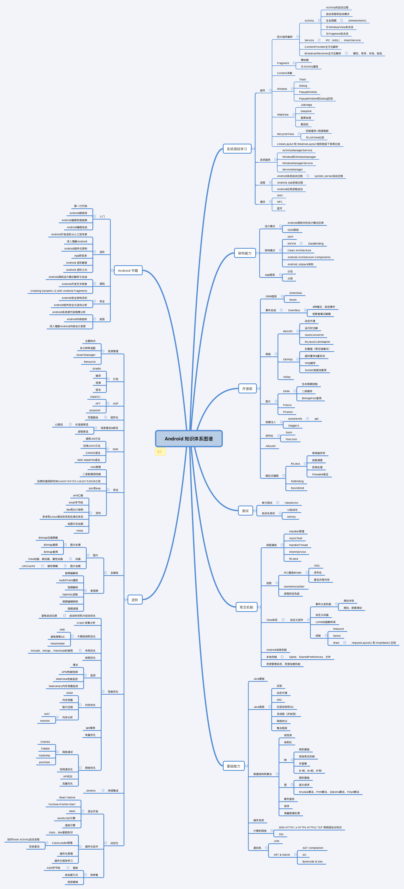

# Android知识点

## Android 知识图谱

 

## 规范文档：

​	1. [Android代码规范文档](编码规范/Android代码规范文档.md)

​	2. [项目设计文档规范](编码规范/项目设计文档规范.md)

​	3. [项目设计文档结构](编码规范/项目设计文档结构.md)

​	4. [开发注意事项](编码规范/开发注意事项.md)

​	5. [阿里巴巴Android规范文档](编码规范/阿里巴巴Android规范文档.pdf)

## 一、JAVA篇

### 1、Java基础

#### 1）[基础知识](java基础/java基础.md)

#### 2）[异常处理](java基础/Java异常.md)

#### 3）[容器](java基础/容器.md)

#### 4）[线程](java基础/线程.md)

#### 5）[泛型](java基础/java泛型.md)

#### 6）[java反射](java基础/java反射.md)

#### 7）[java注解](java基础/java注解.md)

#### 8）[线程池](java基础/线程池.md)

## 二、Android篇

### 1、[Android基础](android基础/android基础.md)

​    [activity展示和view绘制原理](android基础/组件展示流程.md)

​    [MVVM实战](android基础/mvvm实战.md)

   [recyclerView原理](android基础/recyclerView和listView对比.md)

### 2、开发工具

#### 							1）studio使用优化

​    [AndroidStudio日常开发实用技巧](studio优化/AndroidStudio日常开发实用技巧.md)

#####      											 （1）优化工具

#####            																					       	   Analyze APK

#### 							 2）gradle使用及优化

#### 							 3）git使用

### 3、Android高级

1）[知识点](android高级/Android高级知识点.md)

2）[apk瘦包](android高级/apk瘦身.md)

3）[异常分析优化](android高级/异常分析优化.md)

4）[apt实践](https://juejin.im/post/5edce4e3e51d45785e00a221)

5）[java虚拟机](android高级/java虚拟机.md)

6）studio使用优化

7）[app和activity启动启动过程](android高级/app启动过程.md)

8)  [权限获取](android高级/权限分享材料.md)

9) [app稳定性](android高级/app稳定性.md)

10) [自定义事件总线](android高级/自定义事件总线的演化.md)

### 4、性能优化
​     [性能优化简介](性能优化/README.md)

  1）[Android启动速度优化](性能优化/启动优化.md)

  2 )  [UI优化总结](ui优化/UI优化.md)

  3）[UI渲染优化](性能优化/UI渲染优化.md)

  4) [卡顿优化](性能优化/Android卡顿分析.md)

####   5）性能优化工具：TraceView、Systrace、调试GPU过度绘制 & GPU呈现模式分析、Hierarchy Viewer、MAT、Memory Monitor & Heap Viewer & Allocation Tracker、LeakCanary、Lint。

#### Android lint 

> Lint问题种类
>
> Correctness 不够完美的编码，比如硬编码、使用过时 API 等 
>
> Performanc 对性能有影响的编码，比如：静态引用，循环引用等 
>
> Internationalization 国际化，直接使用汉字，没有使用资源引用等 
>
> Security 不安全的编码，比如在 WebView 中允许使用 JavaScriptInterface等 
>
> Usability 可用的，有更好的替换的 比如排版、图标格式建议.png格式 等 
>
> Accessibility 辅助选项，比如ImageView的contentDescription往往建议在属性中定义 等

### 5、内存检测和优化

​    [MAT内存分析](内存检测和优化/使用AndroidStudio和MAT进行内存泄漏分析.md)

​    [LeakCanary源码分析](内存检测和优化/LeakCanary源码分析.md)

​    [Android内存优化](内存检测和优化/Android内存优化.md)

   [深入探索Android内存优化](https://jsonchao.github.io/2019/12/29/%E6%B7%B1%E5%85%A5%E6%8E%A2%E7%B4%A2Android%E5%86%85%E5%AD%98%E4%BC%98%E5%8C%96/)

### 6、电量分析和优化 

​      [电量优化](性能优化/电量优化.md)

### 8、[常见错误分析和处理](常见错误处理.md)

## 三、第三方sdk原理分析

   [DsBridge原理分析](第三方SDK/DsBridge原理分析.md)

   [GreenDao的使用](第三方SDK/GreenDao的使用.md)

   [GreenDao扩展和在项目中的使用](第三方SDK/GreenDao扩展和在项目中的使用.md)

   [行为日志库](第三方SDK/行为日志库.md)

  [OkHttp代码分析](第三方SDK/Okhttp.md)

  [Glide源码分析](第三方SDK/Glide.md)

  [retrofit原理](第三方SDK/retrofit原理.md)

## 四、架构设计

### 1、设计模式

​     [设计模式](../面试题/设计模式.md)

​	 [MVC,MVP,MVVM,CLEAN](设计模式/设计模式.md)

### 2、AOP

​    [AOP面向切面编程](设计模式\AOP\AOP面向切面编程.md)

​	[AOP编程实践](https://github.com/zytc2009/Demo_Aop)

## 五、组件化和插件化

### 1.插件化

   [插件化:DynamicLoad和DroidPlugin](组件化和插件/插件.md)

### 2.组件化

 [组件化分享(一期)](组件化和插件/组件化分享(一期).md)

 [ARouter流程分析](ARouter流程分析/ARouter流程分析.md)

 [组件消息总线modular-event](组件化和插件/modular-event.md)

 [组件化框架设计和实践](组件化和插件/组件化框架设计和实践.md)

  [Multidex流程和优化方案](组件化和插件/Multidex流程.md)

####  3.JetPack

## 六、Kotlin学习

​    [kotlin分享计划](kotlin/培训计划.md)

​    [kotlin第一期](kotlin/第一期培训内容.md)

​	    [环境搭建](kotlin/第一期/环境搭建.md)， [基本语法](kotlin/第一期/Kotlin-基本语法及使用.md)， [属性和字段](kotlin/第一期/Kotlin-属性与字段详解.md)， [函数](kotlin/第一期/Kotlin-函数详解.md)， [导包](kotlin/第一期/Kotlin-导包说明.md)

​    [kotlin第二期](kotlin/第二期培训内容.md)

​    [kotlin第三期](kotlin/第三期培训内容.md)

