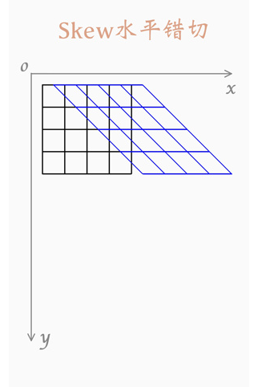
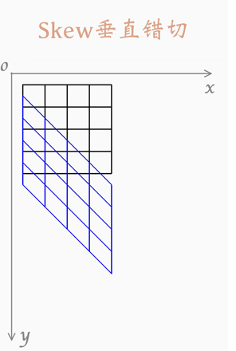
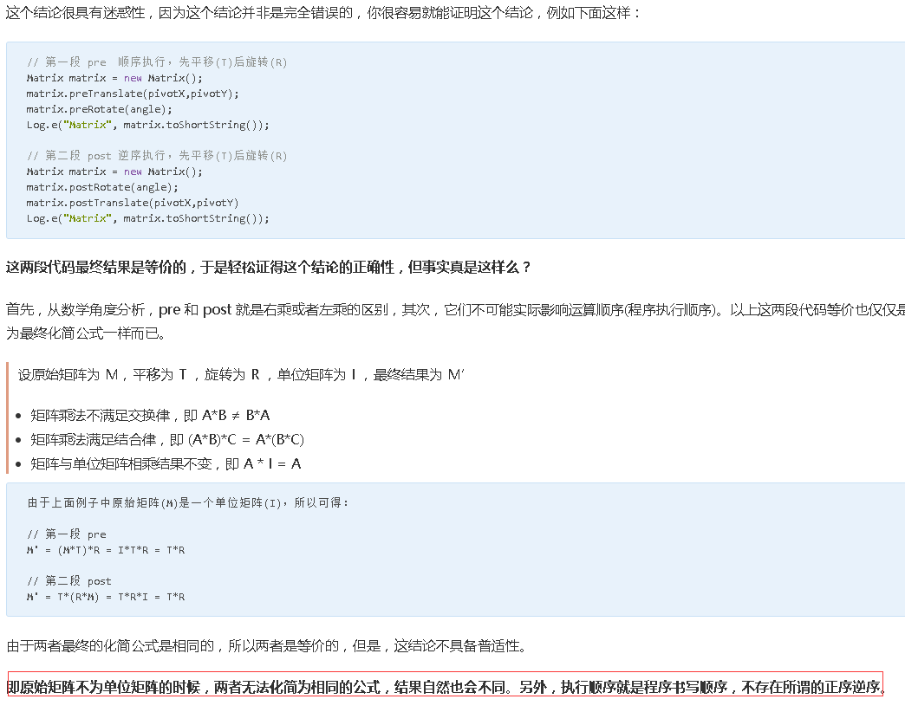

# 图片的Matrix使用

| 时间         | 版本     | 内容       | 修改人  |
| ---------- | ------ | -------- | ---- |
| 2019/10/28 | 6.17.1 | matrix使用 | 郭记龙  |
|            |        |          |      |

[TOC]

### 矩阵定义：

​	矩阵对象，可以对图形绑定，然后通过矩阵的变化，使图形产生对应的变化(对于图片的矩阵对象实质是三阶单位矩阵)

​	三阶矩阵对应图片的实例图：


+ 对应区块对应矩阵的对应属性情况
  - 缩放：MSCALE_X,MSCALE_Y代表矩阵横向和竖向缩放倍数，例如，MSCALE_X,MSCALE_Y均为0.5则代表图片的横向和竖向均缩小到0.5倍
  - 错切：即图片的一条边和另外一条边平移量不同造成的图片的位图变化，MSKEW_X,MSKEW_Y即代表位移量不同的边，大部分情况和缩放一同参考，控制旋转
    - 	
  - 平移：MTRANS_X,MTRANS_Y代表矩阵的水平和竖直位移量
  - 透视：在2纬图形上使用不到  一般值均为  [0 0 1] 
+ 基础小提示：
  + 矩阵的乘A*B 必须满足  A的矩阵行数 =  B的矩阵列表    
  + Q1：以上矩阵乘积是几阶矩阵
  + Q2：单位矩阵

### 基本API介绍:

| 方法类名     | 相关api                                    | 摘要                                    |
| -------- | ---------------------------------------- | ------------------------------------- |
| 基本方法     | equals,  toString , toShortString        | equals比较矩阵对象数组值，toShortString输出二维数组值  |
| 数值操作     | set, reset, setValues ,getValues         | 设置值，重置为单位矩阵，设置值，获取矩阵的值赋值给数组（必须长度不小于9） |
| 数值计算     | mapPoints, mapRadius ,mapRect, mapVectors | 计算变换后的数值                              |
| 设置(set)  | setConcat, setRotate ,setScale, setSkew ,setTranslate | 设置变换                                  |
| 前乘(pre)  | preConcat ,preRotate, preScale, preSkew, preTranslate | 前乘变换                                  |
| 后乘(post) | postConcat ,postRotate, postScale ,postSkew ,postTranslate, | 后乘变换                                  |
| 矩阵相关     | invert ,isAffine ,isIdentity             | 是否是逆矩阵、 是否为仿射矩阵、 是否为单位矩阵              |

注：

1.方法操作工具类在studyDemo项目中的MatrixUtils工具类中，在MatrixUseActivity类中存在调用

2.有关Prexxxx和Postxxxx操作

+ 理解的错误理解  

  - pre是顺序执行，post是倒叙执行

    

  - pre是先执行，post是后执行

+ 正确结论：

  + pre操作仅为矩阵右乘  M' = M * S  (S指为特殊矩阵)
  + post操作仅为矩阵的左乘，M' = S * M （S指为特殊矩阵）

3.set方法和pre，post的区别：set方法(仅限变化方法，setValue除外)会被后边的set方法覆盖，pre和post则都会叠加之前的结果

### 图片操作使用：

+ **前期准备**

  - 对ImageView设置setScaleType模式为ScaleType.MATRIX，不设置图片无变化

+ **常用变化对应操作**

  - 图片缩放：

    ```
    Matrix.postScale(float sx, float sy, float px, float py)
    	参数：
    	sx： 水平方向的缩放倍数   sy：竖直方向的缩放倍数
         px：缩放图片的水平点  py：缩放图片的竖直点
    ```

  - 图片旋转：

    ```
    Matrix.postRotate(float degrees, float px, float py)
    	参数：
    	degrees：旋转角度  px：缩放图片的水平点  py：缩放图片的竖直点
    ```

  - 图片平移：

    ```
    Matrix.postTranslate(float dx, float dy)
    参数：
    	dx：水平位移距离  dy：竖直位移距离
    ```

+ **操作图片对象**

  + 将变化后的Matrix对象，通过setImageMatrix方法设置为ImageView的Matrix对象，此时即可达到图片的对应变化

  + 如果想获取变化后的位图的rect对象需要通过如下代码获取：

    ```
    /**
     * 更新矩形边界
     */
    private void upDateBoundRectF() {
        if (getDrawable() != null) {
            mImageRectF.set(getDrawable().getBounds());
            mCurrentMatrix.mapRect(mImageRectF);
        }
    }
    ```

+ **注意点**

  + 图片如果涉及到多重操作，需要按照缩放，旋转，平移的操作执行，否侧结果会与期望不同
  + 矩阵的变换不满足交换律，A*B ≠ B*A

### 实现原理：

> 图片变化原理：	

​	setImageMatrix方法：即设置图片当前的matrix对象，调整drawable的位置，执行ondraw

```
public void setImageMatrix(Matrix matrix) {
        // 如果是单位矩阵将矩阵置空
        if (matrix != null && matrix.isIdentity()) {
            matrix = null;
        }

        // 判断之前缓存的matrix对象和现在不同则调整drawable对象并且执行刷新
        if (matrix == null && !mMatrix.isIdentity() ||
                matrix != null && !mMatrix.equals(matrix)) {
            mMatrix.set(matrix);
            configureBounds();
            invalidate();
        }
    }
```

调整位图的宽高

```
private void configureBounds() {
        .... 省略.... 
		//获取位图的宽高
        final int dwidth = mDrawableWidth;
        final int dheight = mDrawableHeight;
		//获取view的宽高
        final int vwidth = getWidth() - mPaddingLeft - mPaddingRight;
        final int vheight = getHeight() - mPaddingTop - mPaddingBottom;

       .... 省略.... 

        if (dwidth <= 0 || dheight <= 0 || ScaleType.FIT_XY == mScaleType) {
            //设置位图的边界
            mDrawable.setBounds(0, 0, vwidth, vheight);
            mDrawMatrix = null;
        } else {
            //设置位图的边界
            mDrawable.setBounds(0, 0, dwidth, dheight);
            //根据缩放模式调整
            if (ScaleType.MATRIX == mScaleType) {
                // 对imageView的mDrawMatrix赋值
                if (mMatrix.isIdentity()) {
                    mDrawMatrix = null;
                } else {
                    mDrawMatrix = mMatrix;
                }
            } else if .... 省略.... 
        }
    }
```

绘制过程：

```
protected void onDraw(Canvas canvas) {
        super.onDraw(canvas);
		......省略......
        if (mDrawMatrix == null && mPaddingTop == 0 && mPaddingLeft == 0) {
            mDrawable.draw(canvas);
        } else {
            final int saveCount = canvas.getSaveCount();
            canvas.save();
		......省略.......
		//上一步赋值的矩阵对象对画板对象做变化，仅对当前图层
            if (mDrawMatrix != null) {
                canvas.concat(mDrawMatrix);
            }
            mDrawable.draw(canvas);
            canvas.restoreToCount(saveCount);
        }
    }
```


### 参考文档：

> [Matrix超详细文档](https://blog.csdn.net/xiexiangyu92/article/details/79382650)

> [Matrix原理](https://www.gcssloop.com/customview/Matrix_Basic)
>
> [martix自定义view](https://www.jianshu.com/p/6ddb152b2a86)
>
> [Matrix详解](https://www.gcssloop.com/customview/Matrix_Method)

### 实操项目：

> [git地址](http://code.szy.net/android-module/StudyDemo.git)
>
> MatrixUseActivity 提供可编辑图片矩阵操作类


​	