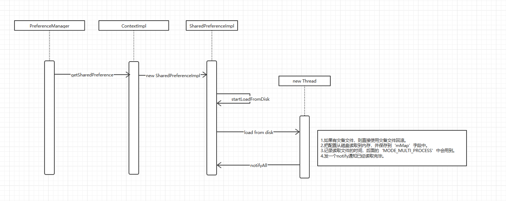
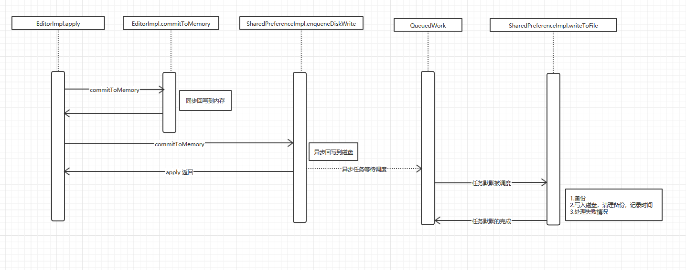
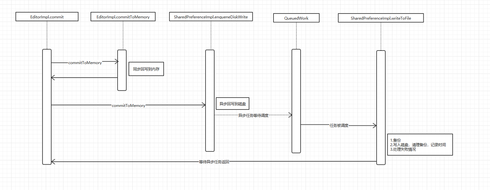

# SharedPreferences深度学习
[TOC]
## 目的
其实我们日常工作中，总在跟它打交道，但是可能我们对它的了解还不太全面，今天呢希望通过这篇文章，让大家能够更加系统的、全面的了解SharedPrefences的用法、注意问题及内部实现。由表及里，全方位的认识我们的“老朋友”。

## What(是什么)
### SharedPreferences基本概念
SharedPreferences 到底是个啥？  
它是Android提供一个轻量级数据存储接口，具体的实现类为SharedPreferencesImpl，源码位置在/frameworks/base/core/java/android/app/SharedPreferencesImpl.java下，其存储格式为xml格式。 用来保存应用的一些常用配置，它提供了string，set，int，long，float，boolean六种数据类型。最终数据是以xml形式进行存储。在应用中通常做一些简单数据的持久化缓存。SharedPreferences作为一个轻量级存储，所以就限制了它的使用场景，如果对它使用不当将会带来严重的后果。

### 存放位置
data/data/包名/shared_prefs目录下，文件名为xxx.xml，示例如下。
```
<?xml ...>
<map>
	<string name="name">Davi</string>
	<int name="age" value="29" />
	<string name="age">30</string>
</map>	
```


## How(怎么用)
### 存储数据(通过Editor处理)：

```
SharedPreferences sp=getSharedPreferences("data",MODE_PRIVATE);
SharedPreferences.Editor editor=sp.edit();   //获取编辑器
editor.putString("name","Liu"); //存入String型数据
editor.putInt("age",8);         //存入Int类型数据
editor.apply();                //提交修改，否则不生效
```
### 删除数据(通过Editor处理)：  
调用Editor对象的remove(String key)或clear()方法。
```
SharedPreferences sp=getSharedPreferences("data",MODE_PRIVATE);
SharedPreferences.Editor editor=sp.edit();   //获取编辑器
editor.remove("name");   //删除一条数据
editor.clear();         //删除所有数据
editor.apply();     //提交修改，否则不生效
```
### 获取数据：  
```
SharedPreferences sp=getSharedPreferences("data",MODE_PRIVATE);
//第二个参数为缺省值，如果不存在该key，返回缺省值
String data=sp.getString("name",""); 
```

## Why(为什么)
### Q?
1.如何从磁盘读取配置到内存?  
2.getXxx 如何从内存中获取配置?  
3.最终配置如何从内存回写到磁盘?  
4.多线程/多进程是否会有问题?

### SharedPreferences 对象获取
一般来说有如下方式:  
1.PreferenceManager.getDefaultSharedPreferences（）。  
2.ContextImpl.getSharedPreferences（）。

我们以上述 [1] 为例来看看源码:

```
// PreferenceManager.java
public static SharedPreferences getDefaultSharedPreferences(Context context) {
    return context.getSharedPreferences(getDefaultSharedPreferencesName(context),getDefaultSharedPreferencesMode());
}
    
```

上述无论那种方法, 最终都是调用到了ContextImpl.getSharedPreferences. 源码:  

```
// ContextImpl.java
public SharedPreferences getSharedPreferences(File file, int mode) {
        checkMode(mode);
        if (getApplicationInfo().targetSdkVersion >= android.os.Build.VERSION_CODES.O) {
            if (isCredentialProtectedStorage()
                    && !getSystemService(StorageManager.class).isUserKeyUnlocked(
                            UserHandle.myUserId())
                    && !isBuggy()) {
                throw new IllegalStateException("SharedPreferences in credential encrypted "
                        + "storage are not available until after user is unlocked");
            }
        }
        SharedPreferencesImpl sp;
        synchronized (ContextImpl.class) {
            final ArrayMap<File, SharedPreferencesImpl> cache = getSharedPreferencesCacheLocked();
            sp = cache.get(file);
            if (sp == null) {
                sp = new SharedPreferencesImpl(file, mode);
                cache.put(file, sp);
                return sp;
            }
        }
        if ((mode & Context.MODE_MULTI_PROCESS) != 0 ||
            getApplicationInfo().targetSdkVersion < android.os.Build.VERSION_CODES.HONEYCOMB) {
            // If somebody else (some other process) changed the prefs
            // file behind our back, we reload it.  This has been the
            // historical (if undocumented) behavior.
            sp.startReloadIfChangedUnexpectedly();
        }
        return sp;
    }
    
    
    private void checkMode(int mode) {
        if (getApplicationInfo().targetSdkVersion >= Build.VERSION_CODES.N) {
            if ((mode & MODE_WORLD_READABLE) != 0) {
                throw new SecurityException("MODE_WORLD_READABLE no longer supported");
            }
            if ((mode & MODE_WORLD_WRITEABLE) != 0) {
                throw new SecurityException("MODE_WORLD_WRITEABLE no longer supported");
            }
        }
    }
```

可见 sp 是先取了缓存, 如果缓存未命中, 才构造对象. 也就是说, 多次 getSharedPreferences 几乎是没有代价的，同时, 实例的构造被 synchronized 关键字包裹, 因此构造过程是多线程安全的。  

### SharedPreferences 的构造

我们再来看看第一次构建对象时发生了什么:

```
// SharedPreferencesImpl.java
SharedPreferencesImpl(File file, int mode) {
    mFile = file;
    mBackupFile = makeBackupFile(file);
    mMode = mode;
    mLoaded = false;
    mMap = null;
    startLoadFromDisk();
}
```
```
static File makeBackupFile(File prefsFile) {
    return new File(prefsFile.getPath() + ".bak");
}
```

有这么几个关键信息:  
1.mFile 代表我们磁盘上的配置文件。  
2.mBackupFile 是一个灾备文件, 用户写入失败时进行恢复, 后面会再说. 其路径是 mFile 加后缀 ‘.bak’。  
3.mMap 用于在内存中缓存我们的配置数据, 也就是 getXxx 数据的来源。

还涉及到一个 startLoadFromDisk, 我们来看看:

```
// SharedPreferencesImpl.java
private void startLoadFromDisk() {
    synchronized (mLock) {
        mLoaded = false;
    }
    new Thread("SharedPreferencesImpl-load") {
        public void run() {
            loadFromDisk();
        }
    }.start();
}
```

开启了一个线程，从文件读取，其源码如下：

```
private void loadFromDisk() {
    synchronized (mLock) {
        if (mLoaded) {
            return;
        }
        if (mBackupFile.exists()) {
            mFile.delete();
            mBackupFile.renameTo(mFile);
        }
    }

    // Debugging
    if (mFile.exists() && !mFile.canRead()) {
        Log.w(TAG, "Attempt to read preferences file " + mFile + " without permission");
    }

    Map map = null;
    StructStat stat = null;
    try {
        stat = Os.stat(mFile.getPath());
        if (mFile.canRead()) {
            BufferedInputStream str = null;
            try {
                str = new BufferedInputStream(
                        new FileInputStream(mFile), 16*1024);
                map = XmlUtils.readMapXml(str);
            } catch (Exception e) {
                Log.w(TAG, "Cannot read " + mFile.getAbsolutePath(), e);
            } finally {
                IoUtils.closeQuietly(str);
            }
        }
    } catch (ErrnoException e) {
        /* ignore */
    }

    synchronized (mLock) {
        mLoaded = true;
        if (map != null) {
            mMap = map;
            mStatTimestamp = stat.st_mtime;
            mStatSize = stat.st_size;
        } else {
            mMap = new HashMap<>();
        }
        mLock.notifyAll();
    }
}
```
loadFromDisk 这个函数很关键. 它就是实际从磁盘读取配置文件的函数. 可见, 它做了如下几件事:  

1.如果有 ‘灾备’ 文件, 则直接使用灾备文件回滚。  
2.把配置从磁盘读取到内存的并保存在 mMap 字段中(看代码最后 mMap = map)。  
3.标记读取完成, 这个字段后面 awaitLoadedLocked 会用到。记录读取文件的时间, 后面 MODE_MULTI_PROCESS 中会用到。  
4.发一个 notifyAll 通知已经读取完毕, 激活所有等待加载的其他线程。

总结一下:


### getXxx 的流程

```
// SharedPreferencesImpl.java
public String getString(String key, @Nullable String defValue) {
    synchronized (mLock) {
        awaitLoadedLocked();
        String v = (String)mMap.get(key);
        return v != null ? v : defValue;
    }
}
```

可见, 所有的 get 操作都是线程安全的. 并且 get 仅仅是从内存中(mMap) 获取数据, 所以无性能问题。

考虑到 配置文件的加载 是在单独的线程中异步进行的(参考 ‘SharedPreferences 的构造’), 所以这里的 awaitLoadedLocked 是在等待配置文件加载完毕. 也就是说如果我们第一次构造 SharedPreferences 后就立刻调用 getXxx 方法, 很有可能读取配置文件的线程还未完成, 所以这里要等待该线程做完相应的加载工作. 来看看 awaitLoadedLocked 的源码:

```
private void awaitLoadedLocked() {
    if (!mLoaded) {
        // Raise an explicit StrictMode onReadFromDisk for this
        // thread, since the real read will be in a different
        // thread and otherwise ignored by StrictMode.
        BlockGuard.getThreadPolicy().onReadFromDisk();
    }
    while (!mLoaded) {
        try {
            mLock.wait();
        } catch (InterruptedException unused) {
        }
    }
}
```

很明显, 如果加载还未完成(mLoaded == false), getXxx 会卡在 awaitLoadedLocked, 一旦加载配置文件的线程工作完毕, 则这个加载线程会通过 notifyAll 会通知所有在 awaitLoadedLocked 中等待的线程, getXxx 就能够返回了. 不过大部分情况下, mLoaded == true. 这样的话 awaitLoadedLocked 会直接返回。

### putXxx 的流程

put 比 get 稍微麻烦一点儿, 因为涉及到 Editor 和 MemoryCommitResult 对象。先来看看 edit() 方法的实现:

```
public Editor edit() {
    // TODO: remove the need to call awaitLoadedLocked() when
    // requesting an editor.  will require some work on the
    // Editor, but then we should be able to do:
    //
    //      context.getSharedPreferences(..).edit().putString(..).apply()
    //
    // ... all without blocking.
    synchronized (mLock) {
        awaitLoadedLocked();
    }

    return new EditorImpl();
}
```
Editor 没有构造函数, 只有两个属性被初始化:

```
// SharedPreferencesImpl.java
public final class EditorImpl implements Editor {
    private final Map<String, Object> mModified = Maps.newHashMap();
    private boolean mClear = false;

    ... 略去方法定义 ...
    public Editor putString(String key, @Nullable String value) { ... }
    public boolean commit() { ... }
    ...
}
```

mModified 是我们每次 putXxx 后所改变的配置项。  
mClear 标识要清空配置项, 但是只清了 SharedPreferences.mMap。  
edit() 会保障配置已从磁盘读取完毕, 然后仅仅创建了一个对象. 接下来看看 putXxx 的真身:  

```
// SharedPreferencesImpl.java
public Editor putString(String key, @Nullable String value) {
    synchronized (this) {
        mModified.put(key, value);
        return this;
    }
}
```

很简单, 仅仅是把我们设置的配置项放到了 mModified 属性里保存. 等到 apply 或者 commit 的时候回写到内存和磁盘. 咱们分别来看看:  

### apply
apply 是各种 ‘最佳实践’ 推荐的方式, 那么它到底是怎么异步工作的呢? 我们来看个究竟: 

```
// SharedPreferencesImpl.java
    public void apply() {
        final long startTime = System.currentTimeMillis();

        final MemoryCommitResult mcr = commitToMemory();
        final Runnable awaitCommit = new Runnable() {
                public void run() {
                    try {
                        mcr.writtenToDiskLatch.await();
                    } catch (InterruptedException ignored) {
                    }

                    if (DEBUG && mcr.wasWritten) {
                        Log.d(TAG, mFile.getName() + ":" + mcr.memoryStateGeneration
                                + " applied after " + (System.currentTimeMillis() - startTime)
                                + " ms");
                    }
                }
            };

        QueuedWork.addFinisher(awaitCommit);

        Runnable postWriteRunnable = new Runnable() {
                public void run() {
                    awaitCommit.run();
                    QueuedWork.removeFinisher(awaitCommit);
                }
            };

        SharedPreferencesImpl.this.enqueueDiskWrite(mcr, postWriteRunnable);

        // Okay to notify the listeners before it's hit disk
        // because the listeners should always get the same
        // SharedPreferences instance back, which has the
        // changes reflected in memory.
        notifyListeners(mcr);
    }
```

可以看出大致的脉络:  
1.commitToMemory 应该是把修改的配置项回写到内存。
2.SharedPreferencesImpl.this.enqueueDiskWrite 把配置项加入到一个异步队列中, 等待调度。  
我们来看看 commitToMemory 的实现(略去大量无关代码):

```
    private MemoryCommitResult commitToMemory() {
        long memoryStateGeneration;
        List<String> keysModified = null;
        Set<OnSharedPreferenceChangeListener> listeners = null;
        Map<String, Object> mapToWriteToDisk;

        synchronized (SharedPreferencesImpl.this.mLock) {
            // We optimistically don't make a deep copy until
            // a memory commit comes in when we're already
            // writing to disk.
            if (mDiskWritesInFlight > 0) {
                // We can't modify our mMap as a currently
                // in-flight write owns it.  Clone it before
                // modifying it.
                // noinspection unchecked
                mMap = new HashMap<String, Object>(mMap);
            }
            mapToWriteToDisk = mMap;
            mDiskWritesInFlight++;

            boolean hasListeners = mListeners.size() > 0;
            if (hasListeners) {
                keysModified = new ArrayList<String>();
                listeners = new HashSet<OnSharedPreferenceChangeListener>(mListeners.keySet());
            }

            synchronized (mLock) {
                boolean changesMade = false;

                if (mClear) {
                    if (!mMap.isEmpty()) {
                        changesMade = true;
                        mMap.clear();
                    }
                    mClear = false;
                }

                for (Map.Entry<String, Object> e : mModified.entrySet()) {
                    String k = e.getKey();
                    Object v = e.getValue();
                    // "this" is the magic value for a removal mutation. In addition,
                    // setting a value to "null" for a given key is specified to be
                    // equivalent to calling remove on that key.
                    if (v == this || v == null) {
                        if (!mMap.containsKey(k)) {
                            continue;
                        }
                        mMap.remove(k);
                    } else {
                        if (mMap.containsKey(k)) {
                            Object existingValue = mMap.get(k);
                            if (existingValue != null && existingValue.equals(v)) {
                                continue;
                            }
                        }
                        mMap.put(k, v);
                    }

                    changesMade = true;
                    if (hasListeners) {
                        keysModified.add(k);
                    }
                }

                mModified.clear();

                if (changesMade) {
                    mCurrentMemoryStateGeneration++;
                }

                memoryStateGeneration = mCurrentMemoryStateGeneration;
            }
        }
        return new MemoryCommitResult(memoryStateGeneration, keysModified, listeners,mapToWriteToDisk);
    }
```

总结来说就两件事:  

1.把 Editor.mModified 中的配置项回写到 SharedPreferences.mMap 中, 完成了内存的同步。
2.把 SharedPreferences.mMap 保存在了 mcr.mapToWriteToDisk 中， 而后者就是即将要回写到磁盘的数据源。

我们再来回头看看 apply 方法:

```
// SharedPreferencesImpl.java
public void apply() {
    final MemoryCommitResult mcr = commitToMemory();

    ... 略无关 ...

    SharedPreferencesImpl.this.enqueueDiskWrite(mcr, postWriteRunnable);
}
```

1.commitToMemory 完成了内存的同步回写。  
2.enqueueDiskWrite 完成了硬盘的异步回写, 我们接下来具体看看。  

### enqueueDiskWrite

```
// SharedPreferencesImpl.java
private void enqueueDiskWrite(final MemoryCommitResult mcr,
                                final Runnable postWriteRunnable) {
   final Runnable writeToDiskRunnable = new Runnable() {
                public void run() {
                    synchronized (mWritingToDiskLock) {
                        writeToFile(mcr, isFromSyncCommit);
                    }
                    synchronized (mLock) {
                        mDiskWritesInFlight--;
                    }
                    if (postWriteRunnable != null) {
                        postWriteRunnable.run();
                    }
                }
            };

    ...

    QueuedWork.queue(writeToDiskRunnable, !isFromSyncCommit);
}
```

```
//QueuedWork.java
public static void queue(Runnable work, boolean shouldDelay) {
        Handler handler = getHandler();

        synchronized (sLock) {
            sWork.add(work);

            if (shouldDelay && sCanDelay) {
                handler.sendEmptyMessageDelayed(QueuedWorkHandler.MSG_RUN, DELAY);
            } else {
                handler.sendEmptyMessage(QueuedWorkHandler.MSG_RUN);
            }
        }
    }
```

getHandler 实际上就是 HandleThread, 如下:

```
//QueuedWork.java
private static Handler getHandler() {
        synchronized (sLock) {
            if (sHandler == null) {
                HandlerThread handlerThread = new HandlerThread("queued-work-looper",
                        Process.THREAD_PRIORITY_FOREGROUND);
                handlerThread.start();

                sHandler = new QueuedWorkHandler(handlerThread.getLooper());
            }
            return sHandler;
        }
    }
```

回到 enqueueDiskWrite 中, 这里还有一个重要的函数叫做 writeToFile:

```
// SharedPreferencesImpl.java
    private void writeToFile(MemoryCommitResult mcr, boolean isFromSyncCommit) {
        boolean fileExists = mFile.exists();
        // Rename the current file so it may be used as a backup during the next read
        if (fileExists) {
            boolean needsWrite = false;

            // Only need to write if the disk state is older than this commit
            if (mDiskStateGeneration < mcr.memoryStateGeneration) {
                if (isFromSyncCommit) {
                    needsWrite = true;
                } else {
                    synchronized (mLock) {
                        // No need to persist intermediate states. Just wait for the latest state to
                        // be persisted.
                        if (mCurrentMemoryStateGeneration == mcr.memoryStateGeneration) {
                            needsWrite = true;
                        }
                    }
                }
            }

            if (!needsWrite) {
                mcr.setDiskWriteResult(false, true);
                return;
            }

            boolean backupFileExists = mBackupFile.exists();

            if (!backupFileExists) {
                if (!mFile.renameTo(mBackupFile)) {
                    Log.e(TAG, "Couldn't rename file " + mFile
                          + " to backup file " + mBackupFile);
                    mcr.setDiskWriteResult(false, false);
                    return;
                }
            } else {
                mFile.delete();
            }
        }

        // Attempt to write the file, delete the backup and return true as atomically as
        // possible.  If any exception occurs, delete the new file; next time we will restore
        // from the backup.
        try {
            FileOutputStream str = createFileOutputStream(mFile);
            if (str == null) {
                mcr.setDiskWriteResult(false, false);
                return;
            }
            XmlUtils.writeMapXml(mcr.mapToWriteToDisk, str);

            writeTime = System.currentTimeMillis();

            FileUtils.sync(str);

            fsyncTime = System.currentTimeMillis();

            str.close();
            ContextImpl.setFilePermissionsFromMode(mFile.getPath(), mMode, 0);

            try {
                final StructStat stat = Os.stat(mFile.getPath());
                synchronized (mLock) {
                    mStatTimestamp = stat.st_mtime;
                    mStatSize = stat.st_size;
                }
            } catch (ErrnoException e) {
                // Do nothing
            }

            // Writing was successful, delete the backup file if there is one.
            mBackupFile.delete();

            mDiskStateGeneration = mcr.memoryStateGeneration;

            mcr.setDiskWriteResult(true, true);

            long fsyncDuration = fsyncTime - writeTime;
            mSyncTimes.add(Long.valueOf(fsyncDuration).intValue());
            mNumSync++;

            if (DEBUG || mNumSync % 1024 == 0 || fsyncDuration > MAX_FSYNC_DURATION_MILLIS) {
                mSyncTimes.log(TAG, "Time required to fsync " + mFile + ": ");
            }

            return;
        } catch (XmlPullParserException e) {
            Log.w(TAG, "writeToFile: Got exception:", e);
        } catch (IOException e) {
            Log.w(TAG, "writeToFile: Got exception:", e);
        }

        // Clean up an unsuccessfully written file
        if (mFile.exists()) {
            if (!mFile.delete()) {
                Log.e(TAG, "Couldn't clean up partially-written file " + mFile);
            }
        }
        mcr.setDiskWriteResult(false, false);
    }
```

代码大致分为三个过程:
1.先把已存在的老的配置文件重命名(加 ‘.bak’ 后缀), 然后删除老的配置文件. 这相当于做了灾备。  
2.向 mFile 中一次性写入所有配置项. 即 mcr.mapToWriteToDisk(这就是 commitToMemory 所说的保存了所有配置项的字段) 一次性写入到磁盘. 如果写入成功则删除灾备文件, 同时记录了这次同步的时间。  
3.如果上述过程 [2] 失败, 则删除这个半成品的配置文件。  

好了, 我们来总结一下 apply:  

1.通过 commitToMemory 将修改的配置项同步回写到内存 SharedPreferences.mMap 中. 此时, 任何的 getXxx 都可以获取到最新数据了。  
2.通过 enqueueDiskWrite 调用 writeToFile 将所有配置项一次性异步回写到磁盘. 这是一个HandlerThread。

来看个时序图压压惊:


### commit

看过了apply再看commit就非常容易了。

```
// SharedPreferencesImpl.java
public boolean commit() {
    MemoryCommitResult mcr = commitToMemory();

    SharedPreferencesImpl.this.enqueueDiskWrite(
        mcr, null /* sync write on this thread okay */);
    try {
        mcr.writtenToDiskLatch.await();
    } catch (InterruptedException e) {
        return false;
    } finally {
        
    }
    notifyListeners(mcr);
    return mcr.writeToDiskResult;
}
```
直接看时序图：


最后需要提一下的就是 listener:
* 对于 apply, listener 回调时内存已经完成同步, 但是异步磁盘任务不保证是否完成。
* 对于 commit, listener 回调时内存和磁盘都已经同步完毕。  


### 各种标记的作用
**MODE_PRIVATE**  **（默认）**
**MODE_WORLD_READABLE**  
**MODE_WORLD_WRITEABLE**:  


指的是, 在保存文件的时候设置的文件属性. PRIVATE 就只有自己和所属组的读写权限, READABLE/WRITEABLE 是对 other 用户和组的读写权限. 主要源码位于: FileUtils.setPermissions。但这个7.0以后已经废弃了。  

**MODE_MULTI_PROCESS**:  

阅读过本文的话你会知道, 一个 prefs 实例通常有两种获得途径, 一个是第一次被 new 创建出来的, 这种方式会实际的读取磁盘文件. 还一种是后续从缓存(sSharedPrefsCache) 中取出来了.

而这个标记的意思就是: 使用 getSharedPrefercences 获取实例时, 无论是从磁盘读文件构造对象还是从缓存获取, 都会检查实例的 ‘内存中保存的时间’ 和 ‘磁盘上文件的最后修改时间’, 如果内存中保存的时间和磁盘上文件的最后修改时间, 则重新加载文件. 可以认为如果实例是从磁盘读取构造出来的, 那么他的 ‘内存中保存的时间’ 和 ‘文件的最后修改时间’ 一定是一样的, 而从缓存中来的实例就不一样了, 因为它可能很早就被创建(那个时候就已经读取了磁盘的文件并记录了当时文件的最后修改时间), 在随后的期间里其他进程很可能修改过磁盘上的配置文件导致最后修改时间变化, 这时候当我们从缓存中再次获取这个实例的时候,系统会帮你检查这个文件在这段时间是否被修改过(‘内存中保存的时间’ 和 ‘磁盘上文件的最后修改时间’ 是否一致), 如果被修改过, 则重新从磁盘读取配置文件, 保证获取实例的内容是最新的。

```
    * @deprecated MODE_MULTI_PROCESS does not work reliably in
     * some versions of Android, and furthermore does not provide any
     * mechanism for reconciling concurrent modifications across
     * processes.  Applications should not attempt to use it.  Instead,
     * they should use an explicit cross-process data management
     * approach such as {@link android.content.ContentProvider ContentProvider}.
     */
    @Deprecated
    public static final int MODE_MULTI_PROCESS = 0x0004;
```
当使用MODE_MULTI_PROCESS这个字段时，其实并不可靠，因为android内部并没有合适的机制去防止多个进程所造成的冲突，应用不应该使用它，推荐使用ContentProvider。上面这段介绍我们得知：多个进程访问{MODE_MULTI_PROCESS}标识的SharedPreferences时，会造成冲突，举个例子就是，在A进程，明明set了一个key进去，跳到B进程去取，却提示null的错误。


## 结论
1.SharedPreferences 是线程安全的. 内部由大量 synchronized 关键字保障。  
2.SharedPreferences 不是进程安全的。  
3.第一次 getSharedPreferences 会读取磁盘文件, 后续的 getSharedPreferences 会从内存缓存中获取. 如果第一次调用getSharedPreferences时还没从磁盘加载完毕就调用getXxx/putXxx , 则getXxx/putXxx 操作会卡主, 直到数据从磁盘加载完毕后返回。   
4.所有的 getXxx 都是从内存中取的数据。  
5.apply 是同步回写内存, 然后把异步回写磁盘的任务放到一个单线程的队列中等待调度。 commit 和前者一样, 只不过要等待异步磁盘任务结束后才返回。  
6.MODE_MULTI_PROCESS 是在每次getSharedPreferences时检查磁盘上配置文件上次修改时间和文件大小, 一旦所有修改则会重新从磁盘加载文件。所以并不能保证多进程数据的实时同步。
7.从 Android N 开始, 不再支持 MODE_WORLD_READABLE & MODE_WORLD_WRITEABLE， 一旦指定, 会抛异常。  


## 注意事项
1.不要存放大的key和value！我就不重复三遍了，会引起界面卡、频繁GC、占用内存等等。   
2.毫不相关的配置项就不要丢在一起了！文件越大读取越慢，不知不觉就被坑了；另外，放进defalut的的方式也是不可取的！  
3.读取频繁的key和不易变动的key尽量不要放在一起，影响速度。（如果整个文件很小，那么忽略吧，为了这点性能添加维护成本得不偿失）  
4.不要乱edit和apply，尽量批量修改一次提交！  
5.尽量不要存放JSON和HTML，这种场景请直接使用json！  
6.不要指望用这货多进程使用, 很小几率会造成数据全部丢失, 现象是配置文件被删除。
7.目前咱们项目中tt_sp_app_list.xml,userSystem_sp.xml这两个文件非常大。
8.commit 发生在 UI 线程中，apply 发生在工作线程中，对于数据的提交最好是批量操作统一提交。虽然apply 发生在工作线程（不会因为IO阻塞UI线程）但是如果添加任务较多也有可能带来其他严重后果（参照ActivityThread源码中handleStopActivity方法实现）。

**相关的问题**

加载慢：初始化加载整个文件

全量写入：单次改动都会导致整体写入

卡顿：补偿策略导致


**存储优化**：

常规存储：每次产生一条数据，写入磁盘：不丢失，性能会损耗

开辟一个内存buffer，先存buffer，再存文件：可能会丢数据

mmap：内存映射文件，系统自动写入，高性能，不丢失；如微信的XLog，美团的Logan等


### 替代方案
1.自己实现一套存储策略。
2.https://github.com/Tencent/MMKV 微信开源的MMKV。

   mmap和文件锁保证数据完整

   增量写入、使用Protocol Buffer

   支持从SP迁移

