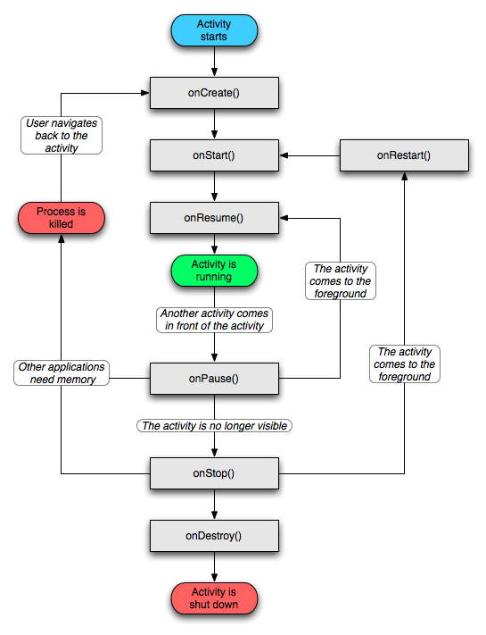
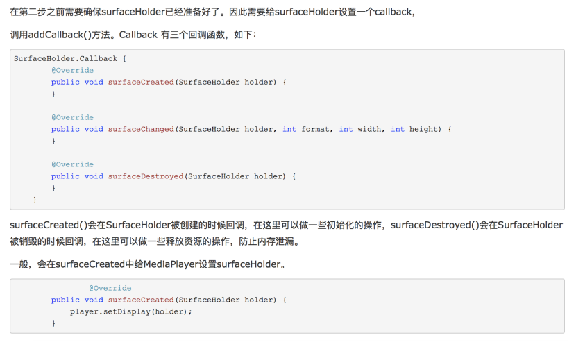
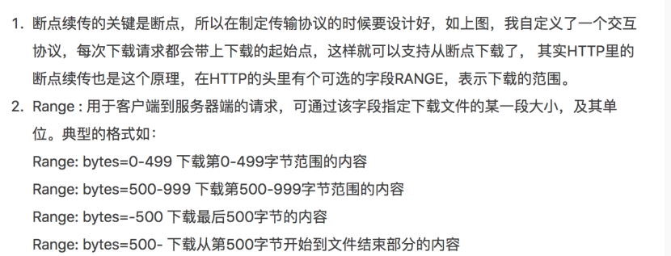
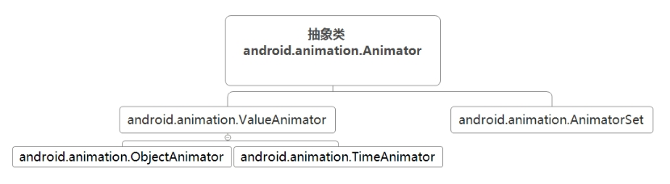
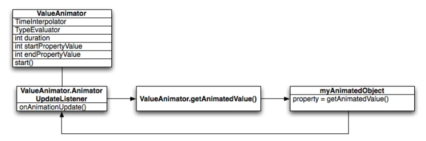
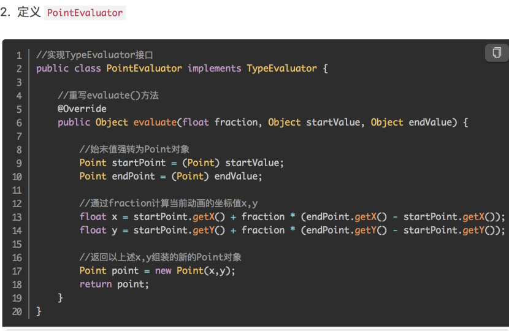
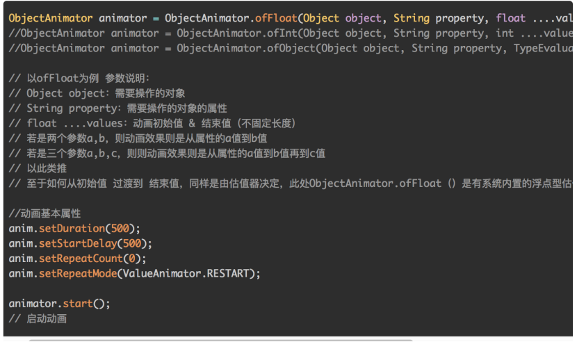
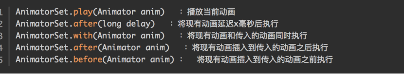

[TOC]

#### Application作用

保存应用进程的全局变量
初始化操作
提供应用上下文

#### Activity生命周期



> onCreate - onStart - onResume - onPause - onStop - onRestart - onDestroy 
>
> 页面A启动页面B，生命周期如何联动？
>
> 部署程序
>
> D/MainActivity: onCreate------A
> D/MainActivity: onStart-------A
> D/MainActivity: onResume------A
>
> 点击A中按钮开始跳转B
>
> D/MainActivity: onPause-------A
> D/SecondActivity: onCreate----B
> D/SecondActivity: onStart-----B
> D/SecondActivity: onResume----B
> D/MainActivity: onStop--------A
>
> #### 然后点击返回键从B返回A
>
> D/SecondActivity: onPause-----BD/MainActivity: onRestart-----A D/MainActivity:  onStart-------AD/MainActivity: onResume------AD/SecondActivity: onStop------BD/SecondActivity: onDestroy---B
>
> <https://blog.csdn.net/weixin_43589682/article/details/97030740>

#### 异常情况下的Activity的生命周期 & 数据如何保存和恢复

> 当系统配置发生变化后(比如屏幕旋转)，Activity 会被销毁，它的onPause、onStop、onDestroy会被调用，不过由于是在异常情况下终止的，系统会在调用onStop 方法之前调用 onSaveInstanceState 方法保存 Activity 的状态（UI状态和数据），在Activity 重建时，从onCreate 或onRestoreInstanceState 中获取保存的Activity的状态，重新恢复Activity。

#### Android为什么requestWindowFeature()在setContentView()之前调用？

何一个Activity中显示的界面其实主要都由两部分组成，标题栏（TitleView）和内容布局(ContentView)。标题栏就是在很多界面顶部显示的那部分内容。而内容布局就是一个FrameLayout，这个布局的id叫作content，我们调用setContentView()方法时所传入的布局其实就是放到这个FrameLayout中的，这也是为什么这个方法名叫作setContentView()，而不是叫setView()。

Activity的RequestWindowFeature()实际上走的是PhoneWIndow的requestFeature()，在PhoneWIndow的requestFeature()中有个前提条件，成员属性mContentParent不能为非null，这是构建窗体的view，即在为窗体设置属性时，还不能构建窗体。

```
低版本API
public boolean requestFeature(int featureId) {
        if (mContentParent != null) {
            throw new AndroidRuntimeException("requestFeature() must be called before adding content");
        }
        .....
}

api：29
public boolean requestFeature(int featureId) {
    if (mContentParentExplicitlySet) {//应该改为boolean变量记录，setContentView置true
        throw new AndroidRuntimeException("requestFeature() must be called before adding content");
    }    
}
```

#### activity启动模式

 standard模式：在这种模式下，activity默认会进入启动它的activity所属的任务栈中。这也是默认的一种模式

 singleTop模式：栈顶复用模式（只有activity在顶部时复用）。如果新activity位于任务栈的栈顶的时候，activity不会被重新创建，同时它的onNewIntent方法会被回调。如果栈顶activity不是启动activity时，会和standard模式一样重写创建activity并加入栈中。

使用场景：登录页，推送提示框，微信支付WxPayEntryActivity，WxEntryActiviy等

 singleTask模式：栈内复用模式（整个栈中复用，复用时该activity之上的会出栈，使它成为栈顶）。只要activity在一个栈中存在，那么多次启动此activity不会被重新创建单例，系统会回调onNewIntent。这种模式可以称为单例模式，只会存在一种，有则直接从栈中调用，没有则创建并且压入栈中。复用时，该activity上面的activity被强制弹栈

使用场景：主页面，WebView页面，扫一扫页面等

 singleInstance模式：单实例模式。这种模式的activity只能单独地位于一个任务栈中，这种与singleTask有点类似，其实也是有则直接调用，没有则创建并且放入栈中，只不过singleTask是可以和其他的Activity放在同一个栈中，singleInstance则是只会将创建的Activity放在一个栈中，并且这个栈中只会有这一个Activity实例

使用场景：系统luacher，来电显示，锁屏

系统默认给一个app创建一个任务栈，如果activity启动模式 设置了如singleInstance时，会单独创建一个栈

#### Android Service、IntentService，Service和组件间通信

> IntentService是继承Service的，所以IntentService是Service的子类。IntentService 封装了 HandlerThread 和 Handler。
> IntentService是一个特殊的Service类，是实现了多线程处理异步请求的一个服务类，在handleIntent方法中进行耗时的操作，如果有多个耗时的操作任务，会按照顺序去一个一个的执行，执行完一个关闭一个。

####  普通service

启动方式：

1 startService／stopService

生命周期：onCreate—>onStartCommond()àonDestroy

多次调用startservice开启服务onCreate只在创建时调用一次，	onStartCommond会多次调用

2 bindService ／unbindService（ServiceConnection）

生命周期：onCreate->onBind()àonUnBind()àonDestroy

   多次调用bindService()时 onCreate和onBind只调用一次

可以通过Ibinder接口回去service实例从而能调用service中方法。 

```
public class TestTwoService extends Service{ 
  //client 可以通过Binder获取Service实例
  public class MyBinder extends Binder {
     public TestTwoService getService() {
      return TestTwoService.this;
     }
  }

  //通过binder实现调用者client与Service之间的通信
  private MyBinder binder = new MyBinder();
  private final Random generator = new Random();
  @Override
  public void onCreate() {
    super.onCreate();
  }

  @Override
  public int onStartCommand(Intent intent, int flags, int startId) {
    return START_NOT_STICKY;
  }

  @Nullable
  @Override
  public IBinder onBind(Intent intent) {
    return binder;
  }

  @Override
  public boolean onUnbind(Intent intent) {
    return false;
  }
}

客户端实现：
private ServiceConnection conn = new ServiceConnection() {
   @Override
   public void onServiceConnected(ComponentName name, IBinder binder) {
 		TestTwoService.MyBinder myBinder = (TestTwoService.MyBinder) binder;
	    service = myBinder.getService(); 
   }

   @Override
   public void onServiceDisconnected(ComponentName name) {
       isBind = false;
   }
}; 

protected void onCreate(Bundle savedInstanceState) {
    super.onCreate(savedInstanceState);
    setContentView(R.layout.activity_a);
    Intent intent = new Intent(this, TestTwoService.class);
    intent.putExtra("from", "ActivityA");      
    bindService(intent, conn, BIND_AUTO_CREATE);
}

```

 1.如果先bindService,再startService:

​        在bind的Activity退出的时候,Service会执行unBind方法而不执行onDestory方法,因为有startService方法调用过,所以Activity与Service解除绑定后会有一个与调用者没有关连的Service存在

2.如果先bindService,再startService,再调用Context.stopService

​        Service的onDestory方法不会立刻执行,因为有一个与Service绑定的Activity,但是在Activity退出的时候,会执行onDestory,如果要立刻执行stopService,就得先解除绑定 

3 先startService，再bindService。 

首先在主界面创建时，startService(intent)启动方式开启服务，保证服务长期后台运行；

然后调用服务时，bindService(intent, connection, BIND_AUTO_CREATE)绑定方式绑定服务，这样可以调用服务的方法； 

调用服务功能结束后，unbindService(connection)解除绑定服务，置空中介对象；

最后不再需要服务时，stopService(intent)终止服务。

#### IntentService

是service的子类，处理异步请求实现多线程。内部使用HanderThread+Handler实现异步处理。在handleIntent方法中执行耗时任务，执行完后自动调用带参数的stopself（starid）在所有任务执行完毕后关掉service。

intentservice处理完后自动停掉。不需要手动停止

使用场景：后台上传图片，文件，批量处理数据库等。优化application启动，在oncrate中开启service 初始化第三方库加载等

#### Android异步任务机制之AsycTask

> AsyncTask本质上是一个封装了线程池、工作线程和Handler的异步框架，主要是执行异步任务，由于AsyncTask里面封装了Handler，所以它可以在主线程和子线程之间灵活的切换。
> 在Android 1.6之前的版本中，AsyncTask都是串行的，所有的任务都会一串一串的放到线程池中。
> 在Android 1.6到 Android 2.3中，AsyncTask改成并行
> 在Android 2.3之后，又改成串行了，但是还可以执行并行，想要执行并行，可以调用executeOnExecutor(...)

#### 简述一下Android 8.0、9.0 分别增加了哪些新特性

> 8.0：画中画、Notification Dots、智能文本选择、自动填写、系统/应用启动程序加速、WiFi感知功能；
>
> 画中画：Android8.0又带了另一种更高级的多窗口模式，号称“Picture in Picture”（简称PIP，即“画中画”）。应用一旦进入画中画模式，就会缩小为屏幕上的一个小窗口，该窗口可拖动可调整大小，非常适合用来播放视频。
>
> 9.0：自适应电池、黑暗模式、应用程序操作、应用定时器、自适应亮度、新截图快捷方式、通知信息等。

#### 图片缓存原理

> 1.内存缓存：读取速度最快。
>
> 2.硬盘缓存（文件缓存）：读取速度比内存缓存稍慢。
>
> 3.网络缓存：读取速度最慢。
>
> 缓存机制的通用调度算法是LRU(最近最久未使用)，与内存缓存和硬盘缓存对应的类分别是LruCache和DiskLruCache，网络缓存okHttp。

#### BitmapRegionDecoder加载高清大图

BitmapRegionDecoder主要用于显示图片的某一块矩形区域，所以可以利用它来完成大图片的动态区域显示。

l 简单用法：

BitmapRegionDecoder提供了一系列的newInstance方法来构造对象，支持传入文件路径，文件描述符，文件的inputstrem等。

#### Android数据存储的五种方式

> 1.使用SharedPreferences存储数据(commit,apply)
>
>    对于 apply返回时内存已经完成同步, 但是异步磁盘任务不保证是否完成，所以无法知道最终结果。对于 commit, 返回时内存和磁盘都已经同步完毕。  
>
> 2.文件存储数据
>
> 3.SQLite数据库存储数据
>
> 4.使用ContentProvider存储数据
>
> 5.网络存储数据

#### 初识ConstraintLayout及性能优势

优点：减少布局嵌套，提高性能；可以按照比例约束控件的位置和尺寸，更好的适配屏幕。与relative类似但是要比relitiveLayout强大。

1. 相对位置：相对父View或相对其他View或使用辅助工具：GuildeLine ，barrier（屏障）

 layout_constraintLeft_toLeftOf = “parent”,layout_constraintRight_toRightOf =”@id/otherviewid”

 …Top,Bottom,Start,End…

 app:layout_constraintBaseLine_toBaseLineOf = “@id/baseline”  //文本极限约束  例如2个高度不同的textview想让文本对齐

2. 剧中和偏移

剧中：上下左右约束设置为parent

偏移（按比例）：

app:layout_constraintHorizontal_bias = “0.2” //水平偏移

app:layout_constraintVertical_bias = “0.6” //垂直偏移

3. 尺寸按宽高比(当宽或高其中一个设置为0dp时)

app:layout_constraintDimensionRatio = “1:1”  //宽高比为1:1

app:layout_constraintLeft_toLeftof = “parent”

app:layout_constarintRight_toRightof = “parent”

android:layout_width = “0dp”

还可以设置：ratio为“H，2:3” //依据高度H按比例约束宽度；“W，2:3”依据宽度约束高度

4. 像linearLayout一样设置权重比

将控件相互约束；宽或高设置为0dp；设置layout_constraintHorizontal_weight=”1”

layout_constraintVertical_weight = “1”

5. 边距

常用属性：

layout_marginTop，layout_marginBottom，layout_margin_left，layout_margin_right

注意：使用边距必须要先设置约束位置

goneMargin属性 用于设置约束对象不可见时使用的margin值。

app:layout_goneMarginLeft = “”   

6. 相对角度:用一个角度和一个距离约束位置

app：layout_constraintCircle = “@id/textview1” //相对的view

app:layout_constraintCircleAngle = “120” //角度

app:layout_constraintRadius = “150dp” //半径（距离）

7. 辅助工具

##### **Guildline**

Guideline是一种特殊的控件，它在界面上是看不见的（被标记为View.Gone），只是用来做参考线。它一般有水平和垂直两种。

Guideline的定位有两种方法：
 1.绝对定位：使用`layout_constraintGuide_begin`和`layout_constraintGuide_end`
 2.百分比定位：使用`layout_constraintGuide_percent`

##### **Barrier**

```
 <Button
        android:id="@+id/btn_a"
        android:layout_width="wrap_content"
        android:layout_height="wrap_content"
        android:text="这是控件A，我比较宽"/>

 <Button
        android:id="@+id/btn_b"
        android:layout_width="wrap_content"
        android:layout_height="wrap_content"
        app:layout_constraintLeft_toLeftOf="@id/btn_a"
        app:layout_constraintTop_toBottomOf="@id/btn_a"
        android:text="这是控件B"/>
        
<android.support.constraint.Barrier
        android:id="@+id/barrier"
        android:layout_width="wrap_content"
        android:layout_height="wrap_content"
        app:barrierDirection="end"
        app:constraint_referenced_ids="btn_a,btn_b"/>
        
<Button
        android:id="@+id/btn_c"
        android:layout_width="wrap_content"
        android:layout_height="wrap_content"
        app:layout_constraintLeft_toLeftOf="@id/barrier"
        app:layout_constraintTop_toTopOf="parent"
        android:text="这是控件C"/>
```

其中，`app:constraint_referenced_ids="btn_a,btn_b"`这句指定这个Barrier是用来控制id为btn_a和btn_b的两个控件。而`app:barrierDirection="end"`这句等于在这两个控件的右端设置一道“屏障”。
 最后，我们让控件C依赖于这个Barrier。注意这句：`app:layout_constraintLeft_toLeftOf="@id/barrier"`

##### **Group**

```objectivec
    <Button
        android:id="@+id/btn_a"
        android:layout_width="wrap_content"
        android:layout_height="wrap_content"
        app:layout_constraintTop_toTopOf="parent"
        app:layout_constraintLeft_toLeftOf="parent"
        android:text="这是控件A"/>

    <Button
        android:id="@+id/btn_b"
        android:layout_width="wrap_content"
        android:layout_height="wrap_content"
        app:layout_constraintLeft_toLeftOf="@id/btn_a"
        app:layout_constraintTop_toBottomOf="@id/btn_a"
        android:text="这是控件B"/>
            
    <android.support.constraint.Group
        android:id="@+id/group"
        android:layout_width="wrap_content"
        android:layout_height="wrap_content"
        android:visibility="visible"
        app:constraint_referenced_ids="btn_a,btn_b"/>
```

通过`app:constraint_referenced_ids="btn_a,btn_b"`这句，让group把btn_a和btn_b两个控件包含进来。注意，虽然Group也是一个控件，但是在UI上是看不见的。

接下来，我们可以通过操作这个Group来同时操作btn_a和btn_b两个控件:

```css
findViewById(R.id.group).setVisibility(View.GONE);//把btn_a和btn_b同时设置为View.Gone
```

> **注意：一个控件可以属于多个Group，这是允许的。此时，这个控件的属性由xml里最后一个包含它的Group决定。**

##### **Chains**

两个或两个以上的控件相互约束成为一条链。

可以在链头中设置链的样式

 CHAIN_SPEAD //展开元素  默认的

 CHAIN_INSIDE //展开但是两端贴近父布局

 CHAIN_PACKED// 打包在一起

可以将宽度或高度设置为0dp，使用链权重

```
  <!-- weight chain -->
    <TextView
        android:id="@+id/weightStart"
        android:layout_width="0dp"
        app:layout_constraintHorizontal_weight="1" />
    <TextView
        android:id="@+id/weightCenter"
        android:layout_width="0dp"
        app:layout_constraintHorizontal_weight="2" />
    <TextView
        android:id="@+id/weightEnd"
        android:layout_width="0dp"
        app:layout_constraintHorizontal_weight="2" />

    <!-- spread chain-->
    <TextView
        android:id="@+id/spreadStart"
        app:layout_constraintBottom_toTopOf="@id/weightStart"
        app:layout_constraintEnd_toStartOf="@id/spreadCenter"
        app:layout_constraintStart_toStartOf="parent" />
    <TextView
        android:id="@+id/spreadCenter" />
    <TextView
        android:id="@+id/spreadEnd" />
   ...     
```


#### Activity的onNewIntent

> 该方法是在除standard启动模式下，Activity实例已经存在，不再调用onCreate方法，转而调用该方法，若该实例不存在，则调用onCreate方法，onNewIntent()生命周期在onStart之前，另外调用onNewIntent()时，要调用setIntent()方法，之后再使用getIntent()方法才有效，谨记！

#### Fragment生命周期相对Activity会多哪些？

onAttach():fragment与Activity建立关联时

onCreateView();创建Fragment视图时

onActivityCreate（）；当Activity的oncreate执行完已返回后回调

onDestroyView（）；fragment视图被移除

onDetach（）；activity与fragment取消关联 

生命周期：onAttach-》onCreate（）-》onCreateView->onActivityCreate->onStart->onResum->onpause->onstop->onDestroyView->onDestroy->onDetach

#### Fragment的懒加载实现，参数传递与保存

> 当页面可见的时候，才加载当前页面，主要的方法是Fragment中的setUserVisibleHint()，此方法会在onCreateView(）之前执行，当viewPager中fragment改变可见状态时也会调用,当fragment 从可见到不见，或者从不可见切换到可见，都会调用此方法，使用getUserVisibleHint() 可以返回fragment是否可见状态。 
>
> 通过bundle方式传递数据，也可以通过set方式，比较下优缺点。

#### ContentProvider实例详解

> 你觉得Android设计ContentProvider的目的是什么呢？
>
> 1.藏数据的实现方式，对外提供统一的数据访问接口；
>
> 2.更好的数据访问权限管理。ContentProvider 可以对开发的数据进行权限设置，不同的 URI 可以对应不同的权限，只有符合权限要求的组件才能访问到 ContentProvider 的具体操作。
>
> 3.ContentProvider 封装了跨进程共享的逻辑，我们只需要 Uri 即可访问数据。由系统来管理 ContentProvider 的创建、生命周期及访问的线程分配，简化我们在应用间共享数据（进程间通信）的方式。我们只管通过 ContentResolver 访问 ContentProvider 所提示的数据接口，而不需要担心它所在进程是启动还是未启动。

> 运行在主线程的 ContentProvider 为什么不会影响主线程的UI操作?
>
> ContentProvider 的 onCreate() 是运行在 UI 线程的，而 query()，insert()，delete()，update() 是运行在线程池中的工作线程的，所以调用这四个方法并不会阻塞 ContentProvider 所在进程的主线程，但可能会阻塞调用者所在的进程的 UI 线程！
> 所以，调用 ContentProvider 的操作仍然要放在子线程中去做。虽然直接的 CRUD 的操作是在工作线程的，但系统会让你的调用线程等待这个异步的操作完成，你才可以继续线程之前的工作。

#### BroadcastReceiver使用总结

> 实现机制：
>
> 1.自定义广播类继承BroadcastReceiver,复写onReceiver()
>
> 2.通过Bnder机制向AndroidManifest进行注册广播
>
> 3.广播发送者通过Binder机制向AndroidManifest发送广播
>
> 4.AMS查找符合相应条件的广播发送到BroadcastReceiver相应的循环队列
>
> 5.消息队列执行拿到广播，回调BroadcastReceiver的onReceiver()

> BroadcastReceiver的生命周期：
>
> 1.动态注册：存活周期是在Context.registerReceiver和Context.unregisterReceiver之间，BroadcastReceiver每次收到广播都是使用注册传入的对象处理的。
>
> 2.静态注册：进程在的情况下，receiver会正常收到广播，调用onReceive方法，生命周期只存活在onReveive函数中，此方法结束，BroadcastReceiver就销毁了。进程不存在时，广播相应的进程会被激活，Application.onCreate会被调用，再调用onReceive()

> 广播分类：
>
> 1.普通广播：完全异步的，可以在同一时刻被所有接收者接收到，消息传递的效率比较高，并且无法中断广播的传播
>
> 2.有序广播：发送有序广播后，广播接收者将按预先声明的优先级依次接收Broadcast.优先级高的先接收到广播，而在其onRecevier()执行过程中，广播不会传播到下一个接收者，此时当前的广播接收者可以abortBroadcast()来总之广播继续向下传播。sendOrderedBroadcast(intent,null)发送有序广播
>
> 3.粘性广播:sendStickyBroadcast()来发送该类型的广播消息，当粘性广播发送后，最后一个粘性广播会滞留在操作系统中，在粘性广播发送后的一段时间里，如果有新的符合广播的动态注册广播接收者，将会收到这个广播消息。对于静态注册的广播接收者来说，这个等同于普通广播。
>
> 4.本地广播

> 本地广播和全局广播差别
>
> 1.LocalBroadcastReveiver仅在自己的应用内发送接受广播，数据更加安全。只能动态注册，在发送和注册时采用sendBroadcast和registerReceiver方法。
>
> 2.全局广播：发送的广播事件可被其他应用程序获取，也能响应其他应用程序发送的广播事件。全局广播既可动态注册也可以静态注册。

#### Android消息机制、runOnUiThread 、Handler.post、View.post之间的区别

> Handler机制：
>
> 1.在应用启动的时候，也就是ActivityThread的main方法里面，创建了Looper和MessageQueue，然后调用Looper.loop 开启消息循环
>
> 2.消息循环是这样的，调用MessageQueue的next方法，循环从消息队列中取出一条消息，然后交给Handler去处理，一般是回调handleMessage方法，取不到消息就阻塞，直到下一个消息入队或者其它延时消息到时间了就唤醒消息队列。
>
> 3.消息入队，通过调用handler的sendMessage方法，内部是调用MessageQueue的enqueueMessage方法，进行消息入队，入队的规制是：队列没有消息，或者要入队的消息没有设置delay，或者delay时间比队列头的消息delay时间短，则将要入队的消息放到队列头，否则就插到队列中间，需要移动链表。

> 发送延时消息是怎么处理的：
>
> 根据消息队列入队规制，如果队列中没消息，那么不管要入队的消息有没有延时，都放到队列头。如果队列不空，那么要跟队列头的消息比较一下延时，如果要入队的消息延时短，则放队列头，否则，放到队列中去，需要移动链表。

> 入队的规制的好处是，延时越长的消息在队列越后面，所以next方法取到一个延时消息时，如果判断时间没有到，就进行阻塞，不用管后面的消息，因为队列后面的消息延迟时间更长。

> runOnUiThread 、Handler.post、View.post之间的区别：

> 当在主线程分别调用 View.post 、Handler.post 、 runOnUiThread , new Thread() - [runOnUiThread] 四个方法执行顺序从快到慢为：

```
runOnUiThread - Handler.post - new Thread()-[runOnUiThread] - View.post
```

> 分析：
>
> runOnUiThread 因为当前执行在 UI线程，无需线程切换，直接执行。
>
> Handler.post 需要将请求加入 UI线程 Handler , 多了 入队 及 出队 时间。
>
> new Thread() - [runOnUiThread] 开启新线程，在启动完成后将请求加入 UI线程 Handler， 多了 线程切换 、入队及出队时间。
>
> View.post 需要在view attach 到 Window 后，通过 ViewRootImpl 的 ViewRootHandler 执行请求。线程切换时间远小于UI渲染时间，所以执行最慢。

#### ActivityThread工作原理

> ActivityThread其实不是一个Thread，而是一个final类型的Java类,并且拥有main(String[] args) 方法,Java的JVM启动的入口就是main(String[] args)。
>
> 主要关注以下几点：
>
> 1. Looper.prepareMainLooper();(主程序Looper的初始化工作)
> 2. Looper.loop();(Loop方法中无限循环的去MessageQueue)
> 3. thread.attach(false, startSeq);(通过thread.attach(false, startSeq);把ActivityThread 和主线程进行绑定)
> 4. thread.getHandler();

#### 嵌套滑动实现原理

> 实现嵌套滑动有三种方案：
>
> 1. 纯事件拦截与派发方案
> 2. 基于NestingScroll机制的实现方案
> 3. 基于CoordinatorLayout与Behavior的实现方案
>
> 第一种方案：灵活性最高，也最繁琐。因为事件的拦截是一锤子买卖，谁拦截了事件，当前手势接下来的事件都会交给拦截者来处理，除非等到下一次Down事件触发。这很不方便多个View对同一个事件进行处理。
>
> 第二种方案：其实就是对原始的事件拦截机制做了一层封装，通过子View实现NestedScrollingChild接口，父View实现NestedScrollingParent 接口，并且在子View和父View中都分别有一个NestedScrollingChildHelper、NestedScrollingParentHelper来代理了父子之间的联动，开发者不用关心具体是怎么联动的，这一点很方便。
>
> 第三种方案：其实就是对原始的NestedScrolling机制再次做了一层封装。CoordinatorLayout默认实现了NestedScrollingParent接口。第二种方案只能由子View通知父View，但有时候除了需要通知父View，还需要通知兄弟View,这个时候就该是Behavior出场了。
> https://blog.csdn.net/m0_37218227/article/details/82937655

> 4. 

#### View、SurfaceView GLSurfaceView 与 TextureView

> View: 显示视图，内置画布，提供了图形绘制函数、触屏事件、按键事件函数等，必须在UI主线程内更新画面，速度较慢；
>
> SurfaceView: 基于view视图进行拓展的视图类，更适合2D游戏的开发，是view的子类，使用了双缓冲机制，即：允许在子线程中更新画面，所以刷新界面速度比view快。
>
> GLSurfaceView: 基于SurfaceView视图再次进行拓展的视图类，在SurfaceView基础上封装了EGL环境管理以及render线程，专用于3D游戏开发的视图。是SurfaceView的子类，openGL专用。
>
> TextrueView: 前面的SurfaceView的工作方式是创建一个置于应用窗口之后的新窗口，脱离了Android的普通窗口，因此无法对其应用变换操作(平移、缩放、旋转等)，而TextureView则解决了此问题，Android4.0引入。

#### 播放器 SufaceView+MediaPlay

1. 调用player.setDataSource（）方法设置要播放的资源，可以是文件、文件路径、或者URL。

2. 调用MediaPlayer.setDisplay(holder)设置surfaceHolder，surfaceHolder可以通过surfaceview的getHolder()方法获得。

3. 调用MediaPlayer.prepare()来准备。

4. 调用MediaPlayer.start()来播放视频。

   

#### ViewPager的缓存实现

> 1. ViwePager 的缓存机制会默认缓存旁边的页面，是为了让页面更加流畅.在缓存旁边页面的时候会执行到onCreateView方法，如果你两个碎片的onCreateView 中都有执行请求数据的时候，旁边的页面也会发送请求，这样就会造成网络请求的一些问题。
>
> 2. 使用setOffscreenPagerLimit方法可以设置缓存页面的个数，默认为1，就算你传入负数他还是默认缓存旁边页面，也就是1
>
> 3. 由于ViewPager的默认缓存是1，所以ViewPager中至少会预加载一个页面的数据。如果页面有请求数据或者下载数据的时候，这就会影响当前显示的页面。
>
> 4. 我们知道在碎片中 只有在onCreateView方法中才可以拿到View 然后加载控件进行一些数据的设置.但是当碎片在ViewPager中的时候，缓存机制会导致旁边的页面中的onCreateView方法执行，这就是我们不想看到的结果。
>
> 5. Fragment里面有一个方法 setUserVisibleHint(boolean isVisibleToUser)方法，这个方法可以判断当前页面是否对用户可见。
>
> 6. 还有一点，当ViewPager缓存了旁边的那个碎片之后，那个碎片执行onCreateView之后，他碎片的生命周期会失效。当他被缓存抛弃的时候这个碎片就会被销毁。直到他又一次被缓存或者当他可见的时候才会执行onCreateView方法。
>
>    <https://www.jianshu.com/p/1cbaf784c29c>

#### requestLayout，invalidate，postInvalidate区别与联系

> 子View调用requestLayout方法，会标记当前View及父容器，同时逐层向上提交，直到ViewRootImpl处理该事件，ViewRootImpl会调用三大流程，从measure开始，对于每一个含有标记位的view及其子View都会进行测量、布局、绘制。
>
> invalidate()用来重绘UI，需要在UI线程调用。
>
> postInvalidate()也是用来重新绘制UI,它可以在UI线程调用，也可以在子线程中调用，postInvalidate()方法内部通过Handler发送了一个消息将线程切回到UI线程通知重新绘制，并不是说postInvalidate()可以在子线程更新UI,本质上还是在UI线程发生重绘，只不过我们使用postInvalidate()它内部会帮我们切换线程。
>
> 一般来说，如果View确定自身不再适合当前区域，比如说它的LayoutParams发生了改变，需要父布局对其进行重新测量、布局、绘制这三个流程，往往使用requestLayout。而invalidate则是刷新当前View，使当前View进行重绘，不会进行测量、布局流程，因此如果View只需要重绘而不需要测量，布局的时候，使用invalidate方法往往比requestLayout方法更高效。
> https://blog.csdn.net/a553181867/article/details/51583060

#### Android两种虚拟机

> Dalvik虚拟机：
>
> Dalvik虚拟机采用的是JIT（Just-In-Time）编译模式，意思为即时编译。
>
> Dalvik虚拟机负责解释dex文件为机器码，如果我们不做处理的话，每次执行代码，都需要Dalvik将dex代码翻译为微处理器指令，然后交给系统处理，这样效率不高。为了解决这个问题，Google在2.2版本添加了JIT编译器，当App运行时，每当遇到一个新类，JIT编译器就会对这个类进行编译，经过编译后的代码，会被优化成相当精简的原生型指令码（即native code），这样在下次执行到相同逻辑的时候，速度就会更快。
>
> ART虚拟机：
>
> Android4.4版本以前是Dalvik虚拟机，4.4版本开始引入ART虚拟机（Android Runtime）。在4.4版本上，两种运行时环境共存，可以相互切换，但是在5.0版本以后，Dalvik虚拟机（简称DVM）则被彻底的丢弃，全部采用ART。
>
> 区别：
>
> 1. Dalvik每次都要编译再运行，ART只会安装时启动编译
> 2. ART占用空间比Dalvik大（原生代码占用的存储空间更大），就是用“空间换时间”
> 3. ART减少编译，减少了CPU使用频率，使用明显改善电池续航
> 4. ART应用启动更快、运行更快、体验更流畅、触感反馈更及时
> 5. 基于的架构不同
> 6. 执行的字节码不同

#### ADB常用命令

> adb version（查看adb version）
>
> adb devices（查看连接的设备）
>
> adb root（以root权限运行adb）
>
> adb shell pm list packages（所有应用列表）
>
> adb shell pm list packages -s（系统应用列表）
>
> adb shell pm list packages -3（第三方应用列表）
>
> adb shell dumpsys activity activities | grep mFcusedActivity（查看前台Activity）
>
> ...
>
> https://blog.csdn.net/geanwen/article/details/80505178

#### Asset目录与res目录的区别

| 区别        | assets   | res/raw   | res/drawable   |
| --------- | -------- | --------- | -------------- |
| 获取资源方式    | 文件路径+文件名 | R.raw.xxx | R.drawable.xxx |
| 是否被压缩     | NO       | NO        | YES(失真压缩)      |
| 能否获取子目录资源 | YES      | NO        | NO             |

>  res会在R.java生成索引ID，在打包的时候判断资源有没有用到，没用到的时候不会被打包进apk中(res/raw文件夹除外)，而assets不会。
>
>  res用getResource()访问，assets用AssetsManager访问。
>
>  res/raw与assets里的文件在打包的时候都不会被系统二进制编译，都被原封不动打包进APK，通常用来存放游戏资源、脚本、字体文件等。但res/raw不可以创建子文件夹，而assets可以。
>
>  res/xml会被编译成二进制文件。res/anim存放动画资源。


#### Android SQLite的使用入门

> SQLite的特性:
>
> 1. ACID事务
> 2. 零配置 – 无需安装和管理配置
> 3. 储存在单一磁盘文件中的一个完整的数据库
> 4. 数据库文件可以在不同字节顺序的机器间自由的共享
> 5. 支持数据库大小至2TB
> 6. 足够小, 大致3万行C代码, 250K
> 7. 比一些流行的数据库在大部分普通数据库操作要快
> 8. 简单, 轻松的API
> 9. 包含TCL绑定, 同时通过Wrapper支持其他语言的绑定
> 10. 良好注释的源代码, 并且有着90%以上的测试覆盖率
> 11. 独立: 没有额外依赖
> 12. Source完全的Open, 你可以用于任何用途, 包括出售它
> 13. 支持多种开发语言，C，PHP，Perl，Java，ASP.NET，Python
>
> .....
>
> https://blog.csdn.net/qq_36982160/article/details/89215226


#### FragmentPagerAdapter和FragmentStatePagerAdapter区别

FragmentPagerAdapter 会保留页面的状态，并不会完全销毁掉。
FragmentStatePagerAdapter会完全销毁滑动过去的item，当需要初始化的时候，
会重新初始化页面，然后将mSavedState中存储的状态重新赋予这个新的fragment， 达到fragment恢复的效果。

#### Jni调用，so库，使用流程？so 生成机制流程如何打包成so？

1. 新建一个类，在该类中定义public native的方法。

2. 使用javah工具／命令 生成.h的头文件，放在jni目录下

3. 创建cpp文件实现.h头文件中的方法。

使用cmake构建工具进行ndk开发

1. 创建NDk项目

2. 在local.properties中配置ndk.dir路径

3. 在build.gradle中配置externalNativeBuild。

在defultConfig中配置cmake的命令参数

在defultConfig之外定义cmake构建脚本cmakelist的路径。

4. cmakelist中定义了cmake最小版本号，编译library的名称；模式shared可以编译成so，static不会编译；设置cpp原生代码路径等。

5. 在java包下创建类，在类中定义native方法。

6. 在cpp目录下创建.cpp的类，定义方法名为java_包名_类名_java中native方法名的方法实现方法。

7. 在java的naïve方法类中 静态块加载library  system.loadlibrary(“native_lib”)

8. 也可以编译成so，提供给其他项目使用。

#### 进程保活

进程被Kill的场景：

1. 按home键App长时间在后台运行，内存不足时kill

将服务设置为前台服务（service.startForeGround）提高进程优先级

2. 锁屏状态，为了节省电量也会kill

策略：注册广播监听锁屏和解锁事件，在锁屏时开启一个像素的透明Activity，提升优先级。解锁后关闭activity

3. 含有service的后台进程被kill

   通过service自带的api唤醒

   onStartCommand方法中返回START_STICKY  //异常停止后，系统尝试重启Service

#### 蓝牙Blue开发流程

**设备端**：

1.开启蓝牙广播

创建service，在service中获取BluetoothLeAdvertiser，

设置advertiseSeting参数，如timeout为0表示一直广播；

设置广播AdvertisData  service的UUid和mac地址

调用bluetoothAdvertiser.startAdversing开启蓝牙广播，并在回调中检测是否开启成功。

//如果蓝牙广播开启失败会有一个3次重试机制

2.初始化服务

用BluetoothGattServer添加服务，并实现该类的回调。创建一个BluetoothGattService，指定uuid和类型为primary。为该service添加3个特征值characteristic 读（只Read权限），写（只Write权限），通知（Read，write，notify），分别为特征值设置uuid和权限，以及添加描述descriptor使用mbleServer.addService(service)将service添加到server中。

 3.监听回调

在回调类中可以检测连接状态，服务添加是否成功，特征值读写请求操作，描述符读写请求

 4.接受消息

在回调onCharacteristicWriteRequest中接受客户端发送的数据 （客户端通过修改写特征值writeCharacteristic value发送数据） 

5.向客户端发送消息

通过通知的特征值的修改向客户端发送消息

 mCharacteristicNotify.setValue(requestBytes);

 mBluetoothGattServer.notifyCharacteristicChanged(device, mCharacteristicNotify, false)

**手机端**

1.扫描

使用BlutoothBleScanner.startSan()开启设备扫描

在scanCallback回调中获取扫描到的ScanResult，获取广播中的serviceUUid，与自己设备的serviceuuid比较过滤出自己的设备。 

2.gatt连接

获取设备的mac地址，与设备端建立gatt连接 connectGatt，并设置连接回调监听；sdk版本>=23可以直接建立连接，否则需要先配对再连接流程 

3.监听连接回调

 在连接成功的回调中onConnectionStateChange中为connected状态时 开启服务查询，调用mBluetoothGatt.discoverServices()再服务查询结果回调onServicesDiscovered 中获取设备端添加的service及service中的特征值 

4.接受数据

 在回调特征值改变回调onCharacteristicChanged中获取设备端发来的数据（因为设备端通过修改notify特征值中的value发送数据） 

5.发送数据

 使用获取到到写特质值writeCharacteristic 修改其value向设备端发送数据

#### 文件下载-断点续传



#### 适配机型

1. 如果存在状态栏，不需要适配，刘海区域包含在状态栏中了；

2. 全屏显示：通过获取刘海的区域，页面功能部分避开刘海区域显示，保证在安全区中展示。Android9.0 google提供了获取凹口屏幕的api，使用DisplayCutout类获取凹口区域和安全区域。 Android 8.0及以前根据不同厂商提供的方案获取安全区域（华为 hwnotchSizeUtil类，小米，vivo等）

### 属性动画Property Animation

动画分为：视图动画（帧动画frame和补间Tween）和属性动画

 视图动画的缺陷：

· 对象的局限性：仅限于View

· 只改变了View的视觉效果，而没有改变View的属性

· 动画效果单一

 属性动画的特点：

1． 作用对象：任意对象，甚至没对象也可以

2． 作用方式：改变对象的属性

3． 动画效果：按需自定义，不再局限于上述4种基本变换

继承关系

 

工作原理

指定时间内，修改属性（对象中对应的字段）的值，以此实现该对象在**属性**上的动画效果。




#### ValueAnimator

 属性动画的最核心的类

原理：控制 值 的变化，之后 手动 赋值给对象的属性，从而实现动画

对于控制的 值 的不同，Android 提供给我们三种构造方法来实例ValueAnimator对象

ValueAnimator.ofInt(int... values) -- 整型数值

ValueAnimator.ofFloat(float... values) -- 浮点型数值

ValueAnimator.ofObject(TypeEvaluator evaluator, Object... values) -- 自定义对象类型

TypeEvaluator：控制属性动画如何计算属性值的



fraction：表示动画完成度，据此计算当前动画的值

startValue：动画初始值

endValue：动画结束值

#### ObjectAnimator

**ValueAnimator需要我们为对象属性手动赋值；ObjectAnimator会为对象属性自动赋值**



**Android预置好的一些属性：即四种基本变换，透明度、平移、缩放、旋转**


**自动赋值**

原理：实际上ObjectAnimator内部的工作机制是去寻找这个属性名对应的get和set方法，通过二者赋值。

**因此：**

ObjectAnimator 类针对的是任意对象 & 任意属性值，并不是单单针对于View对象

如果需要采用ObjectAnimator 类实现动画效果，那么需要操作的对象就必须有该属性的set（） & get（）

**特别注意：如果想让对象的属性a的动画生效，属性a需要同时满足下面两个条件：** 

**1.对象必须要提供属性a的set（）方法**

a. 如果没传递初始值，那么需要提供get（）方法，因为系统要去拿属性a的初始值

b. 若该条件不满足，程序直接崩溃

**2.对象提供的 属性a的set（）方法 对 属性a的改变 必须通过某种方法反映出来**

a. 如带来ui上的变化

b. 若这条不满足，动画无效，但不会崩溃） 

#### AnimatorSet 组合动画



#### ViewPropertyAnimator

Google为View的动画操作提供的一种便捷用法。只能通过View.animate()获取ViewPropertyAnimator。

注意事项

ViewPropertyAnimator实例通过View.animate()方法创建，之后的调用的所有方法，设置的所有属性都是通过这个实例完成的。

ViewPropertyAnimator隐式启动动画，即当我们将动画定义完成之后，动画就会自动启动。当然，如果需要手动显式启动，我们仍然可以调用start()方法启动动画。

ViewPropertyAnimator的连缀语法：每个方法返回值都是自身实例，因此方法的调用可以连缀调用。

### 懒加载

#### ViewPager+Fragment懒加载

遇到的问题 

在使用viewpager（或其他容器）与多个Fragment来组合使用，ViewPager 会默认一次加载当前页面前后隔一个页面，即使设置setofflimit（0）也无效果，也会预加载。这样把我们看不到的页面的数据也加载了，大大降低了性能，浪费初始化资源。然而我们就采用懒加载技术，只让用户看到的页面才会加载他的数据，大大提高效率。

 主要的思路做法 

主要的方法是Fragment中的setUserVisibleHint()，此方法会在onCreateView(）之前执行，当viewPager中fragment改变可见状态时也会调用,当fragment 从可见到不见，或者从不可见切换到可见，都会调用此方法，使用getUserVisibleHint() 可以返回fragment是否可见状态。

在Fragment中需要在onActivityCreated()及setUserVisibleHint()方法中都调了一次lazyLoad() 方法。如果仅仅在setUserVisibleHint()调用lazyLoad()，当默认首页首先加载时会导致viewPager的首页第一次展示时没有数据显示，切换一下才会有数据。因为首页fragment的setUserVisible()在onActivityCreated() 之前调用，此时isPrepared为false 导致首页fragment 没能调用onLazyLoad()方法加载数据。

#### ViewStub 懒加载

ViewStub 是一个轻量级的View，没有尺寸，不绘制任何东西，因此绘制或者移除时更省时。(ViewStub不可见，大小为0) 

优点:  实现View的延迟加载，避免资源的浪费，减少渲染时间，在需要的时候才加载View

 缺点:

ViewStub所要替代的layout文件中不能有<merge>标签

ViewStub在加载完后会被移除，或者说是被加载进来的layout替换掉了

ViewStub对象只可以Inflate一次，之后ViewStub对象会被置为空。