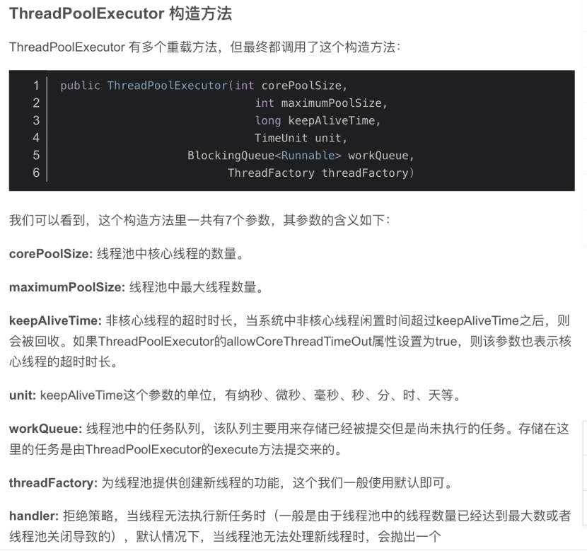
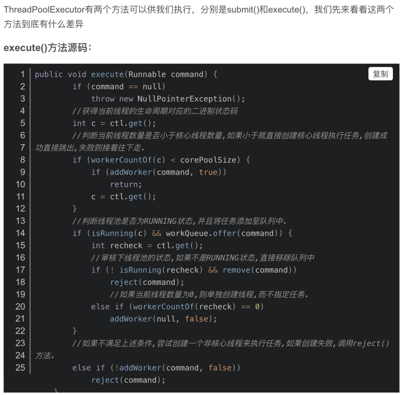
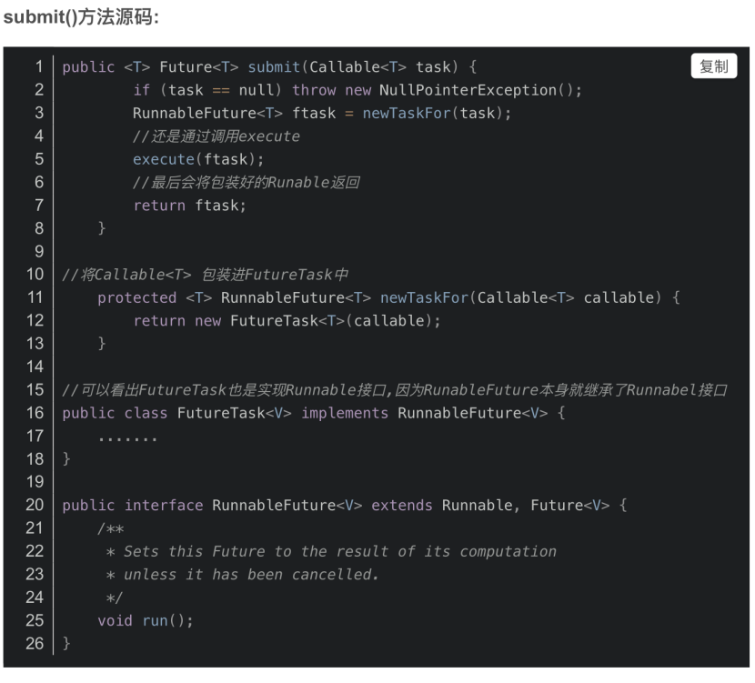
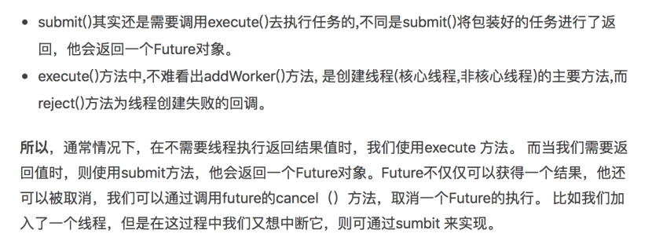
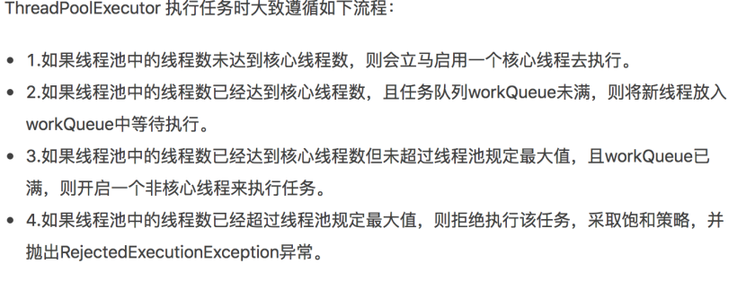

[Toc]

####  线程池ThreadPoolExecutor



#### 执行方法









#### 线程池任务的终止


#### 采用线程池的优势？

1．避免线程频繁创建消毁。虽然采用Thread 创建线程可以实现耗时操作，但线程的大量创建和销毁，会造成过大的性能开销。 
2．避免系统资源紧张。当大量的线程一起运作的时候，可能会造成资源紧张，上面也介绍过线程底层的机制就是切分CpU的时间，而大量的线程同时存在时可能造成互相抢占资源的现象发生，从而导致阻塞的现象。 
3．更好地管理线程。以下载功能为例，一般情况下，会有限制最大并发下载数目，而利用线程池我们可以灵活根据实际需求来设置同时下载的最大量、串行执行下载任务顺序、实现队列等待等功能。

#### 常见的几种线程池

##### FixThreadPool

```
public static ExecutorService newFixThreadPool(int nThreads){  
     return new ThreadPoolExecutor(nThreads, nThreads, 0L, TimeUnit.MILLISECONDS, new LinkedBlockingQueue<Runnable>());  
}  
```

（1）从配置参数来看，FixThreadPool只有核心线程，并且数量固定的，不会被回收，核心线程数和最大线程数一样，所有线程都活动时，因为队列没有限制大小，新任务会等待执行。

（2）线程超时时间为0，由于线程不会回收，FixThreadPool会更快地响应外界请求

##### SingleThreadPool

```
public static ExecutorService newSingleThreadPool (int nThreads){  
      return new FinalizableDelegatedExecutorService ( new ThreadPoolExecutor (1, 1, 0, TimeUnit. MILLISECONDS, new LinkedBlockingQueue<Runnable>()) );  
}  
```

（1）从配置参数可以看出，SingleThreadPool有点类似FixThreadPool，但只有一个核心线程，确保所有任务都在同一线程中按顺序完成。因此不需要处理线程同步的问题。

（2）可以把SingleThreadPool简单的理解为FixThreadPool的参数被手动设置为1的情况，即Executors.newFixThreadPool(1).execute(r)。

##### CachedThreadPool

```
public static ExecutorService newCachedThreadPool(int nThreads){  
      return new ThreadPoolExecutor(0, Integer.MAX_VALUE, 60L, TimeUnit. SECONDS, new SynchronousQueue<Runnable>());  
}
```

（1）CachedThreadPool只有非核心线程，最大线程数非常大，有60s超时机制，过了就会被回收。

（2）任务队列SynchronousQueue相当于一个空集合，由于线程数无限大，任何任务都会被立即执行，如果线程池有空闲线程，则由空闲线程执行新任务，如果没有，则创建新线程执行任务。

（3）在大量耗时短的任务请求时可以使用CachedThreadPool，因为当CachedThreadPool没有新任务时，所有线程超过60秒超时会被终止

##### ScheduledThreadPool（4个里面唯一一个有延迟执行和周期重复执行的线程池）

```
public ScheduledThreadPoolExecutor(int corePoolSize){  
 super(corePoolSize, Integer.MAX_VALUE, 0, NANOSECONDS, new DelayedQueue ());  
}
```

（1）核心线程数固定，非核心线程（闲置会被立即回收）数没有限制。

（2）ScheduledThreadPool主要用于执行定时任务以及有固定周期的重复任务。

#### ThreadPoolExecutor的工作策略有哪些？

工作策略如下：

1、线程池刚创建时，里面没有一个线程。任务队列是作为参数传进来的。不过，就算队列里面有任务，线程池也不会马上执行它们。

2、当调用 execute() 方法添加一个任务时，线程池会做如下判断：

a. 如果正在运行的线程数量小于 corePoolSize，那么马上创建线程运行这个任务；

　　 b. 如果正在运行的线程数量大于或等于 corePoolSize，那么将这个任务放入队列。

c. 如果这时候队列满了，而且正在运行的线程数量小于 maximumPoolSize，那么还是要创建线程运行这个任务；

d. 如果队列满了，而且正在运行的线程数量大于或等于 maximumPoolSize，那么线程池会抛出异常，告诉调用者“我不能再接受任务了”。

3、当一个线程完成任务时，它会从队列中取下一个任务来执行。

4、当一个线程无事可做，超过一定的时间（keepAliveTime）时，线程池会判断，如果当前运行的线程数大于 corePoolSize，那么这个线程就被停掉。所以线程池的所有任务完成后，它最终会收缩到 corePoolSize 的大小