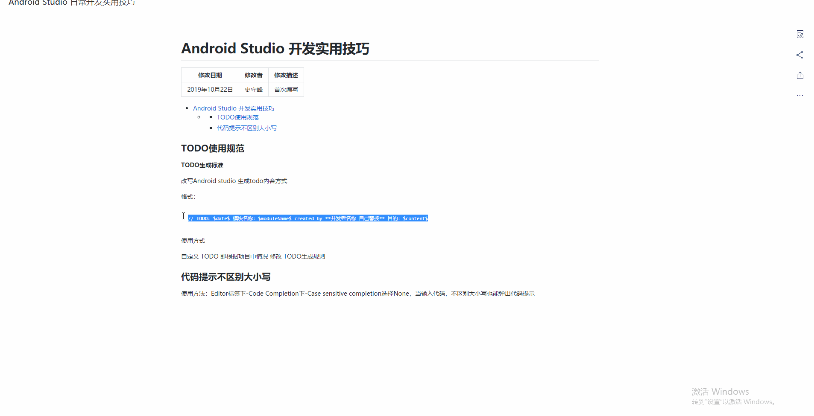
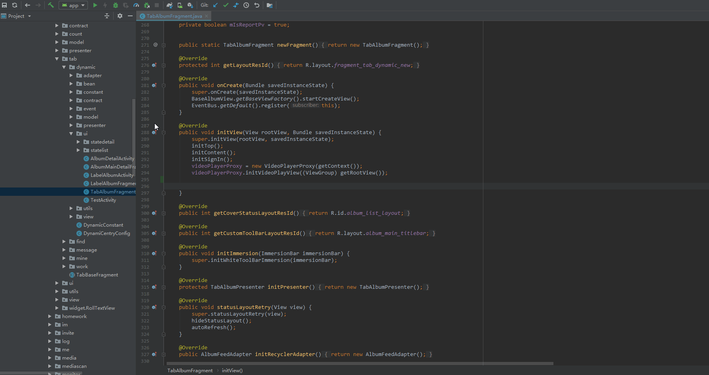

# Android Studio 开发实用技巧

|   修改日期    | 修改者  | 修改描述 |
| :-------: | :--: | :--: |
| 2019年10月22日 | 史守峰     | 首次编写 |


[TOC]


## TODO使用规范

**TODO生成标准**

改写Android studio 生成todo内容方式

格式：

[时间]:模块名称：开发者姓名：目的

```
// TODO: created by **开发者名称 自己替换**: $date$ 模块名称：$moduleName$  目的：$content$
```

使用方式:



**TODO删除规范**

删除todo时机：

代码中TODO 不要无限制增加、不要存放无用todo造成代码风险等 所以在项目或需求开发完成之后 必须将todo全部解决掉，不要带着todo上线。


## 重点代码提示

重点代码提示含义是 为防止开发人员误删或误修改 而产生较大影响或bug 所以在代码中使用注释将重点代码提示起来，来提示开发者避免出错，重点代码分为 3级。

语法：

```

一级
缩写：csbc1

/////////////////////////////////////////////////////////////////////////// 代码重要程度1级 ！
// ----start---- 修改以下 : start ~ end 内部代码时请谨慎修改避免出错！
// 模块类型：$moduleName$  create by "开发者name" :$date$-$time$ 、代码说明： $content$


// ----end--- 
///////////////////////////////////////////////////////////////////////////

```

使用示例：


## Android Studio Live Templates

什么是 Live Templates 如何使用 请参考这篇文章 https://www.jianshu.com/p/3dac8317c687

### 根据项目自定义的 Live Templates 

添加示例：



**快速创建注释**

缩写：cdd
```
// create by "开发者name" :$date$-$time$
// $content$
```

**快速创建修改注释**

缩写：udd

```
// update by "开发者name" :$date$-$time$
// $content$
```

**快速创建构造器**

缩写：constructor
```
public $class$ ($params$){
    this.$filed$ = $p$;//$params$ this is $content$
}
```


**快速生成计算 时长的代码**

缩写：counttime

```
long startTime = System.currentTimeMillis();

long endTime = System.currentTimeMillis();
com.szy.common.utils.LogUtil.d($TAG$," -> : $name$ startTime = "+startTime + " endTime = "+endTime + " count Time = "+(endTime - startTime));
```

**快速创建文档注释**

缩写：doc

```
/**
 * create by "开发者name": $date$-$time$
 *
 * $content$
 */
```

**快速创建单例**

缩写：getInstance

```
private static $CLASS$ instance = null;
 
private $CLASS$(){
}
 
public static $CLASS$ getInstance() {
    synchronized ($CLASS$.class) {
        if (instance == null) {
            instance = new $CLASS$();
        }
    }

    return instance;
}
```

**快速创建返回在UI线程的网络请求**

缩写：httpui

```
com.szy.common.net.http.HttpManager.requestCallOnUiThread($param$, new SimpleUiHttpTaskListener<$clazz$>($clazz$.class) {
            @Override
            public boolean hasCanceled() {
                return false;
            }

            @Override
            public void onTaskSucc($clazz$ o) {
                super.onTaskSucc(o);
                com.szy.common.utils.LogUtil.d(TAG," -> : onTaskSucc(): ");
                if ($callBack$ != null){
                    $callBack$.onSuccess(o);                 
                }
            }

            @Override
            public void onTaskError(NetError<$clazz$> error) {
                super.onTaskError(error);
                com.szy.common.utils.LogUtil.d(TAG," -> : onTaskError(): ");
                if ($callBack$ != null){
                    $callBack$.onError(error.getErrorCode(),error.getErrorMessage());                 
                }
            }
        });
```

**快速创建对象不为空**

缩写： ifnot

```
if ($refences$ != null){
    $refences$.                 
}
```

**快速生成判断对象为空**

缩写：ifnull

```
if ($refences$ == null){
    com.szy.common.utils.LogUtil.d($TAG$," -> : $METHOD_NAME$(): $refences$ == null");
    return;                
}
```

**快速判断字符串为空**

缩写： ifstrnull

```
if (com.szy.common.utils.StringUtil.isEmpty($str$)){
    com.szy.common.utils.LogUtil.d($TAG$," -> : $METHOD_NAME$(): ");
    return;            
}
```

**快速创建switch**

缩写：swit

```
switch ($wait$) {
    case $content$:
                            
        break;
    case $content$:

        break;
    default:
        break;
}
```

**快速生成clone方法**

缩写：clone

```
@Override
public $ClassName$ clone(){
    $ClassName$ args;
    try {
        args = ($ClassName$) super.clone();
    }catch (Exception e){
        e.printStackTrace();
        // 这是时光集制作日志打印类 开发者自行替换
        TBLogUtils.warning($TAG$, TBConstants.LogInfo.MAKING," clone()"," error is "+e.getMessage());

        args = new $ClassName$();
    }
    return args;
}
```

