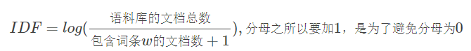

[Toc]

### 数据相关

#### 1.数据收集

​    内容：爬虫，人工录入，第三方倒流

​    用户数据：日志收集（nginx,flume），评论，打分

​    涉及技术：scrapy，flume，kafka，hdfs，hive

#### 2.数据处理

​    数据分词：jieba，TFIDF

​    数据清洗：spark日志清洗

​    数据清洗和数据分词的主要目的是拿到内容标签,  用户使用标签，从而方便合成用户画像

​    涉及技术：spark，jieba, nlp，tfidf

#### 3.内容分类

##### 样本收集方法-半监督学习

- 文本内容，可以进行lda主题分析和kmeans，生成参考样本与参考关键词

- 进行人工筛查与重新标注，并且无监督方法的结果来丰富知识图谱与关键词表，最终生成一定数量的样本（每个分类1000以上）
- 分类类目数量需要控制，类目数量越大，界限越不明显；这里可以采用多级分类，每个大分类再训练不同的分类模型的方法

##### 分类算法

- svm
- 朴素贝叶斯
- 随机森林

#### 4.用户画像

用户画像是指从用户产生的各种数据中挖掘和抽取用户在**不同属性上的标签**，如年龄、性别、职业、收入、兴趣等。

用户画像关键元素：维度、量化

##### 用户画像分类：

1）基础用户画像

- 人口统计学标签：用户的性别，年龄，地区等信息。
- 行为特征标签：用户在互联网平台的注册，活跃，付费，浏览等方面的行为记录产生的用户标签。
- 性格标签：豪爽大方，精打细算，冲动消费等类型标签

2）偏好用户画像

- 长期偏好标签：用户对较长时间内，几个月甚至是几年内，对某类事物的稳定偏好。
- 短期偏好标签：用户最近较短时间内，七天内甚至是几分钟内，对某类事物的偏好。
- 泛化偏好标签：众多的用户偏好中，不同的偏好之间有关联性或者相似性，就像啤酒和尿布那样。用户对啤酒有过直接的行为，但对尿布还没有，那么尿布可能是他的泛化偏好。

##### 用户画像构建方法分成三类：

第一类就是原始数据，又叫静态数据。直接使用原始数据作为用户画像的内容，如注册资料，行为轨迹等信息，除了数据清洗等工作，数据本身并没有做任何抽象和归纳。这种方法通常对于用户冷启动等场景非常有用。

第二类就是统计分析或者动态信息特征选取。方法就是通过大量数据进行统计分析，这是最常见的用户画像数据，常见的兴趣标签，就是这一类。

第三类就是机器学习。通过机器学习，可以得出人类无法直观理解的稠密向量。

##### 物品标签

物品画像，则是每个物品的一系列标签。物品画像其中一个作用就是可以作为推荐模型中的物品特征。另外一方面，**在推荐系统中，物品画像是用户画像的基础：物品画像+用户行为=用户画像**。

物品画像可分为两类：

- 人工的方式给物品打标签；
- 机器学习的方式给物品打标签。

##### 用户画像的公式

**用户偏好程度 = 行为类型权重值 × 次数 × 时间衰减 × TFIDF值**。

**行为类型权重值**是人为给用户行为的赋值。比如：看完=1，收藏=2，分享=3，购买=4等。**次数**则是行为发生的次数。**时间衰减**则是按一定的衰减系数，随着时间衰减。**TFIDF值**本来是文本处理领域的算法，用来提取一篇文章中的关键字。这里用来衡量标签的对一个用户的关键程度。下面我们来计算用户A的用户画像和偏好值。

**第一步：列一下行为类型权重值**，我们只考虑观看行为，权重都为1：

**第二步：统计用户A的行为次数**。用户A看了视频1两次，所以视频1带的标签“金融战争”和“做空”次数都记为2

**第三步：计算时间衰减**，假设用户A看视频1是两天前的行为，看视频4是今天的行为。衰减按照天来计算，衰减系数等于0.1556，热度计算公式为：热度=1×exp(-0.1556×天数)。按照这个衰减系数，45天后热度衰减到0.5。

按照这个计算方式，视频1的热度 = 1×exp(-0.1556×2) = 0.73，今天看的视频4，热度还为1。

**第四步：计算TFIDF值。**

### 文本内容向量化

#### 1.One-hot编码

过计数word在文档中出现的次数，每个单词都有一个V维度的向量来表示，向量中只有1个位置非0（可以是1，也可以是出现次数）,其他都是0。编码过于简单，有如下缺点：

- 没有考虑词的顺序
- 忽略了词与词之间的相互影响
- 特征是离散的，稀疏的

#### 2.tfidf

##### 概念

是一种用于资讯检索与资讯探勘的常用加权技术。TF-IDF是一种统计方法，用以评估一字词对于一个文件集或一个语料库中的其中一份文件的重要程度。**字词的重要性随着它在文件中出现的次数成正比增加，但同时会随着它在语料库中出现的频率成反比下降。**

##### tf词频

指的是某一个给定的词语在该文件中出现的次数。这个数字通常会被归一化(一般是词频除以文章总词数), 以防止它偏向长的文件。

一个文档中，tf越大，说明这个词越重要

##### idf逆向文档频率

- 首先来看一下df（即文档频率），df = (出现过这个词的文档的数量) / 文档总数量

- 再来看idf，

##### tf-idf	

​	tf-idf =  tf * idf，可以把文章进行向量化

#### 3.TextRank

1）文本中，设定一个窗口宽度，比如 K 个词，统计窗口内的词和词的共现关系，将其看成无向图

2）所有词初始化的重要性都是 1；

3）每个节点把自己的权重平均分配给“和自己有连接“的其他节点；

4）每个节点将所有其他节点分给自己的权重求和，作为自己的新权重；

5）如此反复迭代第 3、4 两步，直到所有的节点权重收敛为止。

#### 4.内容分类

长文本的内容分类可以提取很多信息，而如今 UGC 当道的时代，短文本的内容分类则更困难一些。短文本分类方面经典的算法是 SVM ，在工具上现在最常用的是 Facebook 开源的 FastText

#### 5.实体识别

命名实体识别（也常常被简称为 NER，Named-Entity Recognition）在 NLP 技术中常常被认为是序列标注问题，和分词、词性标注属于同一类问题。

所谓序列标注问题，就是给你一个字符序列，从左往右遍历每个字符，一边遍历一边对每一个字符分类，分类的体系因序列标注问题不同而不同：

- 分词问题：对每一个字符分类为“词开始”“词中间”“词结束”三类之一；
- 词性标注：对每一个分好的词，分类为定义的词性集合的之一；
- 实体识别：对每一个分好的词，识别为定义的命名实体集合之一。

对于序列标注问题，通常的算法就是隐马尔科夫模型（HMM）或者条件随机场（CRF），我们在推荐系统中主要是挖掘出想要的结构化结果，对其中原理有兴趣再去深入了解。

实体识别还有比较实用化的非模型做法：词典法。提前准备好各种实体的词典，使用 trie-tree 数据结构存储，拿着分好的词去词典里找，找到了某个词就认为是提前定义好的实体了。

以实体识别为代表的序列标注问题上，工业级别的工具上 spaCy 比 NLTK 在效率上优秀一些。

#### 6.聚类

LDA无监督模型, 设定主题个数，K 可以通过一些实验来对比挑选，方法：每次计算 K 个主题两两之间的平均相似度，选择一个较低的 K 值；如果你赶时间，在推荐系统领域，只要计算资源够用，主题数可以尽量多一些。

需要注意的是，得到文本在各个主题上的分布，可以保留概率最大的前几个主题作为文本的主题。LDA 工程上较难的是并行化，如果文本数量没到海量程度，提高单机配置也是可以的，开源的 LDA 训练工具有 Gensim，PLDA 等可供选择

#### 7.词嵌入

机器很难处理原始文本数据,以向量的形式表示文本几乎一直是所有NLP任务中最重要的步骤. 词嵌入就是为每一个词学习得到一个稠密的向量。向量中各个维度上的值大小代表了词包含各个语义的多少。

拿着这些向量可以做以下的事情：

- 计算词和词之间的相似度，扩充结构化标签；
- 累加得到一个文本的稠密向量；
- 用于聚类，会得到比使用词向量聚类更好的语义聚类效果。

**Word2Vec:**

Word2Vec 是用浅层神经网络学习得到每个词的向量表达，Word2Vec 最大的贡献在于一些工程技巧上的优化，使得百万词的规模在单机上可以几分钟轻松跑出来，得到这些词向量后可以聚类或者进一步合成句子向量再使用

Word2Vec生成的向量值可以看成是N维语义空间(N个语义词)中的坐标值(每个坐标轴对应一个语义)。当2个词在同一个N维语义空间中的距离接近时，说明2个词的含义接近。

包括两种模型，CBOW与Skip-gram。前者利用单词上下文预测单词，后者利用单词预测上下文。

### nlp

- nlp处理采用python实现，分为在线、离线，主要包括以下几个步骤：

  **在线**：

  加载词典

  清洗爬虫数据（去除html/img等标签）；

  分词，去停词（采用jieba分词）

  使用TFIDF模型，去重复（采用三种方式：1、标题完全一致；2、simHash；3、三句最长句子）；

  结果写入Mysql；

  **离线**： 

  一天一次加载词典

  清洗爬虫数据（去除html/img等标签）；

  分词，去停词（采用jieba分词）

  计算TFIDF（采用gensim计算TFIDF）

  结果写入Mysql；

- 分词的好坏依赖词典，java分词库可以使用Ansj；

### 相似度推荐

把物品按属性分维度，定义相似度公式：

distance=f1(导演)+f2(主演)+…+fn(片长)

相对属性的为1，不同为0，计算这个相似度的值，根据结果排序，推荐前几个物品

### 推荐系统

#### 1.协同过滤

##### 1）基于用户的协同过滤

确定其他用户是否跟自己相似，将邻居们的喜好组织成一个有序的目录，从而方便根据阈值挑选

**主要步骤**：

- 收集用户偏好
- 找到和目标用户兴趣相似的用户集合
- 把相似用户看过的内容，推荐给目标用户

**存在问题**

- 新用户没有任何信息，无法计算相似度
- 对于一个物品邻居没打分，那么该物品永远不会被推荐

**改进**

- 相似度使用皮尔逊距离，正相关最大，说明相似度越大
- 考虑用户打分物品的数目，指定一个共同打分的阈值，求一个共同打分的比例
- 打分归一化
- 新用户考虑基于内容和基于排行榜的推荐

**为啥不流行**
稀疏问题 ，数百万客户时计算量大 ，人有兴趣迁移

##### 2）基于物品的协同过滤

**优势：**

- 一个系统中，用户数量远大于物品数量，找相似的时候，计算量小
- 人的爱好善变，即使计算了相似度，也是可能发生变化的；物品不善变
- 物品还可以进行打**内容标签**，可利用维度高

**过程**

- 建立 物品-用户评分表

- 进行评分预测

**用户冷启动方式有：**

不走协同过滤；引导用户填写兴趣信息；利用第三方开放数据平台（成本高，可选）；根据用户基础属性推荐（年龄、男女、居住地点等）；排行榜

**物品冷启动问题**

- 文本分析（nlp）
- 主题分析
- 打标签（类目标签、关键词标签）

**协同过滤的例子：**
基于用户的推荐 ：实时新闻
基于物品的推荐 ：图书 电子商务 电影

#### 2.隐语义模型

用户和物品有隐含的联系，将用户和物品通过中介隐含因子联系起来
将用户对物品的评分矩阵分解成两个矩阵：一个是用户对隐藏因子矩阵，一个是隐藏因子对物品的矩阵

**正负样本的选取**
正样本选取：有评分的
负样本选取：热门但用户没有行为

**隐语义模型参数矩阵**
隐特征个数，通常F=100
学习率 不要太大
正则化参数
正负样本比例

**问题：**
实时推荐比较难

**指标：**

准确率 rmse

召回率 给他推荐了这么多之后，有哪些是推荐对的

覆盖率 

多样性 

广告收益

#### 3.冷启动问题

##### 用户冷启动

- 不走协同过滤
- 引导用户填写兴趣信息
- 利用第三方开放数据平台（成本高，可选）
- 根据用户基础属性推荐（年龄、男女、居住地点等）
- 排行榜

##### 物品冷启动问题

- 文本分析（nlp）
- 主题分析
- 打标签（类目标签、关键词标签）

### 模型训练

LR模型

训练机器学习模型是一个不断最小化（或者最大化）目标函数的过程，先设定一个目标函数，然后通过不断迭代让这个函数值到最小值（或者最大值）。

把一个推荐系统也看做一个函数，这个函数的输入有很多：UI、UE、数据、领域知识、算法等等，输出则是我们关注的指标：留存率、新闻的阅读时间、电商的 GMV、视频的 VV 等等。

### 召回

召回方式：

基于用户历史行为行为的深度学习模型召回

基于兴趣标签做召回。比如推荐系统判断用户对股票、体育标签感兴趣，就会基于股票和体育标签做召回

基于自然语言处理做召回。比如看一篇文章，基于自然语言召回与当前文章相关的文章

基于热门、最新、编辑精选做召回

### Rank

精排序

