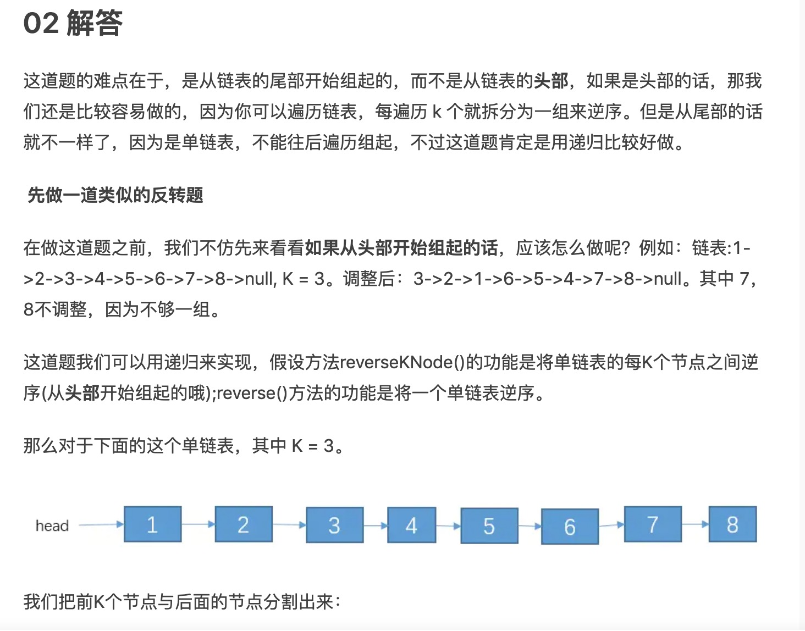
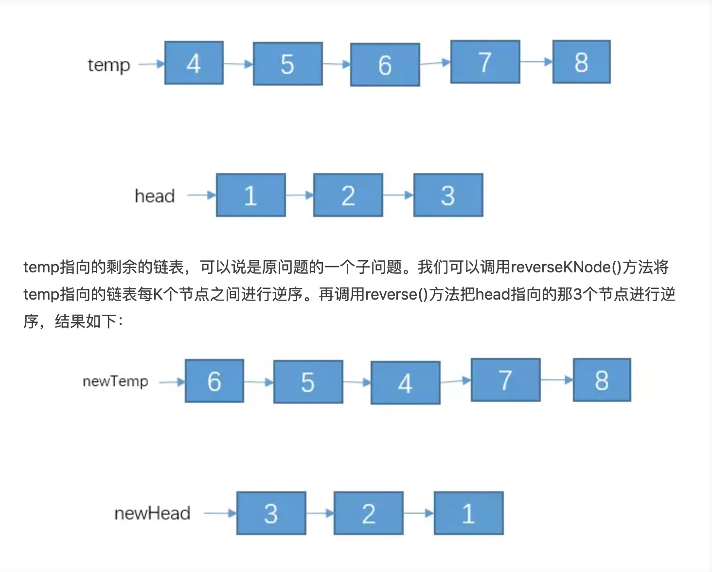
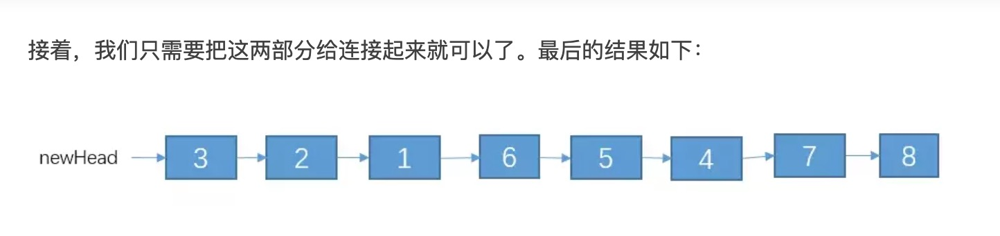
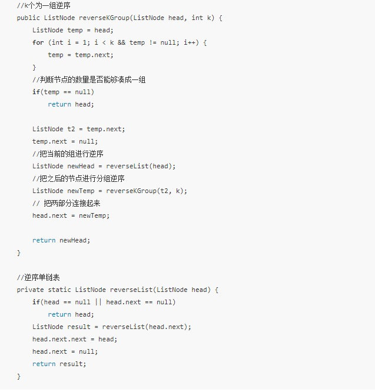
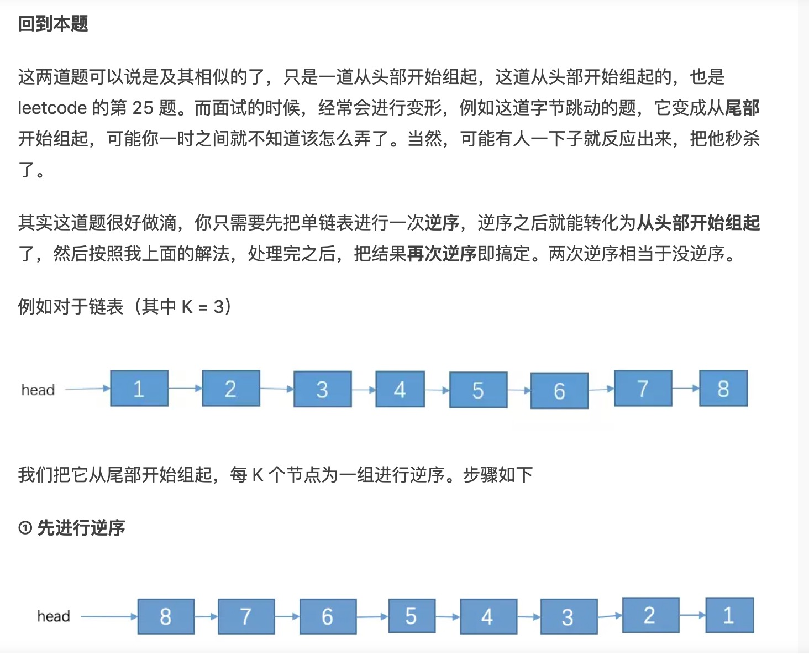
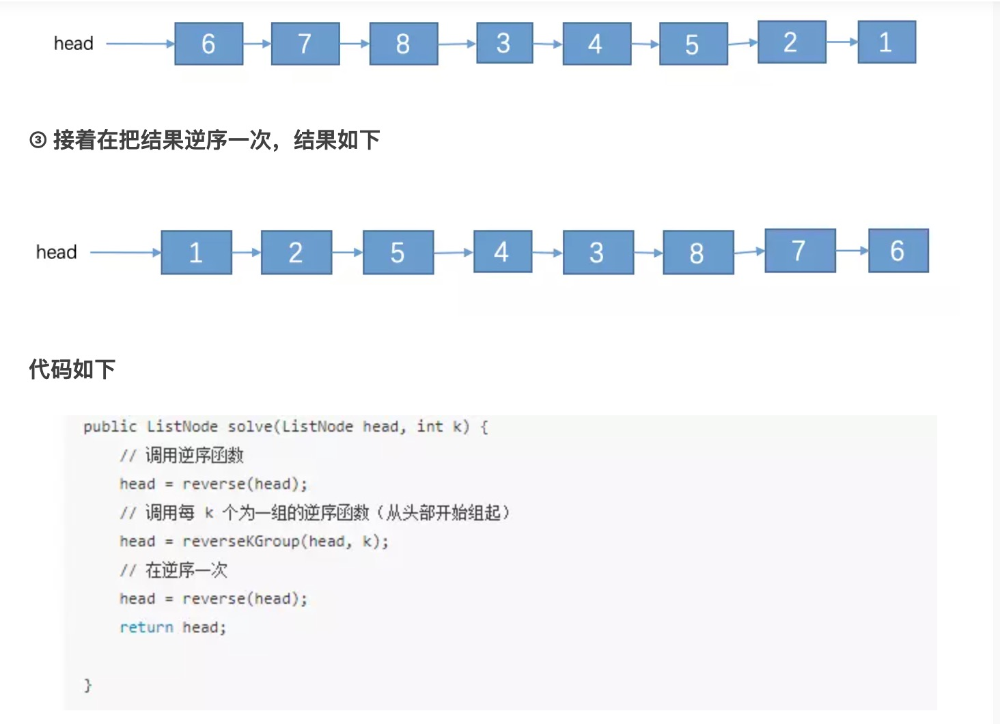

# 算法

#### 如何从1000个手机号中快速查询某一个手机号是否存在？在内存有限的情况下如何在500万的ip地址中，进行去重操作？：

```
class Solution {
  public void merge(int[] nums1, int m, int[] nums2, int n) {
    // two get pointers for nums1 and nums2
    int p1 = m - 1;
    int p2 = n - 1;
    // set pointer for nums1
    int p = m + n - 1;

    // while there are still elements to compare
    while ((p1 >= 0) && (p2 >= 0))
      // compare two elements from nums1 and nums2 
      // and add the largest one in nums1 
      nums1[p--] = (nums1[p1] < nums2[p2]) ? nums2[p2--] : nums1[p1--];

    // add missing elements from nums2
    System.arraycopy(nums2, 0, nums1, 0, p2 + 1);
  }
}
```

链接：<https://leetcode-cn.com/problems/merge-sorted-array/solution/he-bing-liang-ge-you-xu-shu-zu-by-leetcode/>

#### 做一次实验，把一个鸡蛋从某个楼层扔下去，看它是否破碎。没有破碎的鸡蛋可以重复使用；

```
import java.util.Arrays;

public class Solution {

    public int superEggDrop(int K, int N) {

        // dp[i][j]：一共有 i 层楼梯的情况下，使用 j 个鸡蛋的最少实验的次数
        // 注意：
        // 1、i 表示的是楼层的大小，不是第几层的意思，例如楼层区间 [8, 9, 10] 的大小为 3，这一点是在状态转移的过程中调整的定义
        // 2、j 表示可以使用的鸡蛋的个数，它是约束条件，我个人习惯放在后面的维度，表示消除后效性的意思

        // 0 个楼层和 0 个鸡蛋的情况都需要算上去，虽然没有实际的意义，但是作为递推的起点，被其它状态值所参考
        int[][] dp = new int[N + 1][K + 1];

        // 由于求的是最小值，因此初始化的时候赋值为一个较大的数，9999 或者 i 都可以
        for (int i = 0; i <= N; i++) {
            Arrays.fill(dp[i], i);
        }

        // 初始化：填写下标为 0、1 的行和下标为 0、1 的列
        // 第 0 行：楼层为 0 的时候，不管鸡蛋个数多少，都测试不出鸡蛋的 F 值，故全为 0
        for (int j = 0; j <= K; j++) {
            dp[0][j] = 0;
        }

        // 第 1 行：楼层为 1 的时候，0 个鸡蛋的时候，扔 0 次，1 个以及 1 个鸡蛋以上只需要扔 1 次
        dp[1][0] = 0;
        for (int j = 1; j <= K; j++) {
            dp[1][j] = 1;
        }

        // 第 0 列：鸡蛋个数为 0 的时候，不管楼层为多少，也测试不出鸡蛋的 F 值，故全为 0
        // 第 1 列：鸡蛋个数为 1 的时候，这是一种极端情况，要试出 F 值，最少次数就等于楼层高度（想想复杂度的定义）
        for (int i = 0; i <= N; i++) {
            dp[i][0] = 0;
            dp[i][1] = i;
        }

        // 从第 2 行，第 2 列开始填表
        for (int i = 2; i <= N; i++) {
            for (int j = 2; j <= K; j++) {
                for (int k = 1; k <= i; k++) {
                    // 碎了，就需要往低层继续扔：层数少 1 ，鸡蛋也少 1
                    // 不碎，就需要往高层继续扔：层数是当前层到最高层的距离差，鸡蛋数量不少
                    // 两种情况都做了一次尝试，所以加 1
                    dp[i][j] = Math.min(dp[i][j], Math.max(dp[k - 1][j - 1], dp[i - k][j]) + 1);
                }
            }
        }
        return dp[N][K];
    }
}
```

链接：<https://leetcode-cn.com/problems/super-egg-drop/solution/dong-tai-gui-hua-zhi-jie-shi-guan-fang-ti-jie-fang/>


#### *给定一个单链表的头节点 head,实现一个调整单链表的函数，使得每K个节点之间为一组进行逆序，\**并且从链表的尾部开始组起**，头部剩余节点数量不够一组的不需要逆序。（不能使用队列或者栈作为辅助）*

*例如：*

*链表:1->2->3->4->5->6->7->8->null, K = 3。那么 6->7->8，3->4->5，1->2各位一组。调整后：1->2->5->4->3->8->7->6->null。其中 1，2不调整，因为不够一组。*

答案：










链接：<https://www.jianshu.com/p/3dc5e73ab69c?hmsr=toutiao.io&utm_medium=toutiao.io&utm_source=toutiao.io>



逆序之后就可以把问题转化为从**头部**开始组起，每 K 个节点为一组进行逆序。

**② 处理后的结果如下**



类似于这种需要先进行逆序的还要两个链表相加，这道题字节跳动的笔试题也有出过，如下图的第二题


这道题就需要先把两个链表逆序，再节点间相加，最后在合并了。


链接：<https://www.jianshu.com/p/3dc5e73ab69c?hmsr=toutiao.io&utm_medium=toutiao.io&utm_source=toutiao.io>


# [用两个栈来实现一个队列||用两个队列实现一个栈](https://www.cnblogs.com/-xinxin/p/10725705.html)

**1.用两个栈来实现一个队列，完成队列的Push和Pop操作。**

   **队列中的元素为int类型。**

**实现思路：**

　　　　**利用栈last in first out 的特性，使用两个栈可以实现队列的pop和push操作。**

　　　　**push: 往stack1中push元素。**

　　　　**pop: 先判断stack2是否为空，若为空，将stack1中的所有元素pop至stack2中，取出stack2的栈顶元素pop出去；**

　　　　　　 **若不为空，直接取出stack2的栈顶元素pop出去；**

```
class Solution
{
public:
    void push(int node) {
         stack1.push(node);
    }

    int pop() {
       if(stack2.empty())
       {
            while(!stack1.empty())
            {
                int t=stack1.top();
                stack2.push(t);
                stack1.pop();
            }
       }
        int s=stack2.top();
        stack2.pop();
        return s;
    }

private:
    stack<int> stack1;
    stack<int> stack2;
};
```

2.**用两个队列来实现一个栈，完成栈的Push和Pop操作。**

   **队列中的元素为int类型。**

  **思路：**

​         **定义一个队列为存储队列(queue1)，另一个为中转队列(queue2)。**

　　 **入栈时直接压入queue1中，出栈时先将除queue1最后一个元素外依次pop出队列，并压入queue2中，将留在queue1中的最后一个元素出队列即为出队元素，之后再次将queue2中的元素压回queue1中。**

```
void stackpush(queue<int> &q1,int m)
 {
     q1.push(m);
 }

 int stackpop(queue<int> &q1,queue<int> &q2)
 {
     int num=q1.size();
     for(int i=0;i<num-1;i++)
     {
         q2.push(q1.front());
         q1.pop();
     }
     int res=q1.front();
     q1.pop();

     for(int i=0;i<q2.size();i++)
     {
         q1.push(q2.front());
         q2.pop();
     }

     return res;
 }
```

链接：<https://www.cnblogs.com/-xinxin/p/10725705.html>

# [LeetCode 简单 -旋转字符串(796)](https://www.cnblogs.com/-xinxin/p/10638657.html)

> 给定两个字符串, `A` 和 `B`。
>
> ```
> A` 的旋转操作就是将 `A` 最左边的字符移动到最右边。 例如, 若 `A = 'abcde'`，在移动一次之后结果就是`'bcdea'` 。如果在若干次旋转操作之后，`A` 能变成`B`，那么返回`True。
> 示例 1:
> 输入: A = 'abcde', B = 'cdeab'
> 输出: true
> 
> 利用一个规律，
> 如果一个字符串是由另一个串旋转得到的，那么新串一定是2*原串的的子串。
> string find方法，若查找成功，返回按查找规则找到的第一个字符或子串的位置；若查找失败，返回npos，即-1（打印出来为4294967295）。
> ```

```
class Solution {
public:
    bool rotateString(string A, string B) {
        if (A.length() != B.length()) return false;
        A = A + A;
        if(A.find(B)!=-1)return true;
        else return false;
    }
};
```

链接：<https://www.cnblogs.com/-xinxin/p/10638657.html>


# [LeetCode 中级 -二叉树的层次遍历(102)](https://www.cnblogs.com/-xinxin/p/10741800.html)

题目描述：
　　　　

给定一个二叉树，返回其按层次遍历的节点值。 （即逐层地，从左到右访问所有节点）。

例如:
给定二叉树: `[3,9,20,null,null,15,7]`,

```
    3
   / \
  9  20
    /  \
   15   7
```

返回其层次遍历结果：

```
[
  [3],
  [9,20],
  [15,7]
]

思路：
　　　　笔试时采用了queue的遍历方式，但用的是一维数组存的，感觉有点别扭。
　　　　网上的queue解法模板
```

```
/**
 * Definition for a binary tree node.
 * struct TreeNode {
 *     int val;
 *     TreeNode *left;
 *     TreeNode *right;
 *     TreeNode(int x) : val(x), left(NULL), right(NULL) {}
 * };
 */
class Solution {
public:
    vector<vector<int>> levelOrder(TreeNode* root) {
        vector<vector<int>> res;//保存结果
        TreeNode * first =root;
        if(!first)
            return res;
        queue<TreeNode *> q;
        q.push(first);
        while(!q.empty())
        {
            int count = q.size();
            vector<int> t;
            while(count!=0)
            {
                TreeNode *p=q.front();
                q.pop();
                t.push_back(p->val);
                if(p->left)
                    q.push(p->left);
                if(p->right)
                    q.push(p->right);
                count--;
            }
            res.push_back(t);
        }
        return res;
    }
};
```

> 第二种采用先序遍历递归，个人感觉代码更加简洁，但稍微难理解点。复杂度都是O（n）
>
> - 利用`depth`变量记录当前在第几层（从0开始），进入下层时`depth + 1`；
> - 如果`depth >= vector.size()`说明这一层还没来过，这是第一次来，所以得扩容咯；
> - 因为是前序遍历，中-左-右，对于每一层来说，左边的肯定比右边先被遍历到，实际上后序中序都是一样的。。。

```
/**
 * Definition for a binary tree node.
 * struct TreeNode {
 *     int val;
 *     TreeNode *left;
 *     TreeNode *right;
 *     TreeNode(int x) : val(x), left(NULL), right(NULL) {}
 * };
 */
class Solution {
public:
    
    void pre(TreeNode *root,int depth, vector<vector<int>> &res)
    {
        if(root==NULL)
            return ;
        if(depth>=res.size())
            res.push_back(vector<int>{});
        res[depth].push_back(root->val);
        pre(root->left,depth+1,res);
        pre(root->right,depth+1,res);
    }
    vector<vector<int>> levelOrder(TreeNode* root) {
            vector<vector<int>> ans;
            pre(root,0,ans);
            return ans;
    }
};
```

链接：<https://www.cnblogs.com/-xinxin/p/10741800.html>


# 数青蛙[字节跳动专场赛][Java]

给你一个字符串 croakOfFrogs，它表示不同青蛙发出的蛙鸣声（字符串 "croak" ）的组合。由于同一时间可以有多只青蛙呱呱作响，所以 croakOfFrogs 中会混合多个 “croak” 。请你返回模拟字符串中所有蛙鸣所需不同青蛙的最少数目。

注意：要想发出蛙鸣 "croak"，青蛙必须 依序 输出 ‘c’, ’r’, ’o’, ’a’, ’k’ 这 5 个字母。如果没有输出全部五个字母，那么它就不会发出声音。

如果字符串 croakOfFrogs 不是由若干有效的 "croak" 字符混合而成，请返回 -1 。

 

示例 1：

输入：croakOfFrogs = "croakcroak"
输出：1 
解释：一只青蛙 “呱呱” 两次
示例 2：

输入：croakOfFrogs = "crcoakroak"
输出：2 
解释：最少需要两只青蛙，“呱呱” 声用黑体标注
第一只青蛙 "crcoakroak"
第二只青蛙 "crcoakroak"
示例 3：

输入：croakOfFrogs = "croakcrook"
输出：-1
解释：给出的字符串不是 "croak" 的有效组合。
示例 4：

输入：croakOfFrogs = "croakcroa"
输出：-1


提示：

1 <= croakOfFrogs.length <= 10^5
字符串中的字符只有 'c', 'r', 'o', 'a' 或者 'k'
思路:仔细想想，数据量最大10^5能采取的方法，比较直观上讲有O(n)一次遍历，O(n)log(n)方法，O(n)log(n)怎么下手，没法下手。所以这里也比较容易想，只能O（n）并且，题目中也说了是需要次序遍历的。

那么怎么设计算法呢？

题目求任意时刻最少需要需要的青蛙的个数，已知题目中青蛙可以任意时刻叫的，就是有穿插的意思。所以，可能有很多种组合，那么我们就可以记录‘c’, ’r’, ’o’, ’a’, ’k’ 这五个字符的次数，初始都为0，

又因为如果字符串 croakOfFrogs 不是由若干有效的 "croak" 字符混合而成，请返回 -1 。也就是说 比较按顺序

叫出‘c’, ’r’, ’o’, ’a’, ’k’这五个字符，所以数量上是严格>=的

如果不符这种要求那么就是返回-1另外还需要提前判断一种情况就是如果长度%5!=0也是返回-1

因为最后可能会出现1,1,1,1,0的情况，这也是不符题意的，应该返回-1，因为叫不出来。

```
 public int minNumberOfFrogs(String croakOfFrogs) {
    	int[] num = new int[5];	// 分别记录‘c’, ’r’, ’o’, ’a’, ’k’的个数
    	int len = croakOfFrogs.length();
    	int res = 0;
    	// 特判
    	if(len %5 !=0)return -1;
    	for(int i = 0 ; i < len ; i++){
    		if(croakOfFrogs.charAt(i)=='c'){
    			num[0]++;
    		}else if(croakOfFrogs.charAt(i)=='r'){
    			num[1]++;
    		}else if(croakOfFrogs.charAt(i)=='o'){
    			num[2]++;
    		}else if(croakOfFrogs.charAt(i)=='a'){
    			num[3]++;
    		}else if(croakOfFrogs.charAt(i)=='k'){
    			num[4]++;
    		}
    		// 任意时刻，num数组都是 递减的，如果 不符这一情况，肯定不是有效的。
    		// 因为要满足有效的蛙叫中间可能有很多个再叫，而且是  必须从头叫。
    		if(num[0]<num[1] || num[1]<num[2] || num[3]<num[4]){
    			return -1;
    		}
    		// 如果 存在  num里面 每个值 都>1 那么说明 有只青蛙 交完了，那么就需要 全部-1
    		// 维护一个当前num数组中，的一个最大值，即可， 即最少需要的青蛙个数。
    		if(num[0]>=1 && num[1]>=1 && num[2]>=1 && num[3]>=1 && num[4]>=1){
    			num[0]--;
    			num[1]--;
    			num[2]--;
    			num[3]--;
    			num[4]--;
    		}
    		for(int j = 0 ; j < 5 ; j ++){
    			res = Math.max(res, num[j]);
    		}
    	}
    	return res;
    }

```

执行结果显示：通过

执行用时：14ms,  在所有java 提交中击败了100%的用户。

内存消耗：40.1mb,在所有java提交中击败了 100%的用户。

链接：<https://blog.csdn.net/weixin_43885656/article/details/105614873>