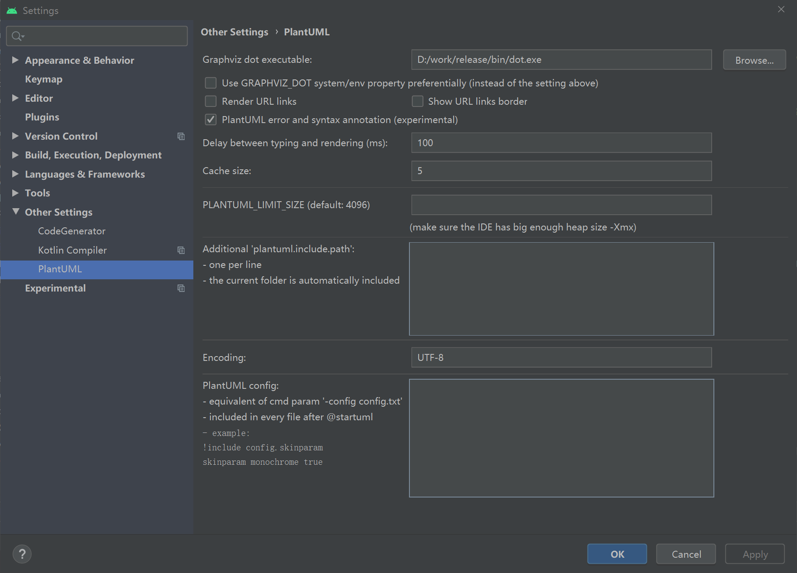

[Toc]

我最近要画类图和时序图，所以找一下工具，我的要求主要是：

1.使用简洁

2.可以版本管理，所以文本格式

最后找到**plantuml**，满足我的需求

因为涉及一些预发，所以工具先放到前面说

### 渲染工具

PlantUML Viewer， 你可以安装AndroidStudio插件，也可以安装Chrome插件，他都支持，安装完就可以查看了

如果AndroidStudio上渲染有问题，那可能就需要安装下载个视图工具

以下链接是别人的

> 视图工具需要下载，此处我分享一个我下载的资源，官网有点慢
>
> https://download.csdn.net/download/a343981218/12037484
>
> 百度云盘链接
>
>  链接：https://pan.baidu.com/s/17qq_ZS4qf0W0cQCSyyyZbg 
> 提取码：qi7k

下载完解压，然后设置studio，




### 生成UML图

PlantUML 是一个画图脚本语言，用它可以快速地画出：

- 类图：http://plantuml.com/class-diagram
- 流程图：http://plantuml.com/activity-diagram-beta
- 时序图：http://plantuml.com/sequence-diagram
- 用例图：http://plantuml.com/use-case-diagram
- 状态图：http://plantuml.com/state-diagram
- 组件图：http://plantuml.com/component-diagram

#### 1.类图

```
@startuml
title 类图

class Track
class Media
class Trip{
   String tripID;
   String tracks;
   String medias;
}
Trip --> Track
Trip --> Media

interface ITripTrackCollection{
    void start();
    void stop();
    void pause();
    void destory();
}
class TripTrackCollection implements ITripTrackCollection{
    Vector<LocationInfo> mLocations;
    ExtcutorService mVecoterThread;

    void getThread();
}

class TrackCollectService extends Service implements ITripTrackCollection{
    TripTrackCollection TripTrackCollection;
}
TrackCollectService -->TripTrackCollection
@enduml
```


#### 2. 流程图

```
@startuml
start
:"步骤1处理";
:"步骤2处理";
if ("条件1判断") then (true)
    :条件1成立时执行的动作;
    if ("分支条件2判断") then (no)
        :"条件2不成立时执行的动作";
    else
        if ("条件3判断") then (yes)
            :"条件3成立时的动作";
        else (no)
            :"条件3不成立时的动作";
        endif
    endif
    :"顺序步骤3处理";
endif

if ("条件4判断") then (yes)
    :"条件4成立的动作";
else
    :"条件4不成立时的动作";
endif
stop
@enduml
```


#### 3.时序图

```
@startuml
title 时序图
participant Activity #Lime
participant ContextWrapper #Cyan
participant ContextImpl #Cyan
participant ActivityManagerService #Cyan

'增加数字显示'
autonumber
Activity -> ContextWrapper : registerReceiver()
ContextWrapper -> ContextImpl : registerReceiver()

Activity -> ContextWrapper : sendBroadcast()
ContextWrapper -> ContextImpl : sendBroadcast()
ContextImpl -> ActivityManagerService: broadcastIntent()
ActivityManagerService -> ActivityManagerService : broadcastIntentLocked()
ActivityManagerService -> ActivityManagerService : collectReceiverComponents()
ActivityManagerService -> ActivityManagerService : scheduleBroadcastsLocked()
ActivityManagerService -> ActivityManagerService : processNextBroadcast()

Activity -> ContextWrapper : sendOrderedBroadcast()
ContextWrapper -> ContextImpl : sendOrderedBroadcast()
ContextImpl -> ActivityManagerService: broadcastIntent()
@enduml
```


#### 4. 用例图：

```
@startuml
:Main Admin: as Admin
(Use the application) as (Use)

User -> (Start)
User --> (Use)

Admin ---> (Use)

note right of Admin : This is an example.

note right of (Use)
A note can also
be on several lines
end note

note "This note is connected\nto several objects." as N2
(Start) .. N2
N2 .. (Use)
@enduml
```


#### 5. 状态图

```
@startuml
[*] --> NotShooting

state NotShooting {
  [*] --> Idle
  Idle --> Configuring : NewValue
  Configuring --> Idle : SaveValue
}

state Configuring {
     State1 -> State2
}
@enduml
```


#### 6. 组件图

```
@startuml
package "Some Group" {
HTTP - [First Component]
[Another Component]
}

package "Other Groups" {
FTP - [Second Component]

[First Component] --> FTP
}
@enduml
```


参考链接：

1.https://blog.csdn.net/a343981218/article/details/103591566

2.https://blog.csdn.net/geduo_83/article/details/86422485

3.[语法速查](http://blog.ifjy.me/软件开发/2016/07/16/PlantUML语法速查.html)