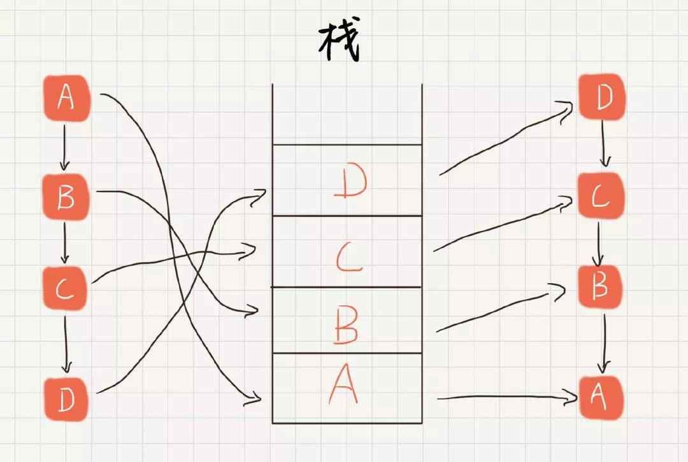

### 数据结构和算法

#### 数组

- 谈谈你对数组的理解？

> 所谓数组，是有序的元素序列。 [1] 若将有限个类型相同的变量的集合命名，那么这个名称为数组名。组成数组的各个变量称为数组的分量，也称为数组的元素，有时也称为下标变量。用于区分数组的各个元素的数字编号称为下标。数组是在程序设计中，为了处理方便， 把具有相同类型的若干元素按有序的形式组织起来的一种形式。 [1] 这些有序排列的同类数据元素的集合称为数组。
>
> 数组是用于储存多个相同类型数据的集合。


#### 链表

- 什么是单链表 & 双向链表 & 循环链表 & 双向循环链表 & 静态链表

> 单向链表：链式的存储结构，在逻辑上是连续的，每次通过一个指针来指向下一个节点将其链接起来
>
> 单向循环链表：与单向链表的区别就是，单向链表的最后一个节点指针是指向NULL的，单向循环链表最后一个节点的指针是指向头节点head的。
>
> 双向链表：包含两个指针，一个(prior)指向前一个节点，一个(next)指向后一个节点。
>
> 双向循环链表：最后一个节点的next指向head，而head的prior指向最后一个节点，构成一个环。

> 静态链表和动态链表的区别：

> 静态链表和动态链表是线性表链式存储结构的两种不同的表示方式。

> 1、静态链表是用类似于数组方法实现的，是顺序的存储结构，在物理地址上是连续的，而且需要预先分配地址空间大小。所以静态链表的初始长度一般是固定的，在做插入和删除操作时不需要移动元素，仅需修改指针。

> 2、动态链表是用内存申请函数（malloc/new）动态申请内存的，所以在链表的长度上没有限制。动态链表因为是动态申请内存的，所以每个节点的物理地址不连续，要通过指针来顺序访问


> 反转一个链表有哪些方式？

> 栈实现的链表反转



> 但是这样实现，有一个问题，它会额外消耗一个栈的内存空间，此时空间复杂度就变成了 O(n)。并且，栈会遇到的问题，使用此种方式都会遇到，例如比较常见的，栈的深度问题

> 空间复杂度为 O(1) 单链表反转

> 在排序算法中，有一个概念叫**原地排序，指的是不需要引入额外的存储空间，在原数据结构的基础上进行排序**。这种排序算法的空间复杂度是 O(1)。例如我们常见的冒泡排序、插入排序都是原地排序算法。

> 这里，我们也可以在原单链表的数据结构上，进行单链表反转。

> 原地单链表反转，是一种很基础的算法，但是有一些在面试中遇到这道题，思路不清晰时，一时半会也写不出来。

> 容易出错的点在于，**指针丢失**。在转换结点指针的时候，所需结点和指针反转顺序，都很重要，一不小心，就会丢掉原本的后续指针 next，导致链表断裂。

> 单链表时间复杂度为 O(1) 的结点删除法中，介绍到，删除单链表的时候，需要知道前后三个结点。在单链表翻转的时候，也是这样。

> 当我们要对一个结点进行指针翻转的时候，我们也需要知道三个结点。

- 待翻转的结点。
- 待反转结点的前驱结点 prev。
- 待反转结点的后续结点 next。

> 说了那么多，直接上代码

```
static Node reverseByLoop(Node head) {
    if (head == null || head.next == null){
        return head;
    }

    Node preNode = null;
    Node nextNode = null;
    while (head != null){
        nextNode = head.next;

        head.next = preNode;
        preNode = head;
        head = nextNode;
    }
    return preNode;
}
```

> 链表翻转的所有逻辑，都在 reverseByLoop() 方法中，此处以头结点为参数，反转之后返回值为反转后的单链表头结点。

> 递归实现单链表反转

> 单链表反转，还可以通过递归来实现，但是这里不推荐使用，大家了解一下就好了。

> 递归还是在借助函数调用栈的思想，其实本质上也是一个栈。没什么好说的，直接上代码

```
static Node reverseByRecursion(Node head){
    if(head == null || head.next == null){
        return head;
    }

    Node newHead = reverseByRecursion(head.next);

    head.next.next = head;
    head.next = null;
    return newHead;
}
```


#### 用Java语言设计一个LinkedList

> LinkedList与ArrayList都是List接口的具体实现类。LinkedList与ArrayList在功能上也是大体一致，但是因为两者具体的实现方式不一致，所以在进行一些相同操作的时候，其效率也是有差别的。
>
> 对于抽象的数据结构——线性表而言，线性表分为两种，一种是顺序存储结构的顺序表，另一种是通过指针来描述其逻辑位置的链表。
>
> **针对于具体的Java实现：**
>
> 1. **顺序存储的顺序表是用数组来实现的，以数组为基础进行封装各种操作而形成的List为ArrayList**
> 2. **链表是用指针来描述其逻辑位置，在Java中以双向链表为基础进行封装各种操作而形成的List为LinkedList**
>
> 针对插入与删除操作，ArrayList每插入一个元素，首先需要判断数组的空间够不够，不够要进行扩容，在有足够的空间的基础上，在指定的index位置上插入元素，但是该index及以后的元素都要后移。虽然删除操作不需要判断空间够不够，但同样需要该index及以后的元素向前移动，这些移动的操作会增加时间的复杂度。但是对于LinkedList就不一样，因为使用指针来指示其逻辑的位置，所以插入与删除的操作的时间复杂度都是 ** O(1) **
>
> 虽然对于ArrayList而言，插入与删除的时间复杂度很高，但是对于查找指定位置的元素这种操作而言，就非常的快，因为可以通过数组直接得到该下标对应的元素。反而，LinkedList而言，无法直接返回指定位置的元素，需要一个个查询，其时间的复杂度就是 ** O(n) **
>
> 与如何实现Java的ArrayList经典实体类一样，实现的目的主要在于练手以及掌握官方实现的原理和一些技巧，因此很多需要与其他类配合的方法和功能，就先不在这里实现如iterator等
>
> 所以，实现的LinkedList的方法如下：
>
> **add方法**
>
> **get方法**
>
> **indexOf方法**
>
> **remove方法**
>
> 与实现ArrayList的名字一样，为SimpleLinkedList。[源码地址](https://github.com/byhieg/JavaTutorial/blob/master/src/main/java/cn/byhieg/collectiontutorial/listtutorial/SimpleLinkedList.java)，欢迎star,fork

#### 堆

- 如何理解堆

> 堆（heap）也被称为优先队列，队列中允许的操作是 先进先出（FIFO），在队尾插入元素，在队头取出元素。而堆也是一样，在堆底插入元素，在堆顶取出元素。二叉树的衍生，有最小堆最大堆的两个概念，将根节点最大的堆叫做最大堆或大根堆，根节点最小的堆叫做最小堆或小根堆。常见的堆有二叉堆、斐波那契堆等


#### 栈

- 什么是栈 & 栈的特点是什么

> 栈（Stack）又名堆栈，作为一个 先进后出 的数据结构。（注意：这里的堆栈本身就是栈，只是换了个抽象的名字。）
>
> 它是一种运算受限的线性表。其限制是仅允许在表的一端进行插入和删除运算。这一端被称为栈顶，相对地，把另一端称为栈底。向一个栈插入新元素又称作进栈、入栈或压栈，它是把新元素放到栈顶元素的上面，使之成为新的栈顶元素；从一个栈删除元素又称作出栈或退栈，它是把栈顶元素删除掉，使其相邻的元素成为新的栈顶元素

> 堆、栈区别总结：

> 1.堆栈空间分配

> ①栈（操作系统）：由操作系统自动分配释放 ，存放函数的参数值，局部变量的值等。其操作方式类似于数据结构中的栈。

> ②堆（操作系统）： 一般由程序员分配释放， 若程序员不释放，程序结束时可能由OS回收，分配方式倒是类似于链表。

> 2.堆栈缓存方式

> ①栈使用的是一级缓存， 他们通常都是被调用时处于存储空间中，调用完毕立即释放。

> ②堆则是存放在二级缓存中，生命周期由虚拟机的垃圾回收算法来决定（并不是一旦成为孤儿对象就能被回收）。所以调用这些对象的速度要相对来得低一些。

> 3.堆栈数据结构区别

> ①堆（数据结构）：堆可以被看成是一棵树，如：堆排序。

> ②栈（数据结构）：一种先进后出的数据结构


- 什么是顺序栈 & 链式栈？

> 顺序栈是栈的顺序实现。顺序栈是指利用顺序存储结构实现的栈。采用地址连续的存储空间（数组)依次存储栈中数据元素，由于人栈和出栈运算都是在栈顶进行，而栈底位置是固定不变的，可以将栈底位置设置在数组空间的起始处；栈顶位置是随入栈和出栈操作而变化的，故需用一个整型变量top来记录当前栈顶元素在数组中的位置。
>
> 链式栈是一种数据存储结构，可以通过单链表的方式来实现，使用链式栈的优点在于它能够克服用数组实现的顺序栈空间利用率不高的特点，但是需要为每个栈元素分配额外的指针空间用来存放指针域


- 你能用栈实现队列吗？[code](../算法/常用算法.md)


- 如何实现浏览器前进和后退功能？

> 浏览器大家都很熟悉，当我们点开一系列页面例如a-b-c时，到c页面后退可以查看b、a页面，在b、a页面前进可以查看c页面，但是当在b页面重新进入一个新的页面时，此时再也不能通过前进或者后退进入c页面了，这是怎么实现的呢？很简单，两个栈即可实现此功能。
>
> 1.首先，进入一系列页面a、b、c：将a、b、c依次压入栈Stack1，此时在页面c；
>
> 2.后退两步：将c、b依次弹出再压入栈Stack2；
>
> 3.前进一步：将b从Stack2弹出压入Stack1；
>
> 4.打开新的页面：将d压入Stack1；
>
> 5.清空Stack2，此时就不能通过前进或者后退进入页面c了。
>
> 支持动态扩容的顺序栈
>
> 分析时间复杂度
>
> 对于出栈来说时间复杂度还是O(1)
>
> 对于入栈来说如果栈空间足够时间复杂度为O(1)，如果栈空间不够用需要扩容那么时间复杂度为O(n)


#### 队列

- 什么是队列 & 队列的特点是什么？

> 队列为一种特殊的线性表，特殊之处在于它只允许在表的前端（front）进行删除操作，而在表的后端（rear）进行插入操作，和栈一样，队列是一种操作受限制的线性表。进行插入操作的端称为队尾，进行删除操作的端称为队头。队列中没有元素时，称为空队列。
>
> 队列的数据元素又称为队列元素。在队列中插入一个队列元素称为入队，从队列中删除一个队列元素称为出队。因为队列只允许在一端插入，在另一端删除，所以只有最早进入队列的元素才能最先从队列中删除，故队列又称为先进先出（FIFO—first in first out）线性表。
>
> 1.队列先进先出，栈先进后出。
>
> 2.对插入和删除操作的"限定"。
>
> 栈是限定只能在表的一端进行插入和删除操作的线性表。 队列是限定只能在表的一端进行插入和在另一端进行删除操作的线性表。
>
> 从"数据结构"的角度看，它们都是[线性结构](https://www.baidu.com/s?wd=线性结构&tn=SE_PcZhidaonwhc_ngpagmjz&rsv_dl=gh_pc_zhidao)，即数据元素之间的关系相同。但它们是完全不同的数据类型。除了它们各自的基本操作集不同外，主要区别是对插入和删除操作的"限定"。
>
> 栈和队列是在程序设计中被广泛使用的两种线性数据结构，它们的特点在于基本操作的特殊性，栈必须按"后进先出"的规则进行操作，而队列必须按"先进先出"的规则进行操作。和线性表相比，它们的插入和删除操作受更多的约束和限定，故又称为限定性的线性表结构。
>
> 3.遍历数据速度不同。栈只能从头部取数据
>
> 也就最先放入的需要遍历整个栈最后才能取出来，而且在遍历数据的时候还得为数据开辟临时空间，保持数据在遍历前的一致性队列怎不同，他基于地址指针进行遍历，而且可以从头或尾部开始遍历，但不能同时遍历，无需开辟临时空间，因为在遍历的过程中不影像数据结构，速度要快的多
>
> 栈（Stack）是限定只能在表的一端进行插入和删除操作的线性表。
>
> 队列（Queue）是限定只能在表的一端进行插入和在另一端进行删除操作的线性表。
>
> 从"数据结构"的角度看，它们都是[线性结构](https://www.baidu.com/s?wd=线性结构&tn=SE_PcZhidaonwhc_ngpagmjz&rsv_dl=gh_pc_zhidao)，即数据元素之间的关系相同。但它们是完全不同的数据类型。除了它们各自的基本操作集不同外，主要区别是对插入和删除操作的"限定"。
>
> 栈和队列是在程序设计中被广泛使用的两种线性数据结构，它们的特点在于基本操作的特殊性，栈必须按"后进先出"的规则进行操作，而队列必须按"先进先出"的规则进行操作。和线性表相比，它们的插入和删除操作受更多的约束和限定，故又称为限定性的线性表结构


- 什么是优先队列？

> 优先队列也是一种抽象数据类型。优先队列中的每个元素都有优先级，而优先级高（或者低）的将会先出队，而优先级相同的则按照其在优先队列中的顺序依次出队。
>
> 也就是说优先队列，通常会有下面的操作：
>
> - 将元素插入队列
> - 将最大或者最小元素删除
>
> 这样的话，我们完全可以使用链表来实现，例如以O（1）复杂度插入，每次在表头插入，而以O（N）复杂度执行删除最小元素；或者以O（N）复杂度插入，保持链表有序，而以O（1）复杂度删除。
>
> 然而**优先队列往往使用堆来实现**，以至于通常说堆时，就自然而然地想到了优先队列。
>
> 优先队列不再遵循先入先出的原则，而是分为两种情况：
>
> - 最大优先队列，无论入队顺序，当前最大的元素优先出队。
> - 最小优先队列，无论入队顺序，当前最小的元素优先出队

- 你能用队列实现栈吗？[code](../算法/常用算法.md)


#### 树

- 什么是二叉树？

> 二叉树是树形结构的一种重要类型，在实际应用中具有十分重要的意义。从许多实际问题中抽象出来的数据结构往往是二叉树的形式，即使是一般的树也能够简单地转换为二叉树形式，而且二叉树的存储结构及其算法都比较简单，因此我们将详细地讨论关于二叉树的存储、运算及应用。
>
> 　　二叉树(Binary)是n(n≥0)个结点的有限集合，它的每个结点至多只有两棵子树。它或是空集，或是由一个根结点及两棵不相交的分别称作这个根的左子树和右子树的二叉树组成。


什么是先序遍历 & 中序遍历 & 后序遍历

> **遍历二叉树**
>
> 前序、中序和后序三种遍历方式
>
> - 前序遍历, 先输出父节点, 再遍历左子树和右子树
> - 中序遍历, 先遍历左子树, 再输出父节点, 再遍历右子树
> - 后序遍历, 先遍历左子树, 再遍历右子树, 最后输出父节点


- 什么是红黑树？

> 红黑树是一种“平衡的”二叉查找树，它是一种经典高效的算法，能够保证在最坏的情况下动态集合操作的时间为O（lgn）。红黑树每个节点包含5个域，分别为color,key,left,right和p。 color是在每个节点上增加的一个存储位表示节点的颜色，可以是RED或者BLACK。key为结点中的value值，left,right为该结点的左右孩子指针，没有的话为NIL，p是一个指针，是指向该节的父节点。如下图（来自维基百科）表示就是一颗红黑树，NIL为指向外结点的指针.
>
> 红黑树有什么性质呢？一般称为红黑性质，有以下五点：
>
>    1）每个结点或者是红的或者是黑的；
>
>    2）根结点是黑的；
>
>    3）每个叶结点（NIL）是黑的；
>
>    4）如果一个结点是红的，则它的两个孩子都是黑的；
>
>    5）对每个结点，从该结点到其他其子孙结点的所有路径上包含相同数目的黑结点


#### 排序

- 给我说说你会的排序 & 复杂度如何？

> **冒泡排序**
>
> **时间复杂度O(n^2) ;**
>
> **空间复杂度O(1);**
>
> **稳定、简单。**

```
function insertSort(arr){
    for(var i=1;i<arr.length;i++){
        if(arr[i]<arr[i-1]){ //当a[i]>a[i-1]时，直接插入
            var j = i-1;
            var x = arr[i];  //设立标兵参照数
            arr[i+1] = arr[i]; //向后移一个位置，一次归入一个数进行比较
            while(x<arr[j]){ //寻找插入位置
                arr[j+1] = arr[j];  //标兵比a[i-1]小时，再向前一位寻找插入位置
                j--;
            }
            arr[j+1] = x; //标兵比a[i-1]大时，则插入
        }
    }
}
```

> **选择排序**
>
> **时间复杂度：O(n^2);**
>
> **空间复杂度：O(1);**
>
> **不稳定，简单。**
>
> **快速排序**
>
> **时间复杂度：O(nlog2N);**
>
> **空间复杂度：O(nlog2N);**
>
> **不稳定，较复杂**


- 现在有10万条数据需要进行排序，你会选择什么排序？

> 对于内存足够大的大量数据排序，一般来说用归并排序比较好的，因为他的读取次数会比较少（在数据挖掘的理论里面，读取次数越少，排序方法越快），同时是稳定的；但是如果内存空间不足，就自然要减少次数了，所以也可以用快速排序，快速排序是目前基于比较的内部排序中被认为是最好的方法，当待排序的关键字是随机分布时，快速排序的平均时间最短；也可以利用堆排序，当N很大时，并且有序程度低时，堆排序最快（当N很大时，并且有序程度高时，快速排序最快 ）。

#### 算法题

> https://hadyang.github.io/interview/docs/java/concurrent/synchronized/