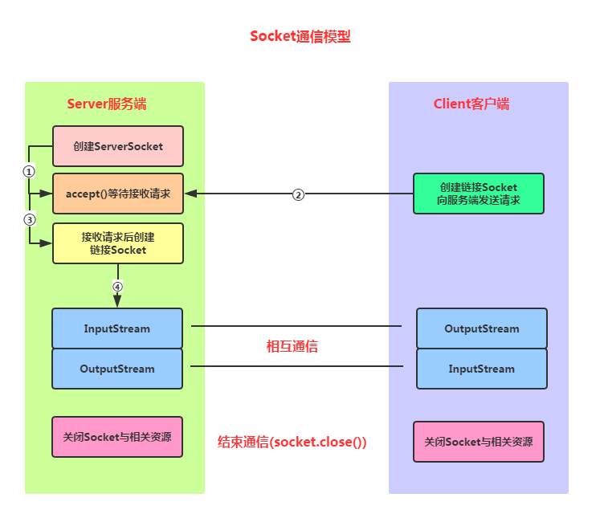
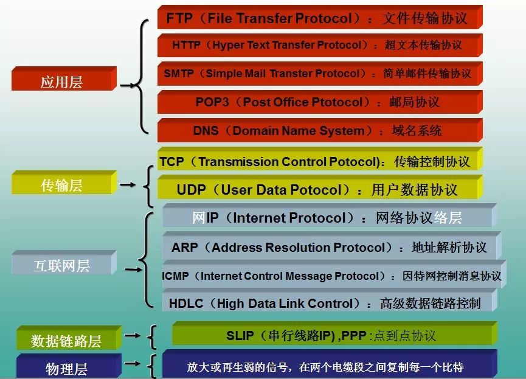
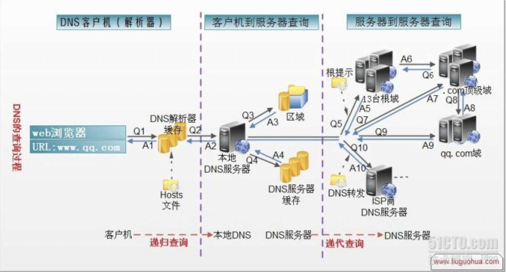

### 计算机网络

#### Socket协议，Socket实现长连接

慨念：

> 套接字（socket）是通信的基石，是支持TCP/IP协议的网络通信的基本操作单元。它是网络通信过程中端点的抽象表示，包含进行网络通信必须的五种信息：连接使用的协议，本地主机的IP地址，本地进程的协议端口，远地主机的IP地址，远地进程的协议端口。

建立socket连接:

> 建立Socket连接至少需要一对套接字，其中一个运行于客户端，称为ClientSocket，另一个运行于服务器端，称为ServerSocket。  
> 套接字之间的连接过程分为三个步骤：服务器监听，客户端请求，连接确认。  
> 服务器监听：服务器端套接字并不定位具体的客户端套接字，而是处于等待连接的状态，实时监控网络状态，等待客户端的连接请求。  
> 客户端请求：指客户端的套接字提出连接请求，要连接的目标是服务器端的套接字。为此，客户端的套接字必须首先描述它要连接的服务器的套接字，指出服务器端套接字的地址和端口号，然后就向服务器端套接字提出连接请求。  
> 连接确认：当服务器端套接字监听到或者说接收到客户端套接字的连接请求时，就响应客户端套接字的请求，建立一个新的线程，把服务器端套接字的描述发给客户端，一旦客户端确认了此描述，双方就正式建立连接。 而服务器端套接字继续处于监听状态，继续接收其他客户端套接字的连接请求。

SOCKET连接与TCP连接：

> 创建Socket连接时，可以指定使用的传输层协议，Socket可以支持不同的传输层协议（TCP或UDP），当使用TCP协议进行连接时，该Socket连接就是一个TCP连接。

Socket连接与HTTP连接:

> 由于通常情况下Socket连接就是TCP连接，因此Socket连接一旦建立，通信双方即可开始相互发送数据内容，直到双方连接断开。但在实际网络应用  
> 中，客户端到服务器之间的通信往往需要穿越多个中间节点，例如路由器、网关、防火墙等，大部分防火墙默认会关闭长时间处于非活跃状态的连接而导致  
> Socket 连接断连，因此需要通过轮询告诉网络，该连接处于活跃状态。
> 而HTTP连接使用的是“请求—响应”的方式，不仅在请求时需要先建立连接，而且需要客户端向服务器发出请求后，服务器端才能回复数据。  
> 很多情况下，需要服务器端主动向客户端推送数据，保持客户端与服务器数据的实时与同步。此时若双方建立的是Socket连接，服务器就可以直接将数据传送给  
> 客户端；若双方建立的是HTTP连接，则服务器需要等到客户端发送一次请求后才能将数据传回给客户端，因此，客户端定时向服务器端发送连接请求，不仅可以  
> 保持在线，同时也是在“询问”服务器是否有新的数据，如果有就将数据传给客户端。

Socket连接通信模型：



**Socket通信实现步骤解析:**

> **Step 1***：创建ServerSocket和Socket*
>
> **Step 2***：打开连接到的Socket的输入/输出流*
>
> **Step 3***：按照协议对Socket进行读/写操作*
>
> **Step 4***：关闭输入输出流，以及Socket*

**Socket服务端的编写：**

> **Step 1***：创建ServerSocket对象，绑定监听的端口*
>
> **Step 2***：调用accept()方法监听客户端的请求*
>
> **Step 3***：连接建立后，通过输入流读取客户端发送的请求信息*
>
> **Step 4***：通过输出流向客户端发送响应信息*
>
> **Step 5***：关闭相关资源*

代码示例：

```
public static void main(String[] args) throws IOException {
        //1.创建一个服务器端Socket，即ServerSocket，指定绑定的端口，并监听此端口
        ServerSocket serverSocket = new ServerSocket(12345);
        InetAddress address = InetAddress.getLocalHost();
        String ip = address.getHostAddress();
        Socket socket = null;
        //2.调用accept()等待客户端连接
        System.out.println("~~~服务端已就绪，等待客户端接入~，服务端ip地址: " + ip);
        socket = serverSocket.accept();
        //3.连接后获取输入流，读取客户端信息
        InputStream is=null;
        InputStreamReader isr=null;
        BufferedReader br=null;
        OutputStream os=null;
        PrintWriter pw=null;
        is = socket.getInputStream();     //获取输入流
        isr = new InputStreamReader(is,"UTF-8");
        br = new BufferedReader(isr);
        String info = null;
        while((info=br.readLine())!=null){//循环读取客户端的信息
            System.out.println("客户端发送过来的信息" + info);
        }
        socket.shutdownInput();//关闭输入流
        socket.close();
    }
```

**Socket服务端的编写**

> **Step 1***：创建ServerSocket对象，绑定监听的端口*
>
> **Step 2***：调用accept()方法监听客户端的请求*
>
> **Step 3***：连接建立后，通过输入流读取客户端发送的请求信息*
>
> **Step 4***：通过输出流向客户端发送响应信息*
>
> **Step 5***：关闭相关资源*

代码示例：

```
 private void acceptServer() throws IOException {
        //1.创建客户端Socket，指定服务器地址和端口
        Socket socket = new Socket("172.16.2.54", 12345);
        //2.获取输出流，向服务器端发送信息
        OutputStream os = socket.getOutputStream();//字节输出流
        PrintWriter pw = new PrintWriter(os);//将输出流包装为打印流
        //获取客户端的IP地址
        InetAddress address = InetAddress.getLocalHost();
        String ip = address.getHostAddress();
        pw.write("客户端：~" + ip + "~ 接入服务器！！");
        pw.flush();
        socket.shutdownOutput();//关闭输出流
        socket.close();
    }
```


#### TCP和UDP协议

TCP:

> TCP（Transmission Control Protocol 传输控制协议）是一种面向连接的、可靠的、基于字节流的传输层通信协议。
>
> TCP 为了保证数据包传输的可靠行，会给每个包一个序号，同时此序号也保证了发送到接收端主机能够按序接收。然后接收端主机对成功接收到的数据包发回一个相应的确认字符(ACK，Acknowledgement)，如果发送端主机在合理的往返时延(RTT)内未收到确认字符ACK，那么对应的数据包就被认为丢失并将被重传

UDP：

> UDP （User Datagram Protocol）协议，即用户数据报协议，是OSI（Open System Interconnection，开放式系统互联）参考模型中一种无连接的传输层协议，提供面向事务的简单不可靠信息传送服务。UDP与TCP协议一样用于处理数据包，但UDP是一种无连接的协议，不保证可靠性。UDP有不提供数据包分组、组装和不能对数据包进行排序的缺点，也就是说，当报文发送之后，是无法得知其是否安全完整到达的。UDP 用来支持那些需要在计算机之间传输数据的网络应用。

TCP和UDP的区别

> TCP面向连接（如打电话要先拨号建立连接）;UDP是无连接的，即发送数据之前不需要建立连接
>
> TCP提供可靠的服务。UDP尽最大努力交付，即不保证可靠交付。也就是说，通过TCP连接传送的数据，无差错，不丢失，不重复，且按序到达，TCP通过校验和，重传控制，序号标识，滑动窗口、确认应答等机制实现可靠传输。如丢包时的重发控制，还可以对次序乱掉的分包进行顺序控制。
>
> UDP具有较好的实时性，工作效率比TCP高，适用于对高速传输和实时性有较高的通信或广播通信。
>
> 每一条TCP连接只能是点到点的;UDP支持一对一，一对多，多对一和多对多的交互通信。
>
> TCP对系统资源要求较多，UDP对系统资源要求较少

TCP协议的主要特点

> （1）TCP是面向连接的运输层协议；
>
> （2）每一条TCP连接只能有两个端点（即两个套接字），只能是点对点的；
>
> （3）TCP提供可靠的传输服务。传送的数据无差错、不丢失、不重复、按序到达；
>
> （4）TCP提供全双工通信。允许通信双方的应用进程在任何时候都可以发送数据，因为两端都设有发送缓存和接受缓存；
>
> （5）面向字节流。虽然应用程序与TCP交互是一次一个大小不等的数据块，但TCP把这些数据看成一连串无结构的字节流，它不保证接收方收到的数据块和发送方发送的数据块具有对应大小关系，例如，发送方应用程序交给发送方的TCP10个数据块，但就受访的TCP可能只用了4个数据块久保收到的字节流交付给上层的应用程序，但字节流完全一样。

TCP的可靠性原理

> 可靠传输有如下两个特点:
>
> a.传输信道无差错,保证传输数据正确;
>
> b.不管发送方以多快的速度发送数据,接收方总是来得及处理收到的数据;
>
> （1）首先，采用三次握手来建立TCP连接，四次握手来释放TCP连接，从而保证建立的传输信道是可靠的。
>
> （2）其次，TCP采用了连续ARQ协议（回退N，Go-back-N；超时自动重传）来保证数据传输的正确性，使用滑动窗口协议来保证接方能够及时处理所接收到的数据，进行流量控制。
>
> （3）最后，TCP使用慢开始、拥塞避免、快重传和快恢复来进行拥塞控制，避免网络拥塞。

UDP协议特点

> （１）UDP是无连接的传输层协议；
>
> （２）UDP使用尽最大努力交付，不保证可靠交付；
>
> （３）UDP是面向报文的，对应用层交下来的报文，不合并，不拆分，保留原报文的边界；
>
> （４）UDP没有拥塞控制，因此即使网络出现拥塞也不会降低发送速率；
>
> （５）UDP支持一对一　一对多　多对多的交互通信；
>
> （６）UDP的首部开销小，只有８字节．

TCP和UDP的区别

> １、TCP是可靠传输,UDP是不可靠传输;
>
> 2、TCP面向连接,UDP无连接;
>
> 3、TCP传输数据有序,UDP不保证数据的有序性;
>
> 4、TCP不保存数据边界,UDP保留数据边界;
>
> 5、TCP传输速度相对UDP较慢;
>
> 6、TCP有流量控制和拥塞控制,UDP没有;
>
> ７、TCP是重量级协议,UDP是轻量级协议;
>
> ８、TCP首部较长２０字节,UDP首部较短８字节;

基于TCP和UDP的常用协议

> HTTP、HTTPS、FTP、TELNET、SMTP(简单邮件传输协议)协议基于可靠的TCP协议。TFTP、DNS、DHCP、TFTP、SNMP(简单网络管理协议)、RIP基于不可靠的UDP协议


#### HTTP协议中GET和POST的具体实现

> GET和POST是HTTP请求的两种基本方法，要说它们的区别，接触过WEB开发的人都能说出一二。
>
> 最直观的区别就是GET把参数包含在URL中，POST通过request body传递参数。
>
> 你可能自己写过无数个GET和POST请求，或者已经看过很多权威网站总结出的他们的区别，你非常清楚知道什么时候该用什么。
>
> 你轻轻松松的给出了一个“标准答案”：
>
> - GET在浏览器回退时是无害的，而POST会再次提交请求。
> - GET产生的URL地址可以被Bookmark，而POST不可以。
> - GET请求会被浏览器主动cache，而POST不会，除非手动设置。
> - GET请求只能进行url编码，而POST支持多种编码方式。
> - GET请求参数会被完整保留在浏览器历史记录里，而POST中的参数不会被保留。
> - GET请求在URL中传送的参数是有长度限制的，而POST么有。
> - 对参数的数据类型，GET只接受ASCII字符，而POST没有限制。
> - GET比POST更不安全，因为参数直接暴露在URL上，所以不能用来传递敏感信息。
> - GET参数通过URL传递，POST放在Request body中。

> 从表面上来看看GET和POST的区别：

> 1. get是从服务器上获取数据，post是向服务器传送数据。 
>
> get 和 post只是一种传递数据的方式，get也可以把数据传到服务器，他们的本质都是发送请求和接收结果。只是组织格式和数据量上面有差别，http协议里面有介绍
>
> 1. get是把参数数据队列加到提交表单的ACTION属性所指的URL中，值和表单内各个字段一一对应，在URL中可以看到。post是通过HTTP post机制，将表单内各个字段与其内容放置在HTML HEADER内一起传送到ACTION属性所指的URL地址。用户看不到这个过程。 
>
> 因为get设计成传输小数据，而且最好是不修改服务器的数据，所以浏览器一般都在地址栏里面可以看到，但post一般都用来传递大数据，或比较隐私的数据，所以在地址栏看不到，能不能看到不是协议规定，是浏览器规定的。
>
> 1. 对于get方式，服务器端用Request.QueryString获取变量的值，对于post方式，服务器端用Request.Form获取提交的数据。 
>
> 没明白，怎么获得变量和你的服务器有关，和get或post无关，服务器都对这些请求做了封装
>
> 1. get传送的数据量较小，不能大于2KB。post传送的数据量较大，一般被默认为不受限制。但理论上，IIS4中最大量为80KB，IIS5中为100KB。 
>
> post基本没有限制，我想大家都上传过文件，都是用post方式的。只不过要修改form里面的那个type参数
>
> 1. get安全性非常低，post安全性较高。 
>
> 如果没有加密，他们安全级别都是一样的，随便一个监听器都可以把所有的数据监听到。

#### Http/Https协议工作在哪一层？IP协议工作在哪一层？应用层有哪些协议？

> **HTTP是一个应用层协议，由请求和响应构成，是一个标准的客户端服务器模型。HTTP是一个无状态的协议。**
>
> HTTPS：是以安全为目标的HTTP通道，简单讲是HTTP的安全版，即HTTP下加入SSL层，HTTPS的安全基础是SSL，因此加密的详细内容就需要SSL。
>
> HTTPS协议的主要作用可以分为两种：一种是建立一个信息安全通道，来保证数据传输的安全；另一种就是确认网站的真实性。



> 1. 应用层 2.传输层 3.网络层 4.网络接口层*
>
> 应用层-------。ICP/IP协议族在这一层面有着很多协议来支持不同的应用，许多大家所熟悉的基于Internet的应用的实现就离不开这些协议。如我们进行万维网（WWW）访问用到了HTTP协议、文件传输用FTP协议、电子邮件发送用SMTP、域名的解析用DNS协议、远程登录用Telnet协议等等，都是属于TCP/IP应用层的；就用户而言，看到的是由一个个软件所构筑的大多为图形化的操作界面，而实际后台运行的便是上述协议。（FTP、SMTP、telnet、DNS、tftp）
>
> \* 传输层--------这一层的的功能主要是提供应用程序间的通信，TCP/IP协议族在这一层的协议有TCP和UDP。（UDP）
>
> \* 网络层---------是TCP/IP协议族中非常关键的一层，主要定义了IP地址格式，从而能够使得不同应用类型的数据在Internet上通畅地传输，IP协议就是一个网络层协议。（IP数据包）
>
> - 网络接口层-------这是TCP/IP软件的最低层，负责接收IP数据包并通过网络发送之，或者从网络上接收物理帧，抽出IP数据报，交给IP层。(帧，网络接口协议)
>
> 通讯协议采用了 4 层的层级结构，每一层都呼叫下一层所提供的网络来完成自己的需求。这
>
>  层分别为：
>
> 应用层：应用程序间沟通的层，如简单电子邮件传输（SMTP）、文件传输协议（FTP）、网
>
> 络远程访问协议（Telnet）、超文本传输协议(HTTP)、可扩展通讯和表示协议（XMPP）等。
>
> 传输层：在此层中，它提供了节点间的数据传送服务，如传输控制协议（TCP）、用户数据
>
> 报协议（UDP）等，TCP 和 UDP 给数据包加入传输数据并把它传输到下一层中，这一层负责传送数据，
>
> 并且确定数据已被送达并接收。
>
> 互连网络层：负责提供基本的数据封包传送功能，让每一块数据包都能够到达目的主机（但
>
> 不检查是否被正确接收），如网际协议（IP）。
>
> 网络接口层：对实际的网络媒体的管理，定义如何使用实际网络（如 Ethernet、SerialLine
>
> 等）来传送数据。

#### 试着说说https加密过程 & 为什么https比http要安全？

> 客户端在使用HTTPS方式与Web服务器通信时有以下几个步骤，如图所示。
>
> 　　（1）客户使用https的URL访问Web服务器，要求与Web服务器建立SSL连接。
>
> 　　（2）Web服务器收到客户端请求后，会将网站的证书信息（证书中包含公钥）传送一份给客户端。
>
> 　　（3）客户端的浏览器与Web服务器开始协商SSL连接的安全等级，也就是信息加密的等级。
>
> 　　（4）客户端的浏览器根据双方同意的安全等级，建立会话密钥，然后利用网站的公钥将会话密钥加密，并传送给网站。
>
> 　　（5）Web服务器利用自己的私钥解密出会话密钥。
>
> 　　（6）Web服务器利用会话密钥加密与客户端之间的通信。


> 1. HTTPS的优点：

> 　　尽管HTTPS并非绝对安全，掌握根证书的机构、掌握加密算法的组织同样可以进行中间人形式的攻击，但HTTPS仍是现行架构下最安全的解决方案，主要有以下几个好处：

> 　　（1）使用HTTPS协议可认证用户和服务器，确保数据发送到正确的客户机和服务器；

> 　　（2）HTTPS协议是由SSL+HTTP协议构建的可进行加密传输、身份认证的网络协议，要比http协议安全，可防止数据在传输过程中不被窃取、改变，确保数据的完整性。

> 　　（3）HTTPS是现行架构下最安全的解决方案，虽然不是绝对安全，但它大幅增加了中间人攻击的成本。

> 　　（4）谷歌曾在2014年8月份调整搜索引擎算法，并称“比起同等HTTP网站，采用HTTPS加密的网站在搜索结果中的排名将会更高”。

> 1. HTTPS的缺点：

> 　　虽然说HTTPS有很大的优势，但其相对来说，还是存在不足之处的：

> 　　（1）HTTPS协议握手阶段比较费时，会使页面的加载时间延长近50%，增加10%到20%的耗电；

> 　　（2）HTTPS连接缓存不如HTTP高效，会增加数据开销和功耗，甚至已有的安全措施也会因此而受到影响；

> 　　（3）SSL证书需要钱，功能越强大的证书费用越高，个人网站、小网站没有必要一般不会用。

> 　    （4）SSL证书通常需要绑定IP，不能在同一IP上绑定多个域名，IPv4资源不可能支撑这个消耗。

> 　　（5）HTTPS协议的加密范围也比较有限，在黑客攻击、拒绝服务攻击、服务器劫持等方面几乎起不到什么作用。最关键的，SSL证书的信用链体系并不安全，特别是在某些国家可以控制CA根证书的情况下，中间人攻击一样可行。

#### 给我说说三次握手和四次挥手。

> 在TCP/IP协议中，TCP协议提供可靠的连接服务，采用三次握手建立一个连接，如图1所示。
>
>  (1) 第一次握手：建立连接时，客户端A发送SYN包(SYN=j)到服务器B，并进入SYN_SEND状态，等待服务器B确认。
>
>  (2) 第二次握手：服务器B收到SYN包，必须确认客户A的SYN(ACK=j+1)，同时自己也发送一个SYN包(SYN=k)，即SYN+ACK包，此时服务器B进入SYN_RECV状态。
>
>  (3) 第三次握手：客户端A收到服务器B的SYN＋ACK包，向服务器B发送确认包ACK(ACK=k+1)，此包发送完毕，客户端A和服务器B进入ESTABLISHED状态，完成三次握手。
>
> 完成三次握手，客户端与服务器开始传送数据。


> 由于TCP连接是全双工的，因此每个方向都必须单独进行关闭。这个原则是当一方完成它的数据发送任务后就能发送一个FIN来终止这个方向的连接。收到一个 FIN只意味着这一方向上没有数据流动，一个TCP连接在收到一个FIN后仍能发送数据。首先进行关闭的一方将执行主动关闭，而另一方执行被动关闭。
>
> （1）客户端A发送一个FIN，用来关闭客户A到服务器B的数据传送(报文段4)。
>
> （2）服务器B收到这个FIN，它发回一个ACK，确认序号为收到的序号加1(报文段5)。和SYN一样，一个FIN将占用一个序号。
>
> （3）服务器B关闭与客户端A的连接，发送一个FIN给客户端A(报文段6)。
>
> （4）客户端A发回ACK报文确认，并将确认序号设置为收到序号加1(报文段7)。
>
> TCP采用四次挥手关闭连接如图2所示。


> 知识延伸：

> **为什么建立连接协议是三次握手，而关闭连接却是四次握手呢？**

> 这是因为服务端的LISTEN状态下的SOCKET当收到SYN报文的连接请求后，它可以把ACK和SYN(ACK起应答作用，而SYN起同步作用)放在一个报文里来发送。但关闭连接时，当收到对方的FIN报文通知时，它仅仅表示对方没有数据发送给你了；但未必你所有的数据都全部发送给对方了，所以你可能未必会马上会关闭SOCKET,也即你可能还需要发送一些数据给对方之后，再发送FIN报文给对方来表示你同意现在可以关闭连接了，所以它这里的ACK报文和FIN报文多数情况下都是分开发送的

> **为什么不能用两次握手进行连接？**

> 我们知道，3次握手完成两个重要的功能，既要双方做好发送数据的准备工作(双方都知道彼此已准备好)，也要允许双方就初始序列号进行协商，这个序列号在握手过程中被发送和确认。

> 现在把三次握手改成仅需要两次握手，死锁是可能发生的。作为例子，考虑计算机S和C之间的通信，假定C给S发送一个连接请求分组，S收到了这个分组，并发 送了确认应答分组。按照两次握手的协定，S认为连接已经成功地建立了，可以开始发送数据分组。可是，C在S的应答分组在传输中被丢失的情况下，将不知道S 是否已准备好，不知道S建立什么样的序列号，C甚至怀疑S是否收到自己的连接请求分组。在这种情况下，C认为连接还未建立成功，将忽略S发来的任何数据分 组，只等待连接确认应答分组。而S在发出的分组超时后，重复发送同样的分组。这样就形成了死锁。

#### 什么是Cookie & Session & Token。

> Cookie是客户端保存用户信息的一种机制，用来记录用户的一些信息。如何识别特定的客户呢？cookie就可以做到。每次HTTP请求时，客户端都会发送相应的Cookie信息到服务端。它的过期时间可以任意设置，如果你不主动清除它，在很长一段时间里面都可以保留着，即便这之间你把电脑关机了。
>
> Session是在无状态的HTTP协议下，服务端记录用户状态时用于标识具体用户的机制。它是在服务端保存的用来跟踪用户的状态的数据结构，可以保存在文件、数据库或者集群中。在浏览器关闭后这次的Session就消失了，下次打开就不再拥有这个Session。其实并不是Session消失了，而是Session ID变了，服务器端可能还是存着你上次的Session ID及其Session 信息，只是他们是无主状态，也许一段时间后会被删除。
>
> 实际上Cookie与Session都是会话的一种方式。它们的典型使用场景比如“购物车”，当你点击下单按钮时，服务端并不清楚具体用户的具体操作，为了标识并跟踪该用户，了解购物车中有几样物品，服务端通过为该用户创建Cookie/Session来获取这些信息。
>
> 如果你的站点是多节点部署，使用Nginx做负载均衡，那么有可能会出现Session丢失的情况（比如，忽然就处于未登录状态）。这时可以使用IP负载均衡（IP绑定 ip_hash，每个请求按访问ip的hash结果分配，这样每个访客固定访问一个后端服务器，可以解决Session的问题），或者将Session信息存储在集群中。在大型的网站中，一般会有专门的Session服务器集群，用来保存用户会话，这时可以使用缓存服务比如Memcached或者Redis之类的来存放Session。
>
> 目前大多数的应用都是用 Cookie 实现Session跟踪的。第一次创建Session时，服务端会通过在HTTP协议中反馈到客户端，需要在 Cookie 中记录一个Session ID，以便今后每次请求时都可分辨你是谁。有人问，如果客户端的浏览器禁用了 Cookie 怎么办？建议使用URL重写技术进行会话跟踪，即每次HTTP交互，URL后面都被附加上诸如 sid=xxxxx 的参数，以便服务端依此识别用户。
>
> 总结语：
>
> 1、Cookie 在客户端（浏览器），Session 在服务器端。
>
> 2、Cookie的安全性一般，他人可通过分析存放在本地的Cookie并进行Cookie欺骗。在安全性第一的前提下，选择Session更优。重要交互信息比如权限等就要放在Session中，一般的信息记录放Cookie就好了。
>
> 3、单个Cookie保存的数据不能超过4K，很多浏览器都限制一个站点最多保存20个Cookie。
>
> 4、Session 可以放在 文件、数据库或内存中，比如在使用Node时将Session保存在redis中。由于一定时间内它是保存在服务器上的，当访问增多时，会较大地占用服务器的性能。考虑到减轻服务器性能方面，应当适时使用Cookie。
>
> 5、Session 的运行依赖Session ID，而 Session ID 是存在 Cookie 中的，也就是说，如果浏览器禁用了 Cookie，Session 也会失效（但是可以通过其它方式实现，比如在 url 中传递 Session ID）。
>
> 6、用户验证这种场合一般会用 Session。因此，维持一个会话的核心就是客户端的唯一标识，即Session ID。

为什么使用Token:

> 1、Token的引入：Token是在客户端频繁向服务端请求数据，服务端频繁的去数据库查询用户名和密码并进行对比，判断用户名和密码正确与否，并作出相应提示，在这样的背景下，Token便应运而生。
>
> 2、Token的定义：Token是服务端生成的一串字符串，以作客户端进行请求的一个令牌，当第一次登录后，服务器生成一个Token便将此Token返回给客户端，以后客户端只需带上这个Token前来请求数据即可，无需再次带上用户名和密码。
>
> 3、使用Token的目的：Token的目的是为了减轻服务器的压力，减少频繁的查询数据库，使服务器更加健壮

#### Http和Https的区别？

> HTTP 是明文传输协议，HTTPS 协议是由 SSL+HTTP 协议构建的可进行加密传输、身份认证的网络协议，比 HTTP 协议安全


> 关于安全性，用最简单的比喻形容两者的关系就是卡车运货，HTTP下的运货车是敞篷的，货物都是暴露的。而https则是封闭集装箱车，安全性自然提升不少。
>
> HTTPS比HTTP更加安全，对搜索引擎更友好，利于SEO,谷歌、百度优先索引HTTPS网页;
>
> HTTPS需要用到SSL证书，而HTTP不用;
>
> HTTPS标准端口443，HTTP标准端口80;
>
> HTTPS基于传输层，HTTP基于应用层;
>
> HTTPS在浏览器显示绿色安全锁，HTTP没有显示;

#### 什么是DNS & 作用是什么 &工作机制？

> DNS（Domain Name System，域名系统），万维网上作为域名和IP地址相互映射的一个分布式数据库，能够使用户更方便的访问互联网，而不用去记住能够被机器直接读取的IP数串。通过域名，最终得到该域名对应的IP地址的过程叫做域名解析（或主机名解析）。DNS协议运行在UDP协议之上，使用端口号53。在RFC文档中RFC 2181对DNS有规范说明，RFC 2136对DNS的动态更新进行说明，RFC 2308对DNS查询的反向缓存进行说明
>
> DNS( Domain Name System)是“域名系统”的英文缩写，是一种组织成域层次结构的计算机和网络服务命名系统，它用于TCP/IP网络，它所提供的服务是用来将主机名和域名转换为IP地址的工作。DNS就是这样的一位“翻译官”，它的基本工作原理可用下图来表示。


> dns服务的工作过程

> 当 DNS 客户机需要查询程序中使用的名称时，它会查询本地DNS 服务器来解析该名称。客户机发送的每条查询消息都包括3条信息，以指定服务器应回答的问题。

> ● 指定的 DNS 域名，表示为完全合格的域名 (FQDN) 。

> ● 指定的查询类型，它可根据类型指定资源记录，或作为查询操作的专门类型。

> ● DNS域名的指定类别。

> 对于DNS 服务器，它始终应指定为 Internet 类别。例如，指定的名称可以是计算机的完全合格的域名，如

> im.qq.com

> ，并且指定的查询类型用于通过该名称搜索地址资源记录。

> DNS 查询以各种不同的方式进行解析。客户机有时也可通过使用从以前查询获得的缓存信息就地应答查询。DNS 服务器可使用其自身的资源记录信息缓存来应答查询，也可代表请求客户机来查询或联系其他 DNS 服务器，以完全解析该名称，并随后将应答返回至客户机。这个过程称为递归。

> 另外，客户机自己也可尝试联系其他的 DNS 服务器来解析名称。如果客户机这么做，它会使用基于服务器应答的独立和附加的查询，该过程称作迭代，即DNS服务器之间的交互查询就是迭代查询。

> DNS 查询的过程如下图所示。



> 1、在浏览器中输入www . qq .com 域名，操作系统会先检查自己本地的hosts文件是否有这个网址映射关系，如果有，就先调用这个IP地址映射，完成域名解析。
>
> 2、如果hosts里没有这个域名的映射，则查找本地DNS解析器缓存，是否有这个网址映射关系，如果有，直接返回，完成域名解析。
>
> 3、如果hosts与本地DNS解析器缓存都没有相应的网址映射关系，首先会找TCP/ip参数中设置的首选DNS服务器，在此我们叫它本地DNS服务器，此服务器收到查询时，如果要查询的域名，包含在本地配置区域资源中，则返回解析结果给客户机，完成域名解析，此解析具有权威性。
>
> 4、如果要查询的域名，不由本地DNS服务器区域解析，但该服务器已缓存了此网址映射关系，则调用这个IP地址映射，完成域名解析，此解析不具有权威性。
>
> 5、如果本地DNS服务器本地区域文件与缓存解析都失效，则根据本地DNS服务器的设置（是否设置转发器）进行查询，如果未用转发模式，本地DNS就把请求发至13台根DNS，根DNS服务器收到请求后会判断这个域名(.com)是谁来授权管理，并会返回一个负责该顶级域名服务器的一个IP。本地DNS服务器收到IP信息后，将会联系负责.com域的这台服务器。这台负责.com域的服务器收到请求后，如果自己无法解析，它就会找一个管理.com域的下一级DNS服务器地址([http://qq.com](https://link.zhihu.com/?target=http%3A//qq.com))给本地DNS服务器。当本地DNS服务器收到这个地址后，就会找[http://qq.com](https://link.zhihu.com/?target=http%3A//qq.com)域服务器，重复上面的动作，进行查询，直至找到www . qq .com主机。
>
> 6、如果用的是转发模式，此DNS服务器就会把请求转发至上一级DNS服务器，由上一级服务器进行解析，上一级服务器如果不能解析，或找根DNS或把转请求转至上上级，以此循环。不管是本地DNS服务器用是是转发，还是根提示，最后都是把结果返回给本地DNS服务器，由此DNS服务器再返回给客户机。
>
> 从客户端到本地DNS服务器是属于递归查询，而DNS服务器之间就是的交互查询就是迭代查询。