[toc]

H264视频压缩算法现在无疑是所有视频压缩技术中使用最广泛，

最流行的。随着 x264/openh264以及ffmpeg等开源库的推出，大多数使用者无需再对H264的细节做过多的研究，这大降低了人们使用H264的成本。

但为了用好H264，我们还是要对H264的基本原理弄清楚才行。今天我们就来看看H264的基本原理。

## H264概述

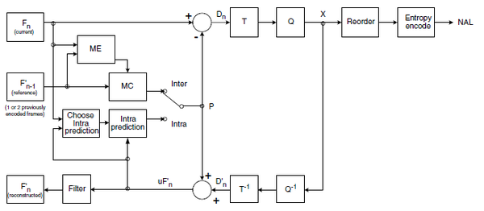

 


H264压缩技术主要采用了以下几种方法对视频数据进行压缩。包括：

　　帧内预测压缩，解决的是空域数据冗余问题。
　　帧间预测压缩（运动估计与补偿），解决的是时域数据冗徐问题。
　　整数离散余弦变换（DCT），将空间上的相关性变为频域上无关的数据然后进行量化。
　　CABAC压缩。


经过压缩后的帧分为：I帧，P帧和B帧:

　　I帧：关键帧，采用帧内压缩技术。

> 1.它是一个全帧压缩编码帧。它将全帧图像信息进行JPEG压缩编码及传输;
> 2.解码时仅用I帧的数据就可重构完整图像;
> 3.I帧描述了图像背景和运动主体的详情;
> 4.I帧不需要参考其他画面而生成;
> 5.I帧是P帧和B帧的参考帧(其质量直接影响到同组中以后各帧的质量);
> 6.I帧是帧组GOP的基础帧(第一帧),在一组中只有一个I帧;
> 7.I帧不需要考虑运动矢量;
> 8.I帧所占数据的信息量比较大

　　P帧：向前参考帧，在压缩时，只参考前面已经处理的帧。采用帧间压缩技术。

> P帧法是根据本帧与相邻的前一帧（I帧或P帧）的不同点来压缩本帧数据。采取P帧和I帧联合压缩的方法可达到更高的压缩且无明显的压缩痕迹。
>
> P帧特点：
>
> ①P帧是I帧后面相隔1～2帧的编码帧。
>
> ②P帧采用运动补偿的方法传送它与前面的I或P帧的差值及运动矢量（预测误差）。
>
> ③解码时必须将I帧中的预测值与预测误差求和后才能重构完整的P帧图像。
>
> ④P帧属于前向预测的帧间编码。它只参考前面最靠近它的I帧或P帧。
>
> ⑤P帧可以是其后面P帧的[参考帧](https://baike.baidu.com/item/参考帧)，也可以是其前后的B帧的参考帧。
>
> ⑥由于P帧是[参考帧](https://baike.baidu.com/item/参考帧)，它可能造成解码错误的扩散。
>
> ⑦由于是差值传送，P帧的压缩比较高。

　　B帧：双向参考帧，在压缩时，它即参考前而的帧，又参考它后面的帧。采用帧间压缩技术。

> 1.B帧是由前面的I或P帧和后面的P帧来进行预测的;
> 2.B帧传送的是它与前面的I或P帧和后面的P帧之间的预测误差及运动矢量;
> 3.B帧是双向预测编码帧;
> 4.B帧压缩比最高,因为它只反映丙参考帧间运动主体的变化情况,预测比较准确;
> 5.B帧不是参考帧,不会造成解码错误的扩散。


除了I/P/B帧外，还有图像序列GOP。

　　GOP:两个I帧之间是一个图像序列，在一个图像序列中只有一个I帧。如下图所示：

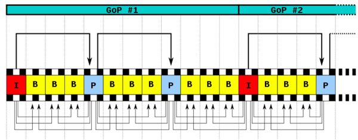

 


下面我们就来详细描述一下H264压缩技术。

## H264压缩技术


H264的基本原理其实非常简单，下我们就简单的描述一下H264压缩数据的过程。通过摄像头采集到的视频帧（按每秒 30 帧算），被送到 H264 编码器的缓冲区中。编码器先要为每一幅图片划分宏块。

以下面这张图为例:

 

### 划分宏块

H264默认是使用 16X16 大小的区域作为一个宏块，也可以划分成 8X8 大小。

 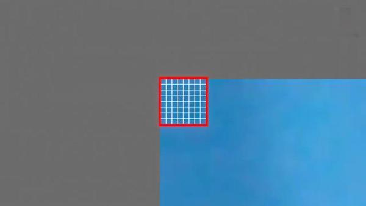

 

划分好宏块后，计算宏块的象素值。

 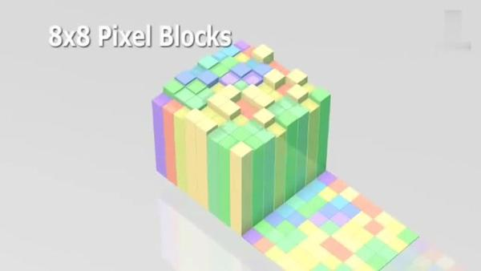

 

以此类推，计算一幅图像中每个宏块的像素值，所有宏块都处理完后如下面的样子。

 

 

### 划分子块

H264对比较平坦的图像使用 16X16 大小的宏块。但为了更高的压缩率，还可以在 16X16 的宏块上更划分出更小的子块。子块的大小可以是 8X16､ 16X8､ 8X8､ 4X8､ 8X4､ 4X4非常的灵活。

 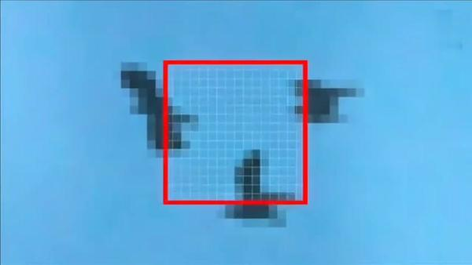

 

上幅图中，红框内的 16X16 宏块中大部分是蓝色背景，而三只鹰的部分图像被划在了该宏块内，为了更好的处理三只鹰的部分图像，H264就在 16X16 的宏块内又划分出了多个子块。

 

 

这样再经过帧内压缩，可以得到更高效的数据。下图是分别使用mpeg-2和H264对上面宏块进行压缩后的结果。其中左半部分为MPEG-2子块划分后压缩的结果，右半部分为H264的子块划压缩后的结果，可以看出H264的划分方法更具优势。

 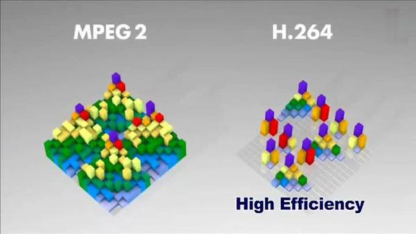

 

宏块划分好后，就可以对H264编码器缓存中的所有图片进行分组了。

 

### 帧分组

对于视频数据主要有两类数据冗余，一类是时间上的数据冗余，另一类是空间上的数据冗余。其中时间上的数据冗余是最大的。下面我们就先来说说视频数据时间上的冗余问题。

为什么说时间上的冗余是最大的呢？假设摄像头每秒抓取30帧，这30帧的数据大部分情况下都是相关联的。也有可能不止30帧的的数据，可能几十帧，上百帧的数据都是关联特别密切的。

对于这些关联特别密切的帧，其实我们只需要保存一帧的数据，其它帧都可以通过这一帧再按某种规则预测出来，所以说视频数据在时间上的冗余是最多的。

为了达到相关帧通过预测的方法来压缩数据，就需要将视频帧进行分组。那么如何判定某些帧关系密切，可以划为一组呢？我们来看一下例子，下面是捕获的一组运动的台球的视频帧，台球从右上角滚到了左下角。

 


 

没有运动补偿的时候  120fps     60fps   60帧电影  视频画面是没有提升


120fps    60帧视频  60帧虚拟帧

H264编码器会按顺序，每次取出两幅相邻的帧进行宏块比较，计算两帧的相似度。如下图：

 

通过宏块扫描与宏块搜索可以发现这两个帧的关联度是非常高的。进而发现这一组帧的关联度都是非常高的。因此，上面这几帧就可以划分为一组。其算法是：**在相邻几幅图像画面中，一般有差别的像素只有10%以内的点,亮度差值变化不超过2%，而色度差值的变化只有1%以内，我们认为这样的图可以分到一组。**

在这样一组帧中，经过编码后，我们只保留第一帖的完整数据，其它帧都通过参考上一帧计算出来。我们称第一帧为**IDR／I帧**，其它帧我们称为**P／B帧**，这样编码后的数据帧组我们称为**GOP**。

 

### 运动估计与补偿

在H264编码器中将帧分组后，就要计算帧组内物体的运动矢量了。还以上面运动的台球视频帧为例，我们来看一下它是如何计算运动矢量的。

H264编码器首先按顺序从缓冲区头部取出两帧视频数据，然后进行宏块扫描。当发现其中一幅图片中有物体时，就在另一幅图的邻近位置（搜索窗口中）进行搜索。如果此时在另一幅图中找到该物体，那么就可以计算出物体的运动矢量了。下面这幅图就是搜索后的台球移动的位置。

 

 抖音 ----》视频  1M  9M   

通过上图中台球位置相差，就可以计算出台图运行的方向和距离。H264依次把每一帧中球移动的距离和方向都记录下来就成了下面的样子。

 

 

运动矢量计算出来后，将相同部分（也就是绿色部分）减去，就得到了补偿数据。我们最终只需要将补偿数据进行压缩保存，以后在解码时就可以恢复原图了。压缩补偿后的数据只需要记录很少的一点数据。如下所示：

 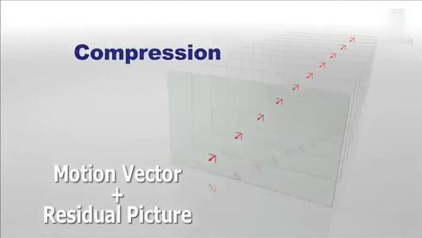

 

我们把运动矢量与补偿称为**帧间压缩技术**，它解决的是视频帧在时间上的数据冗余。除了帧间压缩，帧内也要进行数据压缩，帧内数据压缩解决的是空间上的数据冗余。下面我们就来介绍一下帧内压缩技术。

 

### 帧内预测

人眼对图象都有一个识别度，对低频的亮度很敏感，对高频的亮度不太敏感。所以基于一些研究，可以将一幅图像中人眼不敏感的数据去除掉。这样就提出了帧内预测技术。帧内预测可以防止视频产生锯齿现象。

H264的帧内压缩与JPEG很相似。一幅图像被划分好宏块后，预测块P是基于已编码重建块和当前块形成的。对亮度像素而言，P块用于4×4子块或者16×16宏块的相关操作。4×4亮度子块有9种可选预测模式，独立预测每一个4×4亮度子块，适用于带有大量细节的图像编码；16×16亮度块有4种预测模式，预测整个16×16亮度块，适用于平坦区域图像编码；色度块也有4种预测模式，类似于16×16亮度块预测模式。编码器通常选择使P块和编码块之间差异最小的预测模式。找出与原图最接近的一种预测模式。

#### 4×4亮度预测模式

如图6.14所示，4×4亮度块的上方和左方像素A～M为已编码和重构像素，用作编解码器中的预测参考像素。a～p为待预测像素，利用A～M值和9种模式实现。其中模式2(DC预测)根据A～M中已编码像素预测，而其余模式只有在所需预测像素全部提供才能使用。图6.15箭头表明了每种模式预测方向。对模式3～8，预测像素由A～M加权平均而得。例如，模式4中，d=round(B/4+C/2+D/4)。

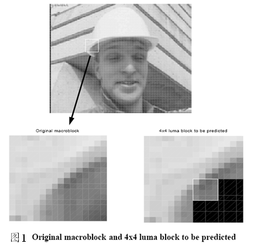

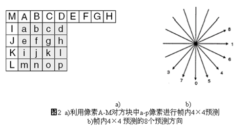


| 模式                | 描 述                                |
| :------------------ | :----------------------------------- |
| 模式0（垂直）       | 由A、B、C、D 垂直推出相应像素值      |
| 模式1（水平）       | 由I、J、K、L 水平推出相应像素值      |
| 模式2（DC）         | 由A~D 及I~L 平均值推出所有像素值     |
| 模式3（下左对角线） | 由45°方向像素内插得出相应像素值      |
| 模式4（下右对角线） | 由45°方向像素内插得出相应像素值      |
| 模式5（右垂直）     | 由26.6°方向像素值内插得出相应像素值  |
| 模式6（下水平）     | 由26.6°方向像素值内插得出相应像素值  |
| 模式7（左垂直）     | 由26.6° 方向像素值内插得出相应像素值 |
| 模式8（上水平）     | 由26.6° 方向像素值内插得出相应像素值 |


#### 16×16预测模式


 


| 模式          | 描 述                                                        |
| :------------ | :----------------------------------------------------------- |
| 模式0（垂直） | 由上边像素推出相应像素值                                     |
| 模式1（水平） | 由左边像素推出相应像素值                                     |
| 模式2（DC）   | 由上边和左边像素平均值推出相应像素值                         |
| 模式3（平面） | 利用线形“plane”函数及左、上像素推出相应像素值，适用于亮度变化平缓区域 |

#### 8×8色度块预测模式 

每个帧内编码宏块的8×8色度成分由已编码左上方色度像素预测而得，两种色度成分常用同一种预测模式。

4种预测模式类似于帧内16×16预测的4种预测模式，只是模式编号不同。其中DC（模式0）、水平（模式1）、垂直（模式2）、平面（模式3）。

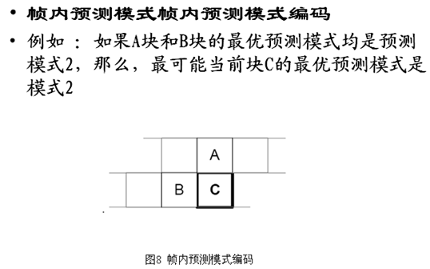

对于当前块C, 编解码器按照如下方法计算

```
probableprediction mode＝

     min{prediction mode of A, predictionmodes of B}

当A (或者 B）的预测模式不可用时，

     prediction mode of A＝ 2.
```

 例如

  A 和 B块的预测模式分别为 3 和1

```
   most probable mode for block C =1
```

编码器为每个4x4 块发送一个标记 flag,解码器按照如下方式 解码

```
Ifflag==1, prediction mode=most_probable_mode

Ifflag==0

If rem_intra4×4_pred_mode< most_probable_mode

    prediction mode=rem_intra4×4_pred_mode

else

    prediction mode=rem_intra4×4_pred_mode+1
```

 这样表示9中预测模式只需要8个值 (0 to 7)


 帧内预测后的图像与原始图像的对比如下： 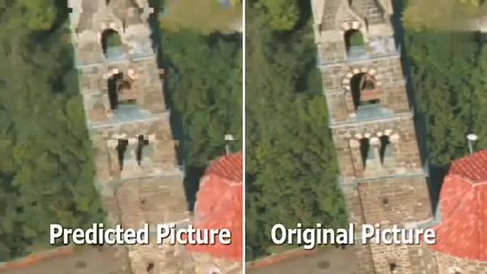

 然后，将原始图像与帧内预测后的图像相减得残差值。 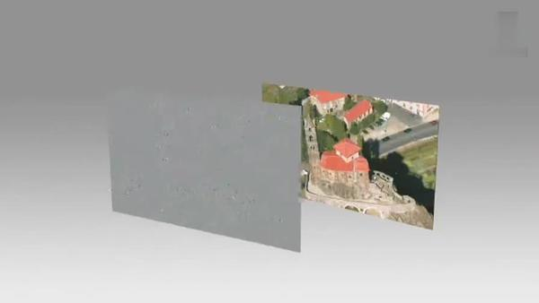

 再将我们之前得到的预测模式信息一起保存起来，这样我们就可以在解码时恢复原图了。效果如下： 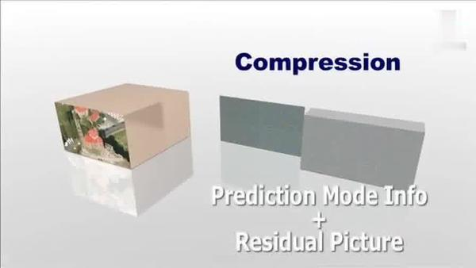

 经过帧内与帧间的压缩后，虽然数据有大幅减少，但还有优化的空间。 

### 对残差数据做DCT


可以将残差数据做整数离散余弦变换，去掉数据的相关性，进一步压缩数据。如下图所示，左侧为原数据的宏块，右侧为计算出的残差数据的宏块。

 

 

将残差数据宏块数字化后如下图所示：

 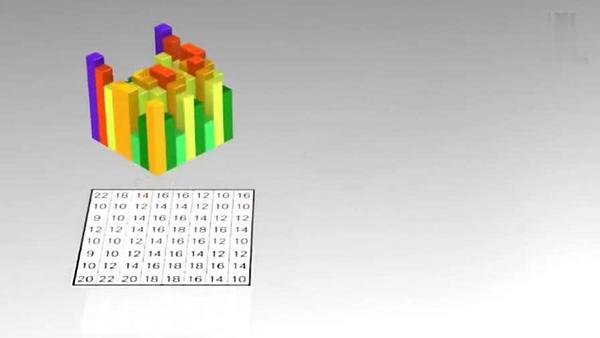

 将残差数据宏块进行 DCT 转换。 

 去掉相关联的数据后，我们可以看出数据被进一步压缩了。 

 做完 DCT 后，还不够，还要进行 CABAC 进行无损压缩。

###  DCT原理大白话

 这是第一帧画面：P1（我们的参考帧） 


 这是第二帧画面：P2（需要编码的帧） 


 从视频中截取的两张间隔1-2秒的画面，和实际情况类似，下面我们进行几次运动搜索： 

 这是一个演示程序，鼠标选中P2上任意**16x16**的Block，即可搜索出**P1上的 BestMatch** 宏块。虽然车辆在运动，从远到近，但是依然找到了最接近的宏块坐标。 

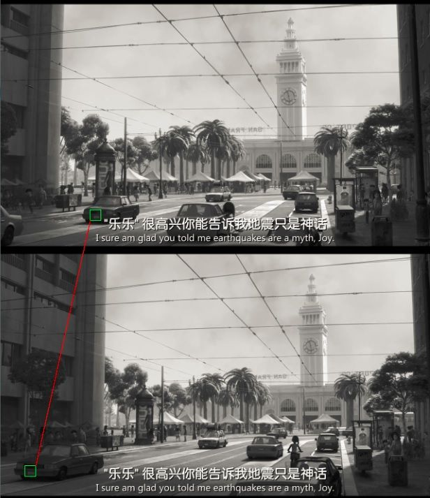

 这是一个演示程序，鼠标选中P2上任意16x16的Block，即可搜索出P1上的 BestMatch 宏块。虽然车辆在运动，从远到近，但是依然找到了最接近的宏块坐标。 

 搜索演示2：空中电线交叉位置（上图P1，下图P2） 


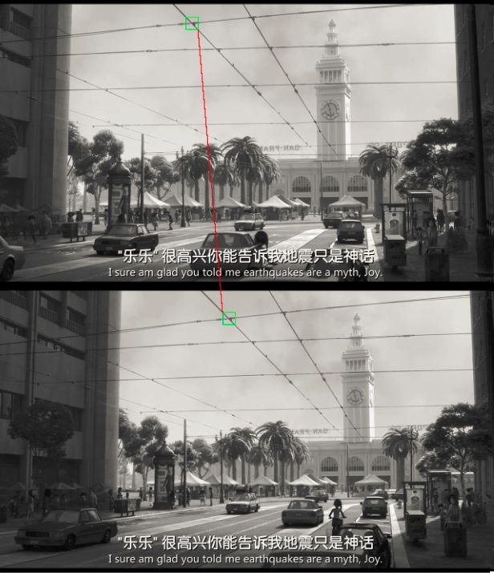

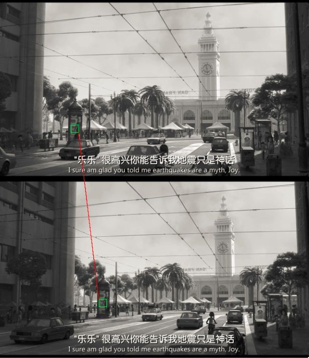

 同样顺利在P1中找到最接近P2里海报的宏块位置。 

 图片全搜索：根据P1和运动矢量数据（在P2中搜索到每一个宏块在P1中最相似的位置集合）还原出来的P2'，即完全用P1各个位置的宏块拼凑出来最像P2的图片P2'，效果如下： 


**仔细观察，有些支离破碎对吧？肯定啊，拼凑出来的东西就是这样，现在我们用P2`和P2像素相减，得到差分图 D2 = (P2' - P2) / 2 + 0x80：** 

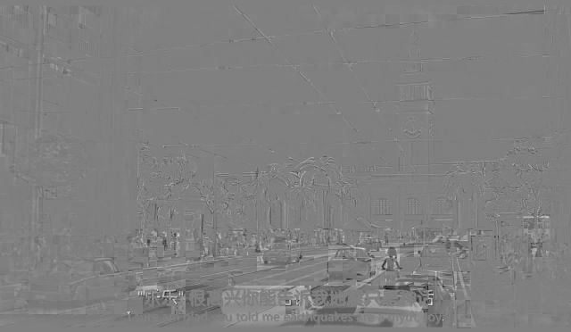

 这就是之前支离破碎的 P2` 加上误差 D2之后变成了清晰可见的样子，基本还原了原图P2。 


 由于D2仅仅占5KB，加上压缩过后的运动矢量不过7KB，所以参考P1我们只需要额外 7KB的数据量就可以完整表示P2了，而如果独立将P2用质量尚可的有损压缩方式独立压缩，则至少要去到50-60KB，这一下节省了差不多8倍的空间，正就是所谓运动编码的基本原理。 


 实际在使用中，参考帧并不一定是前面一帧，也不一定是同一个GOP的I帧，因为GOP间隔较长时，后面的图片离I帧变化可能已经很大了，因此常见做法是最近15帧中选择一帧误差最小的作为参考帧，虽然彩色画面有YUV三个分量，但是大量的预测工作和最优选择通常是根据Y分量的灰度帧进行判断的。 

 再者误差我们保存的是（P2-P2’）/2 + 0x80，实际使用时我们会用更有效率的方式，比如让[-64,64]之间的色差精度为1，[-255,-64], [64, 255] 之间的色差精度为2-3，这样会更加真实一些。 

 同时上文很多地方用的是直接lzma2进行简单存储，实际使用时一般会引入熵编码，对数据进行一定层次的整理然后再压缩，性能会好不少。 

### CABAC

上面的帧内压缩是属于有损压缩技术。也就是说图像被压缩后，无法完全复原。而CABAC属于无损压缩技术。

无损压缩技术大家最熟悉的可能就是哈夫曼编码了，给高频的词一个短码，给低频词一个长码从而达到数据压缩的目的。MPEG-2中使用的VLC就是这种算法，我们以 A-Z 作为例子，A属于高频数据，Z属于低频数据。看看它是如何做的。

 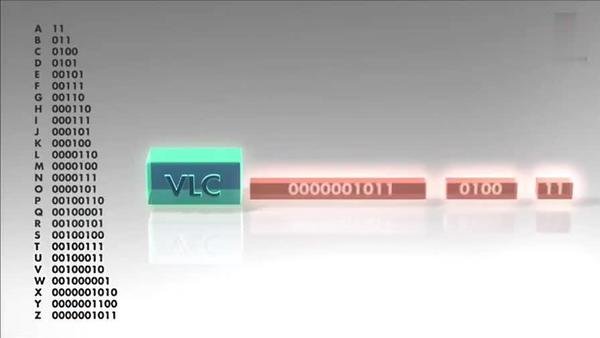

 

CABAC也是给高频数据短码，给低频数据长码。同时还会根据上下文相关性进行压缩，这种方式又比VLC高效很多。其效果如下：

 

 

现在将 A-Z 换成视频帧，它就成了下面的样子。

 

从上面这张图中明显可以看出采用 CACBA 的无损压缩方案要比 VLC 高效的多。

## H264结构

### 码流组成

**组成H264码流的结构中 包含以下几部分 ，从大到小排序依次是** 

> **H264视频序列，图像，片组，片，NALU，宏块 ，像素。** 
>
> 类似 地球 国家 城市  镇 村落

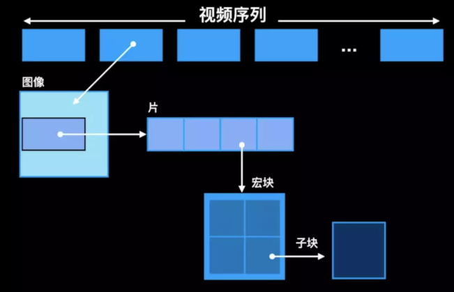

#### 编码分层

- **NAL层:（Network Abstraction Layer,视频数据网络抽象层）**：  它的作用是H264只要在网络上传输，在传输的过程每个包以太网是1500字节，而H264的帧往往会大于1500字节，所以要进行拆包，将一个帧拆成多个包进行传输，所有的拆包或者组包都是通过NAL层去处理的。
- **VCL层:（Video Coding Layer,视频数据编码层）**： 对视频原始数据进行压缩

#### 传输

**H264是一种码流**  类似与一种不见头，也不见尾的一条**河流**。如何从和流中取到自己想要的**数据**呢，

在H264的标砖中有这样的一个封装格式叫做"Annex-B"的字节流格式。 它是H264编码的主要字节流格式。

几乎市面上的编码器是以这种格式进行输出的。**起始码0x 00 00 00 01 或者 0x 00 00 01** 作为**分隔符**。 

两个 0x 00 00 00 01之间的字节数据 是表示一个**NAL单元**，每个NAL单元包含**一个RBSP**，编码片（包括数据分割片IDR片）和序列RBSP结束符被定义为VCL NAL单元，其余为NAL单元。单元的信息头（一个字节）定义了RBSP单元的类型，NAL单元的其余部分为RBSP数据。


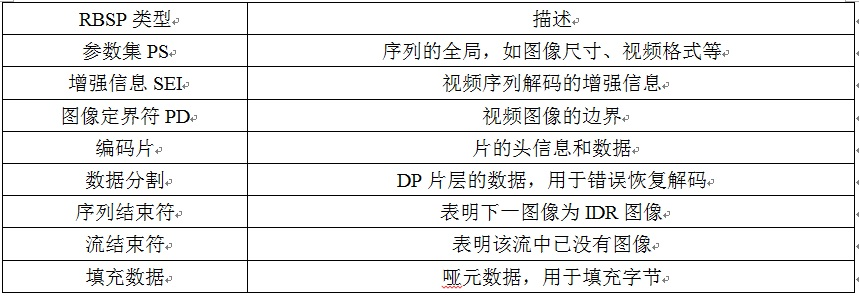


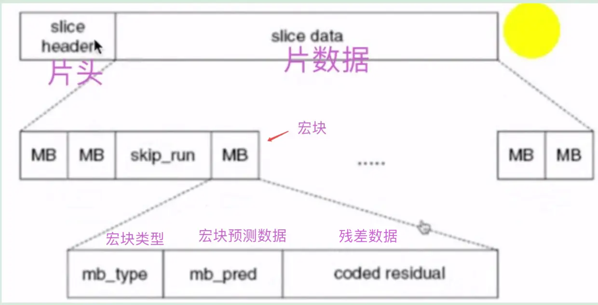

 **切片头**：包含了一组片的信息，比如片的数量，顺序等等 

**码流分层结构图**

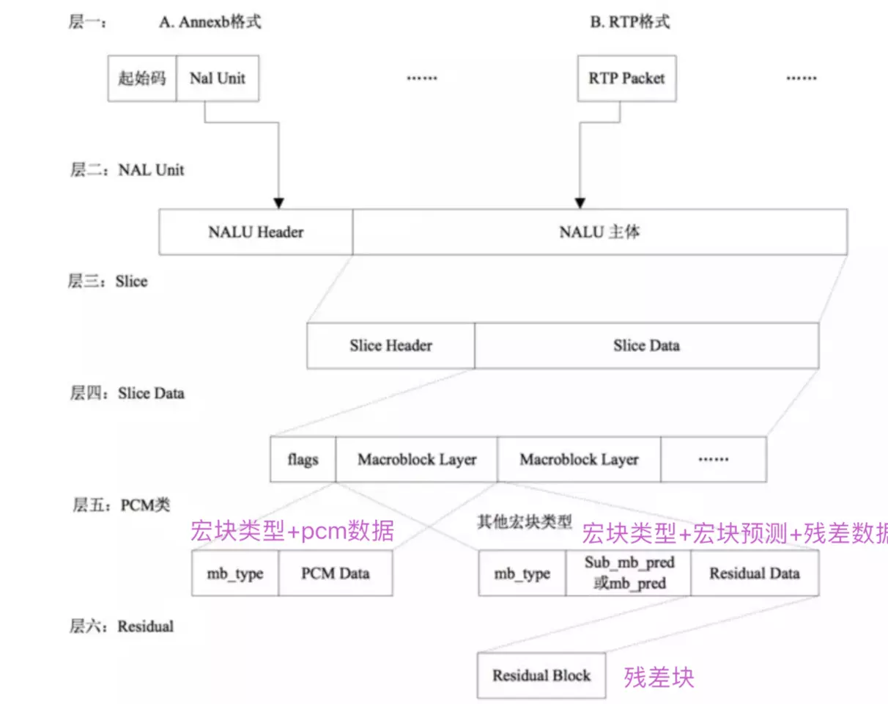

**码流结构图**


  H.264解码 **NAL头信息**的nal_referrence_idc（NRI）用于在重建过程中标记一个NAL单元的重要性，

1. 值为0表示这个NAL单元没有用预测，因此可以被解码器抛弃而不会有错误扩散；
2. 值高于0表示NAL单元要用于无漂移重构，且值越高，对此NAL单元丢失的影响越大。
3. NAL头信息的隐藏比特位，在H.264编码器中默认为0，当网络识别到单元中存在比特错误时，可将其置为1。隐藏比特位主要用于适应不同种类的网络环境（比如有线无线相结合的环境）。    

**NAL单元解码的流程**：


相关文章：

1.https://www.cnblogs.com/pjl1119/p/9914861.html